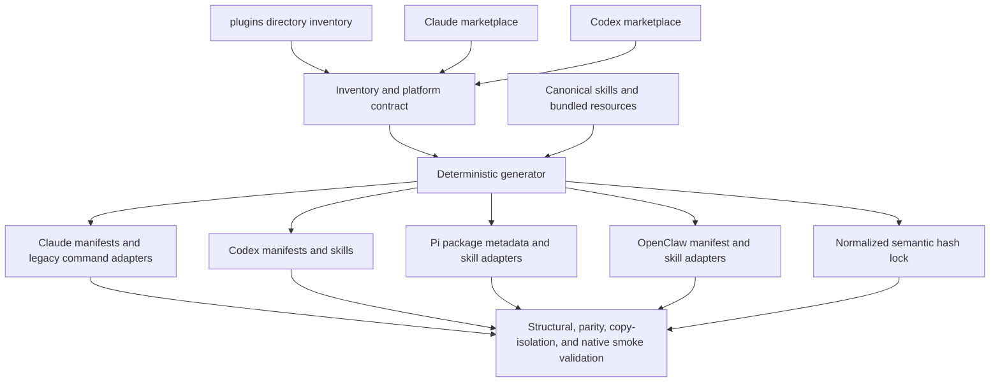

# Migrate Every Agent Plugin to Claude Code, Codex, Pi, and OpenClaw - Plan

## Overview

Migrate all five currently shipped plugins—`llm-wiki`, `screenote`, `agent-seo`, `agent-writing`, and `agent-reviewer`—to first-class Claude Code, Codex, Pi, and OpenClaw packages without changing their established Claude/Codex names, arguments, or user flows except for Screenote's required MCP-to-CLI setup migration.

The migration will keep each plugin's existing `skills/` tree as its canonical behavioral source, enrich that source where legacy Claude commands contain behavior not yet represented there, and generate checked-in host adapters plus platform metadata from a repository contract. Generated packages will contain their canonical skills and all referenced resources inside the plugin directory, use no symlinks, and survive installation from an isolated copy.

Screenote will declare the external `screenote` executable as a prerequisite, use only its machine-readable CLI contract, and remove `.mcp.json` from both manifests and skill instructions. The baseline is the OAuth-first contract merged by Screenote PR #37; because no CLI release is tagged as of 2026-07-14, compatibility remains pinned through a single advanceable baseline record rather than an invented release guarantee.

The plan covers the full brainstorm scope. Adjacent plugin behavior changes and unrelated wiki gaps remain out of scope; existing host drift that directly prevents semantic parity, notably Agent Reviewer's Codex single-pass behavior, is included because parity validation would otherwise fail.

---

## Goal Capsule

- **Objective:** Every shipped plugin installs, loads, and exposes equivalent workflows on Claude Code, Codex, Pi, and OpenClaw from a self-contained package.
- **Authority order:** `brainstorm.md` product requirements; current plugin names and user flows; official host specifications; repository conventions and wiki decisions; implementation-time details.
- **Current inventory:** Five stable plugins appear in both root marketplaces and as five top-level directories under `plugins/`; no public experimental plugin is currently present.
- **Execution profile:** Cross-cutting packaging, prompt consolidation, deterministic generation, Screenote security migration, native smoke validation, documentation, and release preparation.
- **Stop conditions:** No unresolved blocking question remains. A missing upstream capability becomes a recorded compatibility blocker and failing contract test, not guessed behavior or an unreviewed upstream implementation.
- **Tail ownership:** Merge-blocking structural, generation, mock-contract, parity, and redaction checks live in this repository; protected-secret Screenote integration remains opt-in.

---

## Requirements Trace

### Actors

- A1. Plugin users install and invoke the same shipped workflows from Claude Code, Codex, Pi, or OpenClaw.
- A2. Screenote users authenticate interactively with `screenote login` or noninteractively with supported environment/config credentials and an explicit/configured project.
- A3. Plugin maintainers edit canonical skills and declared overlays, regenerate packages, and release independently versioned plugins.
- A4. CI and release maintainers enforce inventory completeness, adapter parity, secret safety, native discovery, and external CLI compatibility.

### Product requirements

| ID | Requirement | Planned units |
|---|---|---|
| R1 | Define the shipped inventory as the union of both root marketplace registrations and every non-deprecated top-level `plugins/` directory; classify stability and fail on drift. | U1, U5, U6 |
| R2 | Give every shipped plugin native metadata, discoverable invocation, bundled resources/scripts, and supported lifecycle/config guidance for all four agents, or an explicitly approved unsupported declaration. | U1, U2, U3, U6, U7 |
| R3 | Preserve existing Claude/Codex plugin, skill, command, argument, and workflow entry points; allow aliases or migration errors for renamed legacy paths. | U1, U3, U5 |
| R4 | Maintain one canonical skill body per workflow and generate checked-in, self-contained adapters with only declared metadata, invocation, tool-name, and install-path overlays. | U1, U2, U3, U5 |
| R5 | Detect rather than install Screenote CLI, provide login/setup guidance, and keep the PR #37 compatibility baseline in one easy-to-advance record until a containing release is tagged. | U1, U4, U5, U7 |
| R6 | Implement Screenote workflows only with JSON `project list`, `page list`, `screenshot list/create`, `annotation list/get`, and `comment add`; remove MCP configuration and hidden fallback behavior. | U4, U5, U7 |
| R7 | Preserve Screenote error codes and project precedence: `--project` over `SCREENOTE_PROJECT` over config; noninteractive runs never prompt or open a browser. | U4, U5 |
| R8 | Require explicit capture/upload intent, allow only user-specified or locally discovered HTTP(S) targets, use secure temporary storage, reject unexpected paths/overwrites, retain failed captures, and delete successful temporary captures unless retention was requested. | U4, U5 |
| R9 | Keep credentials out of arguments, prose, traces, output excerpts, logs, generated files, snapshots, caches, and diagnostics; prove this with sentinel tests. | U4, U5, U6 |
| R10 | Block merges on structural validation, inventory parity, generated drift, semantic parity, mocked Screenote outcomes, and available native smoke tests; keep a protected-secret real integration optional for forks. | U5, U6 |
| R11 | Document spec-derived minimums or an explicit upstream-unspecified state, CI-tested current versions, four-agent installation/invocation, a compatibility matrix, Screenote interactive/noninteractive setup, MCP removal, and external dependency blockers. | U1, U6, U7 |

### Acceptance examples

- AE1. Every authoritative inventory member has four declared surfaces or an approved unsupported record with owner, reason, and expiry/review condition.
- AE2. A catalog-only plugin, directory-only plugin, missing stability label, unapproved unsupported surface, or mismatched generated catalog makes validation fail.
- AE3. Regeneration from a clean checkout produces no diff; copied plugin packages contain no symlink or reference escaping their package root.
- AE4. Normalized section/resource hashes match the canonical source except for fields allowed by the declared platform overlay.
- AE5. Each available agent CLI discovers the installed plugin and expected invocation names at the pinned CI version; documentation distinguishes tested versions from formal minimums.
- AE6. Mock success scenarios show all three Screenote skills use only the approved CLI command tuples and never access MCP.
- AE7. `missing_token` and `missing_project` stop with exit 2; invalid or expired credentials stop with exit 3; every other nonzero result stops the flow while preserving machine-readable diagnostics.
- AE8. Project resolution honors `--project`, `SCREENOTE_PROJECT`, then CLI config and reports ambiguous/inaccessible selections without guessing or prompting in noninteractive mode.
- AE9. Sentinel credentials are absent from commands, stdout/stderr excerpts, logs, traces, generated output, snapshots, caches, and diagnostics on success and failure.
- AE10. Failed capture/upload reports a recoverable private local path; successful upload removes the temporary capture unless retention was requested.
- AE11. Existing Claude/Codex names and argument grammars remain discoverable, Screenote setup reports the CLI migration, and no `.mcp.json` or MCP execution fallback remains.

---

## Scope Boundaries

### In scope

- Root inventory and platform contract metadata for all shipped plugin directories and both root marketplace catalogs.
- Canonical-skill consolidation, generated adapters, platform manifests, native discovery checks, compatibility tests, and user/release documentation.
- Claude legacy command wrappers for `seo:*`, `write:*`, and `reviewer:*`, preserving every current command name and documented argument grammar.
- Pi package metadata and generated skills for all plugins, retaining the current `llm-wiki` Pi names.
- Native OpenClaw metadata and generated skills for all plugins, with empty strict config schemas where no runtime configuration is needed.
- Screenote CLI prerequisite detection, JSON command execution, project/auth handling, capture lifecycle safety, redaction, mock tests, and optional real integration.
- Direct parity fixes exposed by the migration, including Agent Reviewer's known two-pass/confidence-gate mismatch.
- Version/release updates required to publish the migrated packages independently.

### Explicit non-goals

- Implementing or changing Screenote server/CLI internals, Claude Code, Codex, Pi, or OpenClaw.
- Retaining an MCP transport or API-key compatibility fallback for Screenote skills.
- Automatically installing the Screenote binary, opening login browsers from ordinary skills, or storing bearer tokens in plugin-owned files.
- Redesigning plugin workflows, renaming public entry points, or combining independently versioned plugins.
- Solving unrelated wiki gaps, Agent SEO technical debt, Agent Writing README drift beyond migration-facing text, or release infrastructure not needed by this migration.
- Publishing Pi/OpenClaw packages to a new registry when installation from a copied plugin package is already native and self-contained; registry publication can follow the validated package shape.

### Deferred to follow-up work

- Add automatic Screenote annotation resolution only if `annotation resolve` is later added to the explicitly approved CLI command contract. This migration keeps retrieval, fix, and comment behavior, then directs the user to resolve in the Screenote UI rather than invoking an unapproved command.
- Add a shared cross-project wiki; `.llm-wiki/config.json` currently has no `main_wiki_path`, and no default main-wiki directory exists.
- General-purpose prompt AST tooling beyond the Markdown/frontmatter/resource normalization needed by these plugins.

---

## Past Knowledge

**Relevant wiki pages:**

- `wiki/architecture.md` establishes the two-catalog, five-plugin distribution shape and the current Claude/Codex/Pi surfaces.
- `wiki/decisions.md` records plain-directory vendoring, independent plugin releases, two marketplace catalogs, and host-specific entry syntax.
- `wiki/plugins.md` provides the current plugin/version inventory and identifies the duplicated Screenote and LLM Wiki host trees.
- `wiki/commands.md` records all public Claude/Codex invocation names and the current Screenote argument grammar.
- `wiki/dependencies.md` confirms there is no root application build and identifies the current external runtimes.
- `wiki/gaps.md` records Agent Reviewer's host drift and the absence of cross-project knowledge.
- `wiki/releasing.md` records version-marker lockstep and upstream-first vendoring for `llm-wiki`.

**Applicable patterns:**

- Keep plugins as ordinary self-contained directories; host caches copy plugin contents and cannot rely on files outside the package.
- Preserve different invocation syntax while keeping behavior equivalent: Claude can expose namespaced commands, Codex uses skills/natural language, and Pi uses package-declared skill roots.
- Use thin Pi wrappers that point to canonical skill files inside the same plugin package, already demonstrated by `plugins/llm-wiki/pi/skills/`.
- Keep version markers aligned across root catalogs, plugin manifests, and package metadata.

**Past decisions that constrain this work:**

- `llm-wiki`, `screenote`, and `agent-seo` are upstream-backed vendor copies; canonical behavioral changes should land upstream first or be represented as repository-owned generated packaging overlays that can be reapplied deterministically after vendoring.
- `agent-writing` and `agent-reviewer` are developed in this repository.
- Existing host-specific names are intentional and must be tested for drift, not flattened into one universal syntax.
- The project wiki is local/regenerable state; implementation updates its grounded pages and log fragment but does not make wiki persistence policy part of this migration.

**Known pitfalls:**

- Agent Reviewer's Codex skill currently omits Claude's two-pass union and confidence gate.
- Screenote's current skills duplicate Claude/Codex bodies and rely on `.mcp.json`, signed upload URLs, `curl`, and MCP tool names.
- Existing Claude command bodies are often much more detailed than their canonical Codex skills, so replacing them with wrappers before consolidating semantics would regress behavior.
- A root generator can be overwritten by later upstream vendoring unless generation metadata and drift checks are part of the release path.
- The repository has no root test command or CI workflow today; new validation must bring its own lightweight runtime and explicit commands.

**Reusable components:**

- `plugins/llm-wiki/pi/skills/` supplies the internal-reference adapter pattern.
- `plugins/screenote/evals/lint-skills.sh` and `plugins/screenote/evals/trigger-eval-set.json` supply existing deterministic skill structure and trigger fixtures.
- Existing `.claude-plugin/plugin.json`, `.codex-plugin/plugin.json`, `package.json`, and both root marketplaces supply real metadata to normalize rather than replace wholesale.
- `plugins/screenote/skills/screenote/SKILL.md` contains the canonical viewport and serial browser-capture behavior to retain while replacing transport.

**Gaps this work fills:**

- No Pi package metadata for four plugins, no OpenClaw-native metadata for any plugin, no repository-wide inventory/parity validator, no generated-adapter drift check, and no root CI.
- No deterministic Screenote CLI mock contract, secret-leak audit, or protected-secret integration path.
- No repository compatibility matrix or per-plugin four-host installation guide.

No main cross-project wiki was configured or found, so Past Knowledge is project-local only.

---

## Planning Contract

### Key technical decisions

- KTD1. **Use `plugin-surfaces.json` as the repository packaging contract.** It records inventory classification, stability, plugin versions, canonical skills, public aliases/arguments, resources, per-platform metadata, allowed overlays, approved unsupported declarations, CI-tested versions, and the Screenote CLI baseline. The filesystem and both root catalogs remain authoritative inputs; the contract must cover their union and cannot hide drift.
- KTD2. **Keep `plugins/<name>/skills/` as canonical behavioral source.** This minimizes path churn and follows existing Codex/Claude skill discovery. When legacy commands carry additional behavior, first merge it into the relevant canonical skill, then generate a thin command adapter.
- KTD3. **Generate adapters, manifests, catalogs, and a lock from declarative metadata.** Generated files carry an origin marker and normalized source/overlay hashes. CI regenerates into the checkout and fails on diff.
- KTD4. **Permit only named overlay dimensions.** Invocation syntax, frontmatter/metadata, tool vocabulary, host lifecycle notes, and install paths may differ. Safety, error handling, workflow behavior, required resources, and acceptance outcomes may not.
- KTD5. **Make packages self-contained by construction.** Generated adapters may point to canonical files only through paths that resolve inside their copied plugin root; validation rejects symlinks, path escapes, missing resources, and references outside the package.
- KTD6. **Use Python 3 standard-library tooling at the root.** The repository has no root language package; a small JSON/Markdown/frontmatter normalizer and `unittest` suite avoids adding a package manager solely for validation.
- KTD7. **Treat formal minimum and tested-current versions separately.** A platform's minimum is recorded only when an official manifest/skill specification or release note establishes it. Otherwise documentation says `upstream does not specify a formal minimum` and records only the exact CI-tested version.
- KTD8. **Use the Screenote CLI through an argv-safe bundled launcher.** The launcher allowlists command tuples, forwards untrusted values as separate arguments, leaves authentication to the CLI's environment/config mechanisms, preserves JSON and exit codes, and never logs environment credentials.
- KTD9. **The approved Screenote command list is authoritative.** The migrated `feedback` workflow can retrieve, apply fixes, and add a comment; it must not call the currently available but unapproved `annotation resolve` command. The skill reports that final resolution remains a Screenote UI action.
- KTD10. **Run native discovery in isolated homes.** CI copies each plugin package into a temporary directory, installs or points each available host CLI at that copy, and asserts plugin/skill names without mutating a developer's actual agent configuration.

### Current external baselines

The planning environment reports Claude Code `2.1.179`, Codex CLI `0.144.3`, Pi `0.80.7`, and OpenClaw `2026.7.1-beta.2`. These values seed the first CI pin but are not declared minimums. Implementation must refresh pins to the current released versions used by CI and cite the specification/release evidence for any lower supported minimum.

Screenote PR #37 merged the OAuth-first contract at merge commit `8d64ebb4a5d3d9f98d575da70c97750d15f7ae82`. No Screenote CLI release is currently tagged. The public `ivankuznetsov/screenote-cli` main branch was at `c28ac8b3b1b720ef60275e5f59db3a96f8cfa98b` during planning and contains the public command contract. `plugin-surfaces.json` should keep the contract PR/merge SHA, public test repository/ref, and eventual minimum release in separate fields so the baseline advances without editing tests or skills.

### Assumptions

- All five current plugins are labeled `stable`; future public experimental plugins use `experimental` and must still pass four-surface validation.
- A top-level plugin directory is shipped unless it carries an explicit deprecated/excluded classification accepted by the contract schema; nested `eval/`, `evals/`, fixtures, samples, and output folders never enter inventory.
- Generated wrappers can instruct the host to read a canonical file by a relative path inside the installed plugin package, matching the existing Pi adapter pattern.
- Upstream-backed canonical changes are released upstream before final vendoring when the upstream repository is available. If that coordination is not available during implementation, root generation may add only clearly marked packaging overlays; it must not silently fork upstream behavior.
- Ordinary Screenote CLI commands remain noninteractive as established by PR #37. The skills suggest `screenote login`; they never invoke it automatically.

### High-Level Technical Design



```mermaid
flowchart TB
  I[Explicit capture intent] --> U{User or locally discovered HTTP(S) URL?}
  U -->|No| STOP[Stop with actionable safety error]
  U -->|Yes| P[project list and project precedence]
  P --> T[Private mktemp directory]
  T --> B[Serial browser capture]
  B --> C[screenshot create via argv-safe CLI launcher]
  C -->|Success| D[Delete temporary capture unless retention requested]
  C -->|Failure| R[Retain private capture and report recovery path]
```

### Sequencing

U1 establishes the contract used by every later unit. U2 builds generation and self-containment. U3 consolidates non-Screenote workflows before wrappers replace detailed commands. U4 migrates Screenote on the same framework. U5 locks behavior and security, U6 makes it merge-blocking across native hosts, and U7 finishes user/release/wiki documentation after the final generated shape is known.

---

## Implementation Units

### U1. Define authoritative inventory, stability, compatibility, and overlay contracts

**Goal:** Add one validated repository contract that reconciles both root catalogs with all top-level plugin directories and describes every required agent surface without replacing the authoritative union.

**Requirements:** R1, R2, R3, R4, R5, R11; A3, A4; AE1, AE2.

**Dependencies:** None.

**Files:**

- `plugin-surfaces.json` (new)
- `schemas/plugin-surfaces.schema.json` (new)
- `.claude-plugin/marketplace.json`
- `.agents/plugins/marketplace.json`
- `plugins/agent-reviewer/.claude-plugin/plugin.json`
- `plugins/agent-reviewer/.codex-plugin/plugin.json`
- `plugins/agent-seo/.claude-plugin/plugin.json`
- `plugins/agent-seo/.codex-plugin/plugin.json`
- `plugins/agent-writing/.claude-plugin/plugin.json`
- `plugins/agent-writing/.codex-plugin/plugin.json`
- `plugins/llm-wiki/.claude-plugin/plugin.json`
- `plugins/llm-wiki/.codex-plugin/plugin.json`
- `plugins/llm-wiki/package.json`
- `plugins/screenote/.claude-plugin/plugin.json`
- `plugins/screenote/.codex-plugin/plugin.json`
- `tests/test_plugin_inventory.py` (new)
- `tests/fixtures/inventory/` (new)

**Approach:**

- Model each plugin's `stable`, `experimental`, `deprecated`, or `excluded` distribution state; require an approval object for deprecated/excluded packages and for any unsupported platform surface.
- Record canonical skill roots, public Claude/Codex names and argument grammars, bundled resources, adapter destinations, platform overlay permissions, package metadata, and version markers.
- Record platform `ci_version`, optional `minimum_version`, and evidence URL independently. Permit `minimum_version: null` only with an explicit `upstream_minimum_unspecified` note.
- Record Screenote's contract PR, merge SHA, public CLI repository/ref, and eventual tagged baseline in one object.
- Parse only the two root marketplace catalogs for authoritative registrations; validate plugin-local upstream marketplaces as mirrors but do not let them expand repository inventory.
- Treat every top-level directory under `plugins/` as a candidate plugin and ignore nested fixtures/eval/sample/output directories by construction.

**Patterns to follow:** Existing catalog and manifest metadata; independent version alignment in `RELEASING.md`; inventory grounding in `wiki/plugins.md`.

**Test scenarios:**

1. Covers AE1. The current five directories and both catalogs produce the same five-member shipped set, each with four declared surfaces and a stability label.
2. Covers AE2. A fixture with a catalog-only plugin fails and reports the missing directory/contract entry.
3. Covers AE2. A fixture with a directory-only plugin fails and reports both missing marketplace registrations.
4. A deprecated directory with approval metadata is excluded; the same directory without reason/owner/review condition fails.
5. An experimental plugin is included and must declare `experimental` in generated install metadata/docs.
6. An unsupported platform declaration without explicit approval metadata fails.
7. Duplicate names, mismatched source paths, version disagreement, or path escapes fail with the exact plugin/platform field identified.

**Verification:** The contract validates against its schema, reports the five expected plugins, and detects each synthetic drift fixture without consulting generated output as an authority.

### U2. Generate self-contained platform packages and semantic locks

**Goal:** Generate checked-in manifests, catalogs, Pi/OpenClaw adapters, Claude legacy adapters, and normalized parity hashes from canonical skills plus declared overlays.

**Requirements:** R2, R4, R10; A1, A3, A4; AE3, AE4.

**Dependencies:** U1.

**Files:**

- `scripts/plugin_surfaces.py` (new)
- `scripts/generate-agent-packages.py` (new)
- `scripts/validate-agent-packages.py` (new)
- `plugin-surfaces.lock.json` (new, generated)
- `.claude-plugin/marketplace.json` (generated sections)
- `.agents/plugins/marketplace.json` (generated sections)
- `plugins/agent-reviewer/package.json` (new)
- `plugins/agent-reviewer/openclaw.plugin.json` (new)
- `plugins/agent-reviewer/pi/skills/agent-reviewer/SKILL.md` (new, generated)
- `plugins/agent-reviewer/openclaw/skills/agent-reviewer/SKILL.md` (new, generated)
- `plugins/agent-seo/package.json` (new)
- `plugins/agent-seo/openclaw.plugin.json` (new)
- `plugins/agent-seo/pi/skills/agent-seo/SKILL.md` (new, generated)
- `plugins/agent-seo/openclaw/skills/agent-seo/SKILL.md` (new, generated)
- `plugins/agent-writing/package.json` (new)
- `plugins/agent-writing/openclaw.plugin.json` (new)
- `plugins/agent-writing/pi/skills/agent-writing/SKILL.md` (new, generated)
- `plugins/agent-writing/openclaw/skills/agent-writing/SKILL.md` (new, generated)
- `plugins/llm-wiki/package.json`
- `plugins/llm-wiki/openclaw.plugin.json` (new)
- `plugins/llm-wiki/pi/skills/wiki-bootstrap/SKILL.md` (generated)
- `plugins/llm-wiki/pi/skills/wiki-plan/SKILL.md` (generated)
- `plugins/llm-wiki/pi/skills/wiki-research/SKILL.md` (generated)
- `plugins/llm-wiki/pi/skills/wiki-status/SKILL.md` (generated)
- `plugins/llm-wiki/openclaw/skills/` (new, generated)
- `plugins/screenote/package.json` (new)
- `plugins/screenote/openclaw.plugin.json` (new)
- `plugins/screenote/codex-skills/` (regenerated or removed after the Codex manifest moves to canonical `skills/`)
- `plugins/screenote/pi/skills/` (new, generated)
- `plugins/screenote/openclaw/skills/` (new, generated)
- `tests/test_generated_packages.py` (new)
- `tests/test_semantic_parity.py` (new)

**Approach:**

- Implement a deterministic standard-library parser for JSON metadata, YAML-like frontmatter fields used by the skills, Markdown heading/section structure, resource references, and generated-origin markers.
- Generate adapters as minimal host-native `SKILL.md` files that preserve public names, point to a canonical file inside the same plugin root, and add only declared host notes. Generate Claude command wrappers only after U3 has consolidated their behavior.
- Generate Pi `package.json#pi.skills` roots and native OpenClaw manifests with `skills` paths and strict empty config schemas where appropriate. Add `package.json#openclaw.install.minHostVersion` only when U1 contains a sourced formal minimum.
- Generate root marketplace entries and compatible plugin manifests from normalized metadata while preserving platform-only install copy and categories.
- Store canonical content/resource hashes, normalized semantic section hashes, adapter hashes, and applied overlay IDs in `plugin-surfaces.lock.json`.
- Implement `--check` mode that renders in memory, compares with checked-in files, and exits nonzero on drift without rewriting.
- Copy each package to a temporary isolated directory during tests and require every declared/reference path to resolve within that copy; reject symlinks and `..` escapes even when the target exists in the checkout.

**Execution note:** Build copy-isolation and check-mode tests before changing all generated surfaces, so generation cannot make an apparently green but non-installable package.

**Patterns to follow:** `plugins/llm-wiki/pi/skills/` for internal canonical references; root marketplace source paths; official host manifest path rules.

**Test scenarios:**

1. Covers AE3. Two consecutive generations are identical and `--check` reports no diff.
2. Covers AE3. Every generated plugin copied alone to a temporary directory retains all declared skills, scripts, agents, context, and referenced canonical files.
3. A symlink, absolute local path, `../` escape, missing resource, or reference to another plugin fails.
4. Covers AE4. Frontmatter/invocation/install-path overlays change allowed normalized fields while canonical behavioral section hashes remain equal.
5. A behavioral section edited only in one generated adapter fails semantic parity even if byte hashes and frontmatter are otherwise valid.
6. A declared overlay that changes a safety or error-handling section fails as an illegal overlay.
7. Generated JSON is stable across locale/order differences and all manifest paths begin with `./` where the host specification requires it.

**Verification:** A clean generation leaves no git diff; package-copy validation passes for all five plugins; the lock accounts for every canonical skill, adapter, legacy command wrapper, and declared resource.

### U3. Consolidate canonical workflows and preserve legacy Claude/Codex entry points

**Goal:** Move all established workflow behavior into canonical skills, then replace divergent command copies with generated compatibility adapters while preserving names and arguments.

**Requirements:** R2, R3, R4; A1, A3; AE4, AE5, AE11.

**Dependencies:** U1, U2.

**Files:**

- `plugins/agent-seo/skills/seo/SKILL.md`
- `plugins/agent-seo/commands/seo:analyze-existing.md`
- `plugins/agent-seo/commands/seo:data.md`
- `plugins/agent-seo/commands/seo:fact-check.md`
- `plugins/agent-seo/commands/seo:humanize.md`
- `plugins/agent-seo/commands/seo:optimize.md`
- `plugins/agent-seo/commands/seo:performance-review.md`
- `plugins/agent-seo/commands/seo:research.md`
- `plugins/agent-seo/commands/seo:rewrite.md`
- `plugins/agent-seo/commands/seo:scrub.md`
- `plugins/agent-seo/commands/seo:write.md`
- `plugins/agent-writing/skills/writing/SKILL.md`
- `plugins/agent-writing/commands/write:editor-ru.md`
- `plugins/agent-writing/commands/write:editor.md`
- `plugins/agent-writing/commands/write:full.md`
- `plugins/agent-writing/commands/write:journalist.md`
- `plugins/agent-writing/commands/write:writer-ivan.md`
- `plugins/agent-writing/commands/write:writer-ru.md`
- `plugins/agent-writing/commands/write:writer.md`
- `plugins/agent-reviewer/skills/agent-reviewer/SKILL.md`
- `plugins/agent-reviewer/commands/reviewer:extract.md`
- `plugins/agent-reviewer/commands/reviewer:review.md`
- `plugins/agent-reviewer/commands/reviewer:update.md`
- `plugins/llm-wiki/skills/bootstrap/SKILL.md`
- `plugins/llm-wiki/skills/research/SKILL.md`
- `plugins/llm-wiki/skills/status/SKILL.md`
- `plugins/llm-wiki/skills/wiki-plan/SKILL.md`
- `plugins/agent-reviewer/agents/`
- `plugins/agent-reviewer/references/`
- `plugins/agent-reviewer/scripts/`
- `plugins/agent-seo/agents/`
- `plugins/agent-seo/context/`
- `plugins/agent-seo/data_sources/`
- `plugins/agent-seo/hooks/hooks.json`
- `plugins/agent-writing/agents/`
- `plugins/agent-writing/context/`
- `tests/test_legacy_entrypoints.py` (new)
- `tests/fixtures/entrypoints.json` (new)

**Approach:**

- Inventory each current command's usage grammar, required resources, output locations, failure behavior, and orchestration. Merge any behavior missing from its canonical skill before generating a wrapper.
- Express Claude command adapters as mode selectors that load the in-package canonical skill and pass `$ARGUMENTS` unchanged. Preserve every `seo:*`, `write:*`, and `reviewer:*` filename and documented usage line.
- Keep current Claude/Codex skill names and natural-language trigger descriptions. Pi/OpenClaw may add host-safe prefixes only where already established (`wiki-*`) or required to avoid a verified collision; record any alias in the contract.
- Fix Agent Reviewer's canonical review flow to use Claude's two-pass union, confidence gate, and configurable `--passes`/`--min-confidence`, then generate all hosts from that behavior.
- Preserve all agents, scripts, context, optional Ruby tools, eval resources, and lifecycle guidance as declared package resources; adapters may not assume repository-root paths.
- For upstream-backed `llm-wiki` and `agent-seo`, make canonical changes upstream first and vendor the released tree before regeneration. If upstream coordination is unavailable, restrict this unit to generated adapters and record a precise upstream blocker rather than forking canonical behavior.

**Test scenarios:**

1. Covers AE11. Every existing Claude command filename, namespace, required positional argument, option, default, and stop condition appears in the entrypoint fixture and generated wrapper.
2. Existing Codex skill names and manifest skill roots remain discoverable after regeneration.
3. Each generated command selects exactly one canonical workflow and passes arguments without re-parsing or dropping quoted values.
4. Agent Reviewer defaults to two independent passes, unions findings, applies the confidence gate, and honors one- and three-pass overrides on every host surface.
5. Agent Writing preserves journalist grounding, writer/editor rivalry, five-round default, language/persona variants, and project-local artifact paths.
6. Agent SEO preserves all ten modes, optional Ruby/data prerequisites, partial-data behavior, and the existing artifact locations.
7. LLM Wiki retains Claude/Codex names and Pi's `wiki-bootstrap`, `wiki-research`, `wiki-plan`, and `wiki-status` names.
8. A wrapper that references an undeclared agent, script, context file, hook, or executable fails package validation.

**Verification:** The entrypoint compatibility fixture matches every pre-migration public surface; semantic hashes show one behavioral source per workflow; Agent Reviewer no longer has the wiki-recorded host drift.

### U4. Replace Screenote MCP with an allowlisted JSON CLI workflow

**Goal:** Migrate `screenote`, `snapshot`, and `feedback` to the external Screenote CLI while preserving capture/review behavior and enforcing auth, project, safety, and recovery rules.

**Requirements:** R3, R5, R6, R7, R8, R9; A1, A2; AE6, AE7, AE8, AE10, AE11.

**Dependencies:** U1, U2.

**Files:**

- `plugins/screenote/skills/screenote/SKILL.md`
- `plugins/screenote/skills/snapshot/SKILL.md`
- `plugins/screenote/skills/feedback/SKILL.md`
- `plugins/screenote/scripts/screenote-cli.sh` (new)
- `plugins/screenote/.claude-plugin/plugin.json`
- `plugins/screenote/.codex-plugin/plugin.json`
- `plugins/screenote/.mcp.json` (delete)
- `plugins/screenote/codex-skills/` (regenerate as thin wrappers or remove after manifest consolidation)
- `plugins/screenote/evals/lint-skills.sh`
- `plugins/screenote/evals/trigger-eval-set.json`
- `plugins/screenote/evals/README.md`
- `plugins/screenote/README.md`

**Approach:**

- Add a launcher that verifies `screenote` is on `PATH`, allowlists exactly `project list`, `page list`, `screenshot list`, `screenshot create`, `annotation list`, `annotation get`, and `comment add`, and invokes the executable with a quoted argv array. It must pass through stdout, stderr, and exit status without reformatting or tracing secrets.
- Detect contract compatibility through non-secret help/version metadata and the baseline record. Do not download or install binaries. Until a tagged release contains PR #37, use the recorded public commit in CI and show installation guidance based on `go install ...@<ref>`; switch one baseline field when the first release is available.
- Remove MCP server fields from manifests, delete `.mcp.json`, replace every MCP tool name/instruction, and add a negative repository scan for `.mcp.json`, `mcpServers`, Screenote MCP endpoints, and retired tool names.
- Delegate project precedence to the CLI. Use an explicit `--project` when the skill/user selected one, otherwise preserve `SCREENOTE_PROJECT` and config fallback. Call `project list` to validate accessible projects and present choices only in an interactive run after `missing_project`; never guess an ambiguous name.
- On exit 2 with `missing_token`, suggest `screenote login` interactively and require `SCREENOTE_TOKEN` noninteractively. On exit 2 with `missing_project`, explain `--project`, `SCREENOTE_PROJECT`, and config. On exit 3, explain invalid/expired credentials without retrying through another auth mechanism. Stop on all other nonzero statuses.
- Preserve `screenote [viewport] <URL-or-page>`, `snapshot [viewport] <base-URL>`, and `feedback [viewport] [filter]` argument grammars. Require a user-specified or project-discovered HTTP(S) URL before browser navigation.
- Capture serially into a mode-0700 `mktemp -d` directory with private file permissions. Pass only the generated path as `screenshot create --file`; reject user-supplied local paths unless a future explicit workflow adds and validates them.
- Remove successful temporary files unless the user requested retention. On CLI/upload failure, keep the private capture, report its exact recovery path, and avoid overwriting it on retry.
- Implement `snapshot` as route discovery plus repeated approved `screenshot create` calls; do not use the newer unapproved `screenote snapshot` command.
- Implement `feedback` with `page list`, `screenshot list`, `annotation list/get`, and `comment add`. After applying and commenting on a fix, tell the user to resolve the annotation in Screenote; do not call `annotation resolve`.

**Execution note:** Add failing mock-contract tests for the approved argv allowlist and error-code mapping before deleting MCP instructions.

**Patterns to follow:** Current viewport/route/authentication-browser safety in the canonical Screenote skills; PR #37's JSON/exit contract; standard shell quoted arrays and private temporary directories.

**Test scenarios:**

1. Covers AE6. Single-page success calls `project list` then one `screenshot create` per selected viewport and returns the JSON review URL without an MCP or `curl` call.
2. Covers AE6. Snapshot discovers selected HTTP(S) routes and calls only `screenshot create` for each route/viewport; it never invokes CLI `snapshot`.
3. Covers AE6. Feedback lists pages/screenshots/annotations, gets visual context, adds a comment after a fix, and never invokes `annotation resolve`.
4. Covers AE7. `missing_token` and `missing_project` JSON exit 2 with mode-appropriate guidance; invalid/expired token JSON exits 3; rate-limit/not-found/generic failures stop immediately.
5. Covers AE8. Explicit `--project` overrides an environment project, environment overrides config, inaccessible/ambiguous values return JSON-backed errors, and noninteractive mode never reads stdin or launches a browser.
6. A URL with a non-HTTP(S) scheme, shell metacharacters, an unexpected local path, a symlinked destination, or an existing overwrite target is refused before navigation or CLI mutation.
7. Covers AE10. Success deletes the temporary capture; requested retention keeps it; failure preserves it with mode 0600 and reports its path.
8. A missing or contract-incompatible CLI stops with installation/update/login guidance and never attempts automatic installation.
9. Existing `feedback` migration syntax from the `screenote` skill returns the documented alias/migration message rather than silently changing mode.

**Verification:** All three canonical skills and generated adapters contain no MCP transport reference, the manifests contain no `mcpServers`, `.mcp.json` is absent, and the mock launcher records only approved argv tuples.

### U5. Add semantic, Screenote contract, recovery, and credential-leak tests

**Goal:** Make adapter parity and Screenote success/failure/security outcomes deterministic and merge-blocking without live secrets.

**Requirements:** R1, R3, R4, R5, R6, R7, R8, R9, R10; A4; AE2, AE4, AE6, AE7, AE8, AE9, AE10, AE11.

**Dependencies:** U2, U3, U4.

**Files:**

- `tests/test_semantic_parity.py`
- `tests/test_legacy_entrypoints.py`
- `tests/test_screenote_cli_contract.py` (new)
- `tests/test_screenote_redaction.py` (new)
- `tests/fixtures/screenote-cli/screenote` (new executable mock)
- `tests/fixtures/screenote-cli/scenarios/success.json` (new)
- `tests/fixtures/screenote-cli/scenarios/missing-token.json` (new)
- `tests/fixtures/screenote-cli/scenarios/missing-project.json` (new)
- `tests/fixtures/screenote-cli/scenarios/invalid-token.json` (new)
- `tests/fixtures/screenote-cli/scenarios/expired-token.json` (new)
- `tests/fixtures/screenote-cli/scenarios/ambiguous-project.json` (new)
- `tests/fixtures/screenote-cli/scenarios/inaccessible-project.json` (new)
- `tests/fixtures/screenote-cli/scenarios/not-found.json` (new)
- `tests/fixtures/screenote-cli/scenarios/rate-limited.json` (new)
- `tests/fixtures/screenote-cli/scenarios/generic-error.json` (new)
- `tests/fixtures/screenote-cli/scenarios/upload-failure.json` (new)
- `plugins/screenote/evals/lint-skills.sh`
- `plugins/screenote/evals/trigger-eval-set.json`

**Approach:**

- Put the mock `screenote` executable first on `PATH`; have it record argv separately from its scenario JSON while never recording environment variables.
- Exercise the bundled launcher and a small deterministic flow harness that mirrors each canonical skill's command decisions. Keep prompt trigger fixtures for discovery semantics and static checks for required safety/error sections.
- Parse CLI error JSON and assert code/exit mapping without replacing the original machine-readable diagnostic.
- Use a unique high-entropy sentinel as `SCREENOTE_TOKEN`, run every success and failure path including shell trace capture, and recursively scan the temporary test workspace plus generated artifacts for the sentinel.
- Include stdout/stderr excerpts, argv records, test logs, retained captures, generated adapters, snapshots, caches, and failure diagnostics in the scan target.
- Add negative scans for credential-shaped prose/arguments and for obsolete MCP tool/config names.
- Test cleanup by creating real temporary files with controlled permissions while mocking only the external CLI result.

**Test scenarios:**

1. Covers AE9. The sentinel token is absent from normal output, stderr, argv, `bash -x` trace, launcher diagnostics, and retained recovery metadata on success.
2. Covers AE9. The same scan passes for every auth/project/upload failure scenario.
3. A deliberate mock that echoes the sentinel proves the scanner fails and identifies the contaminated artifact without reprinting the secret.
4. Covers AE7. Every named Screenote error fixture maps to the expected stop status and guidance; unknown nonzero status is not swallowed.
5. Covers AE8. A matrix of flag/environment/config sources produces the required precedence and never selects an inaccessible project.
6. Covers AE10. Permission, retention, successful cleanup, failed retention, and collision/no-overwrite cases behave as required.
7. Covers AE4. A canonical safety section modified in a generated adapter is detected even when other adapter text is semantically equivalent.
8. Covers AE11. Repository scans reject `.mcp.json`, Screenote MCP URLs/tool names, `mcpServers`, token arguments, and hidden fallback prose.

**Verification:** `python3 -m unittest discover -s tests` passes offline with no credentials; inserting a sentinel leak, behavioral adapter edit, unapproved command, or MCP reference makes a focused test fail.

### U6. Add merge-blocking CI, native discovery smoke tests, and optional real Screenote integration

**Goal:** Enforce deterministic validation on every merge and prove native loading/discovery at current pinned host versions wherever the CLI can run without interactive credentials.

**Requirements:** R1, R2, R9, R10, R11; A1, A4; AE1, AE2, AE3, AE5, AE9.

**Dependencies:** U1, U2, U3, U4, U5.

**Files:**

- `.github/workflows/agent-platforms.yml` (new)
- `scripts/smoke-agent-packages.sh` (new)
- `plugin-surfaces.json`
- `README.md`
- `docs/agent-compatibility.md` (new)

**Approach:**

- Add a fast required job for schema/inventory validation, generator `--check`, unit tests, JSON parsing, path/symlink isolation, semantic locks, legacy entrypoints, MCP-negative scans, and sentinel redaction.
- Add a matrix for Claude Code, Codex, Pi, and OpenClaw at exact `ci_version` pins. Run each host with an isolated `HOME`/host config directory and copied plugin packages.
- Claude: validate the marketplace/plugin and inspect component discovery. Codex: add the local marketplace snapshot, list/install each plugin, and assert bundled skill names. Pi: install each copied package, list it, and assert declared skills. OpenClaw: validate/install or inspect each native package and assert `skills list/check` visibility.
- Skip only a native command that the runner cannot install or execute, and emit a structured skip reason; structural checks for that platform still block. The primary CI image should install all four pinned CLIs so ordinary merges exercise all four.
- Compare installed versions with pins and fail on silent drift. Updating a pin requires refreshing compatibility evidence and generated locks in the same change.
- Add a separate protected-secret Screenote job that installs the pinned commit/release, requires `SCREENOTE_TOKEN`, an explicit project, and a disposable test fixture, never runs on ordinary forks, and scans all uploaded/local diagnostics for the sentinel afterward.
- Keep the live integration non-blocking for fork PRs but required/manual for release branches or environments that expose the protected secrets.

**Execution note:** Start with structural and mock jobs; add native host installation one platform at a time so failures identify the host contract rather than collapsing into one opaque job.

**Test scenarios:**

1. Covers AE5. Each host discovers all five plugins and their expected skill/command names from an isolated copied package.
2. A missing manifest, bad skill root, incompatible frontmatter, or unsupported host version fails only the relevant matrix leg with plugin/platform context.
3. Covers AE3. Generation drift and a package reference that works only in the repository fail before native smoke jobs.
4. Covers AE2. Marketplace/directory/contract drift blocks the fast required job.
5. A CLI version differing from the pin fails and points to the baseline update workflow.
6. The real Screenote job does not run for forks or absent secrets, never prompts/opens a browser, and succeeds with a protected token/project on an authorized run.
7. Covers AE9. CI artifacts and failure logs pass the same sentinel scan as local tests.

**Verification:** The workflow is green on a branch with all four pinned CLIs, each matrix leg reports five discovered packages, required checks fail for synthetic drift, and the optional integration exposes no secret in retained artifacts.

### U7. Publish compatibility, migration, release, and wiki documentation

**Goal:** Make four-host installation and Screenote migration actionable for users and maintainers, then prepare independently versioned releases without overstating support guarantees.

**Requirements:** R2, R3, R5, R6, R11; A1, A2, A3, A4; AE5, AE11.

**Dependencies:** U1, U2, U3, U4, U5, U6.

**Files:**

- `README.md`
- `RELEASING.md`
- `docs/agent-compatibility.md` (new)
- `docs/screenote-cli-migration.md` (new)
- `plugins/agent-reviewer/README.md`
- `plugins/agent-reviewer/CHANGELOG.md` (new if absent)
- `plugins/agent-seo/README.md`
- `plugins/agent-seo/CHANGELOG.md` (new if absent)
- `plugins/agent-writing/README.md`
- `plugins/agent-writing/CHANGELOG.md` (new if absent)
- `plugins/llm-wiki/README.md`
- `plugins/llm-wiki/CHANGELOG.md`
- `plugins/screenote/README.md`
- `plugins/screenote/CHANGELOG.md` (new if absent)
- `.claude-plugin/marketplace.json`
- `.agents/plugins/marketplace.json`
- `wiki/architecture.md`
- `wiki/plugins.md`
- `wiki/commands.md`
- `wiki/dependencies.md`
- `wiki/decisions.md`
- `wiki/gaps.md`
- `wiki/log.d/<timestamp>-four-agent-plugin-migration.md` (new at implementation time)

**Approach:**

- Add a repository matrix with plugin stability, Claude/Codex/Pi/OpenClaw install path, invocation names, canonical skill, declared resources, CI-tested version, formal minimum or upstream-unspecified note, and unsupported declaration if any.
- Add per-plugin instructions for Claude marketplace install, Codex marketplace install, `pi install <copied-plugin-path>`, and `openclaw plugins install <copied-plugin-path>`, plus native discovery/invocation examples.
- Preserve existing Claude/Codex examples verbatim where the public interface is unchanged. Document any generated alias/migration error next to the legacy form.
- Add Screenote prerequisite detection, first release/commit baseline, `screenote login`, noninteractive `SCREENOTE_TOKEN` plus project examples, precedence, JSON error codes, failed-capture recovery, successful cleanup, and the explicit removal of MCP setup/fallback.
- Explain that `feedback` comments on fixed annotations but asks the user to resolve them in Screenote because `annotation resolve` is outside the approved command allowlist.
- Update release instructions so a version bump changes the repository contract, regeneration updates every manifest/catalog/package marker, checks pass, upstream-backed plugins are released/vendored in their required order, and each plugin receives its own tag/release.
- For upstream-backed plugins, link the upstream release used for vendoring and require generated packaging drift checks after every refresh.
- Update grounded wiki pages and add a log fragment; remove the Agent Reviewer parity gap when tests prove it closed and replace the old Screenote MCP dependency description with the CLI contract.

**Test scenarios:**

1. Every shipped plugin has four install and invocation rows and no table cell silently claims a formal minimum that lacks source evidence.
2. Existing Claude/Codex commands in docs match the compatibility fixture and generated adapters.
3. Screenote interactive and noninteractive examples contain no literal credential, token argument, MCP setup, or browser prompt in the noninteractive path.
4. Every referenced local file/resource exists inside the plugin package; every external specification/baseline link identifies the cited claim.
5. Release instructions identify all version markers and preserve `llm-wiki`'s upstream-first vendoring rule.
6. The wiki catalog, dependency page, command page, decisions, and gaps agree with the generated inventory and final manifests.

**Verification:** Documentation validation finds complete four-platform coverage for every shipped plugin, release dry-run generation changes all expected version markers together, and the wiki no longer describes Screenote MCP or unresolved Agent Reviewer parity.

---

## Verification Contract

| Gate | Command or mechanism | Applies to | Done signal |
|---|---|---|---|
| Contract and inventory | `python3 scripts/validate-agent-packages.py --inventory` | All plugins/catalogs | Five current shipped plugins reconcile; any drift or unapproved unsupported surface fails. |
| Deterministic generation | `python3 scripts/generate-agent-packages.py --check` | Generated catalogs, manifests, adapters, lock | No diff from a clean checkout. |
| Offline behavior/security | `python3 -m unittest discover -s tests` | Inventory, generation, parity, entrypoints, Screenote mocks/redaction | All scenarios pass without network or credentials. |
| Claude native validation | `claude plugin validate .` plus isolated component discovery | Five copied packages | Manifest/frontmatter/resources validate and legacy invocations are listed. |
| Codex native discovery | Isolated marketplace add/list/install smoke | Five copied packages | Each plugin and expected skill is visible from the installed copy. |
| Pi native discovery | Isolated `pi install`/`pi list` plus declared skill inspection | Five copied packages | Package and generated Pi skills are visible. |
| OpenClaw native discovery | Isolated `openclaw plugins validate/install/inspect` and `openclaw skills list/check` | Five copied packages | Native manifest and generated skills are visible/ready. |
| Screenote live integration | Protected-secret noninteractive CI job | `screenote`, `snapshot`, `feedback` representative flow | Pinned CLI succeeds with explicit project, no prompt/browser, and no sentinel leakage. |
| Release validation | Regenerate after contract version update and inspect plugin tag inputs | Each independently released plugin | All version markers, changelog, vendored source, generated lock, and docs agree. |

The implementation must not treat a structural parser as a substitute for native host discovery. Conversely, a native CLI unavailable on one developer machine does not waive deterministic structural, path, semantic, Screenote mock, or redaction gates.

---

## Risks

| Risk | Impact | Mitigation |
|---|---|---|
| Host specifications change while the migration is in progress. | Generated metadata or smoke commands become stale. | Pin exact CI-tested versions in `plugin-surfaces.json`, cite official specs, fail on version drift, and update pins/evidence atomically. |
| OpenClaw is on a beta release and its native manifest behavior may move. | First-class OpenClaw packages may need rapid adapter changes. | Isolate OpenClaw metadata as a declared overlay, use native validation in CI, and avoid claiming a formal minimum until official evidence exists. |
| A detailed legacy Claude command loses behavior when replaced by a thin wrapper. | Backward compatibility regresses despite names remaining present. | Consolidate command semantics into canonical skills before generation; maintain argument/workflow fixtures and normalized section parity tests. |
| Generated packaging conflicts with upstream-backed vendor ownership. | A refresh can erase adapters or create a permanent fork. | Land canonical changes upstream first where possible, mark repository-owned generated files, regenerate after every vendor refresh, and block release on drift. |
| Screenote has no tagged CLI release containing PR #37. | Users cannot install a stable named baseline. | Keep contract merge SHA, public test ref, and eventual release field separate; test the public commit now and advance one record when tagged. |
| The public CLI exposes commands outside the approved skill contract. | Skills accidentally call `snapshot`, `project create`, or `annotation resolve`. | Enforce an argv allowlist in the bundled launcher and mock tests; negative-scan canonical/generated instructions. |
| Removing automatic annotation resolution changes part of the old feedback loop. | Users may expect fixes to close annotations automatically. | Keep retrieve/fix/comment behavior, state the command-contract constraint clearly, and direct resolution to Screenote UI until separately approved. |
| Tokens leak through traces, mocks, diagnostics, or retained recovery files. | Credential compromise and unsafe CI artifacts. | Pass auth only through CLI-supported environment/config channels, never mention values, and recursively sentinel-scan all outputs on every scenario. |
| Capture cleanup deletes the only recoverable file or leaves sensitive files behind. | Lost work on failure or unnecessary local exposure after success. | Use private unique temp directories, retain/report only failures or requested artifacts, delete successes, and test permissions/collision/lifecycle behavior. |
| Native discovery smoke tests require auth or mutate global agent state. | Flaky CI or damaged developer configuration. | Use isolated homes/config roots and discovery/install commands that do not need model inference; keep real Screenote integration separate and protected. |
| A semantic normalizer is too weak or too strict. | Behavioral drift passes, or harmless overlays block generation. | Hash normalized heading/frontmatter/resource structure, make overlay categories explicit, include mutation tests, and keep canonical safety/error sections immutable. |
| Checked-in generated adapters create noisy releases. | Reviewers miss meaningful canonical changes. | Require origin markers, deterministic ordering, a concise generated lock, and PR checks that separate canonical diffs from regenerated output. |

---

## Definition of Done

- The authoritative inventory reconciles both root marketplaces with all non-deprecated `plugins/` directories and labels every shipped plugin's stability.
- All five plugins have validated Claude Code, Codex, Pi, and OpenClaw install metadata and discoverable skills, with no unsupported surface unless explicitly approved.
- Each workflow has one canonical skill body; generated adapters are checked in, self-contained, semantically equivalent, and reproducible with no diff.
- Existing Claude/Codex names, arguments, aliases, and documented workflows pass compatibility fixtures.
- Screenote uses only the approved JSON CLI commands, detects but never installs the binary, honors auth/project/error rules, and contains no MCP configuration or fallback.
- Capture/upload safety and failure recovery pass deterministic tests; sentinel credentials are absent from every scanned output and artifact.
- Merge-blocking CI passes structural, inventory, generation, semantic, compatibility, Screenote mock, and redaction checks plus native discovery for all four pinned hosts.
- The protected-secret Screenote integration is available to authorized release runs and does not block ordinary forks.
- Root/per-plugin docs, compatibility matrix, migration guidance, release instructions, version markers, changelogs, and grounded wiki pages agree with the generated packages.
- No abandoned experimental adapter, stale duplicate body, obsolete MCP reference, or unrelated cleanup remains in the implementation diff.

<!-- COMPLETE -->
