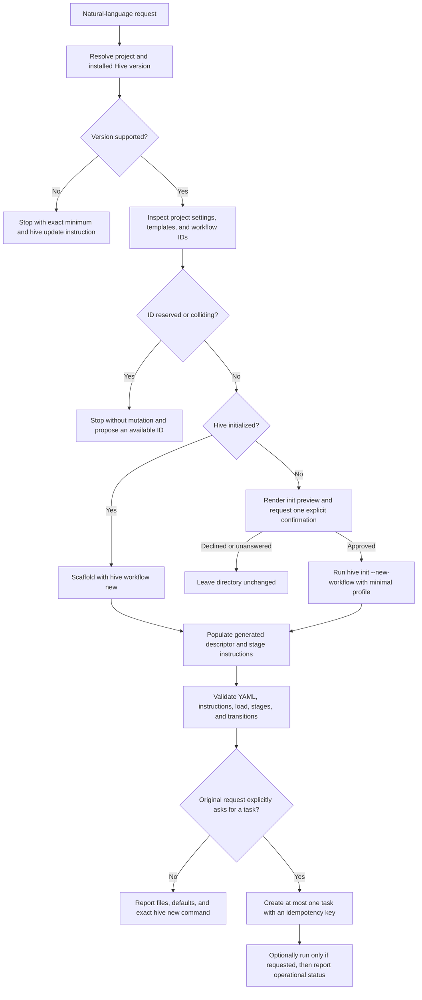
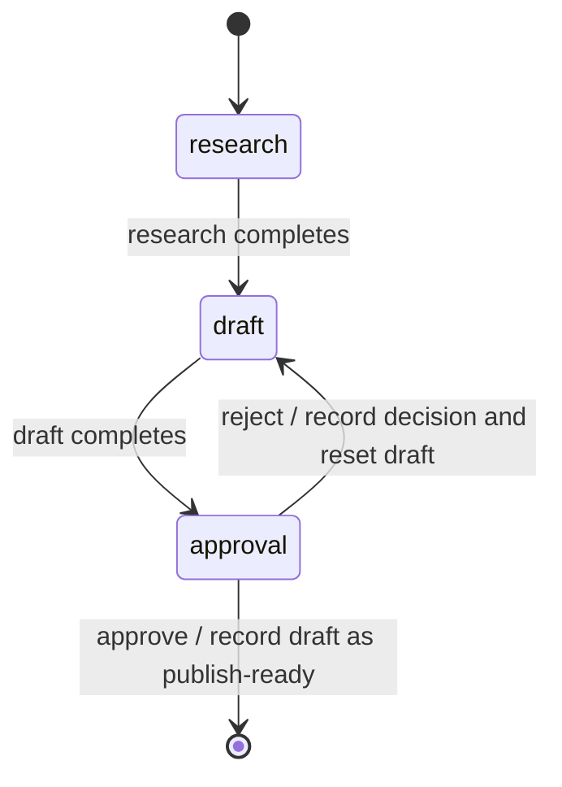

# Natural-Language Workflow Creator

## Overview

Build a discoverable `hive-workflow-creator` capability inside Hive's canonical `/hive` AgentSkill. It will translate an ordinary-language request into a new project-local workflow, use Hive's own scaffolding commands, validate the result through Hive, and report every inferred default. It will never alter an existing workflow.

The work also adds the smallest runtime primitives required by the accepted editorial example: a durable human stage with named approve/reject outcomes, a read-only workflow validation command, a safe minimal initialization profile with a machine-readable preview, and idempotent optional task creation. These are CLI/runtime contracts used by the skill, not a second workflow format or a separate workflow-builder service.

No scheduler prerequisite is declared. The hive-site wording task `hive-site:23116` is coordination-only and must not block implementation or release readiness in this repository.

### Goal capsule

- **Actor:** A Hive/OpenClaw user who knows the workflow they want but not Hive's YAML descriptor format.
- **Trigger:** The user asks `/hive` to create a new project-local workflow in natural language.
- **Outcome:** A new, loadable workflow is scaffolded through Hive, populated, validated, and summarized; by default no task is created.
- **Safety invariant:** Existing workflow files, project choices, and tasks are unchanged unless the user explicitly authorizes the corresponding new side effect.
- **Acceptance anchor:** “Create a three-stage editorial workflow that researches, drafts, and requires approval before publishing” produces exactly `research -> draft -> approval`; approve completes with a publish-ready artifact, while reject returns to `draft`.

### High-level flow



## Requirements Trace

| ID | Requirement | Planned coverage | Acceptance evidence |
|---|---|---|---|
| R1 | Create a new project-local workflow from ordinary language without requiring YAML knowledge. | U6, U7 | Canonical skill contract tests and natural-language smoke scenario. |
| R2 | Create-only: inspect but never overwrite or partially edit an existing workflow; reject reserved/colliding IDs before mutation and propose an available ID. | U3, U6, U8 | Collision integration fixture proves a byte-identical project and deterministic alternative ID. |
| R3 | Infer stages, artifacts, reusable instructions, project agent/model defaults, sequential transitions, `yolo` for ordinary local agent stages, and only materially necessary checkpoints; report every default. | U1, U6 | Skill fixtures assert the generated descriptor and completion summary. |
| R4 | In a fresh project, disclose initialization effects and obtain one explicit confirmation; use neutral minimal defaults; never auto-select a starter template or use `--force`. | U4, U6, U8 | Preview/execute integration tests and an unchanged-before-confirmation fixture. |
| R5 | Use `hive workflow new` or `hive init --new-workflow`; target the current descriptor only; detect an old CLI before mutation and give an exact minimum version plus `hive update`. | U3, U4, U6, U7 | Command-spy and old-version skill fixtures show no writes before the gate. |
| R6 | Model editorial approval as a durable third human stage; approve records a publish-ready artifact and completes, reject returns to `draft`; never publish externally without a separate destination and authorization. | U1, U2, U8 | End-to-end editorial fixture proves both outcomes and the absence of a publish stage/action. |
| R7 | Validate workflow YAML and referenced stage instructions, load it through Hive, and verify canonical stages and transitions before success. Validate AgentSkill frontmatter and projections as packaging contracts. | U3, U7, U8 | `hive workflow validate --json`, schema tests, and canonical projection tests. |
| R8 | Creation-only requests create no task and return exact created files, applied defaults, and `hive new ... --workflow <id>`. | U6, U8 | No-task fixture and summary snapshot. |
| R9 | Explicit create/run requests create at most one task after validation; retries do not duplicate it; report slug, current stage, daemon status, and next transition. | U5, U6, U8 | Retry fixture spans a moved task and returns the original task as a no-op. |
| R10 | Make the capability discoverable to OpenClaw users without violating Hive's single canonical `/hive` skill/package contract. | U6, U7 | OpenClaw discovery, install, gem-content, and projection-parity tests. |
| R11 | Pass focused contract, package/install, YAML, end-to-end, coverage, lint, full-suite, and skill validation gates. | U1-U8 | Verification contract below. |
| R12 | Document natural-language and manual CLI paths, examples, schema/design/safety/testing guidance, and coordinate stable public wording without blocking on hive-site work. | U7 | Documentation links/checks, release-contract tests, and coordination note. |

### Acceptance examples

| ID | Scenario | Required result |
|---|---|---|
| AE1 | Editorial happy path | Exactly `research -> draft -> approval`; `approve` records the draft as publish-ready and completes from `approval`. |
| AE2 | Editorial rejection | `reject` records the decision and returns the same task to `draft` in a runnable/waiting state. |
| AE3 | ID collision | No workflow or instruction file changes; explain the collision and propose an available ID. |
| AE4 | Fresh project | No mutation before confirmation; after approval, minimal initialization and the requested workflow are loadable without unrelated project choices being overwritten. |
| AE5 | Task side effects | No task by default; an explicit create/run request creates at most one task and returns its live operational state. |

## Scope Boundaries

### In scope

- A focused workflow-creator route within the canonical `/hive` skill, with a dedicated reference contract and supporting reference pages.
- Current-format owner-authored workflow scaffolding, population, validation, and reporting.
- A general `human` workflow stage with closed, descriptor-declared outcomes sufficient for durable approval/rejection flows.
- A read-only, JSON-capable workflow validation command.
- A previewable, neutral `--minimal` fresh-project initialization profile for creator use.
- Optional idempotent task creation and machine-readable task-creation output.
- Current-main/runtime compatibility gates, canonical skill projections, package/install contracts, tests, documentation, and wiki updates.

### Out of scope

- Editing, repairing, overwriting, or diffing an existing custom workflow. That future capability needs a preview and rollback design of its own.
- Inferring or performing external publication, deployment, messaging, or another high-consequence action without an explicit destination and authorization.
- Adapters for retired workflow descriptor/schema versions.
- A second ClawHub listing, a second OpenClaw skill directory, or command-specific OpenClaw packages; `/hive` remains the single public invocation.
- A visual workflow editor, web UI, generalized branching language, arbitrary scripts attached to human outcomes, or free-form transition expressions.
- Automatic `--force`, automatic starter-template selection, or silent initialization of a fresh directory.
- Implementing hive-site task `#23116`. Only a non-blocking wording handoff is required here.
- Choosing a release version, bumping version metadata, tagging, publishing a gem/ClawHub package, or deploying public documentation without separate release authorization.

### Settled decisions and implementation assumptions

- **Create-only** — session-settled, user-directed; chosen over modifying an existing descriptor.
- **Project inheritance, sequential defaults, and `yolo`** — session-settled, user-directed; chosen over model specialization, speculative branching, and a new permission ceremony.
- **One disclosed fresh-project confirmation** — session-settled, user-directed; chosen over headless initialization without consent.
- **Durable `approval` stage with no external publish action** — session-settled, user-directed; chosen over a hidden checkpoint before an inferred publish stage.
- **Current descriptor plus a pre-mutation version gate** — session-settled, user-directed; chosen over legacy adapters.
- **No task by default; explicit task creation is idempotent** — session-settled, user-directed; chosen over automatically starting work after creation.
- Repository inspection shows that OpenClaw packaging deliberately exposes one canonical `/hive` skill. Therefore `hive-workflow-creator` is a named, triggerable capability inside that skill, not another installation unit.
- The minimum compatible Hive version is injected from `Hive::VERSION` when the canonical skill projection is built. This plan intentionally does not select a future release number.
- Omitting stage-level agent/model fields is the preferred inheritance mechanism where the current resolver supports it; explicit fields are emitted only when necessary to preserve a project choice.

### Runtime contract for a human stage

The public descriptor shape is deliberately closed and directional:

```yaml
- name: approval
  kind: human
  state_file: approval.md
  input: draft.md
  outcomes:
    approve:
      complete: true
      artifact: draft.md
    reject:
      to: draft
```

- Every outcome must declare exactly one terminal action (`complete: true`) or workflow target (`to: <stage>`).
- Outcome names and targets are validated while loading the workflow; targets must exist in the same descriptor.
- A human stage has no agent, model, permissions, automatic command, or daemon dispatch.
- Entering it persists a waiting marker. `hive decide <task> <outcome> --from <stage>` is the only transition path.
- A completing outcome verifies the declared artifact is present and non-empty, records the outcome, note, artifact path, and timestamp in the human stage state file, and completes the workflow from that stage.
- A returning outcome records the decision, moves the task atomically, and resets the target stage to `WAITING` so stale completion markers cannot immediately re-advance it.
- `--from` and persisted decision identity make retries safe: the same decision is a no-op; a conflicting second decision is rejected with the current task state.



## Implementation Units

### U1 — Parse and validate durable human stages

**Goal:** Extend the authoritative owner-authored workflow descriptor with a minimal `human` kind and statically validated named outcomes, while preserving all existing linear workflow behavior.

**Files:**

- `lib/hive/workflow.rb`
- `lib/hive/workflows/descriptor_parser.rb`
- `test/unit/workflow_test.rb`
- `test/unit/workflows/descriptor_parser_test.rb`

**Approach:**

1. Add `human` to the internal stage-kind vocabulary and expose immutable outcome metadata on a stage.
2. Extend descriptor parsing with only the keys shown in the runtime contract: `outcomes`, `complete`, `artifact`, and `to`.
3. Reject unknown outcome keys, unsafe names, missing/duplicate actions, missing targets, nonexistent artifacts paths, and agent-only settings on human stages.
4. Preserve the existing implicit sequential transition for agent/council/terminal stages. Human outcomes are explicit edges and must not change existing descriptors' normalized representation.
5. Return errors with descriptor path, stage, outcome, and invalid field so the skill can report a material question instead of attempting repair.

**Test scenarios:**

- Load the editorial descriptor and assert the exact three stages and two approval outcomes.
- Reject an outcome with both `complete` and `to`, neither action, an unknown target, an unsafe name, or an unknown property.
- Reject model/agent/permissions on a human stage.
- Load every built-in and existing test descriptor unchanged to prove backward compatibility.

**Verification:** Focused parser/workflow tests pass; normalized legacy descriptor fixtures are unchanged; the editorial fixture exposes `approve -> complete` and `reject -> draft` exactly.

### U2 — Execute human decisions and surface waiting state

**Goal:** Make human stages durable and operable through a typed CLI command without dispatching agents or inferring external actions.

**Dependencies:** U1.

**Files:**

- `lib/hive/commands/decide.rb` (new)
- `lib/hive/cli.rb`
- `lib/hive/task_action.rb`
- `lib/hive/commands/new.rb`
- `lib/hive/commands/approve.rb`
- `lib/hive/commands/status.rb`
- `lib/hive/operational_status.rb`
- `lib/hive.rb`
- `schemas/hive-decide.v1.json` (new)
- `schemas/hive-status.v6.json`
- `schemas/hive-operational-status.v1.json`
- `test/integration/decide_test.rb` (new)
- `test/integration/new_test.rb`
- `test/unit/task_action_generic_test.rb`
- `test/unit/operational_status_test.rb`
- `test/unit/schema_files_test.rb`

**Approach:**

1. Add `hive decide TARGET OUTCOME --from STAGE [--note TEXT] [--json]`, resolving the task under the normal project/state lock.
2. Persist a human stage as `WAITING`; task execution and daemon scheduling return `NEEDS_INPUT` plus allowed outcomes instead of auto-advancing or archiving it.
3. On `approve`, validate the required artifact, write the durable decision record, set the approval stage complete, and archive through the existing completion path.
4. On `reject`, write the same audit record, move back to `draft`, and replace any stale marker with `WAITING` atomically.
5. Make retries idempotent by requiring the caller's expected `--from` stage and comparing the persisted decision. Reject stale or conflicting decisions rather than applying them to a moved task.
6. Add outcome metadata additively to status/operational JSON while preserving current schema versions and existing consumers.

**Test scenarios:**

- Entering `approval` never runs an agent and remains visible as waiting for human input.
- Approve with a non-empty draft records the publish-ready artifact and completes from `approval`.
- Approve with a missing/empty artifact fails without moving the task.
- Reject records the decision, returns to `draft`, and does not immediately auto-advance.
- Repeat the same decision as a no-op; reject a conflicting or stale decision.
- Existing inert terminal and sequential agent stages retain current behavior.

**Verification:** Command and schema tests prove atomic state changes and stable JSON; the daemon/status tests show no human-stage dispatch; no test performs an external publish action.

### U3 — Add authoritative read-only workflow validation

**Goal:** Give the skill a single Hive-native command that validates authored files, loads the workflow through production resolution, and returns the exact normalized graph before success is reported.

**Dependencies:** U1.

**Files:**

- `lib/hive/commands/workflow.rb`
- `lib/hive/commands/workflow/validate.rb` (new)
- `lib/hive/cli.rb`
- `lib/hive.rb`
- `schemas/hive-workflow-validate.v1.json` (new)
- `test/integration/workflow_command_test.rb`
- `test/unit/schema_files_test.rb`

**Approach:**

1. Add `hive workflow validate ID --json` as a strictly read-only subcommand.
2. Resolve the workflow through the same project overlay/loader used by task creation, not a standalone YAML parser.
3. Validate the YAML, descriptor schema, all referenced instruction/state/input paths, and normalized transitions/outcomes.
4. Return a versioned payload containing workflow ID/origin, descriptor and instruction paths, ordered stages, kinds, automatic edges, human outcomes, and `valid`/diagnostic fields.
5. Keep collision detection in `hive workflow new` as the authoritative mutation guard; add a shared deterministic available-ID suggestion helper so the CLI and skill report the same alternative.

**Test scenarios:**

- Validate built-in, ordinary custom, and editorial human workflows.
- Report malformed YAML, invalid descriptor keys, a missing instruction, and a broken transition without mutation.
- Attempt reserved and colliding IDs and assert all workflow files remain byte-identical while an available ID is proposed.
- Prove validation creates no task and does not modify project/state commits.

**Verification:** JSON conforms to `hive-workflow-validate.v1`; integration tests compare repository tree/state before and after every failure path; the returned editorial graph is exact.

### U4 — Make fresh initialization previewable and neutral

**Goal:** Provide an authoritative no-write initialization preview and an explicit minimal profile that the skill can run only after one user confirmation.

**Files:**

- `lib/hive/cli.rb`
- `lib/hive/commands/init.rb`
- `lib/hive/commands/init/prompts.rb`
- `schemas/hive-init.v2.json`
- `schemas/hive-init-preview.v1.json` (new)
- `test/unit/commands/init/prompts_test.rb`
- `test/unit/commands/init_test.rb`
- `test/integration/init_test.rb`
- `test/unit/schema_files_test.rb`

**Approach:**

1. Add `hive init --new-workflow ID --minimal --preview --json`. Preview performs every preflight and returns the resolved target plus planned project files, state worktree, hooks/context integration, timers/services, global registration, and background automation, but commits no filesystem/global/service changes.
2. Define `--minimal` as the creator-safe neutral profile: establish the core Hive project, state worktree, registration, and required wiki/context hooks, while disabling optional patrol/refactor patrol, ad-hoc auto-fix, daemon dispatch/autostart, and babysitter/timer setup.
3. Permit the non-interactive execute form only for a genuinely uninitialized target and only with `--new-workflow`; reject `--force`, existing Hive state, dirty-project replacement, or an implicitly selected starter template.
4. Have the skill show the preview verbatim in concise prose and wait for one explicit confirmation before running the same resolved command without `--preview`.
5. Preserve current interactive/default initialization behavior for all callers that omit `--minimal`.

**Test scenarios:**

- Preview an empty directory and assert no files, worktrees, registrations, hooks, services, or timers change.
- Confirm and execute the same minimal plan, then validate the newly scaffolded custom workflow.
- Decline or omit confirmation in the skill fixture and prove the directory remains unchanged.
- Reject an existing/dirty target, `--force`, missing `--new-workflow`, and template auto-selection.
- Assert ordinary `hive init` retains its current defaults.

**Verification:** Preview JSON enumerates positive and negative side effects; before/after integration snapshots prove zero preview mutation; initialized output loads through U3.

### U5 — Make explicit task creation idempotent and machine-readable

**Goal:** Allow the skill to honor an explicit create/run request exactly once and report operational state reliably across retries.

**Files:**

- `lib/hive/commands/new.rb`
- `lib/hive/cli.rb`
- `lib/hive/task_meta.rb`
- `lib/hive.rb`
- `schemas/hive-new.v1.json` (new)
- `test/integration/new_test.rb`
- `test/unit/task_meta_test.rb`
- `test/unit/schema_files_test.rb`

**Approach:**

1. Add optional `hive new ... --idempotency-key KEY --json`; callers without the option retain current behavior.
2. Persist the opaque key and an input/workflow fingerprint in task metadata under the normal state lock.
3. Search all active/completed project stages for the key before creation. Return the existing task with `created: false` when key and fingerprint match, even if the task has moved; reject reuse with different input/workflow.
4. Return schema-versioned `created`, `slug`, `workflow`, `current_stage`, and next-action fields.
5. After explicit creation (and after an explicit first run), have the skill query `hive status --operational --json` to report daemon disposition and the expected next transition from live state.

**Test scenarios:**

- Default creator flow never invokes `hive new`.
- Explicit creation returns `created: true`; retry before and after stage movement returns the same slug with `created: false`.
- Reusing a key for different input/workflow fails without another task.
- Explicit “run” executes the first stage once; explicit “create” does not run it.
- Legacy task metadata and `hive new` without an idempotency key remain compatible.

**Verification:** State-wide retry tests contain one task only; `hive-new.v1` and operational status validate; reported stage/daemon/next transition match the on-disk task.

### U6 — Author the workflow-creator skill contract

**Goal:** Teach the canonical `/hive` skill to recognize workflow-creation requests and execute the safe inspect, scaffold, populate, validate, and report sequence with minimal questioning.

**Dependencies:** U2, U3, U4, U5.

**Files:**

- `skills/hive/SKILL.md`
- `skills/hive/skill.json`
- `skills/hive/references/workflow-creator.md` (new)
- `skills/hive/references/workflow-creator-example.md` (new)
- `skills/hive/references/workflow-schema.md` (new)
- `skills/hive/references/workflow-stage-design.md` (new)
- `skills/hive/references/workflow-checkpoints.md` (new)
- `skills/hive/references/workflow-permissions.md` (new)
- `skills/hive/references/workflow-testing.md` (new)
- `skills/hive/references/workflow-common-mistakes.md` (new)
- `skills/hive/references/setup-and-platforms.md`
- `skills/hive/references/safety.md`
- `lib/hive/agent_skills/canonical_skill.rb`
- `test/unit/agent_skills/canonical_skill_test.rb`

**Approach:**

1. Add natural-language workflow creation to `/hive` triggers and route it to the focused `hive-workflow-creator` reference contract.
2. Gate on the installed Hive version before any mutation. Inject the package's `Hive::VERSION` into canonical projections as the exact minimum and prescribe the existing `hive update` path when too old.
3. Inspect project configuration, built-ins, and custom workflow IDs first. Infer a safe non-reserved ID, stages/artifacts/instructions, inheritance, sequential transitions, `yolo`, and only requested/high-consequence human stages.
4. Reuse a built-in template only for a genuine semantic match; otherwise use the neutral scaffold and modify only the newly generated paths.
5. Ask only when unresolved alternatives materially change behavior. Stop on collision and propose the CLI-derived available ID rather than choosing silently.
6. For fresh projects, obtain and present U4's preview and await one confirmation. Do not ask further questions for harmless neutral defaults after approval.
7. Validate with U3 before success. Default to no task and print the exact `hive new <quoted request> --workflow <id>` command. Invoke U5 only when task creation/run was explicit in the original request.
8. Require a completion summary with created files, reused template (or neutral scaffold), every applied default, validation result, and optional task operational status.

**Test scenarios:**

- Exact editorial prompt produces the accepted graph, `yolo` local agent stages, project inheritance, and no task.
- Collision, reserved ID, old version, failed validation, and unconfirmed fresh initialization all stop before mutation.
- A neutral non-coding request is not forced into coding/research/writing templates.
- Specialized model, branching, checkpoint, and external publishing are not inferred without material input.
- Explicit task/run language is distinguished from creation-only language and reuses a stable idempotency key on retry.

**Verification:** Canonical-skill tests validate frontmatter, reference routing, version interpolation, trigger text, command ordering, forbidden behavior, and the required completion-summary fields.

### U7 — Project, package, and document the capability

**Goal:** Keep one canonical source and one OpenClaw `/hive` installation while making the focused creator capability easy to discover and maintain.

**Dependencies:** U6.

**Files:**

- `openclaw/skills/hive/SKILL.md` (generated)
- `openclaw/skills/hive/.hive-skill.json` (generated)
- `openclaw/skills/hive/references/workflow-creator.md` (generated)
- `openclaw/skills/hive/references/workflow-creator-example.md` (generated)
- `openclaw/skills/hive/references/workflow-schema.md` (generated)
- `openclaw/skills/hive/references/workflow-stage-design.md` (generated)
- `openclaw/skills/hive/references/workflow-checkpoints.md` (generated)
- `openclaw/skills/hive/references/workflow-permissions.md` (generated)
- `openclaw/skills/hive/references/workflow-testing.md` (generated)
- `openclaw/skills/hive/references/workflow-common-mistakes.md` (generated)
- `openclaw/skills/hive/references/setup-and-platforms.md` (generated)
- `openclaw/skills/hive/references/safety.md` (generated)
- `openclaw/README.md`
- `README.md`
- `docs/workflows.md`
- `docs/cli.md`
- `docs/RELEASING.md`
- `test/unit/openclaw_skills_test.rb`
- `test/integration/setup_agents_test.rb`
- `test/integration/agent_skill_adapters_test.rb`
- `test/unit/gemspec_test.rb`
- `test/unit/release_contract_test.rb`

**Approach:**

1. Extend the canonical renderer's allowed one-level references and regenerate committed OpenClaw projections; do not hand-maintain divergent generated content.
2. Keep `skills/hive/skill.json`, the gem payload, and OpenClaw install/discovery checks aligned with the one-skill contract.
3. Add the complete editorial example plus concise schema, stage-design, checkpoint, permission, testing, and common-mistake references.
4. Document both paths in `docs/workflows.md`: natural-language `/hive` creation and manual `hive workflow new`/`validate` authoring.
5. Document new CLI contracts and stable/public wording rules. Record hive-site `#23116` as a non-blocking downstream wording handoff, with no website mutation or release version selected here.

**Test scenarios:**

- OpenClaw discovers exactly one `/hive` skill and routes a creator request to the new reference.
- Canonical and generated files are byte-for-byte current after rendering.
- Gem/install fixtures include every new reference and no second capability directory.
- Docs contain the exact editorial semantics, collision behavior, confirmation boundary, permission default, task side-effect rule, manual commands, and latest-stable wording caveat.

**Verification:** Projection-parity, gem-content, install, adapter, frontmatter, and release-contract tests pass; generated-file diff is intentional and reproducible.

### U8 — Prove the complete natural-language path and update durable engineering docs

**Goal:** Exercise the creator as a user sees it, cover all acceptance examples, and record the new runtime/CLI contracts in Hive's required wiki system.

**Dependencies:** U1-U7.

**Files:**

- `test/integration/workflow_creator_e2e_test.rb` (new)
- `test/smoke/live_hive_workflow_creator_smoke_test.rb` (new)
- `.github/workflows/live-agent-skills.yml`
- `packaging/live_agent_skills/proof.rb`
- `wiki/commands/workflow.md`
- `wiki/commands/init.md`
- `wiki/commands/new.md`
- `wiki/modules/workflows.md`
- `wiki/modules/task_action.md`
- `wiki/testing.md`
- `wiki/log.d/20260722-natural-language-workflow-creator.md` (new)

**Approach:**

1. Build a hermetic end-to-end harness around the skill contract and real CLI primitives, with filesystem snapshots and command-spy evidence for all acceptance examples.
2. Add an authenticated OpenClaw smoke scenario in a disposable repository for the exact editorial natural-language prompt. Keep it separate from the existing observer-only operating-skill proof so each attestation has a narrow contract.
3. Attest the prompt, resolved `/hive` skill, ordered commands, created files, validation payload, no-task default, exact stage graph, and absence of external publication.
4. Add a second explicit task-create/run scenario and retry it with the same idempotency key; attest one slug plus operational status.
5. Update affected command/module/testing wiki pages and add the required dated `wiki/log.d` fragment. No new top-level wiki page is needed.

**Test scenarios:**

- AE1 editorial approval and AE2 rejection, including durable records and routing.
- AE3 collision with byte-identical before/after snapshot.
- AE4 fresh-project preview, no mutation before consent, and successful minimal init after consent.
- AE5 default no-task plus explicit create/run retry yielding one task.
- Old Hive version, neutral-template inference, invalid generated YAML, and OpenClaw discovery/install failures.

**Verification:** Hermetic E2E passes locally; protected live proof emits schema-valid, secret-redacted evidence for OpenClaw; wiki validation and all repository gates below pass.

## Verification Contract

Run implementation in an isolated worktree and keep the user's original checkout untouched. A unit is complete only when its focused checks pass; the feature is complete only after the aggregate gates pass on the final head.

1. **Focused contracts:** Run the affected unit/integration files for descriptor parsing, human decisions, workflow validation, initialization preview, task idempotency, canonical skill rendering, and packaging.
2. **Hermetic acceptance:** Run `bundle exec ruby -Itest test/integration/workflow_creator_e2e_test.rb` and require AE1-AE5 to pass with filesystem/state snapshots.
3. **Skill validation:** Run canonical projection, OpenClaw discovery/install, gem-content, agent-skill adapter, frontmatter, schema-file, and release-contract tests.
4. **Coverage/full suite:** Run `bundle exec rake coverage`; retain the repository's 100% line-coverage gate.
5. **Library E2E:** Run `bundle exec rake e2e:lib_test` and then the repository's normal `bundle exec rake e2e` gate where environment prerequisites are available.
6. **Lint:** Run `bundle exec rubocop --parallel --format github`.
7. **Protected live proof:** Run the dedicated OpenClaw workflow-creator smoke through `.github/workflows/live-agent-skills.yml` with candidate source pinning and validate the emitted attestation. A missing credential is an explicit unavailable live gate, never a silent pass.
8. **Final review:** Confirm the diff contains no release-version bump, tag/publish/deploy action, hive-site implementation, second OpenClaw skill, or edits to pre-existing user workflows.

## Risks

| Risk | Impact | Mitigation / proof |
|---|---|---|
| A new human stage accidentally changes legacy auto-advance semantics. | Existing workflows stall or archive differently. | Keep the kind opt-in, preserve normalized legacy descriptors, and run exhaustive legacy workflow/task-action tests in U1/U2. |
| Rejecting approval leaves stale markers or loses the audit record. | The task re-advances immediately or a human decision is not durable. | Perform record, move, and marker reset under the state lock; test crash-safe ordering and repeated decisions. |
| The skill mutates before discovering a collision, old version, or invalid target. | Existing project data is changed contrary to the create-only contract. | Order all version/project/ID checks before scaffolding; keep CLI collision guards authoritative; assert byte-identical snapshots on every refusal. |
| Fresh initialization has hidden global/service side effects. | Consent is incomplete and local machine state changes unexpectedly. | Generate preview from the same resolved plan as execution, enumerate positive and negative side effects, and prove preview is write-free. |
| `--minimal` drifts from normal init plumbing or disables a required core component. | Newly initialized workflows do not load. | Share the existing initialization planner, alter only optional feature defaults, and validate/load immediately after execution. |
| Task retry finds only the entry queue and duplicates a moved task. | Repeated agent calls create multiple tasks. | Persist an idempotency key in task metadata and search all active/completed stages under lock before creation. |
| Canonical and OpenClaw skill copies diverge. | Installed users receive stale or undiscoverable guidance. | Treat `skills/hive/**` as source, generate projections, and enforce byte parity/package inventory in tests. |
| A live-agent test is nondeterministic or expands the existing observation proof. | CI becomes flaky or attestation meaning is unclear. | Use deterministic hermetic acceptance as the primary gate and a separate, narrow protected smoke/attestation for the natural-language routing claim. |
| Public docs describe unreleased main behavior. | Users on stable Hive receive unusable commands. | Keep release wording version-aware, coordinate hive-site `#23116` downstream, and publish only after separate release authorization. |
| Scope expands into a general workflow language or publishing system. | Delivery becomes unsafe and unbounded. | Keep human outcomes closed to `complete`/`to`, forbid executable outcome actions, and enforce the explicit out-of-scope list in code review. |

## Definition of Done

- `/hive` recognizes and safely completes a natural-language create-only workflow request through authoritative Hive CLI paths.
- The exact editorial workflow loads as `research -> draft -> approval`; approve and reject both behave as specified, and nothing publishes externally.
- Reserved/colliding IDs, old versions, invalid output, and unconfirmed initialization produce zero workflow/task mutations and actionable diagnostics.
- Fresh initialization is previewed, explicitly approved once, minimal, and loadable without `--force` or an inferred template.
- Creation-only reports created files, every default, validation evidence, and an exact next `hive new ... --workflow <id>` command without creating a task.
- Explicit create/run requests are idempotent across retries and report slug, current stage, daemon status, and next transition.
- The focused capability is present in the one canonical OpenClaw `/hive` package, with valid frontmatter, generated projections, install/discovery coverage, and complete references.
- Focused tests, AE1-AE5 hermetic E2E, coverage, lint, schema/skill/package checks, repository E2E, and the protected OpenClaw proof are green on the final head.
- Docs and wiki describe the shipped stable contract; the required wiki log fragment exists; hive-site coordination remains non-blocking.
- No existing workflow is modified, no legacy adapter is added, and no release/tag/publish/deploy action is taken without separate authorization.

<!-- COMPLETE -->
