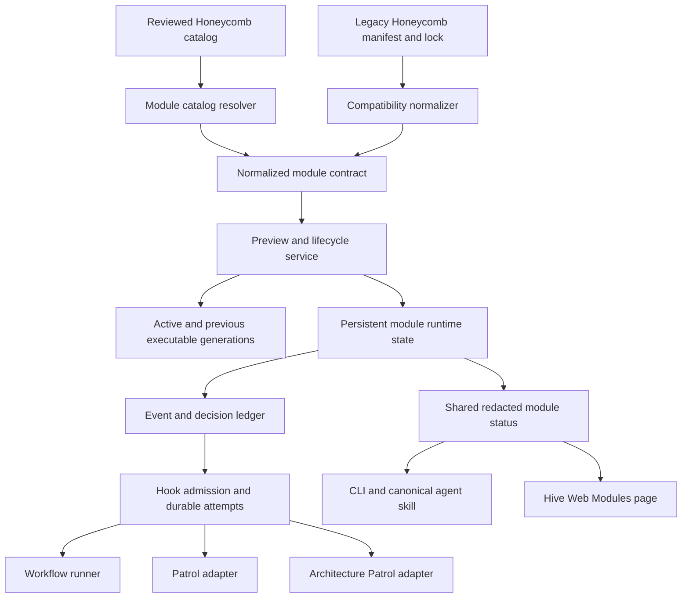
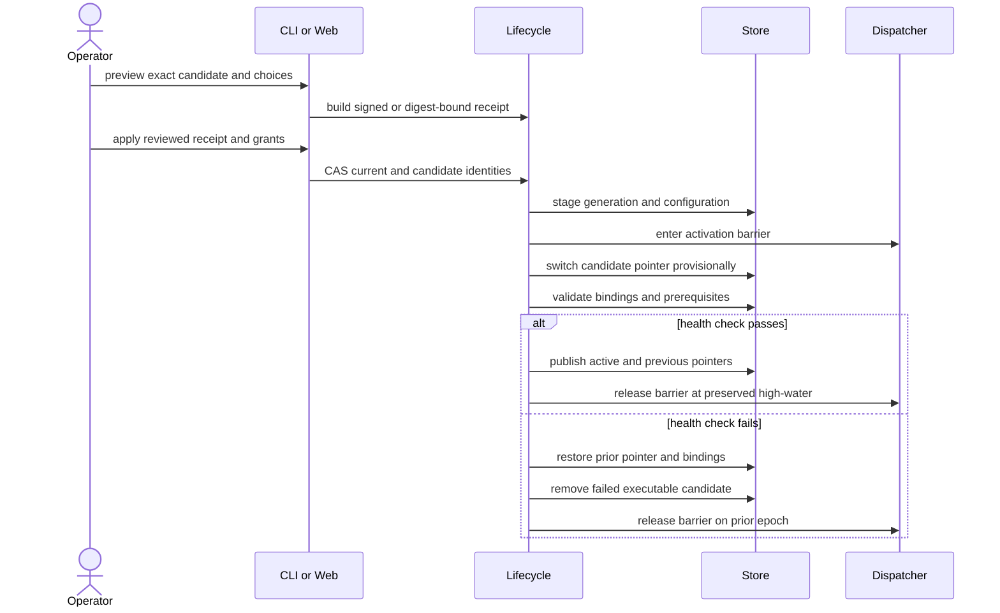
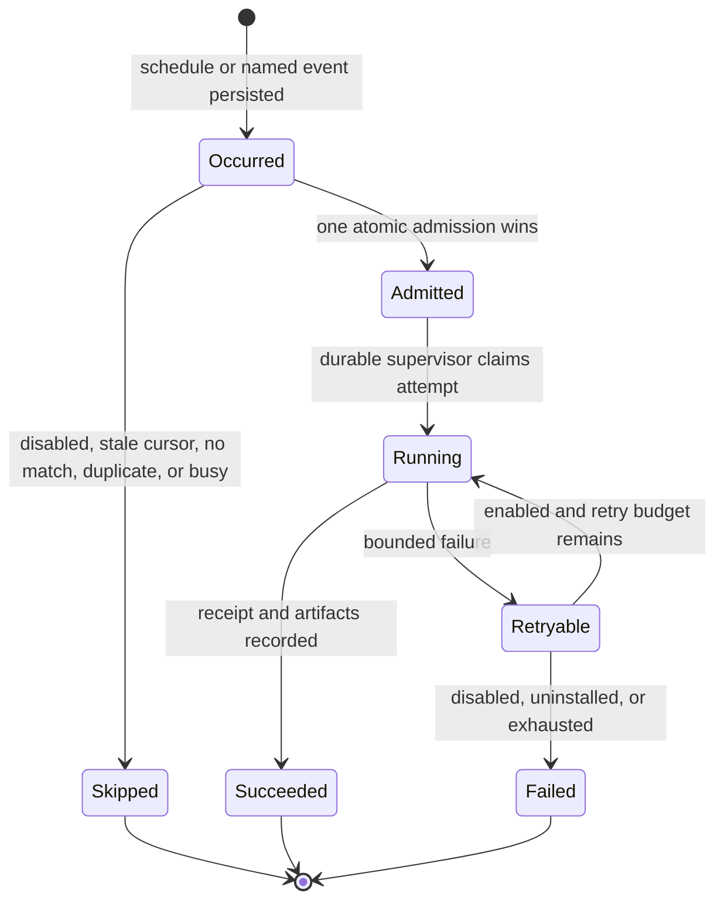
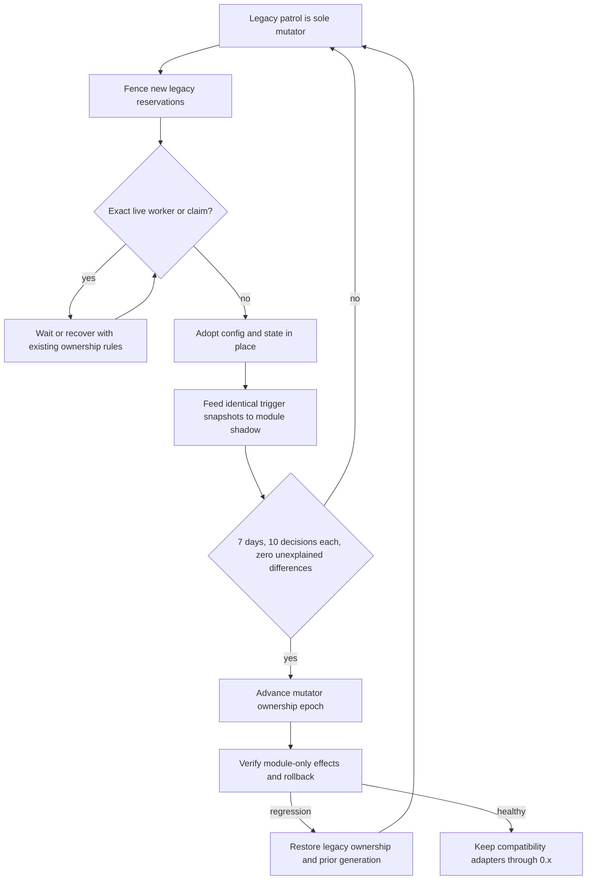

# Installable Patrol Modules - Plan

## Goal Capsule

- **Objective:** Introduce one project-local, reviewed-catalog module contract beneath Honeycombs, Patrol, and Architecture Patrol, then move both patrol products onto it without changing their observable behavior or durable state.
- **Authority:** The Product Contract below governs behavior; existing Honeycomb, Patrol, Architecture Patrol, CLI JSON, Web, attempt, and recovery contracts govern compatibility; implementation details may change only within those boundaries.
- **Execution profile:** Deep, cross-cutting implementation spanning package validation, atomic lifecycle state, daemon dispatch, event durability, CLI, Rails Web, migrations, and long-running shadow proof.
- **Stop conditions:** Stop for any change that requires user-wide precedence, arbitrary package sources, a broader event vocabulary, destructive state relocation, weakened consent, or an unexplained parity difference.
- **Tail ownership:** Delivery ends at a reviewed, non-draft, merge-ready PR with green local and hosted gates. Do not merge, enable auto-merge, tag, publish, or release.

---

## Overview

Hive will evolve the existing managed Honeycomb substrate into a normalized module package layer rather than add a parallel patrol package system. Existing catalog entries, manifests, locks, workflow commands, Web workflow behavior, and in-flight workflow tasks remain compatible through adapters. New module manifests add workflows, hooks, schedules, named-event bindings, typed settings, permission grants, templates, and documentation.

The runtime will persist project-scoped domain events and hook decisions separately from `Hive::Events` telemetry, admit module runs through Hive's durable attempt and daemon ownership machinery, and derive one redacted status projection for CLI, Web, doctor, dry-run, and agent-facing documentation. Patrol and Architecture Patrol will remain the same engines behind first-party module adapters while their existing state stores stay authoritative in place.

Rollout is shadow-first. Legacy patrol scheduling remains the sole mutator until both module paths have accumulated at least seven days and ten comparable trigger decisions each with no unexplained difference or duplicate effect. Cutover changes one durable mutator-ownership epoch and preserves a tested rollback path; bespoke code is not deleted in this delivery.

---

## Product Contract

### Summary

Provide reviewed, project-local modules whose installation is an explicit configuration, consent, and activation transaction. Use that shared contract for Honeycombs and the two first-party patrol products while preserving all legacy entry points, state, decisions, artifacts, and outputs through the remaining 0.x line.

### Problem Frame

Honeycombs already have a strong managed-package lifecycle, but only workflows fit its contract. Patrol and Architecture Patrol have separate configuration, schedulers, locks, state machines, JSON surfaces, and Web visibility. Adding another patrol-specific package layer would multiply trust, update, diagnostic, and recovery semantics.

The difficult part is not packaging two commands. It is defining one installable unit that can activate schedules and events safely, explain every launch or skip, survive failed updates, retain only the supported executable generations, preserve years of patrol deduplication and recovery evidence, and remain consistent across CLI, Web, daemon, and agent surfaces.

**Product Contract preservation:** unchanged. The implementation decisions below refine how the curated requirements are realized without narrowing their behavior.

### Actors

- A1. Project operators discover, preview, install, configure, consent, inspect, diagnose, enable, disable, update, and uninstall modules independently for each registered project through CLI or Hive Web.
- A2. Module authors package declarative workflows, hooks, schedules, event bindings, settings, permissions, templates, provenance, and documentation under one reviewed contract.
- A3. Hive validates catalog identity and package content, activates immutable project-local generations, dispatches hooks through durable execution machinery, and retains runtime history outside executable generations.
- A4. Existing Patrol and Architecture Patrol users continue using their current commands, settings, schedules, state, and outputs while migration and parity proof proceed.

### Requirements

#### Package and trust contract

- R1. Define one generalized installable module contract beneath Honeycombs, Patrol, and Architecture Patrol; existing Honeycomb manifests, catalog entries, locks, installations, commands, and Web workflow behavior must continue without republishing or manual migration.
- R2. Support project-local installation only; each project independently owns module version, configuration, grants, hook state, updates, and removal.
- R3. Resolve only first-party or reviewed catalog entries, pin full immutable source and catalog commits, verify canonical manifest and payload digests, and reject arbitrary Git URLs or unreviewed local packages.
- R4. Treat install and update as preview-bound atomic transactions that disclose every setting, hook, schedule, event binding, permission, secret binding name, and proposed state; non-interactive mutation must supply every required choice and cannot infer consent.
- R5. Require separate grants for repository writes, GitHub mutations, secret access, external command execution, new network hosts, and wildcard filesystem or network access; expanded permissions require renewed consent and first-party modules receive no exemption.

#### Generation and lifecycle semantics

- R6. Keep one active and one previous executable generation, place checkpoints, deduplication, attempts, retry/budget state, and artifacts outside generation rollback, and restore the previous pointer automatically when candidate activation health validation fails.
- R7. Preserve existing hook states on update, leave new hooks inactive until approved, stop new admissions while disabled, prevent historical replay on re-enable, and stop future dispatch after uninstall while preserving historical tasks, decisions, attempts, and artifacts.
- R8. Delete a failed executable candidate after rollback and retain only a bounded redacted diagnostic; hook execution failures record attempts and use Hive's bounded retry policy without rolling back installation.

#### Events and execution

- R9. Support schedules plus exactly `task.completed`, `pull_request.merged`, and `project.registered`; each event has immutable project identity, occurrence time, source identity, event ID, and idempotency key.
- R10. Atomically evaluate enabled state, cursor, deduplication, concurrency, permission/config/generation identity, and attempt creation so replay or simultaneous matching triggers cannot create duplicate work.
- R11. Prove Patrol from schedule and `task.completed`, Architecture Patrol from schedule and `pull_request.merged`, and module bootstrap from `project.registered`, while recording an explainable launch or skip decision for every evaluated occurrence.

#### Migration and compatibility

- R12. Automatically adopt `patrol.*` and `refactor_patrol.*` settings and all schedules, dismissals, checkpoints, fingerprints, claims, deduplication, attempts, retry/budget state, artifacts, reconciler progress, and in-flight recovery evidence without repeating completed work or reopening equivalent PRs.
- R13. Preserve `hive patrol` and `hive refactor-patrol` flags, exit codes, human output, dry-run behavior, and versioned JSON schemas as forwarding aliases through all remaining 0.x releases, with exact replacement warnings before removal at Hive 1.0.

#### Operations and proof

- R14. Expose one redacted module status model through CLI and Hive Web with active version and provenance, manifest/config/permission digests, hooks, schedules, event bindings, effective settings, secret binding availability, next trigger, latest attempt, retry state, artifacts, failure reason, and launch/skip rationale; doctor and dry-run must remain read-only and never expose raw environment values, secrets, or unsafe stderr.
- R15. Require fixture equivalence, realistic migration tests, at least seven days and ten trigger decisions per module in one-mutator shadow mode, zero unexplained differences or duplicate effects, rollback proof, green local and hosted CI, and a reviewed non-draft merge-ready PR that is neither merged nor auto-merged.

### Key Flows

- F1. **Preview and activate:** Resolve a reviewed catalog candidate, normalize its manifest, collect exact settings/hook/grant choices, bind them into a preview receipt, validate a candidate, fence dispatch, activate and health-check it, then publish the active pointer or restore the previous one.
- F2. **Dispatch a trigger:** Persist the schedule or named-event occurrence, evaluate it under one hook admission lock, write a launch/skip receipt, create or attach to the durable attempt, and expose its task, artifacts, retry, and terminal result.
- F3. **Update or change state:** Preserve existing settings and cursors, require choices for new hooks or permission expansion, atomically update/disable/enable/uninstall, and retain historical runtime evidence independently of executable cleanup.
- F4. **Migrate patrols:** Fence new legacy reservations, wait for exact live ownership to quiesce, adopt current config and state stores in place, keep aliases and legacy serializers, then run shadow decisions from the same immutable inputs.
- F5. **Cut over or roll back:** Review parity evidence, advance one mutator-ownership epoch to modules, verify no duplicate admission, and restore legacy ownership and the prior active generation without changing checkpoints if a rollback is required.

### Acceptance Examples

- AE1. A fresh project installs either first-party module from a reviewed catalog candidate, approves settings and grants, activates selected hooks atomically, and sees matching redacted CLI and Web status.
- AE2. Patrol launches from its schedule and `task.completed`; Architecture Patrol launches from its schedule and `pull_request.merged`; project registration runs enabled bootstrap hooks once.
- AE3. Replayed or simultaneous triggers create at most one permitted attempt, and status records trigger identity, deduplication, concurrency, and linked task/attempt outcomes for both winners and skips.
- AE4. A realistic existing installation migrates without changed decisions, repeated completed work, reopened equivalent PRs, lost checkpoints, changed aliases, or changed JSON/human outcomes.
- AE5. A successful update preserves runtime state and existing hook states; failed activation restores the prior generation; expanded grants and new hooks remain inactive without explicit approval.
- AE6. Disable prevents new launches while allowing already-running work to finish; re-enable does not replay the disabled interval; uninstall prevents future dispatch while retaining inspectable historical evidence.
- AE7. Fixture tests and shadow reports prove commands, configuration, schedules, decisions, artifacts, failures, and rollback parity for at least seven days and ten decisions per module with no duplicate job, finding, issue, or PR.
- AE8. Local and hosted verification are green and the final PR is reviewed, non-draft, merge-ready, leaves unrelated files untouched, and remains unmerged without auto-merge.

## Scope Boundaries

#### In scope

- Generalized reviewed module manifests, catalog normalization, project-local lifecycle, typed settings/grants, immutable generations, status, doctor, dry-run, daemon dispatch, CLI, Web, and canonical Hive agent documentation.
- First-party Patrol and Architecture Patrol module definitions and adapters, in-place state adoption, legacy aliases, shadow comparison, cutover, and rollback proof.
- The three named events and scheduled triggers only.

#### Deferred to Follow-Up Work

- Deleting bespoke patrol schedulers, commands, and state adapters after cutover evidence has remained healthy; compatibility aliases and config projections remain until Hive 1.0 regardless.
- Publishing the reviewed module entries as public catalog latest versions, version bumps, release notes, tags, packages, and deployment; these require separate release authorization.
- A bulk command that applies independent project-local module operations across registered projects.

#### Out of scope

- User-wide installations, user/project precedence, inherited grants, or shared enabled state.
- Arbitrary Git or local packages, unreviewed publishers, signed third-party publisher infrastructure, wildcard event matching, or a broader GitHub event catalog.
- Loading executable Ruby code from a module package, confirmation-free agent mutation, cancellation of already-running hooks, or changing owner-authored workflow semantics.
- Replacing the Workflows page, global `hive uninstall`, task operational-status/action contracts, or current patrol product decisions and UX.

---

## Planning Contract

### Key Technical Decisions

- KTD1. Use one generalized module contract and adapt legacy Honeycombs into it. (session-settled: user-directed — chosen over a patrol-only workflow contract or parallel patrol packages: one discovery, validation, installation, and lock model is the decisive compatibility path.)
- KTD2. Keep all module ownership project-local. (session-settled: user-directed — chosen over user-wide plus project-local scopes: v1 avoids precedence, shadowing, inherited permissions, and ambiguous enablement.)
- KTD3. Restrict installation to reviewed catalog sources with immutable commit and digest verification. (session-settled: user-directed — chosen over arbitrary sources or a new signed-publisher system: the reviewed catalog is the v1 trust boundary.)
- KTD4. Make install the enablement transaction and require complete choices in non-interactive mode. (session-settled: user-directed — chosen over install-disabled followed by a separate enable command: previewed activation is one atomic operator decision.)
- KTD5. Separate executable generations from persistent runtime state and retain only active plus previous. (session-settled: user-directed — chosen over rolling back checkpoints or retaining unbounded executable history: rollback changes code/config, never operational history.)
- KTD6. Limit launch events to the three named events plus schedules. (session-settled: user-directed — chosen over wildcard matching or a broader GitHub catalog: v1 proves a small stable vocabulary first.)
- KTD7. Preserve the full patrol command/config/state/Web surface through 0.x. (session-settled: user-directed — chosen over a flag-day migration: old users must not republish, manually migrate, or lose recovery evidence.)
- KTD8. Gate mutator cutover on fixture parity, seven-day shadow dogfood, ten decisions per module, zero unexplained differences, and rollback proof. (session-settled: user-directed — chosen over fixture-only or immediate replacement: real scheduler and recovery behavior must be observed before authority moves.)

### Assumptions

These unvalidated implementation defaults are explicit because this is a headless planning stage. They preserve the Product Contract and can be challenged during review without reopening product scope.

- Add `hive module` as the generalized CLI while `hive workflow install|list|update|remove` remain exact compatibility projections for workflow-shaped Honeycombs.
- Keep Hive Web's Workflows page for workflow selection and authoring; add a separate project-filtered Modules page backed by the same lifecycle service.
- Module packages are declarative. Hook targets are packaged workflow IDs, registered Hive entrypoint IDs, or explicitly consented external commands; package Ruby is never loaded.
- Add immutable project UUID and initial-registration identity to the global registry. Existing rows are backfilled without synthesizing historical `project.registered` events.
- A module installed after project registration runs an audited `install` setup hook rather than replaying `project.registered`; projects that select modules during init install them before the durable registration event.
- Structural activation health checks are side-effect free. Setup/bootstrap hooks run after activation as ordinary audited attempts, so their failure records retry state but does not roll back a valid installation or project registration.
- Scheduled downtime coalesces to one due occurrence on restart. Install, new binding, and re-enable start at the current high-water mark; unchanged updates preserve cursors.
- Disable fences new admissions but does not cancel a running hook. Pending retries are closed and do not resume after re-enable.
- Existing patrol state directories and global architecture action proof stores remain authoritative runtime backends during 0.x; migration records ownership and config bindings instead of copying or deleting state.
- Before pruning an executable generation beyond active plus previous, materialize every nonterminal task/run's required descriptor, instructions, configuration, and grant snapshot into its persistent runtime record. Pruning fails closed if a complete snapshot cannot be proven.
- The daemon remains the sole autonomous dispatcher. `Hive::Events` stays fail-soft telemetry; module events and decisions use a strict project-local ledger.
- Live dogfood may resolve a reviewed, immutable catalog commit before public catalog promotion. Public latest publication remains outside this PR and requires separate release authorization.

### High-Level Technical Design

#### Component topology



#### Install and update activation sequence



#### Trigger admission and lifecycle



#### Migration, shadow, and cutover



### Output Structure

The exact decomposition may adjust during implementation, but the ownership boundaries should remain recognizable:

```text
lib/hive/
├── module_package/
│   ├── manifest.rb
│   ├── normalizer.rb
│   ├── catalog_client.rb
│   ├── validator.rb
│   ├── configuration.rb
│   ├── preview.rb
│   ├── managed_store.rb
│   ├── transaction.rb
│   └── semantic_diff.rb
├── modules/
│   ├── event_ledger.rb
│   ├── decision_journal.rb
│   ├── trigger_evaluator.rb
│   ├── dispatcher.rb
│   ├── status.rb
│   ├── inspector.rb
│   ├── doctor.rb
│   ├── adapters/
│   │   ├── patrol.rb
│   │   └── architecture_patrol.rb
│   └── migration/
│       ├── patrols.rb
│       └── shadow_comparator.rb
├── commands/module/
│   ├── install.rb
│   ├── update.rb
│   ├── enable.rb
│   ├── disable.rb
│   ├── uninstall.rb
│   ├── list.rb
│   ├── inspect.rb
│   ├── doctor.rb
│   └── dry_run.rb
modules/
├── patrol/
└── architecture-patrol/
web/app/
├── controllers/modules/
├── models/module_*.rb
└── views/modules/
```

### Phased Delivery

1. **Compatibility foundation:** U1-U3 establish the normalized contract, generation lifecycle, grants, and generalized CLI without changing current Honeycomb behavior.
2. **Runtime and operations:** U4-U6 add durable events/attempts, the shared status model, and the Modules Web surface.
3. **First-party migration:** U7-U9 package both patrols, adopt their state in place, run shadow comparison, and prove rollback before moving mutator ownership.
4. **Acceptance and handoff:** U10 closes fixture, E2E, documentation, agent-surface, dogfood, CI, and PR-readiness gates without merging or releasing.

---

## Requirements Trace

| Requirement | Primary units | Required evidence |
|---|---|---|
| R1 generalized contract and Honeycomb compatibility | U1, U2, U3 | Legacy catalog/manifest/lock fixtures and unchanged workflow command/Web schemas |
| R2 project-local ownership | U2, U3, U6 | Two-project isolation tests with independent versions, settings, grants, and hook state |
| R3 reviewed immutable trust | U1 | Catalog-source rejection, full-SHA, manifest digest, payload inventory, and provenance tests |
| R4 complete preview and atomic choices | U2, U3, U6 | CLI/Web preview receipt parity, stale receipt, missing noninteractive choice, and CAS tests |
| R5 separate high-risk consent | U2, U3, U6 | Per-grant denial/approval matrix and permission-expansion tests |
| R6 active/previous retention and rollback | U2, U4 | Activation failpoints, runtime snapshot, exact retention, and prior-pointer restoration tests |
| R7 update/disable/re-enable/uninstall | U2, U3, U4, U6 | Hook-state/cursor preservation, no replay, no future dispatch, and history retention tests |
| R8 failed candidates and hook retries | U2, U4, U5 | Redacted diagnostic, candidate deletion, bounded retry, and no-install-rollback tests |
| R9 named event envelope | U4 | Stable project/event/source/idempotency fixtures and restart reconciliation tests |
| R10 atomic dedupe/concurrency admission | U4 | Replay, simultaneous schedule/event, duplicate skip, and single-attempt tests |
| R11 required patrol triggers and bootstrap | U4, U7, U8 | Schedule, named-event, install setup, and fresh registration integration tests |
| R12 complete patrol state migration | U7, U8, U9 | Realistic ordinary/architecture state fixtures, quiescence, in-flight recovery, and no-duplicate assertions |
| R13 legacy command/config/output compatibility | U3, U7, U8, U9 | Golden flags, exit codes, JSON v1/v2/v3, human output, and deprecation projection fixtures |
| R14 shared redacted operations model | U5, U6, U10 | Schema validation, CLI/Web object parity, doctor/dry-run purity, and secret/stderr leak tests |
| R15 parity, dogfood, rollback, CI, PR state | U9, U10 | Reviewed migration report, time/decision counters, rollback receipt, green hosted checks, merge-ready non-draft PR |

---

## Implementation Units

### U1. Normalize the module package and catalog contract

- **Goal:** Introduce a strict generalized module manifest and catalog resolution model while adapting every existing Honeycomb package into an equivalent one-workflow module.
- **Requirements:** R1, R3, KTD1, KTD3.
- **Dependencies:** None.
- **Files:** `lib/hive/module_package/manifest.rb`, `lib/hive/module_package/normalizer.rb`, `lib/hive/module_package/catalog_client.rb`, `lib/hive/module_package/validator.rb`, `lib/hive/workflow_package/registry_manifest.rb`, `lib/hive/workflow_package/registry_client.rb`, `lib/hive/workflow_package/validator.rb`, `schemas/hive-module-manifest.v1.json`, `schemas/honeycomb-catalog.v3.json`, `test/unit/module_package/manifest_test.rb`, `test/unit/module_package/catalog_client_test.rb`, `test/unit/module_package/validator_test.rb`, `test/unit/workflow_package/registry_client_test.rb`.
- **Approach:** Define a canonical normalized descriptor containing module identity/type, one or more workflow descriptors, stable hooks, schedules, named-event bindings, typed settings, permissions, files, templates, docs, and provenance. Parse new reviewed catalog entries into that descriptor. Parse current `honeycomb-catalog/v2` entries and `honeycomb-manifest/v1` packages through a lossless adapter that synthesizes one workflow hook-free module and retains current source grammar and error behavior. Keep package payloads declarative and reject executable Ruby, mutable refs, unlisted commits, arbitrary sources, unknown keys, links, special files, digest drift, and undeclared payloads.
- **Patterns to follow:** `Hive::WorkflowPackage::RegistryClient`, `RegistryManifest`, `Manifest`, `Validator`, canonical JSON/YAML, complete tree inventory, strict unknown-key rejection, and redacted diagnostics.
- **Test scenarios:**
  1. An unchanged current catalog entry and manifest resolve, validate, and normalize to the same workflow identity, permissions, mapping slots, source commit, and digest without republishing.
  2. A module manifest containing workflows, hooks, schedules, all three event bindings, settings, permissions, templates, and docs validates and produces deterministic canonical bytes/digest.
  3. Mutable, abbreviated, unlisted, revoked, arbitrary Git, local, symlinked, special-file, extra-file, hash-mismatched, and unknown-future-key inputs fail before any project mutation with bounded redacted diagnostics.
  4. Catalog metadata that disagrees with package version, source revision, digest, permissions, type, or file inventory fails closed.
  5. First-party Patrol and Architecture Patrol source trees can be validated as reviewed module payloads without granting special parser exceptions.
- **Verification:** Existing Honeycomb validator/client tests remain byte/schema compatible, new module schemas accept only the intended v1 contract, and no new source path bypasses reviewed catalog resolution.

### U2. Generalize immutable generations, previews, grants, and rollback

- **Goal:** Build one project-local lifecycle engine for module generation/configuration state with preview-bound activation, separate grants, health-check rollback, exact retention, and persistent runtime snapshots.
- **Requirements:** R2, R4-R8, KTD2-KTD5.
- **Dependencies:** U1.
- **Files:** `lib/hive/module_package/configuration.rb`, `lib/hive/module_package/preview.rb`, `lib/hive/module_package/managed_store.rb`, `lib/hive/module_package/transaction.rb`, `lib/hive/module_package/semantic_diff.rb`, `lib/hive/workflow_package/configuration.rb`, `lib/hive/workflow_package/managed_store.rb`, `lib/hive/workflow_package/transaction.rb`, `lib/hive/workflow_package/semantic_diff.rb`, `lib/hive/task_meta.rb`, `test/unit/module_package/configuration_test.rb`, `test/unit/module_package/preview_test.rb`, `test/unit/module_package/managed_store_test.rb`, `test/unit/module_package/transaction_test.rb`, `test/unit/module_package/semantic_diff_test.rb`, `test/unit/workflow_package/managed_store_test.rb`.
- **Approach:** Store normalized module generations and immutable configuration snapshots under project Hive state, with an activation journal and active/previous pointers. A preview digest covers exact candidate/current identities, effective settings, each hook state, bindings, schedules/events, permission set, and individual grants. Activation stages and validates the candidate, enters a dispatcher barrier, switches provisionally, performs non-mutating structural/prerequisite health checks, and either commits or restores the prior pointer/bindings/cursors. Before pruning beyond active plus previous, persist complete executable snapshots for every nonterminal legacy task or module run; refuse pruning on unreadable/incomplete references. Runtime journals and patrol stores are never part of generation rollback. Uninstall deactivates authority first and treats later cleanup failures as warnings.
- **Patterns to follow:** `WorkflowPackage::ManagedStore`, mutation lock, transaction journal, atomic file and directory fsync, configuration fingerprints, semantic permission diff, task provenance pins, and post-commit cleanup-warning semantics.
- **Execution note:** Add failpoint-oriented tests before changing the current transaction and cleanup paths; the crash states are the contract.
- **Test scenarios:**
  1. Fresh install previews every hook/setting/binding/grant, accepts complete explicit choices, and publishes one active generation with no previous generation.
  2. Missing choices, stale/changed preview, changed current pointer, changed catalog candidate, or absent individual high-risk grant fails without mutation.
  3. Successful update preserves existing hook states and cursors, proposes new hooks disabled, retains the former active as previous, and prunes older executable generations only after verified task/run snapshots exist.
  4. Structural health failure or crash at each journal phase restores prior active/binding/cursor state, removes the failed executable candidate, and leaves only a redacted diagnostic.
  5. Expanded permission or new host requires renewed matching grants; unchanged permission fingerprints do not.
  6. Disable, re-enable, and uninstall preserve historical runtime state; cleanup corruption becomes a typed warning and never restores launch authority.
  7. Two projects install different versions/configurations of the same module with no shared lock, grant, hook, or enabled state.
- **Verification:** State inspection proves active plus previous executable retention, complete nonterminal snapshots, idempotent crash reconciliation, unchanged runtime bytes across rollback, and no secret value in preview, lock, diagnostic, or JSON output.

### U3. Add the generalized CLI and freeze legacy lifecycle contracts

- **Goal:** Expose complete project-local module lifecycle commands while keeping existing Honeycomb workflow and patrol usage/error routing compatible.
- **Requirements:** R1-R5, R7, R13.
- **Dependencies:** U1, U2.
- **Files:** `lib/hive/commands/module.rb`, `lib/hive/commands/module/base.rb`, `lib/hive/commands/module/install.rb`, `lib/hive/commands/module/update.rb`, `lib/hive/commands/module/enable.rb`, `lib/hive/commands/module/disable.rb`, `lib/hive/commands/module/uninstall.rb`, `lib/hive/commands/module/list.rb`, `lib/hive/commands/workflow/install.rb`, `lib/hive/commands/workflow/update.rb`, `lib/hive/commands/workflow/remove.rb`, `lib/hive/commands/workflow/list.rb`, `lib/hive/cli.rb`, `bin/hive`, `lib/hive.rb`, `schemas/hive-module-lifecycle.v1.json`, `schemas/hive-module-list.v1.json`, `test/unit/commands/module_lifecycle_test.rb`, `test/unit/commands/workflow_lifecycle_test.rb`, `test/unit/workflow_lifecycle_schema_test.rb`, `test/integration/cli_usage_error_json_test.rb`.
- **Approach:** Add `hive module install|update|enable|disable|uninstall|list` with TTY prompts and non-TTY repeated hook/setting/binding/grant choices plus exact preview receipt. Register versioned success/error schemas in the standard schema router. Make legacy `hive workflow` lifecycle commands project normalized workflow modules back into their current payloads, flags, outputs, locks, and errors rather than duplicating lifecycle logic. Preserve the special pre-Thor JSON routing in `bin/hive`. Keep high-risk mutation outside confirmation-free `hive act`.
- **Patterns to follow:** `Commands::Workflow::Base`, current consent errors/exit codes, `Schemas::EnvelopeEmitter`, Thor help contracts, `bin/hive` usage envelopes, and workflow lifecycle schema fixtures.
- **Test scenarios:**
  1. Interactive install/change can accept or decline ordinary activation and each separate high-risk grant after complete disclosure.
  2. JSON/non-TTY mutation fails when any hook, required setting, binding, enabled-state choice, receipt, or required grant is omitted.
  3. Exact replay of an already-applied receipt returns a typed `already_current`; a conflicting or stale replay fails with no write.
  4. Current Honeycomb install/list/update/remove invocations retain their accepted flags, human output, exit codes, schema versions, and lock behavior.
  5. Usage errors before Thor dispatch emit one command-shaped JSON document for every new module verb and all legacy commands.
  6. No module mutation appears as a confirmation-free routine action.
- **Verification:** Golden CLI fixtures show no legacy drift, new JSON validates against registered schemas, stdout contains one document in JSON mode, and every mutating path delegates to the shared preview/transaction engine.

### U4. Persist named events and dispatch module hooks through durable attempts

- **Goal:** Add a strict project-scoped event and decision substrate, generalize durable attempts to module-hook execution subjects, and make schedule/event admission idempotent and single-owner.
- **Requirements:** R6-R11, R14.
- **Dependencies:** U1-U3.
- **Files:** `lib/hive/modules/event_ledger.rb`, `lib/hive/modules/decision_journal.rb`, `lib/hive/modules/trigger_evaluator.rb`, `lib/hive/modules/dispatcher.rb`, `lib/hive/modules/hook_attempt.rb`, `lib/hive/attempts/record.rb`, `lib/hive/attempts/store.rb`, `lib/hive/attempts/generation.rb`, `lib/hive/attempts/dispatcher.rb`, `lib/hive/config.rb`, `lib/hive/commands/init.rb`, `lib/hive/commands/approve.rb`, `lib/hive/commands/stage_action.rb`, `lib/hive/daemon/pr_merge_watcher.rb`, `lib/hive/daemon/refactor_patrol_merge_reconciler.rb`, `lib/hive/daemon/dispatcher.rb`, `schemas/hive-module-event.v1.json`, `schemas/hive-module-decision.v1.json`, `schemas/hive-attempt.v3.json`, `test/unit/modules/event_ledger_test.rb`, `test/unit/modules/trigger_evaluator_test.rb`, `test/unit/modules/dispatcher_test.rb`, `test/unit/attempts/record_test.rb`, `test/unit/daemon/dispatcher_test.rb`, `test/integration/module_event_dispatch_test.rb`.
- **Approach:** Keep `Hive::Events` unchanged as fail-soft telemetry. Add a strict append/fsync project event ledger and immutable decision receipts with project UUID, occurrence/source/event/idempotency identity, binding cursor, module generation/config/grant digests, match/skip reason, concurrency result, and linked attempt/task/artifacts. Extend attempts with a first-class module-hook subject rather than fake tasks while preserving v1/v2 reads, leases, heartbeats, output references, bounded retries, receipts, and supervisor ownership. Serialize enabled/cursor/dedupe/concurrency/admission under one module-hook lock. Emit `task.completed` only after the descriptor-defined terminal transition is durable; emit `pull_request.merged` from the existing reconciler's immutable manifest path; emit `project.registered` from a durable registration outbox after init-selected modules are active. Persist events during activation barriers without advancing failed-candidate cursors.
- **Patterns to follow:** `TaskJournal::Writer`, task projection replay, attempts CAS and generation locks, dispatch request queue, refactor patrol manifest idempotency, project registration lock, and `AtomicFile` durability.
- **Execution note:** Define and test the event, decision, and attempt schemas before wiring producers; identity mistakes are harder to repair after dogfood data exists.
- **Test scenarios:**
  1. Event IDs remain stable across daemon restart while idempotency keys suppress equivalent redelivery and reject conflicting payloads.
  2. Simultaneous schedule and event matches yield one admitted attempt plus explainable duplicate/busy skips according to hook concurrency policy.
  3. Disabled or uninstalled modules produce no new attempts; re-enable starts at the current high-water mark; unchanged update preserves cursors; changed/new binding starts fresh.
  4. Scheduled downtime produces one coalesced occurrence with missed-window metadata rather than a burst backlog.
  5. Attempt retry reuses the admitted occurrence and bounded retry charge; disable/uninstall closes pending retry without replay on re-enable/reinstall.
  6. Terminal transitions for built-in and custom workflows emit one `task.completed` after durable movement, not on failed or repeated terminal work.
  7. Existing PR merge watcher/reconciler emits one immutable `pull_request.merged` occurrence without a second GitHub poller.
  8. Fresh init emits `project.registered` once after durable registration; backfill, re-init, or same-row replacement does not; bootstrap failure remains a module attempt warning.
  9. Crash after event persistence, admission reservation, supervisor claim, or terminal receipt recovers without a second job or lost decision.
- **Verification:** Replay projections are deterministic, old attempt records remain readable, every trigger evaluation has a decision receipt, and one daemon remains the only autonomous module dispatcher.

### U5. Build the shared redacted status, inspector, doctor, and dry-run model

- **Goal:** Provide one strict operational projection that explains module installation and execution end to end for CLI, Web, and agents.
- **Requirements:** R8, R10, R14.
- **Dependencies:** U2, U4.
- **Files:** `lib/hive/modules/status.rb`, `lib/hive/modules/inspector.rb`, `lib/hive/modules/doctor.rb`, `lib/hive/modules/dry_run.rb`, `lib/hive/commands/module/inspect.rb`, `lib/hive/commands/module/status.rb`, `lib/hive/commands/module/doctor.rb`, `lib/hive/commands/module/dry_run.rb`, `lib/hive/commands/status.rb`, `lib/hive/commands/doctor.rb`, `schemas/hive-module-status.v1.json`, `schemas/hive-module-doctor.v1.json`, `schemas/hive-module-dry-run.v1.json`, `test/unit/modules/status_test.rb`, `test/unit/modules/doctor_test.rb`, `test/unit/modules/dry_run_test.rb`, `test/unit/commands/status_test.rb`, `test/unit/commands/doctor_test.rb`.
- **Approach:** Project active/previous/tombstoned generation identity, provenance/integrity, effective settings, hook states, schedules/events, grants, secret binding name and availability, next trigger, latest decision/attempt/retry/artifact/failure, and linked workflow task into one immutable redacted object. Make `module list|inspect|status`, `module doctor`, and `module dry-run` consume it. Dry-run calls the pure trigger evaluator with a supplied schedule/event but does not persist an occurrence, take a claim, move a cursor, launch an agent, or invoke a hook. Doctor validates files, digests, configuration, binding availability, grants, scheduler/event readiness, snapshots, and runtime prerequisites without repair; daemon startup or an explicit mutation owns interrupted-transaction reconciliation. Keep legacy patrol dry-run and JSON serializers independent.
- **Patterns to follow:** operational status required-and-nullable diagnostics, status freshness signatures, `Commands::Doctor` read-only posture, workflow list redaction, bounded artifact references, and status schema closed enums.
- **Test scenarios:**
  1. Active, disabled, activating, failed-activation, retrying, uninstalled-history, and corrupt states produce schema-valid bounded projections.
  2. Status explains launched, duplicate, disabled, no-match, cursor-stale, permission-blocked, activation-fenced, capacity-blocked, and concurrency-blocked decisions.
  3. Secret values, raw environment, raw stderr, tokens, and unbounded logs never appear; only binding names, availability, and safe summaries do.
  4. Doctor reports but does not reconcile or mutate an interrupted activation, missing snapshot, tampered generation, unavailable secret binding, or scheduler registration mismatch.
  5. Dry-run evaluates the same trigger decisions as production without changing event, decision, attempt, cursor, lock, or artifact state.
  6. `module inspect` can address an uninstalled tombstone/history row while the default list shows installed modules only.
- **Verification:** CLI payloads validate, repeated read-only calls leave filesystem digests unchanged, and the same status object can be handed directly to the Web presenter without re-reading raw state.

### U6. Add the project-filtered Hive Web Modules surface

- **Goal:** Give operators full module visibility and preview-bound lifecycle/settings changes in Hive Web without replacing workflow authoring and selection.
- **Requirements:** A1, R2, R4-R7, R14, AE1, AE5, AE6.
- **Dependencies:** U2-U5.
- **Files:** `lib/hive/web/module_lifecycle.rb`, `web/app/models/hive_module.rb`, `web/app/models/module_change.rb`, `web/app/controllers/modules_controller.rb`, `web/app/controllers/modules/previews_controller.rb`, `web/app/controllers/modules/changes_controller.rb`, `web/app/views/modules/index.html.erb`, `web/app/views/modules/_module.html.erb`, `web/app/views/modules/_preview.html.erb`, `web/app/views/layouts/application.html.erb`, `web/config/routes.rb`, `web/app/assets/stylesheets/application.css`, `lib/hive/web/workflow_lifecycle.rb`, `web/test/models/module_change_test.rb`, `web/test/integration/modules_test.rb`, `web/test/system/module_flow_test.rb`, `test/unit/web/module_lifecycle_test.rb`.
- **Approach:** Add a Modules navigation/page with project selection and installed/history views. Render the shared status model rather than parse locks in Rails. Generalize the existing exact-candidate signed preview pattern so every apply rechecks candidate, current selection, settings, hook states, bindings, cursors, and individual grants; stale or changed receipts render a typed preview-again response with no mutation. Expose install/update/enable/disable/uninstall and settings edits through the shared lifecycle service. Keep `/workflows` and its built-in/project-authored/default-selection behavior, while managed workflow lifecycle buttons may delegate to the module service and project their old result.
- **Patterns to follow:** `Hive::Web::WorkflowLifecycle`, `WorkflowChange` signed/expiring receipts, thin Rails controllers, registered-project resolution, owner/CSRF gates, project-filter UI, and typed `Hive::Error` pages.
- **Test scenarios:**
  1. Switching projects changes module rows and never leaks another project's version, settings, grants, history, or secret availability.
  2. CLI and Web render the same status object for installed, disabled, retrying, and uninstalled-history cases.
  3. A signed preview covers complete proposed state; expiry, candidate drift, current-pointer drift, setting/hook/grant change, or replay conflict returns no mutation.
  4. Permission expansion and new hooks require distinct approval; unchanged grants and existing states survive update.
  5. Disable/re-enable/uninstall use the same transaction path as CLI and show no-replay/history outcomes.
  6. Workflows page authoring/default selection and existing Web Honeycomb lifecycle integration remain compatible.
- **Verification:** Rails model/integration/system tests prove shared projection and mutation parity, Web routes remain owner/CSRF protected, and no secret value reaches HTML or signed receipts.

### U7. Package and adapt Patrol as a first-party module

- **Goal:** Run ordinary Patrol through a first-party module adapter for schedule and `task.completed` triggers while preserving the existing product engine, budgets, artifacts, state, and command contract.
- **Requirements:** R5, R9-R13, KTD7, AE2-AE4.
- **Dependencies:** U1-U6.
- **Files:** `modules/patrol/manifest.yml`, `modules/patrol/README.md`, `modules/patrol/templates/`, `lib/hive/modules/adapters/patrol.rb`, `lib/hive/modules/capability_context.rb`, `lib/hive/daemon/patrol_scheduler.rb`, `lib/hive/daemon/patrol_arbiter.rb`, `lib/hive/commands/patrol.rb`, `lib/hive/config.rb`, `templates/project_config.yml.erb`, `schemas/hive-patrol.v1.json`, `schemas/hive-patrol.v2.json`, `test/unit/modules/adapters/patrol_test.rb`, `test/unit/daemon/patrol_scheduler_test.rb`, `test/unit/daemon/patrol_arbiter_test.rb`, `test/integration/patrol_command_test.rb`, `test/integration/patrol_module_test.rb`.
- **Approach:** Define stable setup, scheduled-scan, and task-completed hooks that invoke a registered adapter around the existing `Hive::Patrol::*` engine. Translate effective `patrol.*` values into canonical module settings and schedules while retaining one writable source of truth and a read/deprecation projection for old keys. Continue using `.hive-state/patrol/`, `TokenBudget`, `PatrolArbiter`, exact remote/worktree checks, fingerprint/dismissal/selection/patch records, review handoff, and current schemas. Route repository writes, configured validation commands, GitHub operations, secrets, and network calls through an enforced module capability context matching installed grants. Keep `hive patrol`, including its state-writing/agent-launching legacy `--dry-run`, as a frozen serializer/argument adapter to the module hook.
- **Patterns to follow:** `Commands::Patrol`, `Patrol::StateStore`, `FeatureBatch`, `CandidateSelector`, `TokenBudget`, `PrOpener`, `ReviewHandoff`, existing exact-base publication safety, and v1/v2 schema compatibility.
- **Execution note:** Add characterization fixtures for command, scheduler, state, and artifact behavior before routing any legacy entry point through the adapter.
- **Test scenarios:**
  1. Fresh module install creates no patrol runtime history until setup/trigger execution and preserves selected hook states and required grants.
  2. Scheduled trigger reproduces continuous/new-commit/timer due decisions and coalescing; `task.completed` launches only for configured matching tasks.
  3. Replay and simultaneous schedule/task events produce one permitted cycle under existing project/day budgets and arbiter rules.
  4. Full current Patrol integration fixtures produce equivalent feature mapping, selection, findings, skips, fixes, artifacts, PR/handoff outcomes, JSON v1/v2, human text, and exit codes through both module and alias paths.
  5. Existing dismissals, fingerprints, active snapshot cursor, token/budget history, validated patches, reconciliation-pending PRs, and review handoff retries remain visible and prevent duplicate work.
  6. Missing or declined repo/GitHub/secret/command/network grants block the corresponding side effect with an explainable decision before mutation.
  7. Legacy config edits warn with exact module replacements and deterministically update the canonical configuration without dual-writer drift.
- **Verification:** A byte/semantic compatibility report covers every public command mode and durable state family, and schedule plus `task.completed` runs create ordinary module decisions/attempts linked to unchanged Patrol artifacts.

### U8. Package and adapt Architecture Patrol as a first-party module

- **Goal:** Run Architecture Patrol through the same module runtime for schedules and `pull_request.merged` while preserving its durable merged-PR lifecycle, global action proofs, recovery, and command modes.
- **Requirements:** R5, R9-R13, KTD7, AE2-AE4.
- **Dependencies:** U1-U7.
- **Files:** `modules/architecture-patrol/manifest.yml`, `modules/architecture-patrol/README.md`, `modules/architecture-patrol/templates/`, `lib/hive/modules/adapters/architecture_patrol.rb`, `lib/hive/daemon/refactor_patrol_scheduler.rb`, `lib/hive/daemon/refactor_patrol_merge_reconciler.rb`, `lib/hive/daemon/refactor_patrol_merge_progress_store.rb`, `lib/hive/commands/refactor_patrol.rb`, `lib/hive/refactor_patrol/job_store.rb`, `lib/hive/refactor_patrol/state_store.rb`, `lib/hive/refactor_patrol/canonical_action_catalog.rb`, `schemas/hive-refactor-patrol.v1.json`, `schemas/hive-refactor-patrol.v2.json`, `schemas/hive-refactor-patrol.v3.json`, `test/unit/modules/adapters/architecture_patrol_test.rb`, `test/unit/daemon/refactor_patrol_scheduler_test.rb`, `test/unit/daemon/refactor_patrol_merge_reconciler_test.rb`, `test/integration/refactor_patrol_command_test.rb`, `test/integration/architecture_patrol_module_test.rb`.
- **Approach:** Define setup, scheduled-discovery, merged-PR discovery, and action hooks around the current engine. Use the existing reconciler and immutable PR manifest as the sole `pull_request.merged` producer; do not add another GitHub poller. Keep `.hive-state/refactor_patrol/`, v2 jobs/manifests/families/indexes/reconciler/progress/quarantine/results, analysis worktrees, claims/heartbeats, publication attempts, and `$HIVE_HOME/refactor_patrol/v2` terminal proofs authoritative. Translate `refactor_patrol.*` into canonical module settings with an old-key projection. Preserve every `hive refactor-patrol` discovery, `--pr`, `--job-manifest`, `--actions`, `--result-file`, list/show/cursor/full, dry-run, JSON v1/v2/v3, and human mode. Enforce installed capability grants around repository, command, GitHub, issue, secret, and network gateways without weakening continuation-only recovery.
- **Patterns to follow:** `RefactorPatrol::JobStore` generation-fenced claims, merge reconciler/progress store, repository ownership, immutable source manifests, canonical action catalog, publication attempt state machine, and current reporter schemas.
- **Execution note:** Characterize every public and daemon-internal mode before adapter routing; Architecture Patrol's internal flags are part of the recovery protocol, not incidental CLI detail.
- **Test scenarios:**
  1. Scheduled discovery and merged-PR events enter one module admission path while the reconciler remains the only catch-up/pagination/backoff source.
  2. Duplicate merged events, daemon restart, stale claim recovery, in-flight discovery/action claims, and continuation-only publication never create duplicate jobs, issues, branches, PRs, or review tasks.
  3. Existing v2 state, quarantines, indexes, family occurrences, attempts, action receipts, result-file transport, and global terminal proofs remain authoritative and queryable.
  4. All manual and internal command modes retain flags, exit codes, human outcomes, JSON v1/v2/v3, immutable job results, and dry-run semantics through the alias.
  5. Permission denial blocks only new authority; an already-intended continuation may reconcile evidence within its existing grant/ownership boundary.
  6. Schedule and `pull_request.merged` decisions expose exact source manifest/event identity and linked job/attempt/artifact status.
- **Verification:** Existing Architecture Patrol unit/integration suites pass unchanged alongside module-specific trigger/admission tests, and a compatibility matrix shows no loss of state, command mode, or recovery behavior.

### U9. Adopt legacy state, shadow both modules, and prove cutover rollback

- **Goal:** Migrate existing projects without copying durable patrol ledgers, compare module and legacy decisions safely, move one mutator ownership epoch only after the evidence gate, and restore legacy ownership on demand.
- **Requirements:** R6-R8, R12, R13, R15, KTD8, AE4-AE7.
- **Dependencies:** U7, U8.
- **Files:** `lib/hive/modules/migration/patrols.rb`, `lib/hive/modules/migration/shadow_comparator.rb`, `lib/hive/modules/migration/report.rb`, `lib/hive/daemon/dispatcher.rb`, `lib/hive/daemon/patrol_scheduler.rb`, `lib/hive/daemon/refactor_patrol_scheduler.rb`, `schemas/hive-module-migration.v1.json`, `schemas/hive-module-shadow-decision.v1.json`, `schemas/hive-module-migration-report.v1.json`, `test/fixtures/modules/patrol-migration/`, `test/fixtures/modules/architecture-patrol-migration/`, `test/unit/modules/migration/patrols_test.rb`, `test/unit/modules/migration/shadow_comparator_test.rb`, `test/integration/module_migration_test.rb`, `docs/dogfood-reports/installable-patrol-modules.md`.
- **Approach:** Implement a resumable migration state machine: validate legacy state/config, mark migration pending, fence new legacy reservations, wait for exact live processes/claims or recover them with existing resolvers, bind canonical module settings and runtime adapters under CAS, and leave legacy selected on ambiguity. Never kill or hot-transfer a worker and never duplicate/copy authoritative ledgers. Capture each production scheduler/event decision and immutable input once, let legacy remain sole mutator, and feed that snapshot to a namespaced non-mutating module shadow that cannot claim, advance authoritative cursors, spawn agents, or call side-effect gateways. Normalize outputs for comparison, explain allowed representation differences, fail the gate on any unexplained decision/effect difference, and write a reviewed report. Cutover advances one durable ownership epoch; rollback restores legacy ownership plus the previous module pointer/config while sharing unchanged checkpoints and high-water marks.
- **Patterns to follow:** strict state migration and legacy diagnostics, patrol arbiter ownership, refactor claim resolvers, generation-fenced transitions, disposable projection rebuilds, and durable attempt/shadow modes in task projections.
- **Execution note:** Use realistic state fixtures and a real-time shadow window; synthetic accelerated timestamps cannot replace the seven-day operational gate.
- **Test scenarios:**
  1. Clean legacy projects, partially migrated projects, corrupt/unreadable records, and repeated migration invocations produce idempotent typed outcomes with actionable doctor/status evidence.
  2. Live ordinary child, live architecture discovery claim, live action claim, expired resolvable claim, and ambiguous identity cases never yield two mutators or lose completion callbacks.
  3. Config, schedules, enabled state, reviewers, limits, include/exclude rules, dismissals, fingerprints, checkpoints, attempts, budgets, artifacts, reconciler progress, quarantines, and recovery receipts remain byte-equivalent or directly mapped and visible.
  4. Shadow receives exactly the production decision snapshot, writes only shadow records, and cannot perturb scheduler cadence, budgets, cursors, dedupe claims, repositories, GitHub, issues, or PRs.
  5. Reports enforce at least seven elapsed days and ten comparable decisions for each module, zero unexplained differences, zero duplicate jobs/findings/issues/PRs, and reviewer sign-off before cutover.
  6. Cutover admits only module ownership; forced rollback restores legacy ownership and prior executable/config pointer without changing runtime ledgers or replaying old events.
  7. Disable, re-enable, uninstall, and reinstall after migration preserve no-replay watermarks and inspectable tombstone history.
- **Verification:** Fixture migration and live shadow reports satisfy every parity counter, a deliberate mismatch blocks cutover, and rollback proof demonstrates unchanged checkpoints plus no duplicate external effect.

### U10. Close acceptance, documentation, agent parity, CI, and PR-readiness gates

- **Goal:** Prove the complete feature across fresh install, migration, triggers, lifecycle failures, all user surfaces, and hosted delivery while leaving release and merge authority untouched.
- **Requirements:** R1-R15, A1-A4, F1-F5, AE1-AE8.
- **Dependencies:** U1-U9.
- **Files:** `test/integration/module_lifecycle_test.rb`, `test/integration/module_event_dispatch_test.rb`, `test/integration/module_migration_test.rb`, `test/e2e/scenarios/module_fresh_install.yml`, `test/e2e/scenarios/module_trigger_replay.yml`, `test/e2e/scenarios/module_update_rollback.yml`, `test/e2e/scenarios/module_disable_uninstall.yml`, `web/test/system/module_flow_test.rb`, `skills/hive/SKILL.md`, `skills/hive/references/workflow-actions.md`, `skills/hive/references/safety.md`, `test/unit/agent_skills/canonical_skill_test.rb`, `test/unit/openclaw_skills_test.rb`, `docs/modules.md`, `docs/workflows.md`, `docs/permissions.md`, `wiki/modules/workflows.md`, `wiki/modules/patrol.md`, `wiki/modules/events.md`, `wiki/modules/attempts.md`, `wiki/modules/config.md`, `wiki/commands/workflow.md`, `wiki/commands/patrol.md`, `wiki/commands/refactor-patrol.md`, `wiki/commands/web.md`, `wiki/gaps.md`, `wiki/log.d/<timestamp>-installable-patrol-modules.md`, `docs/dogfood-reports/installable-patrol-modules.md`.
- **Approach:** Add scenario-level tests for both modules and compatibility fixtures for every legacy surface. Update the canonical Hive skill so agents can use read-only module list/inspect/status/doctor/dry-run JSON, understand preview-first human-gated mutations, and verify completion from status rather than logs; regenerate/prove all platform projections through existing tests. Document module authoring/lifecycle/trust, operator migration/rollback, status diagnostics, old-to-new command/config mapping, and the distinction between side-effect-free module dry-run and patrol legacy dry-run. Update wiki sources and add a log fragment without touching compiled `wiki/log.md`. Run the full local gates, obtain hosted exact-head CI, resolve review findings, and verify the PR is non-draft and mergeable without merging or enabling auto-merge.
- **Patterns to follow:** current Minitest integration/E2E fixtures, Rails system tests, canonical skill projection tests, `docs/dogfood-reports/`, wiki fragment rules, schema compatibility tests, and exact-head hosted CI checks.
- **Test scenarios:**
  1. Covers AE1. Fresh project-local install of each module previews/approves/activates selected hooks and grants, and CLI/Web status match.
  2. Covers AE2. Required schedules/events/bootstrap execute exactly once and link to status decisions, attempts, tasks/jobs, and artifacts.
  3. Covers AE3. Replay and simultaneous triggers yield one attempt and explicit skip decisions across daemon restart.
  4. Covers AE4. Realistic legacy installations migrate with frozen command/config/JSON/human/artifact/failure fixtures and no duplicate effect.
  5. Covers AE5. Update, new hook, permission expansion, activation fault, task/run snapshot, previous-generation rollback, and candidate cleanup behave as specified.
  6. Covers AE6. Disable/re-enable/uninstall/reinstall enforce watermarks, finish already-running work, close pending retries, stop future dispatch, and retain history.
  7. Covers AE7. Shadow report time/count/difference/duplicate gates and rollback evidence are machine-validated and reviewed.
  8. Covers AE8. Full Ruby/Rails tests, coverage, lint, security scans, E2E, hosted CI, review resolution, and live PR state are green on the current head while unrelated files stay untouched.
  9. Agent projections expose every read-only module diagnostic and no confirmation-free path for grants or lifecycle mutation.
  10. Documentation examples and JSON fixtures use redacted values, exact replacement commands, and current schema versions.
- **Verification:** The reviewed dogfood/migration report is committed, all acceptance scenarios pass locally and in hosted CI, legacy fixtures remain unchanged, the diff contains no abandoned experiment or unrelated cleanup, and the PR is reviewed/non-draft/merge-ready but unmerged with auto-merge off.

---

## System-Wide Impact

- **Configuration:** Global project rows gain stable identity; project config gains canonical module settings plus 0.x legacy projections. Concurrent config writers must continue using existing locked atomic updates.
- **Execution:** Attempts gain a module-hook subject while old task attempts remain readable. Daemon admission, capacity, leases, retries, and receipts stay single-owner.
- **Data lifecycle:** Executable generations are bounded; runtime event/decision/attempt/artifact history and patrol ledgers remain durable and inspectable after rollback or uninstall.
- **Security:** Catalog review and digest checks remain supply-chain gates, while runtime capability contexts enforce the exact grants that previews disclose for both agent and in-process patrol effects.
- **Interfaces:** CLI, Rails Web, daemon automation, JSON schemas, and the canonical four-platform Hive skill gain module parity. Legacy workflow and patrol surfaces remain frozen compatibility projections.
- **Operations:** Long-lived shadow evidence is required before mutator cutover, and rollback changes ownership/pointers rather than copying state or replaying events.

---

## Risks

| Risk | Consequence | Mitigation and gate |
|---|---|---|
| Legacy Honeycomb normalization changes strict package behavior | Existing installs or in-flight tasks break without republish | Golden current catalog/manifest/lock fixtures; compatibility adapter; task/run executable snapshots before pruning |
| Activation pointer becomes visible before bindings are healthy | Candidate hooks dispatch on partial state | Activation barrier and journal; non-mutating health validation; crash failpoints and deterministic reconciliation |
| Event identity or cursor semantics are wrong | Duplicate or lost patrol work after restart/update/re-enable | Strict ledger, separate event/idempotency identity, atomic admission, high-water tests, explainable skip receipts |
| Generalized attempts weaken task ownership | Recovery or capacity double-counts work | First-class subject schema with backward reads; reuse lease/CAS/supervisor contracts; replay incident tests |
| Permission disclosure is not runtime enforcement | First-party adapters mutate repo/GitHub without granted authority | Capability context around every side-effect gateway; denial-before-mutation integration tests; no first-party bypass |
| Migration races live patrol work | Lost completion, divergent checkpoints, or two mutators | Fence reservations, exact liveness/claim resolution, quiescent adoption only, legacy remains owner on ambiguity |
| Shadow comparison perturbs production cadence | False parity or extra spend | Capture production decision once; non-authoritative shadow namespace; prohibit claims, cursor/budget moves, agents, and gateways |
| Active-plus-previous pruning removes needed code | In-flight workflow/hook cannot finish or retry | Persist complete task/run executable snapshot first; fail closed on unreadable/incomplete references |
| Web and CLI build separate projections | Settings/status/consent drift and secret leakage | One domain preview/status object; Rails as presenter; parity and leak tests |
| Catalog module entries are not yet publicly promoted | Live public-latest install cannot be demonstrated in this PR | Use reviewed immutable catalog commit for dogfood; keep publication/release as separately authorized follow-up |
| Seven-day dogfood delays PR completion | PR remains open and base moves | Keep PR non-draft, refresh from current base, re-run exact-head CI after the observation window, and do not shorten the evidence gate |
| Compatibility scope is underestimated | Rare internal refactor-patrol modes regress | Characterize every CLI/daemon-internal mode and v1/v2/v3 serializer before forwarding; preserve state stores in place |

---

## Verification Contract

| Gate | Applies to | Required outcome |
|---|---|---|
| Focused unit/integration suites | Each U-ID before moving to dependents | New module/package/runtime/Web tests and all touched legacy workflow/patrol/attempt/daemon tests pass |
| `bundle exec rake test` | U1-U10 | Complete Ruby unit/integration suite passes |
| `bundle exec rake coverage` | U1-U10 | Merged line coverage meets the repository's 100% gate and every executable source file is loaded |
| `bundle exec rubocop --parallel` | Ruby changes | Root lint passes under Ruby 3.4 rules |
| `bundle exec brakeman --force --no-pager --quiet --format github --ignore-config config/brakeman.ignore` | CLI/Web trust-boundary changes | No unreviewed security finding |
| `bundle exec bundler-audit check --update` | Dependency/security gate | No vulnerable dependency finding; no dependency is added unless the plan's contract requires it |
| Rails test and lint suite from `web/` | U6, U10 | Models, integration, system tests, and Web RuboCop pass |
| Module E2E scenarios | U4, U7-U10 | Fresh install, named/scheduled triggers, replay/concurrency, update/rollback, grants, disable/re-enable, uninstall, aliases, doctor, and dry-run pass for both modules |
| Legacy compatibility fixtures | U1-U3, U7-U10 | Existing Honeycomb and patrol flags, exit codes, JSON schemas, human output, artifacts, state, and failures remain equivalent |
| Shadow dogfood report | U9, U10 | At least seven elapsed days and ten comparable decisions per module; zero unexplained differences or duplicate jobs/findings/issues/PRs; reviewer sign-off |
| Rollback drill | U9, U10 | Previous generation and legacy mutator ownership restore without checkpoint loss or event replay |
| Canonical skill projection tests | U10 | OpenClaw, Claude, Codex, and Pi surfaces expose identical read-only module guidance and human-gated mutations |
| Hosted PR checks | U10 | Required jobs are green on the latest pushed head after base refresh and review fixes |
| PR state audit | U10 | PR is reviewed, non-draft, mergeable, current with required base, auto-merge off, and not merged |

Release validation, tags, package publication, public catalog promotion, and deployment are not authorized by this plan.

---

## Documentation and Operational Notes

- Document `hive module` discovery, preview receipts, hook/settings/grant choices, event semantics, status/doctor/dry-run, lifecycle watermarks, history/tombstones, and rollback.
- Publish an exact old-to-new mapping for `hive patrol`, `hive refactor-patrol`, `patrol.*`, and `refactor_patrol.*`; warnings name replacements but do not change exit codes or JSON/human results.
- Make the dry-run distinction prominent: generalized module dry-run is pure and non-persistent, while legacy patrol dry-run retains its current behavior.
- Record the immutable catalog commit, module manifests/digests, real projects, UTC observation window, decision counts, normalized differences, duplicate checks, cutover epoch, and rollback result in the dogfood report. Redact project secrets and raw stderr.
- Keep `wiki/log.md` untouched; add a `wiki/log.d/` fragment and update the owning wiki pages alongside code.
- Keep unrelated working-tree files outside the PR. Do not publish a catalog latest, tag, gem, package, release, or deployment as part of implementation approval.

---

## Sources and Research

- `lib/hive/workflow_package/` and `lib/hive/commands/workflow/` provide reviewed catalog resolution, immutable package/configuration storage, semantic permission diffs, transaction journals, consent, and current compatibility constraints.
- `lib/hive/attempts/`, `lib/hive/task_journal.rb`, and `lib/hive/daemon/dispatcher.rb` provide durable identity, leases, retry, recovery, capacity, and single-owner dispatch patterns.
- `lib/hive/patrol/`, `lib/hive/refactor_patrol/`, `lib/hive/daemon/patrol_scheduler.rb`, and `lib/hive/daemon/refactor_patrol_scheduler.rb` define the behavior and state that migration must preserve.
- `lib/hive/web/workflow_lifecycle.rb` and `web/app/` provide exact-candidate signed previews and thin Rails lifecycle presentation.
- `docs/solutions/architecture-patterns/cross-platform-service-installer-base-2026-05-27.md` supports centralizing lifecycle mechanics before adapting consumers.
- `docs/solutions/architecture-patterns/silent-stage-rename-state-drift.md` supports direct migration mappings plus legacy-state visibility.
- `docs/solutions/architecture-patterns/red-status-diagnose-then-act-2026-05-16.md` supports one bounded redacted status object and deterministic diagnostics.
- `docs/solutions/architecture-patterns/background-spawn-and-signal-aware-marker-healing-2026-04-28.md` and `docs/solutions/architecture-patterns/per-spawn-stdio-capture-correlation-id-2026-04-29.md` support durable ownership, bounded recovery, and per-run correlation rather than shared logs.

---

## Definition of Done

- The normalized module contract installs current Honeycombs unchanged and supports both reviewed first-party patrol module manifests.
- Project-local preview, explicit choices, separate grants, activation barrier, health rollback, active/previous retention, runtime snapshots, disable/re-enable, and uninstall satisfy R2-R8.
- The strict event/decision ledger and generalized attempts prove schedules plus all three named events, replay deduplication, concurrency, bounded retry, no historical replay, and end-to-end explanation.
- CLI, Web, doctor, dry-run, and canonical agent surfaces consume the same redacted status/preview domain models.
- Patrol and Architecture Patrol aliases, config keys, schedulers, decisions, state, artifacts, recovery, human output, exit codes, and JSON versions remain compatible through realistic migration fixtures.
- Both shadow paths run for at least seven days and ten decisions each with legacy as sole mutator, zero unexplained differences or duplicate effects, a reviewed report, successful cutover, and successful rollback drill.
- Bespoke patrol implementation code remains available for rollback and no deprecated alias/key is removed before Hive 1.0.
- All focused, full-suite, coverage, lint, security, Rails, E2E, skill-projection, and hosted CI gates pass on the current PR head.
- The final diff removes abandoned experiments, contains no unrelated cleanup or dirty wiki files, and includes required docs/wiki/log-fragment updates.
- The PR is reviewed, non-draft, merge-ready, unmerged, and not configured for auto-merge; no tag, release, package publication, catalog promotion, or deployment occurs.

<!-- COMPLETE -->
