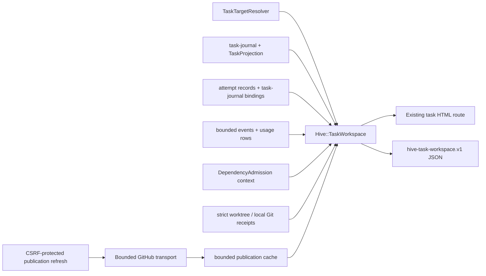
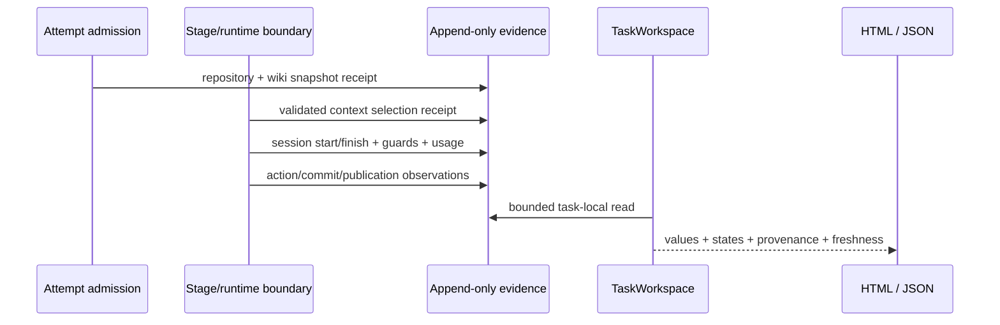
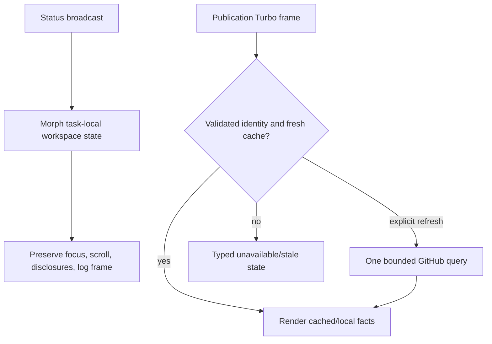

# Improve Hive Web Task Detail Workspace

## Overview

Extend the existing Hive Web task detail page into one trustworthy operator workspace. The page will project immutable repository/context provenance, the current and historical attempt/session lineage, typed resource guards and observed usage, a unified audit timeline, the bounded connected dependency component, and a read-only Git/PR publication preview alongside the existing bounded diff, artifacts, log, questions, and authorization-gated actions.

This is primarily a durable capture and bounded projection change, followed by a Rails composition change. Hive Web remains an observer of the filesystem-backed lifecycle: it will not own agent liveness, dependency state, publication, or recovery. Historical evidence is never rewritten to match current state, legacy gaps remain explicitly unavailable or partial, and a degraded panel cannot take down the existing task page.

## Goal Capsule

A Hive operator can open one task page and correctly decide whether to wait, answer, approve, retry, or investigate. The page identifies the authoritative current attempt and its concurrent sessions, distinguishes configured guards from observed usage and billing, preserves the exact repository/wiki/context state used by each captured stage attempt, orders material decisions and retries into an auditable timeline, explains the task's dependency stack, and reports bounded local and remote publication state without fabricating unavailable facts. One normalized read-only snapshot drives the task HTML and authenticated Web JSON, while every lifecycle mutation continues through Hive's existing guarded action services.

## Product Contract

### Summary

The current task page exposes status, questions, actions, artifacts, media, a bounded log, and a separate bounded diff, but the operator must still correlate task artifacts, attempt records, usage data, dependency metadata, Git state, and GitHub state manually. This work keeps those sources authoritative and adds a single typed projection that makes their agreement, staleness, gaps, and conflicts visible.

### Actors and flows

- **A1 — Hive operator:** supervises durable autonomous work and needs evidence sufficient to decide whether to wait, answer, approve, retry, or investigate.
- **F1 — Establish context trust:** compare the immutable repository and wiki/context snapshot captured for a stage attempt with separately observed current repository/wiki state, including selected references, rationale, capture time, and evidence links.
- **F2 — Establish execution trust:** identify the one projection-bound current attempt, its distinct concurrent child sessions, predecessor/recovery lineage, requested and actual provider/model/effort, health, outcome, timeout, guards, and usage without inference or double counting.
- **F3 — Review decisions:** follow material lifecycle, question/answer, approval, retry/recovery, limit, commit, publication, and operator events in deterministic order, with grouped noise and preserved corrections.
- **F4 — Explain the stack:** traverse a bounded connected dependency component, see blocking/cyclic/missing/partial edges, and compare expected and observed Git base/head identity without creating new dependency state.
- **F5 — Review publication:** compare bounded local changes and commit identity with branch, push, PR, checks, review, and merge observations; network or identity failures degrade only this panel.
- **F6 — Act through existing authority:** use the existing task actions and recovery paths only when their current observation is fresh; the workspace itself adds no publication or lifecycle mutation.

### Requirements

- **R1 — One existing workspace:** extend the current project-and-slug task route and page; preserve its questions, task actions, artifacts, media, log, diff, archive behavior, and live updates. Do not introduce a second lifecycle, feature database, roadmap, repository browser, agent console, billing ledger, or general-purpose PR client.
- **R2 — Immutable provenance:** capture and display the exact repository revision and wiki/context identity used by each new stage attempt, selected context references or query results, inclusion rationale, and capture time. Observe current repository/wiki state separately. Classify evidence as `current`, `stale`, `partial`, `missing`, or `conflicting`; never heuristically backfill legacy records or replace historical values.
- **R3 — Attempts and sessions:** select the current attempt only from the canonical task projection's durable attempt binding. Group attempts by stage and task generation, preserve predecessor/recovery lineage, and show concurrent child sessions separately with stable identities, role, provider, requested/actual model, effort, start/end, health, outcome, timeout, and live/completed state. Missing values are `unavailable` and conflicting evidence retains both sources.
- **R4 — Typed resource truth:** represent monetary API caps, subscription-backed budget-equivalent guards, token limits, launch quotas, and timeouts as different resource kinds with unit, scope, source, enforcement state, configured value, observed value, and reset/retry timing. Compute headroom only when configured and observed values share a trustworthy unit and scope. Never derive cost from tokens, treat missing usage as zero, or describe a subscription-backed `budget_usd` guard as an extra charge.
- **R5 — Unified audit timeline:** merge material stage, attempt, session, question/answer, approval/rejection, retry/recovery, hold/limit, context revision, commit/push, PR/check/merge, and operator events. Prefer authoritative controller/journal occurrence time, treat unverified provider/external clocks as display-only unless within the configured skew bound, fall back to ingestion time, and use deterministic tie-breaking. Give material events and grouped noise separate read budgets, provide cursor-based bounded access to older material history and raw group members, and append correction/supersession records instead of rewriting history.
- **R6 — Bounded dependency component:** derive ancestors and transitive descendants from Hive's existing scalar `depends_on` and dependency admission state. Bound projects, tasks, nodes, edges, depth, bytes, and elapsed time; retain deterministic partial/truncated sentinels. Distinguish cross-project scheduling dependencies from same-repository stacked Git bases and expose missing/inaccessible nodes, cycles, blocked chains, absent branches/PRs, and expected-versus-observed base/head divergence.
- **R7 — Read-only publication preview:** show validated repository, branch/base/head identity, commit summary, push state, PR title/body/URL/state, checks, review/merge state, publication state, and freshness. Use bounded, cached, allowlisted external reads outside the status broadcast path. Absent, stale, failed, rate-limited, partial, deleted, merged, or divergent state must be explicit and must not fabricate data or enable misleading actions.
- **R8 — Bounded and authorization-safe reads:** resolve one target through the existing targeted resolver; use descriptor-based no-follow opens, containment checks, and byte/count/deadline limits for every artifact, event, attempt, Git, and external read; redact through existing secret patterns; expose symbolic source kinds and safe task-relative references instead of absolute paths, capabilities, raw argv, prompts, credentials, or opaque observation tokens. One corrupt or unavailable source must degrade only its panel.
- **R9 — Additive machine contract and Web parity:** leave `hive-status.v7` and existing consumers unchanged. Add a separately versioned `hive-task-workspace.v1` snapshot shared by the Rails HTML presenter and authenticated JSON on the existing task route. Any displayed action is a sanitized projection of the canonical task action; execution remains through current operational status and guarded action services.
- **R10 — Responsive accessibility:** new UI meets WCAG 2.2 AA, retains a logical heading hierarchy and focus order, names statuses and controls for screen readers, announces only material changes, never relies on color alone, and provides a semantic table/list alternative to the dependency visualization. Desktop and narrow-mobile layouts cover loading, skeleton, empty, degraded, partial, and error states without overflow or lost content.

### Acceptance examples

- **AE1 — Honest legacy task:** a task created before this feature still shows questions, actions, artifacts, log, and diff; absent provenance, context selection, actual model, or attempt-attributed usage is labeled `missing`, `partial`, or `unavailable`, never synthesized from current files, argv, prose, or timestamps.
- **AE2 — Historical/current split:** after repository HEAD or wiki identity changes, a captured stage attempt retains its original commit and wiki/context receipt while the current observation is shown separately as stale; contradictory sources remain visible with timestamps and precedence.
- **AE3 — Concurrent recovery:** two concurrent child sessions and a recovered successor attempt remain distinct, exactly one projection-bound attempt is current, prior outcomes are immutable, and aggregate usage counts each session once.
- **AE4 — Resource semantics:** a subscription-backed `budget_usd` value renders as a configured budget-equivalent guard, not billed spend; unavailable live usage does not become zero; a provider cap exhaustion, account quota with `retry-after`, token ceiling, launch quota, and timeout are distinguishable.
- **AE5 — Deterministic timeline:** duplicate events sharing timestamps, a late-ingested event, an external timestamp outside the accepted skew, repeated transient failures, and an appended correction produce stable ordering, one bounded presentation group, expandable source evidence, an explicit supersession link, and an `older_cursor` that retrieves earlier material events without an unbounded read.
- **AE6 — Partial/divergent stack:** a bounded cross-project component containing a missing node, cycle, blocked edge, divergent stacked base, absent PR, and truncation sentinel remains navigable through both the visual representation and its semantic table.
- **AE7 — Publication degradation:** no branch, unpushed commits, remote branch deletion, merged PR with deleted branch, unauthenticated/rate-limited GitHub, incomplete checks, mismatched head, and stale cache each produce distinct states while artifacts, diff, log, questions, and actions remain usable.
- **AE8 — Live accessible page:** at desktop and narrow-mobile viewports, including 320 CSS pixels and 400% zoom, a status broadcast preserves a focused typed answer, scroll position, open disclosures, log ownership, and lazily loaded publication state; only a material status change is announced, and keyboard traversal reaches every panel and existing action.
- **AE9 — Compatibility:** the new workspace schema validates independently; existing routes and `hive-status.v7` keys do not change; old HTML/action/live-update tests remain green; ordinary status broadcasts perform zero dependency fleet rescans, Git fetches, or GitHub requests.

### Preservation note

The Product Contract above preserves the user-curated brainstorm. Planning adds repository-specific capture, projection, API, and verification choices without reopening its settled behavior or non-goals.

## Requirements Trace

| Contract | Implementation units | Primary verification |
|---|---|---|
| R1, F6, AE1, AE9 | U1, U7, U8 | Existing task integration/system tests, targeted-resolution scan counts, unchanged route/action assertions |
| R2, F1, AE1, AE2 | U2, U7, U8 | Provenance receipt/schema tests, historical-vs-current fixtures, legacy missing/conflict rendering |
| R3, F2, AE1, AE3 | U3, U7, U8 | Attempt/session lineage, current-attempt selection, concurrent/recovery and unavailable-identity tests |
| R4, F2, AE3, AE4 | U3, U7, U8 | Resource-kind matrix, usage migration/attribution, no-double-count and unavailable-headroom tests |
| R5, F3, AE5 | U4, U7, U8 | Ordering/dedup/grouping/correction tests plus material action and publication capture fixtures |
| R6, F4, AE6 | U5, U7, U8 | Dependency admission reuse, bounded traversal, cycle/missing/divergence/truncation tests |
| R7, F5, AE7 | U6, U7, U8 | Local Git identity, injected bounded GitHub transport/cache, lazy-frame isolation and zero-status-network tests |
| R8, AE1, AE7 | U1-U8 | Containment, no-follow, byte/count/deadline, malformed-source, redaction, and per-panel degradation tests |
| R9, AE9 | U1, U7, U9 | Registered schema, HTML/JSON normalized parity, status-v7 correspondence and compatibility tests |
| R10, AE6, AE8 | U8, U9 | Desktop/mobile real-browser coverage, keyboard/focus/headings/live-region/table alternative assertions |

## Scope Boundaries

### Now

- Forward capture of repository/wiki/context provenance, agent-session identity, typed resource guards, attempt-attributed usage, material audit events, and publication transitions at existing lifecycle seams.
- A Rails-independent, bounded `hive-task-workspace.v1` projection over exact task evidence, with independent panel degradation and field-level provenance/conflict state.
- An authenticated JSON representation on the existing task route and an additive lazy publication frame/refresh endpoint; HTML and JSON serialize the same normalized projection.
- A responsive task-page composition with current attempt/resource status, provenance, timeline, dependency visualization plus semantic table, bounded diff/publication pairing, bounded artifacts, and preserved questions/actions/log/media behavior.
- Managed Wiki and schema/API documentation, focused unit/integration/browser tests, and one broad repository checkpoint before handoff.

### Later

- Deep links and filters for a selected attempt or timeline event.
- Exporting a workspace snapshot or product analytics measuring reduced cross-tool lookups.
- Animated/client-side dependency layout, user-configurable refresh cadence, or rich repository/wiki browsing.
- Backfilling historical provenance only if an independently trustworthy source is introduced; this implementation deliberately does not infer it.

### Never in this work

- A parallel task lifecycle, feature database, dependency/roadmap model, generic command runner, raw interactive agent console, or exact billing ledger.
- Arbitrary filesystem browsing, unbounded repository or task scans, raw prompt/argv/log publication, or exposure of attempt capabilities, credentials, or opaque action tokens.
- Creating, editing, pushing, merging, closing, or releasing through the publication panel; a general-purpose GitHub client; or any new task/publication mutation. The explicit refresh updates only a bounded advisory observation cache.
- Treating browser/Turbo connection state as agent health or completion authority.
- Rewriting immutable historical receipts, attempt outcomes, timeline events, or publication observations.

## Planning Contract

### Key Technical Decisions

1. **KTD1 — One shared bounded projector.** Introduce a Rails-independent `Hive::TaskWorkspace` projection with source-specific components. Task HTML and authenticated Web JSON serialize the same normalized snapshot; Rails controllers do not independently rescan or classify durable evidence. Governs R1, R8-R9.
2. **KTD2 — Separate workspace schema.** Register `hive-task-workspace.v1` rather than adding detail fields to strict fleet-wide `hive-status.v7`. The existing task route gains content-negotiated JSON, and status payload keys remain unchanged. Governs R1, R9.
3. **KTD3 — Field-level provenance and precedence.** Canonical task projection and durable attempt binding own lifecycle/current-attempt identity; controller-authored receipts own captured historical facts; runtime structured receipts own actual model and usage; current Git/wiki and GitHub observations describe only current state; `events.jsonl` remains observational fallback. On disagreement, select the primary display value through that deterministic precedence, preserve every conflicting value/source/timestamp beside it, and mark the field `conflicting`. Governs R2-R5, R7-R9.
4. **KTD4 — Forward capture, honest legacy gaps.** Add append-only, attempt-bound provenance and activity receipts at admission, launch/finish, usage, action, commit/publication, and recovery seams. `TaskActivity` is the sole event-append/idempotency owner: collectors construct validated payloads and delegate, rather than writing the journal/event stream themselves. Selected context requires a bounded validated agent context receipt; no implementation may scrape prose, prompts, argv, or logs to reconstruct it. Legacy gaps remain missing/partial. Governs R2-R5.
5. **KTD5 — Attempt contains sessions.** The task projection's exact `identity.attempt_id` is the only current-attempt selector. Durable successor/predecessor records form retry lineage; child agent spawns receive independent session/correlation IDs beneath the attempt. Multiple live records without the projection binding render a conflict, not two current attempts. Governs R3-R4.
6. **KTD6 — Typed resources, not a combined budget.** Extend resource-limit resolution to retain config source/scope and profile enforcement semantics. Add exact session/attempt attribution to usage persistence while leaving legacy rows readable and explicitly unattributed. Only matching unit/scope observations produce remaining headroom. Governs R4.
7. **KTD7 — Auditable, pageable timeline merge.** Give new observational events stable operation/correlation IDs, attempt/session identity, occurrence and ingestion timestamps, and optional supersession. A controller/journal timestamp is authoritative; a provider/external timestamp is display-only unless verified within a configurable skew bound, otherwise ingestion time orders it. Deduplicate by correlation identity, assign separate material/noise byte and count budgets, group identical noise only for presentation within a documented 60-second window, and expose signed/validated cursor pagination for older material items and bounded raw group members. Governs R5.
8. **KTD8 — Existing dependency semantics.** Build a capped reverse index and connected-component traversal over a bounded `DependencyAdmission::Context`; never create graph state. Derive it from task rows already collected by the status producer and reuse it by semantic dependency fingerprint, so broadcasts and page morphs perform no additional fleet traversal. Cross-project edges are scheduling-only, while same-repository stack identity comes from strict worktree/Git receipts. No remote fetch occurs per graph node. Governs R6.
9. **KTD9 — Publication isolated from live status.** The ordinary task/page/frame GET renders local facts plus fresh or stale cache and performs no GitHub request. An authenticated, CSRF-protected POST refresh validates the strict registered repository, PR, and expected head before one allowlisted GitHub read, enforces a per-identity minimum interval and single flight, writes only normalized/redacted advisory data, and never runs in status broadcasts. Governs R7-R8.
10. **KTD10 — Existing actions remain authoritative.** The page reuses `_primary_actions.html.erb`, `TaskAction`, status freshness, and native mutation services. The decision posture follows deterministic precedence over canonical facts: an unanswered required question means `answer`; otherwise a pending approval means `approve`; otherwise an enabled existing retry/recovery means `retry`; otherwise a healthy live attempt, scheduled retry-after, or authorized hold means `wait`; stale/conflicting/unavailable action-driving evidence or an unhandled terminal/blocked state means `investigate`. The workspace contract exposes only sanitized action state/label/enabled reason; agents obtain executable guarded actions from current operational status, and every execution is revalidated at the mutation boundary. Governs R1, R7-R9.
11. **KTD11 — Semantic dependency view first.** Render a rooted spanning forest that shows every task once; represent additional, cyclic, and back edges as labeled cross-references. Generate it from the same node/edge set as an always-available semantic table/list, which is authoritative for full graph relationships. The visual layer is progressive enhancement and never the sole representation. Governs R6, R10.

### Assumptions and resolved planning choices

- Repository research found no prerequisite task identifier, so no scheduling dependency is declared in frontmatter.
- The implementation covers the full brainstorm scope. Rich repository/wiki browsing, analytics, export, filters, and animated graph layout stay outside the first release.
- Current tasks cannot provide trustworthy historical context selection, actual model, or attempt-attributed usage unless a durable receipt exists. The UI and contract must remain useful with these fields unavailable.
- The managed wiki identity reader will prefer an immutable tracked revision/tree or managed refresh receipt and otherwise emit a bounded digest/mtime identity with lower provenance quality. The identifier kind is explicit so unlike values are never compared as if equivalent.
- A context receipt is an allowlisted structured result tied to task, stage, attempt, and generation. It may list repository-relative wiki/source references, bounded query strings/results, and rationale; it cannot contain absolute host paths, arbitrary file content, prompts, or secrets.
- Existing `worktree.yml` strict fields (`repository`, `base_branch`, `base_oid`) are historical task evidence when present. Current local head/base and remote publication observations are separate; legacy pointers missing strict fields project as partial.
- In-flight provider/model/usage values are displayed only after their durable observation lands; the browser never infers them from process or Turbo connection state.
- Controller capture is labeled `observed_at_launch`; a validated agent receipt is labeled `agent_asserted_used`. Matching identities or digests increase consistency but never claim proof that the agent consumed the context.
- External cache content is advisory, bounded, keyed by credential principal, registered-project fingerprint, canonical repository/PR, and expected head, timestamped, and never treated as task lifecycle state. A stale successful observation may be shown beside a failed live refresh, with both states retained.
- Panel-local rescue is intentional: invalid journal, attempt, wiki, dependency, Git, GitHub, or artifact evidence contributes a typed diagnostic to that panel and cannot turn the entire task route into a 500.
- Existing archive tasks are read-only snapshots. They receive local historical projections and cached publication facts where safe, but no background refresh, new receipt capture, or mutation.

### Default read and refresh budgets

Centralize these initial defaults in `Hive::TaskWorkspace::Limits`, make them injectable in tests, and return the cap name plus observed count/bytes in every truncation diagnostic:

| Source | Default cap |
|---|---|
| Workspace snapshot | 2 MiB serialized total |
| Artifact | 512 KiB each, 2 MiB aggregate, 20 files |
| Task projection read | 512 KiB snapshot plus 1 MiB/2,000-event journal suffix |
| Attempts | 100 task-indexed IDs plus 32 predecessor fetches, 512 KiB total |
| Timeline | 200 material items and 100 noise groups per page, 512 KiB total; 20 raw members per group |
| Timeline clock policy | 5-minute maximum skew for ordering by verified provider/external occurrence time; otherwise order by ingestion time |
| Dependency component | 32 projects, 10,000 metadata entries scanned, 100 nodes, 200 edges, depth 20, 4 MiB, 2 seconds |
| Local Git/publication | 50 commits, 512 KiB output, 10 seconds |
| GitHub observation | 100 checks, 64 KiB PR text, 256 KiB response, 10 seconds |
| Publication cache | 256 KiB per entry, 32 MiB per credential principal, fresh for 2 minutes, retained stale for 24 hours, refresh no more than once per 60 seconds |

### Delivery sequence

Implement as reviewable vertical slices while retaining the complete release contract: U1/U7 first produce the bounded summary plus HTML/JSON envelope with typed unavailable panels; the `TaskActivity` append/idempotency foundation from U4 lands next; U3 then supplies current attempt/resource truth; U2 and the remainder of U4 add provenance and the decision timeline; U5/U6 add dependency and publication details; U8/U9 finish interaction, accessibility, documentation, and broad compatibility proof. Each slice keeps the current task page and existing actions operational.

## High-Level Technical Design

The first diagram shows source ownership and the shared read model. The projector receives an already-targeted task; it does not invoke the fleet status producer or perform unbounded discovery.



New historical facts are captured before they are projected; Web reads never become lifecycle authority.



The page keeps cheap filesystem-backed sections in the existing Turbo morph lifecycle while remote publication owns an independent lazy refresh.



### System-wide impact

- **Capture path:** attempt admission, stage-agent launches, provider-neutral results, answer/action/recovery services, and PR/review/finalize boundaries gain append-only receipts or richer observational events.
- **Durable state:** task journal and attempt records remain lifecycle authority; admission adds task-local attempt bindings; usage storage gains additive attribution columns; exact predecessor fetches avoid global read-path scans; no new lifecycle database is added.
- **Read path:** exact task resolution feeds a shared projector whose panels have independent limits, source precedence, diagnostics, and freshness.
- **Machine interfaces:** strict `hive-status.v7` remains unchanged; `hive-task-workspace.v1` is added for authenticated detail inspection through the existing Web task route.
- **Web:** the current task route, actions, Action Cable/Turbo owner, archive mode, diff route, media route, and log frame remain. New partials and one lazy publication route are additive.
- **Security:** paths are no-follow/realpath-contained, output is redacted and HTML-escaped, external identities are canonicalized, and no raw capabilities/argv/prompts/credentials enter the schema.
- **Performance:** every source has byte/count/depth/deadline limits. Status broadcasts never invoke GitHub, Git fetch, dependency fleet discovery, or the bounded diff subprocess.

## Implementation Units

### U1 — Define the versioned workspace contract and bounded projection primitives

- **Goal:** Establish the shared field-state, provenance, source-precedence, error-isolation, and schema vocabulary needed by every panel without changing `hive-status.v7`. Covers R1, R8-R9 and KTD1-KTD3.
- **Files:** new `lib/hive/task_workspace.rb`; new `lib/hive/task_workspace/snapshot.rb`; new `lib/hive/task_workspace/field.rb`; new `lib/hive/task_workspace/limits.rb`; new `lib/hive/task_workspace/bounded_reader.rb`; new `lib/hive/task_workspace/source_error.rb`; `lib/hive/task_projection/store.rb`; new `schemas/hive-task-workspace.v1.json`; `lib/hive.rb`; new `test/unit/task_workspace/field_test.rb`; new `test/unit/task_workspace/bounded_reader_test.rb`; new `test/unit/task_workspace/schema_test.rb`; new `test/unit/task_projection_store_test.rb`; `test/unit/schema_files_test.rb`; `test/unit/commands/status_test.rb`; `test/unit/tui/schema_correspondence_test.rb`.
- **Approach:** Define one required-and-nullable workspace document with task identity, snapshot time, status freshness, sanitized action descriptor, and panel envelopes for provenance, attempts/resources, timeline, dependencies, publication, and artifacts. Every field or record carries a typed state, symbolic source kind, safe evidence reference, capture/observation time, provenance quality, and conflict/truncation metadata as applicable. Centralize the default budgets above, allowed states (`current`, `stale`, `partial`, `missing`, `conflicting`, `unavailable`, `estimated`, `exhausted`, `retry-after`), and deterministic source precedence. Build descriptor-based atomic no-follow opens, UTF-8 scrubbing, total/per-source byte accounting, containment-safe task-relative evidence references, redaction, and a panel wrapper that converts source failures into typed diagnostics. Add `TaskProjection::Store#read_bounded` with a versioned checkpoint that anchors a validated journal prefix and permits a bounded suffix replay under the journal lock; a missing/invalid checkpoint or suffix beyond the cap returns typed stale/partial workspace state and disables only evidence-dependent actions. Preserve existing lifecycle callers' `read`/`rebuild!` behavior, and create/advance checkpoints on canonical write/rebuild paths so full replay never moves into a Web request. Keep the schema independent from the status producer and explicitly reject capability tokens, raw argv/prompts, absolute paths, and unknown unbounded payloads.
- **Test scenarios:** Complete current data; required nullable legacy fields; each degraded state; two conflicting sources with both retained; invalid timestamps/state enums; oversized and invalid-UTF-8 source; descriptor/path swap and symlink/containment escape; redaction across chunk boundaries; per-panel exception; aggregate budget exhaustion; deterministic serialization; schema rejects raw sensitive fields. Exercise valid checkpoint, bounded suffix, concurrent append, torn suffix, changed prefix, missing/oversized checkpoint, suffix cap exhaustion, and explicit maintenance rebuild. Compare `Hive::Commands::Status#task_payload` keys and TUI correspondence before/after to prove no status-v7 drift.
- **Verification:** Focused workspace/schema/projection-store tests pass, canonical fixtures validate against `hive-task-workspace.v1`, workspace reads never load the full journal once a valid checkpoint exists, existing lifecycle `read`/`rebuild!` semantics remain compatible, an over-cap workspace journal fails closed without hiding existing controls, malformed sources produce panel diagnostics rather than exceptions, and the existing status producer/schema/key correspondence is byte-for-byte unchanged for equivalent fixtures.

### U2 — Capture immutable repository and wiki/context provenance

- **Goal:** Make exact historical repository/wiki/context evidence available for new stage attempts while preserving honest legacy gaps and current-state separation. Covers R2, AE1-AE2, and KTD3-KTD4.
- **Files:** new `lib/hive/context_provenance.rb`; new `lib/hive/context_provenance/repository_snapshot.rb`; new `lib/hive/context_provenance/wiki_snapshot.rb`; new `lib/hive/context_provenance/context_receipt.rb`; new `schemas/hive-context-receipt.v1.json`; `lib/hive.rb`; `lib/hive/task_journal.rb`; `lib/hive/task_projection.rb`; `lib/hive/stages/base.rb`; `lib/hive/attempts/dispatcher.rb`; `lib/hive/attempts/context.rb`; `lib/hive/agent_runtime.rb`; `templates/agent_prompt.md.erb`; `templates/agent_worktree_prompt.md.erb`; `test/unit/task_journal_test.rb`; `test/unit/task_projection_replay_test.rb`; new `test/unit/context_provenance_test.rb`; `test/unit/attempts/dispatcher_test.rb`; `test/unit/attempts/context_test.rb`; `test/unit/stages/base_test.rb`; `test/unit/agent_runtime_test.rb`; `test/unit/schema_files_test.rb`.
- **Approach:** Add validated append-only journal event types for controller-captured stage context and agent-reported context selection, idempotently keyed to task/stage/attempt/generation, with all appends delegated through `TaskActivity`. After `Attempts::Dispatcher` durably creates the attempt and before worker handoff, resolve `task.project_root`, capture repository HEAD/repository identity plus a bounded wiki identity, and persist an `observed_at_launch` receipt; a capture failure becomes explicit partial evidence and does not strand the launching attempt. Pass the attempt-bound task-local `context-receipts/<attempt-id>.json.next` path and byte budget through the runtime contract. The agent may write an optional allowlisted receipt containing repository-relative selected references, bounded query/result labels, and inclusion rationale; after the stage result is durable, the controller descriptor-opens and validates binding, containment, schema, limits, and redaction, atomically promotes it, and journals it as `agent_asserted_used`. The prompt addition is a small additive appendix within an explicit byte budget and must not change the stage's required artifact/terminal-marker contract. Observe current repository/wiki identity through the same readers but never write it over either historical receipt. Matching launch and agent receipts show consistency, not proof of consumption; absence remains partial/missing rather than being reconstructed from output or logs.
- **Test scenarios:** Brainstorm/plan/execute dispatch from a clean repository; capture after attempt creation and before launcher call; capture failure with successful handoff; tracked and untracked/local wiki identities; managed refresh receipt; HEAD/wiki changes between capture, worker read, and receipt promotion; missing wiki/index; symlinked wiki; oversized context receipt; absolute/traversal reference; wrong task/attempt/generation; descriptor/path swap; duplicate idempotent receipt; conflicting controller and agent facts; crash before/after promotion; legacy attempt with no event; provider that cannot produce a receipt; prompt-size limit and fixture proving the required stage artifact/outcome/marker remain byte-for-byte equivalent apart from the optional receipt appendix.
- **Verification:** Dispatcher ordering tests prove launch evidence is durable before handoff, journal validation/replay preserves immutable historical values, current observation changes only freshness state, the UI never upgrades `observed_at_launch` or `agent_asserted_used` to consumption proof, every accepted reference remains within project/caps, malformed/hostile receipts are rejected without breaking the stage outcome, the context-receipt schema is registered, and no code infers context selection from prompt/log/prose content.

### U3 — Project attempts, concurrent sessions, resource guards, and exact usage attribution

- **Goal:** Produce one authoritative current attempt, immutable retry/recovery lineage, distinct concurrent sessions, and honest configured-versus-observed resource state without double counting. Covers R3-R4, AE1, AE3-AE4, and KTD5-KTD6.
- **Files:** new `lib/hive/agent_observation.rb`; `lib/hive/attempts/record.rb`; `lib/hive/attempts/store.rb`; `lib/hive/attempts/dispatcher.rb`; `lib/hive/agent.rb`; `lib/hive/claude_launcher.rb`; `lib/hive/events.rb`; `lib/hive/stages/base.rb`; `lib/hive/agent_profile.rb`; `lib/hive/agent_profiles.rb`; `lib/hive/config.rb`; `lib/hive/usage_db.rb`; new `lib/hive/task_workspace/attempts.rb`; new `lib/hive/task_workspace/resources.rb`; `test/unit/attempts/record_test.rb`; `test/unit/attempts/store_test.rb`; `test/unit/attempts/dispatcher_test.rb`; `test/unit/agent_test.rb`; `test/unit/claude_launcher_test.rb`; `test/unit/events_test.rb`; `test/unit/config_test.rb`; `test/unit/agent_profile_test.rb`; `test/unit/usage_db_test.rb`; new `test/unit/task_workspace/attempts_test.rb`; new `test/unit/task_workspace/resources_test.rb`; `test/integration/stages_base_usage_test.rb`; `test/integration/implementation_identity_routing_test.rb`.
- **Approach:** Extend dispatcher admission so, after the durable attempt record exists and before worker handoff, `TaskActivity` idempotently records an `attempt_admitted` binding in the task-local journal. Workspace discovery starts from that bounded journal/checkpoint plus existing `TaskProjection` attempt bindings for legacy current IDs, then follows only exact predecessor IDs through `Attempts::Store#fetch` to the configured cap; it never scans the global attempt store. Keep durable attempt IDs/generation/predecessor as lifecycle identity. Generate one session/correlation ID per actual child spawn and pass exact attempt/generation, role, requested provider/model/effort, configured guard metadata, and timeout into `AgentObservation`, which validates/normalizes payloads but delegates every append to `TaskActivity`. Record finish, actual model when provider-reported, outcome, resource exhaustion, retry timing, and final usage even on exceptions; throttle optional monotonic live samples, and display in-flight values only after their observation is durable. Extend resource-limit resolution to return value plus configuration source/scope and profile enforcement/billing semantics while preserving its existing value-only API. Replace `UsageDb`'s create-if-absent-only evolution with a transactional `PRAGMA user_version` migration that adds nullable attempt/session/generation/source fields and a partial unique index for non-null session IDs. Use idempotent session upserts under a busy timeout/retry policy, keep legacy rows queryable as explicitly unattributed, and make the new exact workspace query return `available: false` on persistence/read failure rather than a zero value. Select current attempt only from `TaskProjection` identity, show other live sessions/attempts separately, and aggregate uniquely by attributed session ID.
- **Test scenarios:** One ordinary attempt; task-local admission event before launcher handoff; no global attempt-store scan; two concurrent sessions under one attempt; recovered successor chain at and beyond cap; lost predecessor; stale overlapping live record; projection identity missing/conflicting; requested model differs from runtime-reported model; provider/actual model unavailable; tmux/headless parity; preflight failure; timeout; account quota with retry-after; native cap exhaustion; token/launch quota; subscription-backed budget-equivalent guard; explicitly API-billed monetary guard; unenforced configured guard; missing/in-flight/final usage; observation append failure; duplicate finish/upsert; upgrade from the current legacy SQLite schema; two concurrent migrators/writers; busy database; failed persistence/read; unattributed legacy rows; no usage double count.
- **Verification:** Focused dispatcher/attempt/agent/config/usage tests pass; every managed spawn emits one start and at most one terminal session record with a stable correlation ID; the task-local binding is durable before launch and exact-attempt queries are capped and deterministic; old usage rows remain readable but never silently join by timestamp; duplicate/concurrent session writes yield one row; unavailable storage is not rendered as zero; headroom is emitted only for matching trustworthy units/scopes; and the acceptance fixture reports one current attempt and exact unique usage totals.

### U4 — Build the unified, append-only decision and retry timeline

- **Goal:** Merge material authoritative and observational evidence into a deterministic, bounded, correctable audit view while preserving source quality and raw evidence. Covers R5, AE5, and KTD4/KTD7.
- **Files:** new `lib/hive/task_activity.rb`; new `lib/hive/task_workspace/timeline.rb`; `lib/hive/events.rb`; `lib/hive/task_journal.rb`; `lib/hive/task_projection.rb`; `lib/hive/stages/base.rb`; `lib/hive/commands/stage_action.rb`; `lib/hive/commands/approve.rb`; `lib/hive/commands/decide.rb`; `lib/hive/commands/act.rb`; `lib/hive/commands/finding_toggle.rb`; `lib/hive/recovery/api.rb`; `lib/hive/bot/brainstorm_answer_writer.rb`; `web/app/models/concerns/task_mutations.rb`; `lib/hive/stages/open_pr.rb`; `lib/hive/stages/review.rb`; `lib/hive/stages/finalize.rb`; `test/unit/events_test.rb`; `test/unit/task_journal_test.rb`; `test/unit/task_projection_replay_test.rb`; new `test/unit/task_activity_test.rb`; new `test/unit/task_workspace/timeline_test.rb`; relevant command, bot-answer, recovery, open-PR, review, and finalize tests.
- **Approach:** Use `TaskActivity` as the single append/idempotency facade at domain mutation and observation seams; collectors and Web delegates never write timeline/journal records directly. Before a material mutation, create a stable operation ID and an atomic task-local operation receipt containing the precondition fingerprint and expected postcondition. After the existing domain service commits its result, bind the result fingerprint, append the activity idempotently, and mark the receipt complete. Retry/reconciliation uses those fingerprints to append a missing event exactly once; an ambiguous crash leaves an explicit `activity_gap` diagnostic/correction rather than inventing success. Persist authoritative attempt-bound facts in the task journal and structured observational facts in the task-local event stream only when no durable attempt binding exists. Capture material state transitions, session lifecycle, bounded question/answer references or redacted excerpts, approvals/rejections/decisions, retries/recovery, limits/holds, context changes, commits/pushes, and lifecycle-owned publication/check transitions. Add stable IDs, occurrence/ingestion timestamps, correlation keys, symbolic provenance, and optional `supersedes_event_id`; never store raw PR bodies, prompts, credentials, absolute paths, or action tokens. Controller/journal occurrence time orders authoritative events; provider/external time is display-only unless verified within the five-minute skew bound, otherwise ingestion time is used. Read material and noise streams with separate limits before grouping, merge against attempt state and legacy artifact evidence, and let authoritative duplicates win presentation precedence while retaining cross-source references. Return a signed, opaque, task-bound `older_cursor` for bounded older material pages and separate bounded raw-group expansion; group identical normalized noise only inside the constant 60-second window.
- **Test scenarios:** Same-timestamp events from different sources; trusted controller time; provider/external time inside and outside skew; late ingestion; duplicate journal/event correlation; stage enter/exit; question asked and answer recorded; approve/reject/force/decision; retry and recovered successor; quota/timeout; commit/push/PR/check/merge transition; identical heartbeat/transient failure grouping across and outside 60 seconds; noise flood that cannot evict material items; first/next/terminal older cursor; cursor for wrong task/tampering; bounded raw expansion; malformed/torn trailing line; over-limit page; redaction; correction superseding an earlier event; crash before domain mutation, after mutation/before append, and after append/before receipt completion; legacy artifact-only approximation marked partial.
- **Verification:** Every material domain fixture produces the expected stable timeline item once, crash injection plus reconciliation proves no silent committed-result gap or duplicate, sort output is deterministic under shuffled/skewed source input, cursor pages are bounded and lossless for material fixtures, grouped noise never consumes the material budget or discards its bounded raw references, corrections append without altering prior records, malformed sources degrade only timeline completeness, and Web retries do not create duplicate activity events.

### U5 — Derive the bounded dependency and stacked-flow component

- **Goal:** Explain ancestors, transitive descendants, blocking/cyclic/partial edges, and stacked Git divergence using existing dependency and worktree evidence without creating graph state or remote amplification. Covers R6, AE6, and KTD8/KTD11.
- **Files:** new `lib/hive/task_workspace/dependency_component.rb`; `lib/hive/dependency_snapshot.rb`; `lib/hive/dependency_admission.rb`; `lib/hive/worktree.rb`; `lib/hive/task_workspace/bounded_reader.rb`; `web/app/models/status_broadcaster.rb`; new `test/unit/task_workspace/dependency_component_test.rb`; `test/unit/dependency_snapshot_test.rb`; `test/unit/dependency_admission_test.rb`; `test/unit/dependencies_test.rb`; `test/unit/worktree_test.rb`; `web/test/models/status_broadcaster_test.rb`.
- **Approach:** Extend dependency snapshot construction with the explicitly bounded mode in `Limits` and an input form that consumes the task metadata rows already collected by the existing status snapshot—never a second directory traversal. Reuse `DependencyAdmission::Context` for normalization, errors, gate verdicts, missing nodes, cross-project repository validation, and cycle semantics. Build the reverse index from those preloaded rows, retain it with `StatusBroadcaster` under a semantic dependency fingerprint (qualified identity, `depends_on`, gate/publication identity), and let the lazy dependency frame/page resolver reuse it. A row set that cannot support the full component yields a partial-project sentinel rather than a fallback fleet scan. Walk the current task's ancestors and descendants to node/edge/depth caps and sort by qualified project/task identity. Keep scalar edge direction and blocked-by evidence exact. For same-repository stacks, combine strict immutable `worktree.yml` repository/base branch/base OID with current local branch/head observations; cross-project edges are labeled scheduling-only. Do not fetch remotes or query GitHub per node. Return cycle/back-edge references, inaccessible/missing placeholders, partial/truncated reasons, expected/observed OIDs, divergence state, and safe task/PR references from already-projected facts. Derive a deterministic rooted spanning forest for the compact visual, rendering every node once and every non-tree/cyclic edge as a labeled cross-reference; the semantic node/edge table retains the complete bounded component.
- **Test scenarios:** No dependency; one ancestor; transitive descendants; branching reverse component with multiple descendants sharing one prerequisite; additional/cyclic edge rendered as a cross-reference rather than a duplicate node; numeric ID and slug references; cross-project scheduling edge; repository mismatch; gate wait; missing/unreadable metadata; self-reference; cycle; duplicate task; legacy pointer; absent branch/PR; expected base OID differs from observed base/head; node/depth/project/task/byte/deadline cap exhaustion; deterministic output independent of directory order; multiple renders/morphs for one status snapshot.
- **Verification:** Existing dependency admission verdict tests remain unchanged, the component returns only nodes connected to the target, every cap yields a navigable partial/truncated result rather than a crash, the visual forest and authoritative table use the same complete node/edge set, call-count tests prove the index is derived from existing status rows with zero additional directory traversal during broadcasts/renders/morphs, and no test observes a Git fetch or GitHub call.

### U6 — Add bounded artifacts and the isolated read-only publication projection

- **Goal:** Pair the existing bounded diff with honest local/remote publication state and replace unbounded artifact reads, while ensuring network and source failures degrade independently. Covers R1, R7-R8, AE7, and KTD9-KTD10.
- **Files:** new `lib/hive/task_workspace/artifacts.rb`; new `lib/hive/task_workspace/publication.rb`; new `lib/hive/task_workspace/publication_cache.rb`; `lib/hive/gh.rb`; `lib/hive/worktree.rb`; `web/app/models/task.rb`; `web/app/models/github_api.rb`; new `web/app/controllers/tasks/publications_controller.rb`; `web/app/controllers/tasks/diffs_controller.rb`; `web/config/routes.rb`; new `web/app/views/tasks/_publication.html.erb`; new `web/app/views/tasks/_diff_frame.html.erb`; `web/app/views/tasks/diff.html.erb`; new `test/unit/task_workspace/artifacts_test.rb`; new `test/unit/task_workspace/publication_test.rb`; `test/unit/gh_test.rb`; `test/unit/worktree_test.rb`; `test/unit/web/task_diff_test.rb`; `web/test/models/task_test.rb`; new `web/test/models/github_api_test.rb`; `web/test/integration/tasks_test.rb`.
- **Approach:** Replace `Task#artifacts` whole-file reads with descriptor-based no-follow, containment-checked reads carrying per-file and aggregate caps, binary/encoding detection, stable-descriptor/stat checks for changing files, redaction, and explicit truncation/error metadata while retaining artifact order and sanitized Markdown rendering. Keep the existing log and `TaskDiff` limits. Build publication local facts from validated/capped `pr.md` frontmatter/body, the strict owned worktree pointer, bounded argv-based local Git commands, and capped commit summaries; never run `git fetch` as a page read. Treat PR title/body/check names as escaped, truncated plain text and never call `html_safe` on external content. Extend the existing Web `GithubApi` authorization seam with one fixed read operation for the exact repository/PR; reject any PR URL whose repository differs from the strict registered worktree repository, validate expected head, cap fields/checks/body/response/deadline, and inject the transport in tests. The publication controller inherits `Tasks::BaseController` and its target resolver. GET/page/JSON renders local facts plus fresh or stale cache only; a cold cache reports `unavailable: not_observed` and never triggers network. A CSRF-protected POST refresh is available only for active authorized tasks, enforces the 60-second per-identity interval and single flight, performs at most one read, and returns the Turbo frame/JSON without mutating GitHub. Store only normalized/redacted observations beneath owner-only `Hive::Paths.data_home/task-workspace/publication/<credential-hmac>/<project-fingerprint>/`, with `0700` directories, `0600` files, the limits above, and keys containing canonical repo/PR/expected head. Credential HMAC, project-registration change, PR/head rollover, or expiry prevents cross-account/project reuse; retain stale success beside a failed refresh and evict by the 24-hour/32-MiB policy. Reuse the existing diff route as an independently lazy permanent frame so neither diff subprocess nor GitHub call reruns on status morph.
- **Test scenarios:** Artifact order; exact cap/truncation; binary, invalid UTF-8, changing, unreadable, missing, symlinked, descriptor-swapped and traversal files; redaction; no worktree/branch; dirty/unpushed commits; invalid pointer/frontmatter/PR URL; foreign-repository PR URL; expected-versus-local/remote head mismatch; remote branch deleted; merged PR with deleted head; open/draft/closed PR; failing/pending/partial checks; review/merge state; hostile HTML/Markdown in title/body/check names; unauthenticated, cross-project target, CSRF failure, archive refresh, rate-limited refresh, timeout, oversized/unparseable response; cold cache; stale cache plus failed refresh; credential/project/PR/head key rollover; concurrent and too-soon refresh; cache permission/size/eviction; zero remote calls from ordinary page/frame/JSON render and status broadcast.
- **Verification:** Artifact, diff, publication, Git/GitHub, controller, authorization, and integration tests pass; every descriptor/subprocess/API response is bounded and identity-scoped; cache files contain no credentials or unredacted provider text and cannot cross credential/project identities; publication failures never hide artifacts/diff/log/actions; ordinary GET/JSON/Turbo morphs make zero GitHub requests; and an eligible explicit POST refresh performs at most one capped lookup and reports complete freshness/truncation state.

### U7 — Compose the shared projector and expose authenticated Web read parity

- **Goal:** Assemble all source projectors for one exact task and publish the same normalized `hive-task-workspace.v1` snapshot through task HTML and authenticated JSON on the existing route, without creating an action protocol. Covers R1, R8-R9 and AE9.
- **Files:** `lib/hive/task_workspace.rb`; new `lib/hive/task_workspace/builder.rb`; `lib/hive/web/task_target_resolver.rb`; `web/app/controllers/tasks/base_controller.rb`; `web/app/controllers/tasks_controller.rb`; new `web/app/controllers/tasks/timelines_controller.rb`; `web/app/models/task.rb`; `web/config/routes.rb`; `test/unit/web/task_target_resolver_test.rb`; `test/unit/schema_files_test.rb`; `web/test/integration/tasks_test.rb`.
- **Approach:** Make the builder accept one resolved task/status row, project context, the dependency context derived from existing status rows and keyed by semantic fingerprint, injected clocks/readers/cache/cursor codec, and strict limits. Build each panel independently and compute only the decision summary/action attention from existing `TaskAction`, recovery, and status-freshness facts. If any action-driving observation is unavailable, stale, conflicting, or truncated, preserve the existing control but disable it with the exact reason; every mutation still revalidates canonical current state. Extend `TasksController#show` with authenticated JSON content negotiation on the unchanged route and render the schema document directly; keep archive source behavior and make archive JSON read-only. Add an authenticated read-only timeline endpoint for the signed task-bound opaque `older_cursor` and raw-group expansion; it delegates to the same bounded timeline projector and cannot choose filesystem paths or raise caps. HTML partial presenters receive only the normalized snapshot, so field states and action reasons match JSON. Do not expose raw mutation commands or observation tokens; agents may inspect authenticated JSON, but routine execution remains the existing `hive status --operational --json` plus `hive act` contract.
- **Test scenarios:** Exact project/slug target; missing task; active and archived target; project status unavailable; one panel corrupt; authenticated/unauthenticated HTML, workspace JSON, timeline pages, and raw group expansion; JSON content type/schema; exact status/action freshness; stale/truncated evidence disables relevant action; cursor wrong task/tampered; HTML/JSON same fixture; no fleet rebuild beyond the reused status/dependency snapshot; no source write; no mutation invocation; old task HTML route and action endpoints unchanged.
- **Verification:** Schema, resolver, cursor, JSON, presenter, and Web integration tests pass; call-count fixtures prove one targeted task resolution, reuse of the semantic-fingerprint dependency context, and no additional fleet traversal, full-journal workspace read, or network call; HTML and JSON expose the same normalized values/states under identical observations; and `hive-status.v7`, existing task/action routes, CSRF/auth, and mutation contracts remain unchanged.

### U8 — Build the responsive, accessible task workspace and preserve Turbo interaction state

- **Goal:** Present the shared snapshot as a coherent one-page operator workspace at desktop and narrow-mobile sizes while preserving existing actions, Q&A, artifact/log/diff behavior, and live-update ergonomics. Covers R1-R10 and AE1-AE9.
- **Files:** `web/app/views/tasks/show.html.erb`; `web/app/views/tasks/_state.html.erb`; `web/app/views/tasks/_primary_actions.html.erb`; new `web/app/views/tasks/_workspace_summary.html.erb`; new `web/app/views/tasks/_provenance.html.erb`; new `web/app/views/tasks/_attempts.html.erb`; new `web/app/views/tasks/_timeline.html.erb`; new `web/app/views/tasks/_dependencies.html.erb`; `web/app/views/tasks/_publication.html.erb`; `web/app/views/tasks/_diff_frame.html.erb`; new `web/app/views/tasks/_artifacts.html.erb`; `web/app/views/tasks/_log.html.erb`; `web/app/helpers/application_helper.rb`; `web/app/assets/stylesheets/application.css`; `web/app/javascript/controllers/status_refresh_controller.js`; `web/app/javascript/controllers/artifacts_controller.js`; new `web/app/javascript/controllers/task_workspace_controller.js`; `web/test/integration/tasks_test.rb`; `web/test/system/kanban_board_test.rb`; `web/test/system/pipeline_flow_test.rb`; new `web/test/system/task_workspace_test.rb`.
- **Approach:** Keep the current status stream owner and render a stable decision summary immediately after the task header/state/actions. Without opening another panel, it states the operator posture (`wait`, `answer`, `approve`, `retry`, or `investigate`) from KTD10, why, the current attempt/model/resource condition, and links to the decisive stale/conflicting/blocking evidence; unavailable action-driving input produces `investigate`, never a fabricated wait or enabled action. Follow with current attempt/resource status, provenance, timeline, dependency component, change/publication pair, artifacts/media, and log. On narrow screens keep the decision summary and pending question/action expanded, while lower evidence panels may use labeled `<details>` with stateful expansion. Reuse primary-action forms and stale-status disabling verbatim; display recovery guidance only where an existing authorized path exists. Use stable DOM IDs keyed by panel/event/attempt/session, semantic sections/headings, `<ol>` for timeline, tables for structured comparisons, `<details>` for bounded evidence, `<time>` elements, visible text/icon state cues, and `aria-describedby`/named statuses. Add an accessible `Load older` control for timeline cursors and bounded raw-group expansion. Render the dependency component as the deterministic rooted spanning forest with labeled cross-reference edges and an always-present authoritative semantic edge/node table; mark decorative connectors hidden. Make diff and publication lazy permanent frames so broadcasts do not rerun them. Extend interaction-state preservation for disclosures, focus/caret, scroll, and log ownership. Restrict live regions to materially changed decision/status/resource summaries and suppress equivalent morph announcements. Use responsive CSS grid/card flow, bounded table scrollers, wrapping identifiers, no fixed desktop width, and at least 24-by-24 CSS-pixel pointer targets unless a WCAG exception applies; show skeleton, empty, partial, unavailable, conflicting, and error states without layout collapse.
- **Test scenarios:** Normal executing task; each wait/answer/approve/retry/investigate summary posture; investigate posture from insufficient/conflicting inputs; legacy missing data; stale/conflicting provenance; current plus concurrent/recovered attempts; all resource kinds; grouped/corrected/paged timeline; cycle/missing/truncated dependency graph with non-tree cross-reference; every publication degraded state; oversized/binary artifact; diff timeout; corrupt single source. At `1280x800`, `3840x1400`, `375x812`, and `320x568`, assert no page overflow, hidden decisive status, or clipped controls. Verify 400% zoom/reflow at an effective 320 CSS-pixel viewport and target-size minimums. Drive keyboard-only heading/control order, disclosure and `Load older` operation, accessible names, non-color cues, visual/table graph parity, focus/caret survival during broadcast, disclosure/scroll survival, unchanged log frame, and one material live announcement without repetition.
- **Verification:** Rails integration and Playwright system tests pass; existing task action/Q&A/archive/media/log/diff/live-update scenarios remain green; every acceptance fixture yields the correct decision summary from one page; automated accessibility assertions plus manual 400%-zoom, screen-reader, and keyboard smoke confirm the new hierarchy, reflow, targets, and states; status broadcasts update cheap local facts while diff/publication frames remain untouched.

### U9 — Document the contract and run layered compatibility verification

- **Goal:** Make source precedence, capture limits, resource terminology, degraded states, authenticated Web JSON use, and operator action boundaries durable, then prove the integrated workspace against focused and broad repository gates. Covers R1-R10 and all acceptance examples.
- **Files:** new `wiki/modules/task_workspace.md`; `wiki/index.md`; `wiki/architecture.md`; `wiki/commands/web.md`; `wiki/modules/events.md`; `wiki/modules/attempts.md`; `wiki/token-usage.md`; `wiki/modules/task_dependencies.md`; `wiki/modules/task_action.md`; `wiki/testing.md`; `wiki/gaps.md`; a new `wiki/log.d/*-task-workspace.md` fragment; workspace/context-receipt schema fixture and documentation tests; all focused files named in U1-U8.
- **Approach:** Document both versioned schemas, exact target resolution, field precedence and provenance-quality labels, current-attempt rule, why context receipts are agent assertions rather than consumption proof, resource kinds and subscription-backed wording, timeline clock/cursor/grouping/correction rules, dependency bounds/forest/table semantics, publication cache location/permissions/refresh isolation, action authorization boundary, accessibility behavior, and legacy missing-data policy. Record remaining provider limitations in `wiki/gaps.md`. Add a wiki log fragment and regenerate the compiled log through the repository's supported command rather than editing generated history manually. Run focused root tests per unit, focused Rails model/integration/system tests, schema/compatibility tests, then one broad root suite and the Rails suite. Do not run provider-backed/live GitHub tests; use injected transports. Run the commit-bound packaged-Web bootstrap gate only after relevant changes are committed and only if the implementation changes packaged Web bootstrap behavior.
- **Test scenarios:** Documentation examples validate against the registered schemas; Web examples contain no opaque action token, credential, or absolute path; maintained wiki links resolve; every acceptance fixture has a named automated test; broad suite catches status/TUI/schema/route regressions; Rails system suite covers desktop, wide, narrow, and 400%-reflow cases; generated wiki log matches fragments.
- **Verification:** Focused and broad commands in the Verification Contract pass from their documented roots, no live network/provider proof is mistaken for deterministic evidence, managed Wiki checks are current, and the final test inventory maps every R/AE to at least one passing automated scenario.

## Verification Contract

### Focused root verification

Run the smallest relevant files as each unit lands, for example:

```bash
bundle exec ruby -Itest test/unit/task_workspace/schema_test.rb
bundle exec ruby -Itest test/unit/context_provenance_test.rb
bundle exec ruby -Itest test/unit/task_workspace/attempts_test.rb
bundle exec ruby -Itest test/unit/task_workspace/resources_test.rb
bundle exec ruby -Itest test/unit/task_workspace/timeline_test.rb
bundle exec ruby -Itest test/unit/task_workspace/dependency_component_test.rb
bundle exec ruby -Itest test/unit/task_workspace/publication_test.rb
bundle exec ruby -Itest test/unit/schema_files_test.rb
bundle exec ruby -Itest test/unit/commands/status_test.rb
bundle exec ruby -Itest test/unit/tui/schema_correspondence_test.rb
```

Add the directly affected attempt, agent, event, usage, dependency, Git/worktree, task-journal, projection, and integration files from U2-U7 to the same focused runs. Tests must use disposable project/Hive homes and injected clocks/transports; none may touch the live `.hive-state`, attempt store, usage database, GitHub account, or provider.

### Focused Rails verification

From `web/`, run the task model/integration coverage before browser coverage:

```bash
bin/rails test test/models/task_test.rb test/integration/tasks_test.rb
bin/rails test test/system/task_workspace_test.rb test/system/pipeline_flow_test.rb test/system/kanban_board_test.rb
```

The browser suite must exercise `1280x800`, `3840x1400`, `375x812`, `320x568`, and 400% reflow at an effective 320 CSS pixels; keyboard traversal; target sizes; focus/caret and disclosure survival; material live announcements; dependency forest/table parity; lazy publication/diff isolation; and all empty/degraded/error states. Network-facing publication tests use an injected fake with call-count assertions.

### Broad verification before handoff

From the repository root, run the normal broad checkpoint once after focused tests are green:

```bash
bundle exec rake test
```

Then run the Web application's normal complete test command from `web/` according to its current test task, plus any repository lint/static/security/schema checks required by the branch's CI contract. Do not use the packaged-Web bootstrap gate as proof of uncommitted changes; it archives `HEAD` and is warranted only if this work changes that packaging boundary.

### Final proof snapshot

Record the exact tested commit, workspace schema version, focused/broad test counts, browser viewport/accessibility results, status-v7 correspondence result, zero-network-on-broadcast assertion, and any intentionally unavailable provider/live-GitHub proof. A green status feed, a cached PR response, or partial panel fixtures are not substitutes for the terminal test results above.

## Risks

| Risk | Impact | Mitigation and proving evidence |
|---|---|---|
| Launch snapshot or agent receipt is presented as proof of consumed context | False trust despite capture/read races | Distinct `observed_at_launch` and `agent_asserted_used` quality labels, no “used” claim, race fixtures that change HEAD/wiki between capture/read/promotion |
| Missing historical context is inferred from current files or prose | False trust and rewritten audit history | Forward-only receipts, explicit legacy missing/partial state, tests that change HEAD/wiki and reject heuristic backfill |
| Multiple live records produce two “current” attempts | Operator cannot know which work owns the task | Current identity comes only from `TaskProjection`; conflicting/unbound live records remain separate and flagged; concurrency/recovery fixtures |
| Usage joins by time or is counted twice | Misleading budget/headroom and operator decisions | Stable session/attempt IDs, additive usage attribution, idempotent terminal writes, unique aggregation, legacy unattributed bucket tests |
| Subscription-backed guards look like billed spend | Incorrect cost interpretation | Explicit profile guard semantics and neutral “budget-equivalent guard” default; resource-kind matrix and wording assertions |
| Task journal and observational events are treated as equal | False order, duplicates, or incorrect authority | Source rank/precedence, correlation deduplication, occurrence/ingestion ordering, correction links, shuffled-source tests |
| A domain mutation commits but its timeline append crashes | Silent decision-history gap or duplicate on retry | Stable operation receipts, result fingerprints, idempotent reconciliation, explicit gap diagnostics, before/after-append crash injection |
| A large journal or noise flood defeats bounded reads | Page memory/latency regression or hidden material history | Versioned projection checkpoint plus capped suffix replay, separate material/noise budgets, task-bound older cursors, cap and pagination tests |
| Prompt appendix changes stage behavior | Provenance capture regresses required artifacts or terminal markers | Additive byte-budgeted receipt contract and stage outcome/artifact/marker parity fixtures |
| Capturing context or events leaks prompts, secrets, paths, or capabilities | Sensitive repository/host data reaches Web/API | Allowlisted receipt schema, relative references, redaction, byte caps, forbidden-field schema tests, HTML escaping |
| Dependency descendant discovery becomes a fleet scan | Slow page/status and unbounded filesystem reads | Bounded snapshot/reverse index, task/project/depth/deadline caps, explicit truncation, call-count and timeout tests |
| Current refs are mistaken for historical stack identity | False divergence or trust conclusions | Preserve strict pointer/receipt OIDs separately from current observations; legacy partial state and expected/observed fixtures |
| GitHub reads amplify every Turbo broadcast | Rate limits or network failure take down healthy task pages | Cache-only GET/lazy permanent frame, CSRF-protected rate-limited POST refresh, single flight, zero-network GET/broadcast tests |
| Publication cache crosses users or retains hostile/private metadata | Credential-bound data disclosure or persistent injection | Credential HMAC and project/repo/PR/head keys, owner-only files, normalize/redact before write, size/age eviction, escaping and rollover tests |
| GitHub or Git output is oversized/hostile | Memory use, injection, or secret exposure | Canonical identity validation, argv execution, output/check/body/deadline caps, redaction and render escaping, injected adversarial fixtures |
| One corrupt source crashes the page | Existing operator controls become unavailable | Independent panel rescue/diagnostics and integration fixture with each source corrupted in turn |
| Turbo morph disrupts answers, disclosures, scroll, or announcements | Operator loses work or receives noisy accessibility output | Stable DOM keys, preserved controller state, permanent lazy frames, real-browser focus/caret/scroll/live-region tests |
| Workspace schema drifts from HTML | Humans and authenticated JSON consumers see different facts | One builder/serializer, schema fixtures, HTML/JSON parity tests, status-v7 correspondence guard |
| Large UI becomes a repository browser or PR client | Scope and authorization creep | Compact bounded summaries/evidence links, no arbitrary browsing, no publication mutations, reuse of existing action partial and guards |

## Definition of Done

- New stage attempts capture immutable repository/wiki identity and bounded selected-context receipts; historical and current state render separately, and legacy gaps remain explicitly missing/partial.
- Exactly one projection-bound current attempt is prominent; concurrent sessions and retry/recovery history remain distinct and immutable with honest provider/model/effort/health/outcome values.
- Resource guards and usage are typed by kind/unit/scope/source, session/attempt usage aggregates once, subscription-backed guards are not labeled as charges, and headroom appears only when honestly computable.
- The deterministic bounded timeline includes all material forward-captured decisions and transitions, reconciles committed-result append gaps, keeps noise from evicting material events, exposes bounded older/raw cursors, and preserves late events and corrections.
- The bounded dependency component explains ancestors, descendants, blocked/cyclic/missing/partial edges, stack identity/divergence, and absent publication through a spanning-forest visual with cross-references and an authoritative semantic table.
- The read-only publication panel distinguishes local, cached, and live observations; validates repository/branch/PR/head identity; bounds all reads; and degrades independently for missing, stale, partial, failed, deleted, merged, rate-limited, and divergent cases.
- Artifacts, log, and diff are bounded; questions, media, archive mode, existing actions/recovery semantics, and live updates remain functional and authorization-equivalent.
- `hive-task-workspace.v1` validates through authenticated Web JSON and drives the same values/states as HTML; `hive-status.v7`, the existing task/action routes, TUI correspondence, and API consumers remain unchanged.
- Desktop, wide, 320 CSS-pixel, narrow-mobile, and 400%-reflow browser tests demonstrate WCAG 2.2 AA structure, target sizes, keyboard access, focus/caret/disclosure/scroll preservation, non-color cues, semantic graph alternative, and restrained live announcements.
- Focused root/Rails tests, the broad root checkpoint, the complete Rails suite, schema/compatibility checks, and managed Wiki documentation are green at the final tested commit; ordinary task render/status broadcasts prove zero GitHub, Git fetch, dependency fleet-rescan, and diff-subprocess amplification.

<!-- COMPLETE -->
