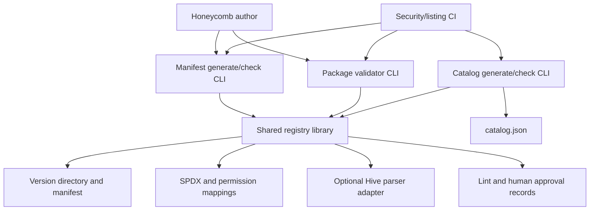
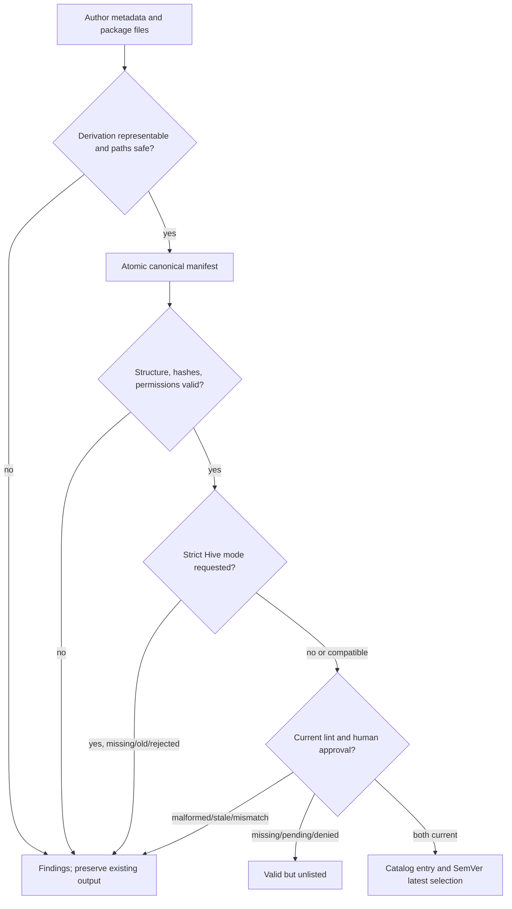

# Registry Layout, Package Manifest, and Catalog Schema - Plan

## Overview

Build the v1 honeycomb registry contract from the current documentation scaffold: immutable version directories, a strict generated manifest, deterministic root catalog generation, and offline Ruby-stdlib tooling for generation, checking, and validation. The same library will back author and CI commands so derived permissions, hashes, schema rules, findings, and serialization cannot drift between entrypoints.

The deliverable remains fixture-first. It creates an empty checked-in catalog and an end-to-end example under tests; real `bench` and `docs-sync` honeycombs, listing workflows, trust policy, the static site, and Hive installer behavior remain with their sibling tasks.

---

## Goal Capsule

- **Objective:** Define and prove the publishable honeycomb format and the deterministic offline tools that task 1849, task 1851, the static catalog page, and Hive installers can consume.
- **Authority:** `brainstorm.md` is the product contract. Repository wiki pages provide current cross-task context. Pinned upstream Hive and hive-bench sources constrain compatibility details without replacing the independent v1 schema.
- **Execution profile:** Ruby standard/default libraries only, no network access, no hidden cache, deterministic output, atomic writes for generators, and no writes from validation or `--check` modes.
- **Stop conditions:** Pause only if task 1849's eventual evidence contract cannot supply both reviewed content identity and exact head-SHA identity, or if the pinned minimum Hive parser cannot parse a package descriptor through its public parser surface without changing package behavior. Do not invent a second production evidence format or silently weaken compatibility.
- **Tail ownership:** This task ends with local tools, fixtures, tests, documentation, and canonical empty `catalog.json`. Sibling tasks own workflow automation, approvals, real packages, trust/signing policy, site rendering, and installation.

---

## Product Contract

### Summary

Authors seed manifest metadata, then explicitly run a generator that derives permissions, integrity hashes, and canonical bytes. Authors and CI use the same read-only validation and catalog logic; CI adds drift checks and requires Hive compatibility. Only versions with valid, current lint and human-approval evidence appear in the catalog.

### Problem Frame

The repository currently documents honeycombs but has no package tree, manifest schema, executable tooling, tests, or generated catalog. That leaves sibling CI, seeding, site, and installer work without a stable contract, while hand-authored hashes or permission summaries could drift from the actual package payload.

The format is also a security boundary. YAML ambiguity, path traversal, symlinks, stale approval evidence, unbounded Hive permissions, SemVer edge cases, and nondeterministic emitters can all produce a catalog that looks valid while referring to different or unsafe content.

### Requirements

#### Package and manifest lifecycle

- R1. Store each version under `packages/<name>/<semver>/` with `workflow.yml`, `instructions/`, `README.md`, and generated `manifest.yml`; merged versions are immutable and corrections publish a new SemVer version.
- R2. Generate `manifest.yml` explicitly with Ruby-stdlib tooling, preserving author-owned metadata while replacing derived permissions and lowercase 64-character SHA-256 values for every nested regular package file except `manifest.yml`; `--check` reports drift without writing.
- R3. Define `honeycomb-manifest` schema v1 with required schema/version, matching name and SemVer version, description, author `{name, url?}`, checked-in SPDX license identifier, SemVer Hive minimum version, source/provenance, normalized permissions, exact file hashes, and a generated release fingerprint. Names must match `\A[a-z0-9][a-z0-9-]{1,62}[a-z0-9]\z`; reject unknown top-level keys except safe `x-*` extensions and reject all unknown known-nested keys.

#### Permissions and compatibility

- R4. Derive a deterministic worst-case union containing risk, capabilities, network hosts, filesystem read/write scopes, and secret names while retaining stage-attributed evidence; unbounded access raises risk and unrepresentable access fails closed.
- R5. Validate one package path or all discovered packages without requiring Hive, emit human output by default or a stable JSON array of `{path, code, message, severity}`, and use exits 0 for no errors, 1 for validation errors, and 2 for invocation/internal failures.
- R6. When Hive is installed, run its descriptor parser as an additional compatibility check; local absence is a non-failing warning, while explicit CI strict mode requires Hive, enforces the declared minimum, and fails on parser incompatibility.

#### Catalog and proof

- R7. Generate deterministic root `catalog.json` only after all candidate manifests validate and include every eligible version with `latest_version` chosen by SemVer. Each entry projects name, version, latest version, description, tier, author, license, Hive minimum version, normalized permissions, install command, package/reviews URLs, source SHA, and listing-approval metadata without embedding a full manifest.
- R8. Prove the format with an offline end-to-end fixture plus malformed, tampered, traversal, drift, SemVer, evidence-gating, and empty-catalog tests; document commands and upstream design references so CI can invoke them without network access.

### Acceptance Examples

- AE1. Given the valid fixture and current passing lint plus human approval evidence, generation is byte-stable, single/all validation succeeds, and catalog generation includes exactly that version with the correct latest version.
- AE2. Given a changed, missing, or unrecorded package file after manifest generation, validation exits 1 with a deterministic integrity finding and neither validation nor check mode rewrites the manifest.
- AE3. Given an absolute, parent-traversing, backslash-ambiguous, symlinked, duplicated-normalized, or special-file path, generation/validation fails before reading or hashing content outside the version root.
- AE4. Given no Hive installation, ordinary local validation emits a warning and exits 0 when otherwise valid; the same input under explicit strict compatibility mode exits 1.
- AE5. Given missing or pending listing evidence, the valid version is omitted without making catalog generation fail; malformed, stale, mismatched, or contradictory evidence aborts generation without replacing `catalog.json`.

---

## Requirements Trace

| Requirement | Origin decision | Implementation units | Primary proof |
|---|---|---|---|
| R1 | Immutable `packages/<name>/<semver>/` layout | U1, U3, U4, U6 | Directory/name/version and discovery tests; fixture layout |
| R2 | Generated manifest and CI `--check` | U3, U6 | Golden-byte generation, repeat generation, drift/no-write tests |
| R3 | Strict required schema and SPDX allowlist | U1, U3 | Schema/YAML/extension/SPDX/source tests |
| R4 | Worst-case normalized permission union | U2, U3, U4 | Preset, stage-union, unbounded, unknown-tool, and evidence tests |
| R5 | One/all validator, human/JSON output, exits 0/1/2 | U1, U4, U6 | CLI matrix, stable ordering, warning/error/invocation tests |
| R6 | Optional local and required CI Hive compatibility | U2, U4, U6 | Absent/old/compatible/rejected Hive adapter tests |
| R7 | Approval-gated multi-version catalog and latest selection | U1, U5, U6 | Evidence state matrix, SemVer latest, atomic/drift/empty tests |
| R8 | Specification, example, fixtures, and offline commands | U6, U7 | End-to-end test, documented-command smoke checks, empty root catalog |

---

## Scope Boundaries

### In Scope

- The v1 package directory contract and strict manifest/catalog field contracts.
- Shared Ruby-stdlib libraries plus manifest, validator, and catalog command entrypoints.
- Author generation and CI-equivalent check modes, including explicit strict Hive compatibility.
- A checked-in SPDX identifier snapshot, canonical empty `catalog.json`, and test fixtures for package and listing evidence.
- Public format/command documentation plus required wiki updates and one new wiki log fragment.

### Out of Scope

- Real `packages/bench/0.1.0/` and `packages/docs-sync/0.1.0/`, provenance translation, README catalog rows, and populated `catalog.json` (task 1851).
- GitHub Actions, scanners, sticky PR evidence, label invalidation, and creation of lint/approval records (task 1849).
- Trust policy, reviewer templates, signing/attestations, promotion/demotion, advisories, yanking, and revocation (task 1850).
- Static `hive.sh/honeycombs` rendering and Hive install/pin resolution (site task and Hive tasks 1852/1853).
- Network fetching, package execution/sandboxing, semantic instruction analysis, or automatic approval/listing.

### Deferred to Follow-Up Work

- Historical immutability enforcement against a base branch belongs in listing CI; the checkout-only validator documents immutability and detects payload/evidence drift but does not invoke Git history.
- Task 1849 remains authoritative for the persisted production evidence location and serialization. This task owns an isolated reader contract and representative fixtures, not an evidence writer.
- Dynamic community reviews should live outside the immutable package payload. If a `reviews/` directory is placed inside a version, it is optional package content and is hashed like every other file; task 1850 must align its final review path with that invariant.
- Catalog signing, attestation, historic tier, advisory, yanked, and revoked fields require a later schema version or coordinated v1 extension once task 1850 freezes their contract.

---

## Planning Contract

### Key Technical Decisions

- KTD1. The manifest is canonical generated output, and the validator stays read-only. (session-settled: user-directed — chosen over hand-authored derived fields: explicit generation plus check mode keeps author and CI bytes aligned.)
- KTD2. Version directories are the durable version store. (session-settled: user-directed — chosen over a latest-only directory or Git-tag history: every listed immutable version must remain directly addressable.)
- KTD3. Published permissions are a worst-case union with stage-attributed diagnostic evidence. (session-settled: user-directed — chosen over per-stage-only publication or a coarse tier alone: consumers need compact risk disclosure without losing review traceability.)
- KTD4. `catalog.json` is a deterministic index filtered by both lint and human approval. (session-settled: user-directed — chosen over embedding manifests or listing every structurally valid package: catalog presence is the review gate.)
- KTD5. Structural validation is standalone Ruby, with Hive as an additional explicit compatibility adapter. (session-settled: user-directed — chosen over a hard Hive runtime dependency or silently skipping compatibility in CI: local validation stays offline while CI proves the declared minimum.)
- KTD6. `honeycomb-manifest` v1 is independent and strict. (session-settled: user-directed — chosen over adopting hive-bench's corpus schema or tolerating arbitrary keys: the registry hashes a different publishable object and needs fail-closed evolution.)

### Assumptions

These are implementation defaults inferred during this non-interactive planning pass and must remain visible during review:

- Author-owned fields begin as a minimal `manifest.yml` skeleton. Generation strict-loads those fields, preserves valid top-level `x-*` values, replaces only generator-owned permissions/files/release fingerprint fields, and atomically writes the full canonical document.
- The manifest's core top-level keys are exactly `schema: honeycomb-manifest/v1`, `name`, `version`, `description`, `author`, `license`, `hive_min_version`, `source`, `permissions`, `files`, and `release_sha256`; `source` is exactly `{url, revision}`, and `files` is the sorted repository-relative path-to-digest mapping. Optional top-level extensions are the only additional keys.
- A constrained canonical YAML emitter defines core-key order, lexicographic path/extension order, scalar quoting, UTF-8, LF newlines, and one final newline; canonical output must not depend on Psych's version-specific presentation.
- `source.revision` is provenance and feeds catalog `source_sha`. A separate generated `release_sha256` fingerprints canonical manifest metadata, normalized permissions, and the sorted file-hash mapping without self-reference. Lint and approval evidence bind both this release fingerprint and an exact review head SHA, avoiding overload of one SHA for three identities.
- Risk values are `low`, `moderate`, and `high`; sorted capability values are `shell`, `network`, `filesystem-read`, and `filesystem-write`; reserved `*` denotes unbounded hosts, scopes, or secret exposure. Hive's absent/default `permissions` and explicit `yolo` map to unbounded high risk. Bash likewise implies unbounded shell-mediated network/filesystem/secret access. Unknown permission-bearing keys or tool names fail until represented by a reviewed mapping.
- Informational and warning findings do not make exit 1; one or more error findings do. Under `--json`, expected invocation and internal failures still keep stdout as a valid four-key finding array while diagnostics stay on stderr.
- Full SemVer 2.0 precedence is implemented locally. Multiple listed versions with equal precedence but different build metadata are rejected because SemVer cannot choose a unique latest version.
- Catalog v1 is rooted at `{"schema":"honeycomb-catalog/v1","entries":[]}` and uses flat, name-then-SemVer ordered entries; every version entry carries the package's `latest_version`. `install_command` is the fixed future Hive form `hive workflow install honeycomb/<name>` and therefore resolves the latest eligible version; exact-version installation remains owned by Hive tasks 1852/1853. This preserves the static site's planned per-version consumer shape without losing default-resolution metadata. No generation timestamp enters canonical output.
- The catalog CLI requires `--evidence PATH` to a registry-owned, versioned normalized JSON record set containing package/version, lint verdict, approval verdict, tier, release fingerprint, exact head SHA, reviewer/audit fields, and review URL. Task 1849 may emit that contract directly or adapt its private persistence format before invoking this tool. Missing/pending/denied evidence omits an entry; malformed or identity-mismatched evidence is an error.
- All commands resolve and verify a repository root, behave identically from other working directories, and never infer strict CI behavior from ambient environment variables; CI opts in with an explicit compatibility flag.

### High-Level Technical Design

#### Shared component and artifact topology



#### Author-to-listing lifecycle



#### Command and terminal-state matrix

| Command surface | Mutating mode | Read-only/check mode | Success | Validation/drift | Invocation/internal |
|---|---|---|---|---|---|
| Manifest | Explicit generate, atomic replace | `--check`, never write | 0 | 1 | 2 |
| Validator | None | One version or `--all`; human or `--json`; optional `--require-hive` | 0 | 1 | 2 |
| Catalog | Explicit generate, atomic replace | `--check`, never write | 0 | 1 | 2 |

#### Permission projection

| Descriptor condition | Normalized consequence | Diagnostic behavior |
|---|---|---|
| `read-only` | Bounded repository/task read, low risk | Stage evidence identifies inherited or explicit preset |
| `scoped` with known read/write tools and safe dirs | Exact bounded capabilities/scopes, risk from worst requested access | Sorted per-stage/reviewer evidence and union |
| Bash, absent permissions, or `yolo` | `*` unbounded shell/network/filesystem/secrets, high risk | Explicit unbounded warning; no silent narrowing |
| Unknown permission key/tool/future construct | No manifest output | Error names the stage and unsupported construct |

### Output Structure

```text
catalog.json
docs/
  PACKAGE_FORMAT.md
lib/
  honeycomb_registry.rb
  honeycomb_registry/
    atomic_write.rb
    canonical_json.rb
    canonical_yaml.rb
    catalog.rb
    findings.rb
    hive_compatibility.rb
    listing_evidence.rb
    manifest.rb
    package.rb
    permissions.rb
    safe_yaml.rb
    schema.rb
    semver.rb
packages/
  .gitkeep
policy/
  spdx-license-ids.txt
script/
  honeycomb-catalog
  honeycomb-manifest
  honeycomb-validate
test/
  fixtures/
    listing-evidence/
    packages/
  *_test.rb
  run.rb
  test_helper.rb
wiki/
  log.d/<timestamp>-registry-package-contract.md
```

---

## Implementation Units

### U1. Establish strict schema, YAML, SemVer, and findings primitives

- **Goal:** Create the shared, offline primitives that all three commands use for safe input, exact v1 validation, ordering, and diagnostics.
- **Requirements:** R1, R3, R5, R7; KTD6.
- **Dependencies:** None.
- **Files:** `lib/honeycomb_registry.rb`, `lib/honeycomb_registry/safe_yaml.rb`, `lib/honeycomb_registry/schema.rb`, `lib/honeycomb_registry/semver.rb`, `lib/honeycomb_registry/findings.rb`, `policy/spdx-license-ids.txt`, `test/test_helper.rb`, `test/run.rb`, `test/safe_yaml_test.rb`, `test/schema_test.rb`, `test/semver_test.rb`, `test/findings_test.rb`.
- **Approach:** Safe-load only JSON-like YAML primitives; reject aliases, custom tags, duplicate keys, non-string keys, invalid encoding, and unknown fields before projection. Centralize manifest/catalog key sets, name regex, strict author/source/URL rules, SHA formats, SPDX snapshot lookup, finding severities/codes, and deterministic finding sort. Implement SemVer 2.0 parsing and comparison without `Gem::Version`; require directory spelling to equal manifest version and detect equal-precedence build-metadata ambiguity.
- **Patterns to follow:** The strict unknown-key and path-attributed error behavior in Hive's pinned descriptor parser; the repository's no-runtime-dependency constraint in `wiki/dependencies.md`.
- **Test scenarios:**
  - A complete v1 metadata object with a valid SPDX identifier and optional safe top-level `x-*` value passes and normalizes without losing extension data.
  - Missing required fields, extra known-level keys, nested unknown keys, malformed author/source URLs, invalid SHA values, non-SPDX licenses, and boundary-invalid names fail with stable codes.
  - Duplicate YAML keys, aliases, custom object tags, non-string map keys, malformed UTF-8, and unsafe extension values fail before data reaches generators.
  - Stable and prerelease SemVer values compare per SemVer 2.0; leading zeros and malformed identifiers fail; equal-precedence build variants cannot produce a latest version.
  - Findings sort deterministically by path, severity, code, and message; warnings/info remain non-failing while errors aggregate to exit 1.
- **Verification:** All schema consumers can use one object model; golden inputs produce stable findings independent of hash insertion order; no gem or network dependency is introduced.

### U2. Normalize current Hive descriptors and permission evidence

- **Goal:** Convert every permission-bearing stage/reviewer/revise scope in `workflow.yml` into a strict worst-case permission summary and stage-attributed evidence.
- **Requirements:** R4, R6; KTD3, KTD5.
- **Dependencies:** U1.
- **Files:** `lib/honeycomb_registry/permissions.rb`, `test/permissions_test.rb`, `test/fixtures/packages/valid/example/1.0.0/workflow.yml`, `test/fixtures/packages/permissions/**`.
- **Approach:** Mirror the pinned Hive descriptor's `permissions` forms (`yolo`, `read-only`, and `scoped` with tools/dirs/bash) and inspect agent stages plus nested council reviewers/revise agents. Normalize set-like fields by deduping and sorting, join filesystem scopes only after path normalization, select the maximum risk, and emit stage/field paths as info/warning findings. Map absent/yolo/Bash to explicit unbounded access; reject unknown permission keys, unknown tools that may carry capability, escaping dirs, or future constructs until the schema can represent them. Keep full descriptor compatibility in U4 rather than cloning Hive's entire parser here.
- **Patterns to follow:** Pinned `Hive::PermissionScope` semantics and Hive's fail-closed handling for unsupported runners or malformed permission blocks.
- **Test scenarios:**
  - `read-only` yields bounded read capability, no write/network/secrets, low risk, and one stage-attributed evidence finding.
  - Multiple stages and council reviewers with scoped known tools/dirs produce a sorted deduplicated union and retain each contributing source in findings.
  - Absent permissions, `yolo`, and Bash each yield high-risk unbounded capabilities/scopes/hosts/secrets rather than a falsely narrow declaration.
  - Relative safe dirs normalize against the repository/task scope; absolute, parent-traversing, null-containing, or ambiguous paths fail.
  - Unknown keys, tools, presets, or permission-bearing descriptor constructs fail generation with the exact stage/field path.
- **Verification:** The normalized object has exactly the documented v1 fields and canonical ordering; every requested capability is represented or blocks output; fixture permissions match generated manifest permissions.

### U3. Implement safe package discovery and deterministic manifest generation

- **Goal:** Generate and check canonical `manifest.yml` files from author metadata, normalized permissions, and an exact safe package file set.
- **Requirements:** R1-R4, R8; KTD1, KTD2, KTD6.
- **Dependencies:** U1, U2.
- **Files:** `lib/honeycomb_registry/atomic_write.rb`, `lib/honeycomb_registry/canonical_yaml.rb`, `lib/honeycomb_registry/package.rb`, `lib/honeycomb_registry/manifest.rb`, `script/honeycomb-manifest`, `test/package_test.rb`, `test/manifest_test.rb`, `test/manifest_cli_test.rb`, `test/fixtures/packages/valid/example/1.0.0/**`.
- **Approach:** Accept exactly one positional version path or mutually exclusive `--all`. In all-package mode, discover entries under the exact package/version depth, ignore only the intentional root-level `packages/.gitkeep` placeholder, report every other malformed tree entry, validate directory/name/version identity, require the minimum package files and a non-empty instructions tree, and reject symlinks/special files. Enumerate every nested regular file including dotfiles, exclude only `manifest.yml`, express keys as normalized repository-relative paths, and require exact set equality during validation. Stream binary SHA-256 values, derive `release_sha256` from the canonical manifest projection without self-reference, render with a constrained emitter, and replace output atomically only after all checks succeed. `--check` regenerates in memory and compares canonical bytes without writing.
- **Execution note:** Start with golden-byte and failure-preserves-existing-output tests because serialization and atomicity are the durable contract.
- **Test scenarios:**
  - Covers AE1. A valid metadata skeleton generates the expected canonical manifest; a second generation is byte-identical and `--check` exits 0.
  - Nested files and dotfiles are hashed in lexicographic repo-relative order; `manifest.yml` is the only exclusion and never appears in `files`.
  - Changed, missing, extra, or unhashed files; tampered derived permissions; and noncanonical manifest bytes make check/validation fail without rewriting.
  - Covers AE3. Absolute/traversal/backslash/duplicate-normalized keys, escaping instruction references, symlinks, FIFOs/devices, and package paths outside the repository root fail before unsafe reads.
  - Missing author metadata, unsupported permissions, unreadable input, or serialization failure preserves any existing manifest and returns a stable nonzero result.
- **Verification:** Repeated runs produce the checked-in golden bytes across supported Ruby environments; failed generation leaves no partial/temp output; all package files except the manifest are covered exactly once.

### U4. Build the read-only validator and optional Hive adapter

- **Goal:** Validate one version or every discovered version with stable human/JSON diagnostics and explicit local versus CI compatibility modes.
- **Requirements:** R1, R3-R6, R8; KTD5.
- **Dependencies:** U1-U3.
- **Files:** `lib/honeycomb_registry/hive_compatibility.rb`, `lib/honeycomb_registry/validator.rb`, `script/honeycomb-validate`, `test/hive_compatibility_test.rb`, `test/validator_test.rb`, `test/validator_cli_test.rb`, `test/fixtures/packages/{malformed,tampered,traversal}/**`.
- **Approach:** Compose structural schema, directory identity, required content, permission re-derivation, exact file set/hash verification, and release fingerprint checks without shelling to sibling tools. Expose one positional version path or mutually exclusive `--all`, with `--json` and `--require-hive`. When available, load Hive's descriptor parser and parse the safe-loaded hash using a synthetic `<package-name>.yml` parser path in the package directory so Hive's filename-ID rule is honored while relative instruction paths still resolve from `workflow.yml`; check installed Hive SemVer against `hive_min_version`. Missing Hive warns locally and becomes an error only in strict mode.
- **Patterns to follow:** Hive's public `Hive::Workflows::DescriptorParser` behavior at the pinned minimum version; the brainstorm's four-field finding and exit-code contract.
- **Test scenarios:**
  - Covers AE1. One-package and `--all` modes validate the canonical fixture in human and JSON modes with stable order and no file mutations.
  - Covers AE2. Malformed schema, changed/missing/unrecorded files, mismatched directory/name/version, derived-permission drift, and bad release fingerprint produce error findings and exit 1.
  - Covers AE3. Traversal, unsafe YAML, symlink, special-file, and escaping instruction fixtures fail closed with attributed paths.
  - Covers AE4. Hive absence is warning/exit 0 locally and error/exit 1 under `--require-hive`; an older Hive or parser rejection is error/exit 1; a compatible parser succeeds.
  - A nonexistent positional path, mutually incompatible options, or unexpected internal exception exits 2; JSON mode keeps stdout valid and omits stack traces.
  - Malformed directory depths under `packages/` are reported rather than silently skipped by discovery.
- **Verification:** The validator never writes; JSON findings contain exactly the stable four keys; warning-only runs exit 0; CI strict mode cannot pass without a compatible Hive parser.

### U5. Generate the approval-gated multi-version catalog

- **Goal:** Project validated manifests plus task 1849 evidence into deterministic `catalog.json`, including only current dual-approved versions.
- **Requirements:** R7, R8; KTD2, KTD4.
- **Dependencies:** U1, U3, U4 and the normalized evidence-reader boundary agreed with task 1849.
- **Files:** `lib/honeycomb_registry/canonical_json.rb`, `lib/honeycomb_registry/listing_evidence.rb`, `lib/honeycomb_registry/catalog.rb`, `script/honeycomb-catalog`, `catalog.json`, `test/listing_evidence_test.rb`, `test/catalog_test.rb`, `test/catalog_cli_test.rb`, `test/fixtures/listing-evidence/**`.
- **Approach:** Validate all candidate versions first and abort before output on any invalid package. Require `--evidence PATH`, strict-load the registry-owned normalized JSON record schema, require lint pass plus affirmative human approval bound to the manifest release fingerprint and the same exact head SHA, and source tier/reviewer/audit/review URL only from evidence. Treat missing/pending/denied evidence as an expected omission, but reject malformed, contradictory, or identity-stale records. Sort flat entries by name then SemVer, compute `latest_version` from eligible versions only, derive fixed install commands and canonical package URLs rather than accepting shell strings, and atomically write pretty canonical JSON without runtime timestamps. `--check` compares bytes only.
- **Execution note:** Keep the normalized evidence schema independent of task 1849's private storage location/serialization. Task 1849 supplies or adapts records at invocation time, so this unit has no production default evidence path to freeze.
- **Test scenarios:**
  - Covers AE5. An empty record set, lint-only, approval-only, pending, and denied inputs omit the version without failing generation.
  - Passing lint plus approval for the same release fingerprint/head SHA includes one entry with all required manifest and listing fields.
  - Mismatched name/version, release fingerprint, or head SHA; malformed evidence; contradictory duplicate records; or invalid package input aborts without partial catalog replacement.
  - Multiple eligible stable/prerelease versions sort by SemVer and share the correct highest `latest_version`; equal-precedence build variants fail as ambiguous.
  - Catalog URLs, reviews URL, source SHA, tier, permissions, and default install command come from their authoritative sources and cannot be injected through package metadata.
  - Empty packages/evidence produce the exact checked-in empty catalog; repeated generation is byte-identical and check mode detects stale bytes without writing.
- **Verification:** Catalog inclusion proves both review gates and current identity; invalid inputs are all-or-nothing; empty and populated golden outputs are deterministic and consumer-ready.

### U6. Prove the offline author and CI flows end to end

- **Goal:** Provide one canonical fixture and integration coverage that exercises author generation, local validation, strict CI checks, approval gating, and empty-root behavior without network access.
- **Requirements:** R1-R8; AE1-AE5; KTD1-KTD6.
- **Dependencies:** U1-U5.
- **Files:** `packages/.gitkeep`, `test/fixtures/packages/valid/example/1.0.0/**`, `test/fixtures/packages/{malformed,tampered,traversal}/**`, `test/fixtures/listing-evidence/**`, `test/end_to_end_test.rb`, `test/offline_contract_test.rb`, `catalog.json`.
- **Approach:** Use the valid fixture as the documented executable example and derive negative cases by copying it to temporary directories before mutation, avoiding stale duplicated fixture trees. Exercise public command entrypoints from both repository root and another working directory, pass an explicit normalized fixture path to every catalog invocation, assert stdout/stderr/exits and no-write behavior, run with locale/timezone variation, and make any attempted network dependency fail the test. Keep root `packages/` empty except for the explicitly ignored `.gitkeep` placeholder so task 1848's checked-in catalog remains canonical until task 1851 seeds real versions.
- **Test scenarios:**
  - Covers AE1. Generate, check, validate one/all, read passing evidence, and generate a populated temporary catalog in one flow; all repeated artifacts are byte-identical.
  - Covers AE2. Mutating payload bytes after generation makes manifest check, validation, and stale evidence/catalog checks fail without modifying source artifacts.
  - Covers AE3. Each traversal/symlink/special-file mutation fails before an external sentinel file can be read or hashed.
  - Covers AE4. Local and strict-Hive command paths produce their distinct warning/error terminal states through the same fixture.
  - Covers AE5. The evidence state matrix proves omission versus hard failure, while the real empty root produces/checks the committed empty catalog.
  - Commands run from a different working directory and under changed locale/timezone produce the same bytes/findings and make no network request.
- **Verification:** A clean checkout can run the documented test harness and command checks offline; the fixture passes end to end; all required malformed/tampered/traversal/drift cases are covered.

### U7. Publish the format and command contract

- **Goal:** Make package authors, CI implementers, seed-task authors, and catalog consumers able to use the v1 contract without reading Ruby internals.
- **Requirements:** R1-R8; KTD1-KTD6.
- **Dependencies:** U1-U6.
- **Files:** `docs/PACKAGE_FORMAT.md`, `README.md`, `wiki/architecture.md`, `wiki/command-api-surface.md`, `wiki/decisions.md`, `wiki/dependencies.md`, `wiki/gaps.md`, `wiki/package-catalog-contract.md`, `wiki/security-review-contract.md`, `wiki/log.d/<timestamp>-registry-package-contract.md`.
- **Approach:** Document the versioned layout, immutable policy, author-versus-derived manifest fields, full strict field tables, permission/risk/wildcard semantics, source/release/head SHA distinction, canonicalization rules, path/symlink policy, extension behavior, evidence gate, catalog projection, CLI modes/exits/stdout/stderr, local/CI Hive behavior, and offline commands. Include an annotated manifest/catalog example tied to the executable fixture. Link the pinned upstream Hive workflow/permission/parser sources and hive-bench schema/current manifest as design references while stating that v1 is independent. Reconcile existing dirty wiki changes in place and add a log fragment; do not edit compiled `wiki/log.md`.
- **Patterns to follow:** Product term “honeycomb” in user-facing prose; `README.md` as public entrypoint; `AGENTS.md` wiki update protocol.
- **Test scenarios:** Test expectation: none -- documentation adds no separate runtime behavior; U6 executes every documented command shape and the fixture/golden tests prevent examples from drifting.
- **Verification:** Every public command and schema field has one authoritative explanation; links and examples resolve; wiki pages describe shipped behavior rather than planned behavior; unrelated existing wiki edits remain intact.

---

## Verification Contract

| Gate | Command or proof | Expected outcome |
|---|---|---|
| Full stdlib test suite | `ruby test/run.rb` | All unit, CLI, security-boundary, golden, and end-to-end cases pass without network access |
| Manifest drift | `ruby script/honeycomb-manifest --check --all` | Exit 0 with no writes for every real package; empty root is valid before seeding |
| Structural validation | `ruby script/honeycomb-validate --all --json` | Valid four-key JSON findings array; no error findings; local missing-Hive warning may be present |
| CI compatibility | `ruby script/honeycomb-validate --all --json --require-hive` | With the pinned minimum Hive installed by CI, all descriptors parse and minimum-version checks pass |
| Catalog drift | `ruby script/honeycomb-catalog --check --evidence test/fixtures/listing-evidence/empty.json` | Checked-in canonical empty catalog matches the explicit normalized evidence set without writes; populated-fixture tests pass their own evidence path |
| Determinism | Golden-byte tests across supported CI Ruby versions and locale/timezone variants | Manifest/catalog bytes and finding order are identical; no current-time field changes output |
| Safety | Traversal, unsafe YAML, symlink, special-file, stale-evidence, and tamper tests | Every unsafe input fails closed before external reads or output replacement |
| Documentation | End-to-end fixture uses documented command shapes | A clean checkout can follow the docs without Bundler, gem downloads, or network access |

---

## Risks

| Risk | Impact | Mitigation |
|---|---|---|
| Hive descriptor and permission APIs change after the pinned reference | Permission summaries or compatibility calls could silently drift | Pin/document the supported minimum, isolate `HiveCompatibility`, mirror only packaging-relevant permission forms, fail unknown constructs, and test the real parser in strict CI |
| Task 1849 evidence shape/path is not yet frozen | Catalog work could invent a competing production contract | Keep evidence behind one reader, define required normalized semantics, use fixture records, and finalize production serialization jointly before merge |
| `source_sha`, release integrity, and review head SHA are conflated | Stale approval or misleading provenance could authorize changed content | Keep provenance `source.revision`, generated `release_sha256`, and evidence `head_sha` distinct; require evidence to bind both release and head identities |
| Psych output or Ruby hash order leaks into generated YAML | `--check` may drift across machines/versions | Use a constrained canonical emitter and golden bytes; pin supported Ruby behavior only where stdlib output cannot be controlled |
| YAML/path/symlink ambiguity expands the hash boundary | Generator may hash outside the package or validator may approve a different payload | Safe-load, reject duplicate/aliased/tagged YAML, canonicalize within roots, reject symlinks/special files/backslashes/traversal, and require exact discovered-versus-declared file sets |
| SemVer build metadata creates equal-precedence candidates | `latest_version` becomes arbitrary | Reject equal-precedence listed variants and cover release/prerelease/build ordering independently of RubyGems |
| Optional review files conflict with immutable package versions | Later reviews could mutate a released payload | Keep evolving reviews/evidence outside the version payload; if present inside, hash them and require a new version for changes |
| Current wiki files contain unrelated working-tree edits | Documentation updates could overwrite user work | Inspect and patch only relevant sections, preserve existing edits, and add a new log fragment without touching compiled `wiki/log.md` |
| Future trust metadata exceeds catalog v1 | Site/installer consumers may diverge or v1 may accrete unowned fields | Keep v1 strict and versioned, document deferred fields, and coordinate the next schema revision with tasks 1850/1854 rather than preemptively adding them |

---

## Definition of Done

- `docs/PACKAGE_FORMAT.md` defines the complete independent v1 package, manifest, permission, integrity, catalog, evidence-reader, and command contracts with a fixture-backed example.
- The three public Ruby entrypoints share one stdlib-only implementation and satisfy their generation/check/read-only/JSON/exit contracts from any working directory without network access.
- Manifest generation covers every safe nested regular file except `manifest.yml`, produces canonical permissions and fingerprints, writes atomically, and detects byte/content drift without writes in check mode.
- Single/all validation is fail-closed, emits stable human and exact four-key JSON findings, treats warnings as non-failing, and proves optional-local versus required-CI Hive behavior.
- Catalog generation validates all candidates, includes only current dual-approved evidence, records every eligible version and correct SemVer latest, writes atomically, and reproduces the committed empty root catalog.
- The valid fixture passes the full flow and tests cover malformed, tampered, traversal, unsafe YAML, symlink, drift, stale evidence, empty catalog, and SemVer edge cases.
- README and wiki content reflect shipped behavior, one new wiki log fragment records the change, existing user edits are preserved, and `wiki/log.md` is untouched.
- No real seed honeycombs, CI workflow, trust-policy implementation, site code, installer code, unrequested dependency, dead-end experiment, or generated temporary artifact remains in the diff.

---

## Sources & Research

- Hive workflow schema and per-stage permission field at pinned commit `c727386124dd549db577431829372b811cc05dc8`: [workflow documentation](https://github.com/ivankuznetsov/hive/blob/c727386124dd549db577431829372b811cc05dc8/docs/workflows.md) and [descriptor parser](https://github.com/ivankuznetsov/hive/blob/c727386124dd549db577431829372b811cc05dc8/lib/hive/workflows/descriptor_parser.rb).
- Hive's current `yolo`, `read-only`, and `scoped` semantics at the same commit: [permission documentation](https://github.com/ivankuznetsov/hive/blob/c727386124dd549db577431829372b811cc05dc8/docs/permissions.md) and [permission scope implementation](https://github.com/ivankuznetsov/hive/blob/c727386124dd549db577431829372b811cc05dc8/lib/hive/permission_scope.rb).
- hive-bench design references at pinned commit `a63d66520daa8b0dfd7966932241a24b99eeb959`: [corpus schema](https://github.com/ivankuznetsov/hive-bench/blob/a63d66520daa8b0dfd7966932241a24b99eeb959/corpus/SCHEMA.md) and [current corpus manifest example](https://github.com/ivankuznetsov/hive-bench/blob/a63d66520daa8b0dfd7966932241a24b99eeb959/corpus/add-i-key-with-legend-260522-ca28/manifest.yml).
- Local cross-task contracts: `wiki/package-catalog-contract.md`, `wiki/security-review-contract.md`, `wiki/command-api-surface.md`, `wiki/dependencies.md`, and `wiki/gaps.md`.
- No `CONCEPTS.md` or `docs/solutions/` corpus exists, so no additional institutional conventions were imported.

<!-- COMPLETE -->
