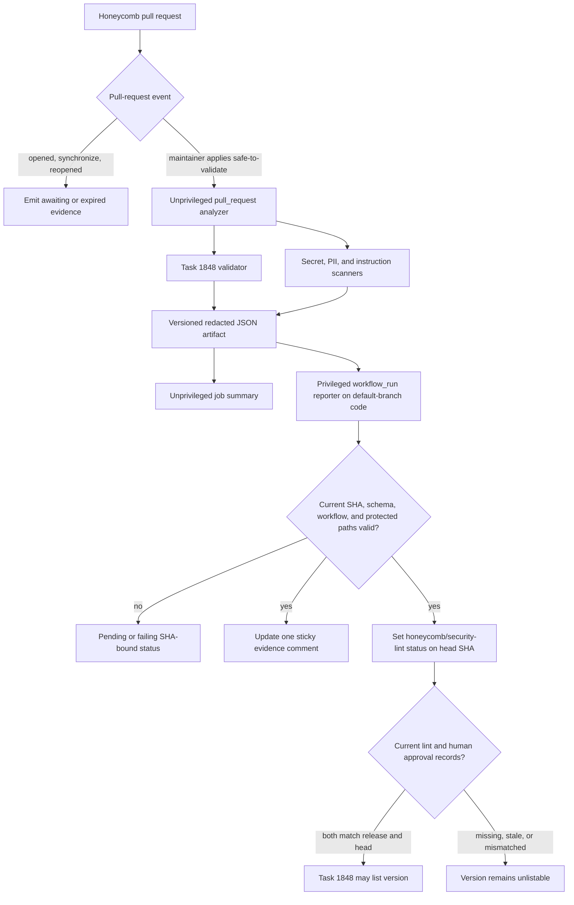
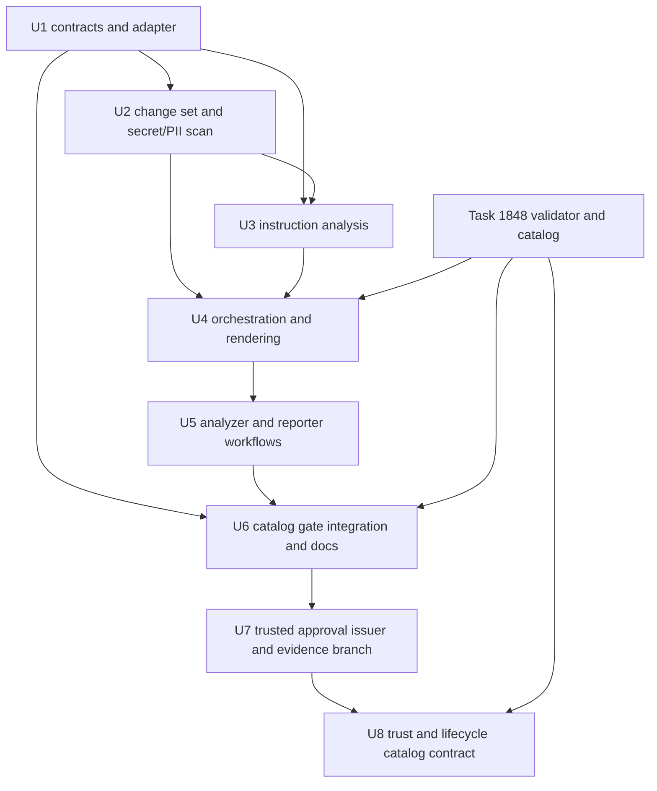

# Security Lint CI for Honeycomb Submissions - Plan

## Overview

Build the security lint gate for honeycomb pull requests on top of task 1848's Ruby-stdlib package validator and listing-evidence boundary.
The gate scans changed package versions as untrusted data, publishes redacted evidence for a human reviewer, and creates an authoritative status bound to the exact pull-request head SHA.
Catalog eligibility remains a separate dual gate: the same package release fingerprint and head SHA must have both a passing lint record and a designated maintainer approval record.

The repository is currently a documentation scaffold, while the sibling task 1848 plan defines the expected production commands as `script/honeycomb-validate` and `script/honeycomb-catalog`, the package integrity identity as `release_sha256`, and the catalog reader boundary in `lib/honeycomb_registry/listing_evidence.rb`.
This work must consume those interfaces after they land and may use a fixture adapter only to develop isolated tests in the meantime.

### High-Level Technical Design

The `pull_request` workflow has `contents: read`, receives no repository secrets, and never executes submitted instructions.
The `workflow_run` reporter has only the metadata permissions needed to download the artifact, update the pull request, remove an expired label, and set a commit status.
It checks out default-branch code only, parses the analyzer artifact as hostile input with strict size and schema limits, and never evaluates artifact fields in a shell.

### Key Technical Decisions

- KTD1. Use a two-workflow trust split. (session-settled: user-directed — chosen over `pull_request_target` or a write-enabled scan job: fork code must never receive secrets or a write token.)
- KTD2. Make the default-branch reporter's `honeycomb/security-lint` commit status authoritative. The analyzer workflow conclusion is diagnostic because pull-request code can propose changes to the workflow or scanner.
- KTD3. Refuse a passing status when the same pull request changes trusted lint, validator, policy, schema, or workflow paths. Security-tool changes must land separately before they can assess package submissions.
- KTD4. Bind evidence to three distinct identities: task 1848's package `release_sha256`, the exact pull-request `head_sha`, and the originating workflow run plus artifact digest. None substitutes for another.
- KTD5. Keep every finding in evidence and apply suppression as a disposition change after detection. A package request alone never suppresses a finding; an exact current-SHA approval record must authorize the same finding fingerprint.
- KTD6. Use task 1848's validator command and JSON findings as a black-box contract. This task does not fork package schema, integrity, permission derivation, or catalog generation.
- KTD7. Keep the analyzer deterministic, Ruby-stdlib-only, and data-only. It may tokenize and parse strings but must not run honeycomb commands, stage prompts, package hooks, generated scripts, or network requests.

---

## Requirements Trace

| ID | Requirement and source | Implementation | Primary proof |
|---|---|---|---|
| R1 | Use Ruby scripts, port relevant hive-bench patterns with attribution, and consume task 1848's validator contract without reimplementation. (A1) | U1, U2, U4 | Validator adapter contract tests; attribution; no production fixture adapter |
| R2 | Hard-fail schema/integrity errors, secrets, high-confidence PII, traversal, credential reads, pipe/download-to-shell, encoded exfiltration, undeclared hosts, and permission excess; keep declared or low-confidence observations advisory. (A2) | U2-U4 | Blocking/advisory rule matrix and aggregate verdict tests |
| R3 | Scan every text file in each changed package version for secrets/PII and limit instruction analysis to `workflow.yml`, `instructions/**/*.{md,txt,yml,yaml}`, and package `README.md`. (A3) | U2, U3 | Discovery, file-type, nested-path, and scope tests |
| R4 | Extract fenced commands, command-like inline backticks, and YAML string values; use task 1848's descriptor/manifest permissions as authoritative and heuristics only for observed undeclared behavior. (A3) | U1, U3 | Extraction provenance and permission comparison tests |
| R5 | Combine a maintainer-owned baseline under `policy/` with package manifest declarations that carry reasons; allow only exact fixture/placeholder suppressions and require human approval before downgrading a hard finding. (A4) | U1-U3, U6 | Policy validation and suppression state matrix |
| R6 | Run package analysis only on `pull_request`, never `pull_request_target`, with read-only contents, no repository secrets, and a maintainer `safe-to-validate` gate. (A5) | U5 | Static workflow security tests and live fork canary |
| R7 | Bind label action, lint, and approval to the exact head SHA; synchronize/reopen events expire prior state and require label reapplication. (A5) | U1, U5, U6 | Event/race tests and stale-SHA catalog matrix |
| R8 | Publish one updated-in-place comment, a matching job summary, a versioned JSON artifact, and a machine-readable SHA-bound status with all requested evidence sections. (A6-A7) | U1, U4, U5 | Golden artifact/comment/summary and status reporter tests |
| R9 | Define the approval record consumed by task 1848 and prove catalog omission unless current lint and approval records both match the package release and head SHA. (A6) | U1, U6 | Black-box `script/honeycomb-catalog` integration test |
| R10 | Use “honeycomb” in user-facing copy and reserve “package” for paths and implementation details. (A7) | U4-U6 | Renderer copy assertions and documentation review |
| R11 | Cover clean, malformed, tampered, malicious-command, secret, PII, undeclared-host, permission-escalation, advisory-only, fork-safety, and new-push invalidation cases. (A8) | U2-U6 | Fixture and workflow acceptance matrix |
| R12 | Do not add semantic/LLM intent classification, auto-merge, auto-listing, or prompt execution/sandboxing. (A8) | All units | Scope audit and absence of execution paths |

### Acceptance States

| State | Lint status on current head | Evidence behavior | Catalog eligibility |
|---|---|---|---|
| Opened or pushed without a fresh maintainer gate | `pending` | Sticky comment says validation awaits `safe-to-validate`; old evidence is marked expired | Ineligible |
| Freshly gated and clean | `success` | Full advisory evidence remains visible | Eligible only with matching human approval |
| Freshly gated with any unsuppressed hard finding | `failure` | Every finding is redacted, attributed, and classified | Ineligible |
| Freshly gated with advisory-only findings | `success` | Advisory commands, declared hosts, and broad declared permissions remain visible | Eligible only with matching human approval |
| Hard finding with package suppression request only | `failure` | Request and reason are visible as unapproved | Ineligible |
| Hard finding with an exact maintainer-approved suppression for the same release/head | `success` if no other hard finding remains | Finding remains visible as downgraded with approval reference | Eligible only if the general approval record also satisfies task 1848 |
| Artifact is missing, malformed, oversized, stale, or from altered trusted tooling | `error` or `failure` | Reporter posts a fail-closed diagnostic without rendering untrusted fields | Ineligible |

---

## Scope Boundaries

### In Scope

- Ruby-stdlib security lint orchestration, changed-package discovery, secret/PII scanning, instruction extraction, static deny rules, network-host checks, permission comparison, redaction, and deterministic evidence rendering.
- A small versioned repo-global policy for stable hosts and exact scanner-fixture fingerprints.
- A strict `x-security` manifest extension in which `network_host_reasons` can explain hosts already present in authoritative normalized permissions and `suppressions` can request exact finding downgrades with reasons. The extension never grants a capability or activates its own suppression.
- A versioned lint-evidence schema and a versioned human-approval schema that bind package name/version, `release_sha256`, and exact head SHA.
- A trusted, non-circular maintainer approval issuer and append-only evidence channel on the dedicated `honeycomb-evidence` branch. Package pull requests cannot write this channel or approve themselves.
- Catalog trust/lifecycle projections required by task 1850: immutable release tier, current tier, listed/soft-hidden/yanked/revoked state, verified signature/attestation evidence, tier history, and public advisory metadata.
- An unprivileged analyzer workflow, a privileged metadata-only reporter workflow, one sticky comment, a job summary, a JSON artifact, label expiry, and a required SHA-bound status context.
- Black-box integration with task 1848 proving that only a current passing lint record plus a current human approval record makes a version catalog-eligible.
- Technical operator documentation and the wiki updates required by `AGENTS.md`.

### Out of Scope

- Reimplementing or mutating task 1848's manifest generator, package validator, permission derivation, listing-evidence reader, or catalog generator.
- General trust-policy prose, community-review prose, security-report handling, and installer enforcement remain owned by tasks 1850 and 1852/1853. This task now owns the technical approval issuer/storage boundary and the catalog evidence fields those policies consume.
- Automatically approving a submission, weakening task 1850's two-maintainer rule for `risk: high`, or treating lint, signatures, attestations, or community reviews as human listing approval.
- Semantic prompt-injection, social-engineering, or intent classification. Human reviewers judge meaning from the surfaced evidence and full diff.
- Running submitted instructions, shell commands, setup hooks, network calls, or a sandboxed honeycomb execution.
- Automatic merge, automatic human approval, automatic listing, or direct mutation of `catalog.json` from the lint workflow.
- A private rule service or unpublished anti-abuse backend; v1 follows the project's open-source registry decision.

### Cross-Task Dependencies

- U1 may start with fixture responses, but U4 and U6 require task 1848's landed `script/honeycomb-validate`, `script/honeycomb-catalog`, generated `manifest.yml` fields, and `lib/honeycomb_registry/listing_evidence.rb` contract.
- By explicit user authorization on 2026-07-17, U7 owns the production approval issuer and storage channel in task 1849's trusted default-branch boundary. Task 1848 continues to own package validation and consumes the normalized records; task 1850 owns the public policy prose.
- U8 must implement task 1850's accepted trust/lifecycle semantics before tasks 1850 and 1851 proceed. Exact schema names may differ from the plan language, but release tier, current tier, lifecycle state, verified evidence, advisory metadata, and history must remain independently represented.
- Repository settings must make `honeycomb/security-lint` a required status and must retain fork defaults that withhold secrets and write tokens. The workflows cannot enforce those settings from inside a pull request.
- The reporter workflow must exist on the default branch before a real `workflow_run` fork-canary test can prove the end-to-end write path.

---

## Implementation Units

### U1. Freeze validator, policy, lint-evidence, and approval contracts

- **Goal:** Establish the strict boundaries shared by the scanner, reporter, suppression resolver, and task 1848 catalog reader.
- **Requirements:** R1, R4, R5, R7-R9; KTD4-KTD6.
- **Dependencies:** Task 1848's planned CLI/finding/release identity contract; fixture adapter permitted until it lands.
- **Files:** `schemas/security-lint-evidence-v1.json`, `schemas/listing-approval-v1.json`, `policy/security-lint.yml`, `lib/honeycomb_security_lint/validator_adapter.rb`, `lib/honeycomb_security_lint/policy.rb`, `lib/honeycomb_security_lint/contracts.rb`, `test/security_lint/contracts_test.rb`, `test/security_lint/validator_adapter_test.rb`, `test/fixtures/security-lint/contracts/**`.
- **Approach:** Define `honeycomb.security-lint/v1` as a deterministic PR-level object containing event/gate metadata, pull-request number, base/head SHAs, workflow run identity, artifact digest slot, one or more package results, validator findings, normalized requested permissions, extracted commands, hosts, deny findings, secret/PII findings, suppression dispositions, aggregate counts, and terminal verdict. Define `honeycomb.listing-approval/v1` with package name/version/path, `release_sha256`, exact `head_sha`, reviewer identity, decision/timestamp, reviewed evidence digest, review URL/notes, and exact approved-suppression fingerprints. Strictly reject unknown known-level keys, malformed identities, mismatched nested SHAs, duplicate approvals, unsafe `x-security` shapes, package regex suppressions, and unreasoned host/suppression declarations. Adapt `script/honeycomb-validate --json` exits 0/1/2 and four-key findings without interpreting or rewriting validation logic; an invalid/missing validator result becomes an operational hard failure.
- **Test scenarios:**
  - Complete lint and approval fixtures round-trip through canonical JSON with stable key/finding order and retain distinct `release_sha256`, `head_sha`, run ID, and artifact digest fields.
  - Missing schema/version, package identity, reason, reviewer, verdict, or SHA fields; unknown nested keys; duplicate approvals; and mismatched release/head identities fail with stable contract errors.
  - A package manifest may explain only hosts already present in task 1848's normalized permissions; an extra `x-security` host cannot grant network access.
  - A suppression request accepts one exact finding fingerprint and mandatory reason, but no glob, regex, prefix, rule-wide, path-wide, or empty suppression.
  - Validator exit 0 with an empty finding array passes through; exit 1 findings remain structured hard evidence; exit 2, malformed JSON, schema drift, timeout, or missing executable produces an operational failure rather than a fallback validator.
  - The temporary fixture adapter is injectable only in tests and no production code path can select it through package-controlled data.
- **Verification:** The two JSON schemas and Ruby validators accept the same golden records, task 1848's listing-evidence fixtures can consume the normalized identities without translation ambiguity, and no validator implementation exists under this task's namespace.

### U2. Discover changed package content and scan secrets/PII safely

- **Goal:** Enumerate the exact untrusted package bytes to inspect and detect secret/high-confidence PII leaks without ever reproducing sensitive values in evidence.
- **Requirements:** R1-R3, R5, R11; KTD5-KTD7.
- **Dependencies:** U1 and task 1848's package path/name/version rules.
- **Files:** `lib/honeycomb_security_lint/change_set.rb`, `lib/honeycomb_security_lint/text_files.rb`, `lib/honeycomb_security_lint/secret_pii_scanner.rb`, `lib/honeycomb_security_lint/redactor.rb`, `NOTICE`, `test/security_lint/change_set_test.rb`, `test/security_lint/secret_pii_scanner_test.rb`, `test/security_lint/redactor_test.rb`, `test/fixtures/security-lint/{clean,secrets,pii,paths}/**`.
- **Approach:** Derive changed version roots from a NUL-delimited base-to-head diff and validate every path against `packages/<name>/<semver>/` before reading. Scan every bounded regular text file within each changed version, including dotfiles and the manifest; reject symlinks, special files, traversal, invalid encoding policy, and size/resource-limit evasion instead of silently skipping them. Port the relevant hive-bench private-key/provider-token/generic-assignment/private-host patterns with MIT attribution, stable rule IDs, and expanded tests. Classify checksum/context-validated identifiers such as payment-card shapes and explicitly labeled government IDs as high-confidence; keep generic email, phone, address, and ambiguous identity heuristics advisory. Compute exact finding fingerprints from rule ID, normalized path/span, and matched evidence, then redact before the result enters any serializable model.
- **Test scenarios:**
  - A clean version with nested instructions, README, YAML, dotfiles, and benign examples produces no blocking secret/PII finding.
  - Private keys, GitHub/OpenAI/Anthropic/AWS/Slack/Google credential shapes, JWT/bearer-style credentials, and high-entropy generic assignments block with the expected rule IDs.
  - A Luhn-valid payment-card fixture and a context-labeled valid-format government identifier block, while ordinary numbers, example domains, email addresses, and phone-like prose remain advisory or clean according to policy.
  - A secret on a short or long line is never present in the JSON, comment, summary, exception text, or test failure output; only redacted location/context and the non-reversible composite fingerprint remain.
  - Missing files from a diff race, invalid text encoding, oversized text, total scan-budget exhaustion, symlinks, FIFOs, absolute paths, parent traversal, backslash ambiguity, and unusual whitespace/newline filenames fail closed.
  - An exact approved fixture fingerprint downgrades only the same rule/path/content on the same release/head; changing one byte, location, head SHA, reason, or approval identity restores the hard failure.
- **Verification:** Every eligible text file is accounted for as scanned or explicitly failed, the hive-bench attribution preserves its MIT notice, and a repository-wide assertion proves raw fixture secrets never appear in produced evidence.

### U3. Extract instruction behavior and apply static security rules

- **Goal:** Surface reviewable commands, hosts, paths, and permission use while hard-failing the high-confidence behaviors named in the brainstorm.
- **Requirements:** R2-R5, R10-R12; KTD5-KTD7.
- **Dependencies:** U1-U2 and task 1848's authoritative normalized permissions.
- **Files:** `lib/honeycomb_security_lint/instruction_scope.rb`, `lib/honeycomb_security_lint/command_extractor.rb`, `lib/honeycomb_security_lint/network_extractor.rb`, `lib/honeycomb_security_lint/rule_engine.rb`, `lib/honeycomb_security_lint/permission_checker.rb`, `test/security_lint/command_extractor_test.rb`, `test/security_lint/network_extractor_test.rb`, `test/security_lint/rule_engine_test.rb`, `test/security_lint/permission_checker_test.rb`, `test/fixtures/security-lint/instructions/**`.
- **Approach:** Inspect only `workflow.yml`, package `README.md`, and `instructions/**/*.{md,txt,yml,yaml}`. Preserve source path and line/column while extracting fenced block lines, inline backticks that pass a conservative command-shape test, and YAML string scalars via safe Psych parsing; malformed YAML is a hard error and no extracted value is evaluated. Normalize concrete URL/host evidence, require every observed host to appear in authoritative manifest permissions, require a reason for package-specific hosts outside the baseline, and treat unresolved/dynamic network destinations as undeclared/unbounded. Apply stable rules for traversal, credential paths, pipe-to-shell, download-then-execute sequences, encoded/compressed exfiltration, and observed shell/network/filesystem behavior beyond the manifest; declared commands/hosts and broad-but-declared permissions remain advisory. Apply suppression only after finding creation and retain the original classification, request, approval reference, reason, and downgraded disposition in evidence.
- **Test scenarios:**
  - Bash/sh/zsh/PowerShell fenced blocks, untagged command-like fences, command-like inline backticks, multiline YAML scalars, sequences, and nested map strings produce attributed command evidence; prose backticks and non-string YAML values do not become commands.
  - `curl | sh`, `wget` followed by execution, encoded data piped to a network client, archive/compression exfiltration, and equivalent whitespace/quoting/continuation variants block.
  - Reads of `.ssh`, `.aws`, `.config/gh`, `.kube/config`, `.npmrc`, `.netrc`, Git credential stores, cloud credential files, or environment-secret dumps block even when obfuscated through `~`, environment variables, or path normalization.
  - Parent traversal, absolute paths outside declared scopes, write commands under read-only permissions, shell use without shell permission, secret access outside declared names, and network use without the manifest capability block.
  - A declared concrete host with a required reason appears as advisory evidence; an undeclared, wildcard, variable-derived, user-controlled, IP-literal, alternate-port, or normalization-mismatched destination blocks unless the authoritative permissions explicitly allow the exact normalized form.
  - Ordinary extracted commands, lower-confidence suspicious verbs, a broad declared permission set, and declared hosts remain visible without changing a pass verdict.
  - Submitted strings containing shell substitutions, workflow expressions, Markdown/HTML, ANSI bytes, or GitHub workflow-command syntax remain inert data and are escaped before rendering.
- **Verification:** Golden fixtures map every required hard/advisory category to a stable rule ID and source location, permission results match task 1848's normalized manifest rather than a heuristic declaration, and no test observes command execution or network access.

### U4. Aggregate findings into the CLI, JSON artifact, and reviewer views

- **Goal:** Produce one deterministic verdict and the three matching evidence surfaces required by reviewers and downstream automation.
- **Requirements:** R1-R5, R8, R10-R11; KTD2, KTD4-KTD7.
- **Dependencies:** U1-U3 and landed `script/honeycomb-validate`.
- **Files:** `script/honeycomb-security-lint`, `lib/honeycomb_security_lint.rb`, `lib/honeycomb_security_lint/runner.rb`, `lib/honeycomb_security_lint/evidence.rb`, `lib/honeycomb_security_lint/renderer.rb`, `test/security_lint/runner_test.rb`, `test/security_lint/evidence_test.rb`, `test/security_lint/renderer_test.rb`, `test/security_lint/cli_test.rb`, `test/fixtures/security-lint/golden/**`.
- **Approach:** Validate all changed package versions first, continue independent scans after ordinary validation findings so reviewers receive a complete evidence set, and reserve an operational error verdict for missing/invalid dependencies or unsafe partial analysis. Emit one canonical PR-level JSON document with per-package results and an aggregate `pass`, `fail`, `awaiting_maintainer`, `expired`, `unchanged`, or `error` state; exits are 0 only for pass/unchanged, 1 for policy findings or waiting/expired state, and 2 for invocation/internal errors. Render both Markdown surfaces from the same already-redacted evidence model with sections for honeycomb/version/head SHA, validator, requested permissions, extracted commands, network hosts, deny-pattern hits, secret/PII findings, suppressions, and final lint verdict. Use a stable hidden marker for the sticky comment, escape GitHub markup/workflow commands, cap each human section with explicit truncation counts, and leave the full redacted record in the bounded artifact.
- **Test scenarios:**
  - One clean changed version returns pass/exit 0 and produces byte-stable JSON, comment Markdown, and job-summary Markdown with matching counts and verdict.
  - Multiple changed versions sort deterministically and aggregate to failure when any version has a hard finding while retaining clean/advisory evidence for the others.
  - Malformed/tampered manifests, every malicious fixture class, undeclared hosts, and permission escalation return fail/exit 1 with both validator and scanner evidence.
  - Advisory-only findings remain visible and return pass/exit 0; an approved exact suppression keeps its finding visible as downgraded and cannot erase its original severity.
  - Waiting, expired, and operational error artifacts use distinct states so the reporter cannot mistake “not run” for pass.
  - Malicious headings, links, mentions, HTML, workflow commands, control bytes, extremely long commands, and secret-bearing commands are escaped/redacted/truncated without changing artifact structure or comment ownership marker.
  - Human-facing output consistently says “honeycomb”; “package” occurs only in paths or implementation diagnostics.
- **Verification:** Golden outputs cover every section and terminal state, JSON conforms to `schemas/security-lint-evidence-v1.json`, rendered surfaces derive from the same counts, and the artifact contains no raw secret or unbounded attacker-controlled field.

### U5. Implement the fork-safe analyzer and trusted reporter workflows

- **Goal:** Enforce maintainer gating and SHA freshness while publishing evidence safely for fork pull requests.
- **Requirements:** R6-R8, R10-R12; KTD1-KTD4, KTD7.
- **Dependencies:** U1-U4 and the workflows present on the default branch for live verification.
- **Files:** `.github/workflows/security-lint.yml`, `.github/workflows/security-lint-report.yml`, `script/honeycomb-security-lint-report`, `lib/honeycomb_security_lint/reporter.rb`, `test/security_lint/reporter_test.rb`, `test/security_lint/workflow_contract_test.rb`, `test/fixtures/security-lint/github-events/**`.
- **Approach:** Trigger the analyzer on `pull_request` opened, labeled, synchronize, and reopened events scoped to package changes, with workflow-level `contents: read`, no custom secrets, no cache, hosted ephemeral runners, explicit PR head checkout, and `persist-credentials: false`. Only a `safe-to-validate` labeled event runs U4; opened/synchronize/reopened create waiting/expired evidence without reading package content, and unrelated label events preserve the current status. Use per-PR concurrency to cancel stale scans and upload evidence even on failures. Trigger the reporter through `workflow_run`; check out only the default branch, pin every third-party action by full commit SHA, grant only `actions: read`, `contents: read`, `pull-requests: write`, `issues: write`, and `statuses: write`, and use no repository secret besides the scoped automatic token. Before writing, verify the exact upstream workflow identity, repository, PR association, current head SHA, artifact name/digest/size/schema, and that the PR does not change the analyzer, reporter, validator, registry libraries, schemas, policy, or workflows. Ignore stale runs, fail closed on current malformed/missing evidence, update only the bot-owned marker comment, set `honeycomb/security-lint` on the artifact head, and remove `safe-to-validate` after synchronize/reopen so a maintainer must reapply it.
- **Test scenarios:**
  - Static workflow tests reject `pull_request_target`, write permission or `${{ secrets.* }}` in the analyzer, persisted checkout credentials, self-hosted runners, mutable action tags/branches, cache use, and any submitted-instruction execution step.
  - Reporter tests reject checkout of a PR head/merge ref, shell interpolation of event/artifact values, excessive permissions, unpinned actions, or access to non-automatic secrets.
  - Opened and synchronize events set the new head to pending/expired, logically invalidate prior lint/approval, and remove the label only for the still-current head; reapplying the label starts a fresh scan bound to that head.
  - A successful old run finishing after a new push cannot overwrite the new comment or status; per-PR concurrency and a current-head API comparison make it a no-op.
  - Missing, duplicate, oversized, malformed, path-traversing archive, schema-invalid, identity-mismatched, or digest-mismatched artifacts fail the current head without executing or trusting artifact content.
  - A package PR that also changes protected lint/validator/policy/workflow code receives failure with split-PR guidance even if its artifact claims pass.
  - The first valid run creates one comment; reruns edit that comment in place; comments with a matching marker from another author are not hijacked.
  - A real fork canary confirms the analyzer receives no custom secrets or write token, the reporter alone can comment/status, and a post-label push returns the gate to pending until label reapplication.
- **Verification:** Workflow contract tests prove the static trust boundary, event simulations prove stale-run and invalidation behavior, and the default-branch fork canary confirms GitHub's effective token permissions and one-comment/status lifecycle.

### U6. Prove dual-gate catalog behavior and publish the technical contract

- **Goal:** Demonstrate the end-to-end listing boundary without taking ownership of catalog generation or trust policy.
- **Requirements:** R5, R7-R12; KTD4-KTD6.
- **Dependencies:** U1-U5, landed `script/honeycomb-catalog`, and task 1848's listing-evidence adapter.
- **Files:** `test/security_lint/catalog_gate_integration_test.rb`, `test/fixtures/security-lint/listing-gate/**`, `docs/SECURITY_LINT_CI.md`, `README.md`, `wiki/architecture.md`, `wiki/command-api-surface.md`, `wiki/dependencies.md`, `wiki/gaps.md`, `wiki/security-review-contract.md`, `wiki/log.d/<timestamp>-security-lint-ci.md`.
- **Approach:** Feed canonical task 1849 lint and approval fixtures through task 1848's actual evidence reader and `script/honeycomb-catalog` in a temporary registry, never a local catalog stub. Require both records to match name, version, `release_sha256`, and exact head SHA; link the approval to the reviewed lint artifact digest and preserve reviewer/audit fields. Keep missing or pending evidence as expected omission, while malformed, contradictory, or identity-mismatched evidence fails catalog generation according to task 1848's contract. Document the analyzer/reporter trust split, label/status lifecycle, evidence fields, suppression request/approval flow, protected-path split-PR rule, required repository settings, and local fixture commands; leave reviewer eligibility and policy prose to task 1850. Update wiki pages from “planned” to shipped facts and add a log fragment without editing compiled `wiki/log.md`.
- **Test scenarios:**
  - Current passing lint plus current affirmative human approval for the same package release/head includes the version in a temporary catalog.
  - No records, lint-only, approval-only, pending lint, failed lint, or rejected approval leaves the version absent.
  - A stale lint head, stale approval head, mismatched heads between records, wrong `release_sha256`, wrong package identity, changed package bytes, or unrelated artifact digest cannot list the version.
  - An approved suppression must match an existing package request and preliminary evidence fingerprint for the same release/head; broad, orphaned, duplicated, or stale approvals fail closed and never remove the finding from final evidence.
  - A new push after clean lint and approval invalidates both records even when package name/version is unchanged; only a fresh label run and fresh approval restore eligibility.
  - The integration invokes task 1848's production catalog command/reader, asserts absence or presence in generated output, and contains no copied catalog filtering logic.
  - Documented examples and JSON snippets validate against the same schemas/fixtures, and user-facing prose consistently uses “honeycomb.”
- **Verification:** The black-box integration proves the exact dual-gate invariant required by A6/A8, documentation separates lint evidence from human trust decisions, and wiki/README changes describe shipped interfaces without absorbing task 1850 policy.

### U7. Issue and persist trusted maintainer approvals without a Git SHA cycle

- **Goal:** Make the human half of the listing gate operational while keeping every write token and approval decision outside untrusted package pull-request code.
- **Requirements:** R5, R7-R9, R11-R12; KTD1-KTD6; task 1850 KTD2/KTD4.
- **Dependencies:** U1, U5-U6 and task 1848's normalized evidence reader.
- **Files:** `.github/workflows/listing-approval.yml`, `script/honeycomb-listing-approval`, approval/evidence support under `lib/honeycomb_security_lint/`, approval workflow/CLI tests, `docs/SECURITY_LINT_CI.md`, and affected wiki pages plus one new log fragment.
- **Approach:** Run the issuer only from reviewed default-branch code through a protected `workflow_dispatch`/environment. Verify the caller has eligible maintainer permission, the pull request is open at the supplied current head SHA, the authoritative lint status is successful for that SHA, the named package identity and `release_sha256` match the redacted lint artifact, and the review URL/decision/evidence digest are current. Persist canonical lint and approval records to a dedicated append-only `honeycomb-evidence` branch through the GitHub API; use immutable paths keyed by package/version/head/reviewer and refuse conflicting overwrite, deletion, or package-controlled destination data. The package PR token never receives evidence-branch write authority. Provide a deterministic offline exporter that reads a checked-out evidence snapshot and emits task 1848's normalized listing-evidence document. This separate ref is the durable source of truth and avoids changing the exact package head being approved.
- **Test scenarios:** Reject non-maintainers, self-approval where policy disallows it, stale/different PR heads, missing/failed lint status, artifact or release digest mismatch, unknown package identities, unsafe paths, mutable overwrite, duplicate reviewer records, reviewer dismissal, and evidence produced by changed untrusted tooling. Prove idempotent replay, canonical record order, two distinct eligible approvals for `risk: high`, one-current-maintainer behavior only where task 1850 permits it, and exact approved-suppression binding. Static workflow tests prove no pull-request code or artifact field reaches a shell and the write token is confined to the trusted approval job.
- **Verification:** A fixture-backed GitHub API integration exercises dispatch through immutable evidence storage and offline export into the real catalog reader; a current approval can list, while stale/missing/forged evidence cannot. Live branch creation and protection are post-merge rollout steps, but the workflow and operator command must be executable from default branch without code changes.

### U8. Add the catalog trust, lifecycle, verification, and advisory contract

- **Goal:** Give tasks 1850, 1851, the site, and installers one enforceable data model for Community/Verified releases and listed/soft-hidden/yanked/revoked behavior.
- **Requirements:** Task 1850 R3-R4, R8, R11, R13 and KTD1-KTD2, KTD5, KTD7.
- **Dependencies:** U7 plus task 1848's manifest/catalog implementation.
- **Files:** `lib/honeycomb_registry/listing_evidence.rb`, `lib/honeycomb_registry/catalog.rb`, catalog/evidence schemas and tests, signature/attestation verification support, catalog fixtures, public format/security documentation, and affected wiki pages plus one new log fragment.
- **Approach:** Evolve the pre-release v1 contracts coherently so each version preserves an immutable release tier separately from its current tier and lifecycle state. Use the closed lifecycle enum `listed`, `soft_hidden`, `yanked`, `revoked`; retain every version and its history/advisory metadata in canonical catalog data while discovery/latest selection includes only listed versions. Exact resolution continues for soft-hidden/yanked versions and fails closed with a public advisory for revoked versions. Verified releases require matching immutable archive digest, keyless signer identity/signature reference, GitHub Actions attestation/workflow identity, and verification timestamp; Community releases may omit verification evidence. High-risk permission sets require two distinct current eligible maintainer approvals. Keep permission risk, tier, state, and advisory independent, validate all URLs/digests/timestamps strictly, and never silently demote Verified to Community or revoked to yanked/listed.
- **Test scenarios:** Cover Community and Verified listed versions, historic Verified/current Community demotion, soft-hide, yank, revoke with mandatory advisory, missing/mismatched signature or attestation evidence, stale approval heads/releases, high-risk one-versus-two-reviewer gates, latest-version selection across hidden/yanked/revoked versions, canonical history ordering, exact-resolution eligibility, and schema drift. Mutation of reviews must not change release identity; mutation of signed archive members must invalidate verification.
- **Verification:** Real catalog generation over canonical fixtures proves independent tier/risk/state/advisory behavior, verified evidence fails closed, high-risk approval count is enforced, discovery/latest omit non-listed versions without deleting history, and downstream examples validate against the same schema.

### Dependency Order

---

## Verification Contract

| Gate | Coverage | Done signal |
|---|---|---|
| Ruby unit and contract suite | U1-U5 scanners, schemas, renderers, reporter, and workflow YAML assertions | All fixtures pass using the repository's task 1848 `test/run.rb` harness; no added gem or network dependency |
| Secret leakage guard | U2-U4 raw fixture tokens versus every JSON/Markdown/log/exception output | No raw credential or high-confidence PII value appears outside the source fixture |
| Rule acceptance matrix | U2-U4 clean, malformed, tampered, malicious, secret, PII, host, permission, advisory, and suppression fixtures | Every required category has a stable rule/finding and expected blocking disposition |
| Validator integration | U1/U4 real `script/honeycomb-validate --json` | Exits/findings are preserved; invocation/schema errors fail closed; no duplicated validator logic exists |
| Workflow static security | U5 both workflow files | No `pull_request_target`, analyzer write permission/custom secret/cache/self-hosted runner, unpinned action, untrusted reporter checkout, or shell interpolation sink |
| Workflow event/race simulation | U5 GitHub event and artifact fixtures | Waiting, label, pass, fail, synchronize, stale completion, label removal, comment update, and status transitions match exact head SHAs |
| Live fork canary | U5 after workflows are on the default branch | Fork analyzer has read-only/no-secret context; reporter alone writes; a new push expires the prior result and requires label reapplication |
| Catalog dual gate | U6 real `script/honeycomb-catalog` and listing-evidence reader | Only matching current-SHA lint plus human approval lists the version; all missing/stale/mismatched matrices omit or fail as contracted |
| Trusted approval issuance | U7 workflow/CLI/API fixtures and offline exporter | Only an eligible maintainer acting from trusted default-branch code can append an exact-SHA record; the package PR cannot mutate evidence and no approval commit changes the reviewed head |
| Trust/lifecycle catalog | U8 real catalog generation and signature/attestation fixtures | Tier, current tier, risk, state, history, verification, and advisory remain independent; high-risk and Verified gates fail closed; non-listed versions remain auditable but are excluded from discovery/latest |
| Documentation and wiki | U6 schemas/fixtures versus examples and project wiki protocol | Examples validate, repo settings are documented, wiki facts are current, one new log fragment exists, and `wiki/log.md` is unchanged |

---

## Risks

| Risk | Impact | Mitigation |
|---|---|---|
| A privileged reporter trusts an attacker-produced artifact | Artifact paths or fields could become code execution, token theft, or forged comments/statuses | Default-branch reporter code only; no untrusted checkout; strict artifact identity, digest, count, size, archive-path, and JSON schema checks; no shell interpolation; escaped rendering |
| A pull request modifies the scanner or validator to emit a false pass | The unprivileged workflow could produce convincing forged evidence | Reporter queries changed files independently and refuses success when trusted workflow/scanner/validator/policy/schema paths change; require a separate tooling PR |
| A stale run wins a race after synchronize | A clean old SHA could overwrite the current malicious head's status/comment | Per-PR concurrency, exact current-head API comparison immediately before every write, SHA in every record, and stale-run no-op behavior |
| GitHub repository settings do not require the trusted status or allow fork writes/secrets | CI configuration could bypass the intended boundary despite correct YAML | Document and verify the required `honeycomb/security-lint` context and fork settings; prove effective permissions with a live fork canary |
| Public regex rules create false negatives or evasion pressure | Static lint may miss semantic or obfuscated malicious intent | Keep stable rules conservative, fail dynamic/unbounded behavior, surface lower-confidence evidence, expand regression fixtures, and retain mandatory human review |
| Secret/PII evidence leaks the value it detected | The security control itself could publish credentials or personal data | Redact before model construction, fingerprint composite context rather than printing matches, sanitize exceptions, and assert raw fixtures are absent from all outputs |
| Suppressions become a broad bypass | A placeholder exemption could hide a later real token or behavior | Exact fingerprint plus reason plus current release/head approval; no package regex/glob/rule suppression; always retain the finding and approval disposition |
| Task 1848 lands with a different executable or evidence reader shape | This task could accidentally create a parallel contract | Isolate one adapter, use fixtures only before landing, then freeze against the real commands/schema before U4/U6; treat incompatible drift as a dependency failure |
| Evidence persistence creates a SHA cycle or exposes a write token to untrusted code | A package could approve itself or every approval commit could invalidate its own reviewed head | U7 stores immutable records on a separate append-only ref from trusted default-branch code; package workflows stay read-only and the exporter consumes a checked-out evidence snapshot offline |
| Crafted file trees exhaust memory or escape package scope | Scanner may hang, skip content, or read outside the submission | NUL-safe paths, root containment, no symlinks/special files, per-file/aggregate limits, bounded parsing, and fail-closed accounting |
| The reporter cannot be tested in the same PR that first introduces it | `workflow_run` behavior remains unproven until code exists on the default branch | Land static/unit-tested workflows first, then run a dedicated fork canary before declaring repository-level rollout complete |

---

## Definition of Done

- `script/honeycomb-security-lint` consumes task 1848's real validator, scans every required changed text/instruction file without executing submissions, and emits deterministic schema-valid redacted evidence.
- Every hard and advisory category in R2 is represented by stable tested rules, and exact approved suppressions downgrade without hiding evidence.
- `.github/workflows/security-lint.yml` is fork-safe and label-gated; `.github/workflows/security-lint-report.yml` alone performs metadata writes from trusted default-branch code and treats artifacts as hostile.
- One sticky comment, matching job summary, versioned JSON artifact, and authoritative `honeycomb/security-lint` status all identify the same package release and exact head SHA.
- Opened/new-push/reopen states block on a fresh maintainer gate, stale runs cannot overwrite current state, and old lint/approval records cannot satisfy the new head.
- The live fork canary proves that analyzer jobs receive no custom secrets or write token and that the reporter can update evidence without checking out or executing fork code.
- The production task 1848 catalog generator integration proves absence unless both current lint and human approval records match package/version, `release_sha256`, and head SHA.
- The trusted approval workflow and CLI append immutable exact-SHA records to the dedicated evidence ref, enforce reviewer eligibility/high-risk counts, and export deterministic normalized evidence without a Git SHA cycle.
- The catalog contract independently carries release/current tier, permission risk, lifecycle state, verification evidence, history, and advisory metadata; Verified, high-risk, and revoked states fail closed when their required evidence is missing.
- Technical documentation and wiki pages reflect shipped behavior, required repository settings are recorded, a new wiki log fragment exists, and unrelated user changes plus compiled `wiki/log.md` remain untouched.
- No validator/catalog fork, semantic classifier, auto-approval/listing, submitted-command execution, broad suppression, unnecessary dependency, dead-end implementation, or temporary generated artifact remains in the implementation diff.

---

## Sources and Existing Patterns

- Sibling implementation contract: `.hive-state/stages/3-plan/registry-layout-package-manifest-schema-260709-1f1a/plan.md`.
- Local planning contracts: `wiki/security-review-contract.md`, `wiki/package-catalog-contract.md`, `wiki/architecture.md`, `wiki/decisions.md`, `wiki/dependencies.md`, and `wiki/gaps.md`.
- Hive Bench precedent at commit `432e730ea7812246496726fcc9153e98be58eb30`: [fork-safe analyzer workflow](https://github.com/ivankuznetsov/hive-bench/blob/432e730ea7812246496726fcc9153e98be58eb30/.github/workflows/validate-submission.yml), [separate reporter workflow](https://github.com/ivankuznetsov/hive-bench/blob/432e730ea7812246496726fcc9153e98be58eb30/.github/workflows/post-results.yml), [secret scanner](https://github.com/ivankuznetsov/hive-bench/blob/432e730ea7812246496726fcc9153e98be58eb30/validator/secret_scan.rb), and [scanner tests](https://github.com/ivankuznetsov/hive-bench/blob/432e730ea7812246496726fcc9153e98be58eb30/test/secret_scan_test.rb). Preserve the upstream MIT notice when porting patterns.
- GitHub security guidance: [secure use reference](https://docs.github.com/en/actions/reference/security/secure-use), [workflow event security and `workflow_run` warning](https://docs.github.com/en/actions/reference/workflows-and-actions/events-that-trigger-workflows), [fork token/secrets behavior](https://docs.github.com/en/actions/reference/workflows-and-actions/events-that-trigger-workflows#workflows-in-forked-repositories), and [script-injection guidance](https://docs.github.com/en/actions/concepts/security/script-injections).

<!-- COMPLETE -->
