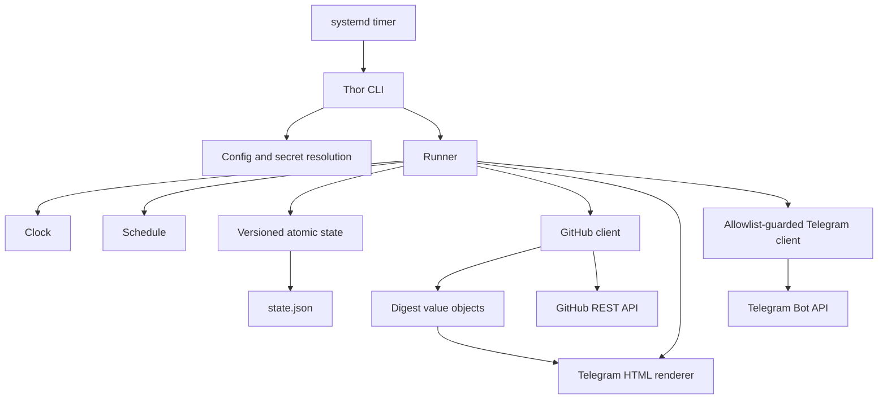
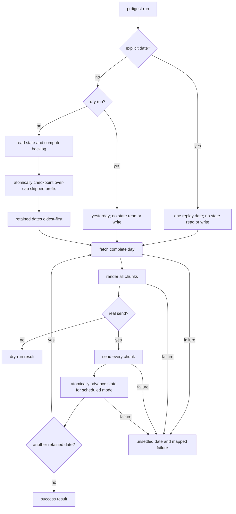

# PRDigest v0.1.0 - Plan

## Goal Capsule

- **Objective:** Turn the existing Ruby gem scaffold into the production-ready v0.1.0 oneshot that sends deterministic daily merged-PR digests to one allowlisted Telegram chat.
- **Authority:** `brainstorm.md` defines product behavior and supersedes conflicting details in `idea.md` or the older architecture handoff; the current scaffold defines naming and compatibility patterns.
- **Execution profile:** Implement M1 through M6 in dependency order, keep every automated test offline, and checkpoint correctness at each milestone before moving to the next.
- **Stop conditions:** Do not add excluded product surfaces, expose credentials or private payloads in artifacts, silently lose an owed day, or tag, publish, or create a release without separate operator approval.
- **Tail ownership:** M6 prepares the v0.1.0 package and release evidence only; an operator owns publication and release creation.

---

## Overview

PRDigest serves a self-hosting operator running a small VPS. The operator supplies an explicit ordered list of `owner/name` repositories and an IANA timezone in YAML, provides GitHub and Telegram tokens through environment variables, configures one allowlisted delivery chat, and enables the supplied systemd timer.

The current repository is a working scaffold: Thor exposes `run`, `serve`, and `version`; `Config` validates repositories and the chat allowlist; the gemspec already includes Octokit and retry support; systemd, Docker, example configuration, CI, and a small Minitest suite exist. The implementation extends those seams instead of replacing them. The `serve` command remains a compatibility stub directing operators to systemd.

The completed flow is a deterministic oneshot. A scheduled real run reads versioned state, computes owed local dates through yesterday, durably skips dates outside the newest catch-up window, and processes retained dates oldest-first. Each date is converted to a half-open UTC window, fetched completely from GitHub, rendered into valid Telegram HTML chunks, delivered in order, and atomically checkpointed only after the date is settled. A failure stops the run with a stable result and exit code; durable progress remains, and the next timer invocation resumes from state.

### High-Level Technical Design

The second flow encodes the safety invariant: fetching and rendering finish before the first chunk is sent, all chunks must succeed before a day is checkpointed, and replay or dry-run modes never touch delivery state.

---

## Requirements Trace

| ID | Requirement | Planned coverage |
|---|---|---|
| R1 | Support one VPS operator using an explicit ordered repository list, IANA timezone, environment-only tokens, one allowlisted Telegram chat, and the systemd oneshot/timer. | U1, U4, U5, U6 |
| R2 | In scheduled mode, compute owed local days from durable state, process the retained dates oldest-first, and atomically advance state after each settled date. | U1, U5 |
| R3 | Settle a date only after every chunk succeeds, an enabled empty message succeeds, an empty message is intentionally suppressed, or an over-cap prefix is durably skipped; all GitHub, render, Telegram, and state failures leave the current date unsettled. | U1, U3, U4, U5 |
| R4 | Accept at-least-once delivery: if a later chunk or the following state write fails, retry the entire date and permit duplicate earlier chunks rather than risk silent loss. | U4, U5, U6 |
| R5 | Default `max_catchup_days` to 7, accept only `1..30`, retain the newest capped window, durably report the older skipped prefix, and then process retained dates oldest-first. | U1, U5 |
| R6 | Treat `--date YYYY-MM-DD` as a replay that bypasses state and may resend any date; make dry-run bypass state and Telegram, never advance progress, and expose no credentials. | U5 |
| R7 | Search merged PRs per configured repository and UTC window with pagination, bounded retries, mapped errors, and all-or-nothing optional detail statistics. | U2, U5 |
| R8 | Render deterministic Telegram HTML with config-order grouping, totals, empty-day behavior, hostile-text escaping, valid 4096-character chunks, sender allowlist refusal, 429 handling, pacing, and redacted errors. | U3, U4, U5, U6 |
| R9 | Resolve explicit `--config` first; when omitted, use `PRDIGEST_CONFIG`, then an existing `/etc/prdigest/config.yml`, otherwise refuse. Keep token values out of config, logs, human output, JSON, fixtures, and artifacts. | U1, U2, U4, U5, U6 |
| R10 | Always build the stable result envelope and map completed, dry-run, refusal, GitHub, Telegram, state, partial-catch-up, and unexpected outcomes to exits `0`, `2`, `3`, `4`, `5`, `6`, and `1`. | U5 |
| R11 | Honor the fixed London spring/fall DST windows, the Tokyo UTC-date rollover, and start-inclusive/end-exclusive merge boundaries. | U1, U2 |
| R12 | Produce release evidence across Ruby 3.2–3.4, clean gem installation, a non-root Alpine image with tzdata, systemd verification and VPS walkthrough, authenticated GitHub and Telegram smokes, complete operations/security docs, changelog, and independent reviews. | U2, U4, U6 |
| R13 | Preserve scaffold compatibility except for safe config discovery, execute M1–M6 in order, exclude the named non-goals, and prepare v0.1.0 without tagging, publishing, or creating a release. | U1–U6 |

### Acceptance Examples

- AE1. `Europe/London` on 2026-03-29 produces `[2026-03-29T00:00:00Z, 2026-03-29T23:00:00Z)`, a 23-hour window.
- AE2. `Europe/London` on 2026-10-25 produces `[2026-10-24T23:00:00Z, 2026-10-26T00:00:00Z)`, a 25-hour window.
- AE3. `Asia/Tokyo` on 2026-01-15 produces `[2026-01-14T15:00:00Z, 2026-01-15T15:00:00Z)`; a merge at the start is included and one at the end is excluded.
- AE4. If chunk 1 succeeds and chunk 2 fails, the date is not checkpointed; the next scheduled run sends chunk 1 again before retrying chunk 2.
- AE5. With ten owed dates and a cap of seven, the oldest three are reported and durably skipped first, then the newest seven are attempted oldest-first.
- AE6. `--date 2026-01-15` can resend a previously settled date without reading or changing state; adding `--dry-run` also suppresses Telegram while retaining replay mode in the result.
- AE7. `America/Santiago` on 2026-09-06 resolves its nonexistent midnight to the 04:00Z transition instant and produces `[2026-09-06T04:00:00Z, 2026-09-07T03:00:00Z)`.
- AE8. `America/Havana` on 2026-11-01 chooses the earliest occurrence of repeated midnight and produces `[2026-11-01T04:00:00Z, 2026-11-02T05:00:00Z)`.

---

## Scope Boundaries

### In Scope

- Extend the existing Ruby 3.2+ gem with `Clock`, `State`, `Schedule`, GitHub, digest value-object, renderer, Telegram, result, and orchestration components.
- Preserve the current Thor commands and configuration concepts while safely changing config path discovery.
- Support one ordered repository list, one schedule, and one configured delivery chat checked against the existing non-empty allowlist schema; v0.1.0 does not route to any additional allowlisted IDs.
- Use systemd as the v0.1.0 scheduler and Docker as an alternative packaging surface.
- Prepare version `0.1.0`, documentation, packaging checks, manual validation checklists, and review evidence.

### Deferred to Follow-Up Work

- Implementing the existing `serve` command as a long-running scheduler.
- A durable per-chunk or per-message ledger for duplicate suppression.
- Scaling beyond GitHub Search API caps or adding high-volume batching beyond the documented v0.1.0 operating envelope.
- Concurrent-run locking beyond systemd's single oneshot service instance.

### Outside This Product's v0.1.0 Identity

- Hive integration, Hive registry discovery, shipped-task narration, or any LLM-generated digest content.
- A web UI, interactive Telegram commands, or multi-chat/per-repository routing.
- Non-GitHub forges or organization-wide repository discovery.
- Tagging a release, creating a GitHub release, or publishing the gem without separate operator approval.

---

## Planning Contract

### Key Technical Decisions

- KTD1. **Mode is independent from status.** Results use mode `scheduled` or `explicit_date_replay`; status uses `success`, `dry_run`, `failure`, or `partial_failure`. Scheduled dry-run previews yesterday without reading state. Explicit-date dry-run retains replay mode while also avoiding state and Telegram.
- KTD2. **State fails closed except when absent.** A missing state file means first run and requests yesterday only. Version 1 binds `last_digested_date` to its IANA `timezone` and may retain a compact `last_skip` audit (`start_date`, `end_date`, and `notice_pending`). Malformed JSON, an unsupported version, an invalid or future date, a configured-timezone mismatch, permission failure, or atomic-write failure raises `StateError`; the CLI maps it to exit `5` unless earlier durable progress makes the run partial. Explicit-date replay remains state-free. This intentionally supersedes the older handoff's corrupt-state reset behavior.
- KTD3. **Catch-up skipping is a durable, recoverable prefix checkpoint.** `Schedule` returns `skipped_days` and `requested_days` separately. Before network work, `Runner` atomically advances `last_digested_date` to the last over-cap skipped date and records the full skipped range with `notice_pending: true`; a later settled-day checkpoint preserves the range and clears the pending notice. A process restarted between those writes recovers and reports the pending range. Successful skip checkpointing counts as durable progress for partial-failure classification.
- KTD4. **GitHub's inclusive search range is derived from the half-open domain window.** For whole-second GitHub timestamps, query `merged:START..END_MINUS_ONE_SECOND` with `repo:OWNER/NAME is:pr is:merged`. The authenticated M2 check must prove start inclusion and end exclusion; if GitHub invalidates this documented syntax, M2 is not complete until the query is adjusted without weakening `[start, end)` behavior.
- KTD5. **GitHub completeness beats partial availability.** Request 100 search results per page, follow every page, reject incomplete or over-cap searches instead of truncating, and post-validate every result's repository and `merged_at` against the requested half-open window. Preserve repository configuration order and sort PRs within a repository by merge time then PR number. When `line_stats` is enabled, all detail calls must finish before rendering or sending; one failed detail aborts the day. Each request gets at most three total attempts with 10-second connect and 30-second read/write timeouts; server-directed waits above 60 seconds fail the invocation for the next timer run.
- KTD6. **Rendering builds valid semantic fragments before packing chunks.** Escape every non-tool string used as text or an attribute, construct only supported Telegram HTML tags, and pack headers, repository sections, PR entries, and the footer without breaking tags. Prefer repository boundaries, fall back to PR-entry boundaries for a large section, and measure the 4096 limit after entity parsing as Telegram specifies.
- KTD7. **The Telegram client owns delivery defenses.** It refuses a non-allowlisted chat before constructing a request, uses only the fixed `https://api.telegram.org` origin with certificate verification and no redirect following, sends JSON with HTML parse mode and disabled previews, and paces consecutive messages through an injected sleeper. It honors `parameters.retry_after` within the shared three-attempt, 10-second connect, 30-second read/write, and 60-second maximum-wait budget, and emits sanitized `SendError` values that cannot contain the bot token or tokenized URL.
- KTD8. **Runner returns data; the CLI boundary owns presentation and exits.** Runner dependencies are injectable and never call `exit`. A single result builder guarantees the required fields in every path. The executable-level wrapper detects JSON intent before Thor dispatch so unknown commands, malformed options, and application errors all emit the promised human or JSON shape and map to the public exit contract.
- KTD9. **Offline behavior is enforced, not assumed.** WebMock disables external connections from the test helper, all network clients and sleepers are injectable, fixtures contain synthetic public-shaped data only, and live checks are separate manual release gates whose artifacts record only redacted metadata.
- KTD10. **Release preparation is reversible.** Update the version, image, units, docs, changelog, and verification evidence, but leave tagging, gem publication, and release creation to a later explicitly authorized operation.

### External Contract Notes

- GitHub documents `merged` date comparisons for pull-request search, REST pagination, the pull-request detail endpoint, and a separate search rate-limit bucket. M2 must treat these as fallible external contracts rather than assuming Octokit hides completeness or throttling concerns.
- Telegram's Bot API defines `sendMessage` text as 1–4096 characters after entity parsing, requires escaping `<`, `>`, and `&` outside supported HTML tags/entities, and provides `parameters.retry_after` for flood control.
- TZInfo requires an IANA data source; Linux normally supplies it through the `tzdata` package. The Alpine image must prove the same named-zone behavior as the Ruby test suite.
- GitHub does not publish a search-index freshness SLA. The supplied 09:05 timer therefore runs with the host timezone aligned to the digest timezone, giving completed local days a nine-hour buffer; operators use explicit replay if a later audit finds a delayed indexed merge. This is a documented residual limitation, not something pagination can prove away.

---

## Implementation Units

### U1. M1 - Time, Versioned State, and Capped Scheduling

- **Goal:** Establish the pure date, persistence, and catch-up semantics that every later milestone depends on.
- **Requirements:** R1, R2, R3, R5, R9, R11, R13; AE1, AE2, AE3, AE5, AE7, AE8; KTD2 and KTD3.
- **Dependencies:** None.
- **Files:**
  - Modify `prdigest.gemspec`.
  - Modify `lib/prdigest.rb`.
  - Modify `lib/prdigest/config.rb`.
  - Create `lib/prdigest/clock.rb`.
  - Create `lib/prdigest/state.rb`.
  - Create `lib/prdigest/schedule.rb`.
  - Modify `test/config_test.rb`.
  - Create `test/clock_test.rb`.
  - Create `test/state_test.rb`.
  - Create `test/schedule_test.rb`.
- **Approach:**
  - Add TZInfo as the only new runtime dependency in this milestone and validate that `timezone` is a resolvable IANA identifier.
  - Make `Clock` accept an injected current time. Derive yesterday in the configured zone and convert each local midnight independently to UTC; never compute the end by adding 86,400 seconds to the start. Resolve a nonexistent midnight to its transition instant and an ambiguous midnight to its earliest UTC occurrence. If two consecutive resolved boundaries coincide for a wholly skipped civil date, return a zero-length window that follows the configured empty-day policy without a GitHub query.
  - Define state version 1 as a secret-free JSON document containing `version`, `timezone`, `last_digested_date`, and optional `last_skip`. Treat absence as no prior date and validate every other read, including refusing a scheduled run when the state timezone differs from configuration. Write a mode-`0600` temporary file in the target directory, flush/fsync it, rename in the same directory, and fsync the parent directory before reporting success; any failure is a `StateError`.
  - Keep `Schedule` pure: given yesterday, optional last date, and cap, return the over-cap skipped prefix plus the newest retained dates oldest-first. Reject caps outside `1..30` and state dates later than yesterday.
  - Preserve existing repository and non-empty chat-allowlist validation. Require the single delivery `chat_id` to be a member, but retain schema compatibility when additional IDs are allowlisted; token values remain environment-only.
- **Execution note:** Implement the boundary tests before the clock and schedule logic because a one-day or DST error would contaminate every integration milestone.
- **Patterns to follow:** Retain the plain Ruby objects, frozen string literals, `Prdigest` namespace, `ConfigError` hierarchy, Minitest style, and tmpdir isolation already used by `lib/prdigest/config.rb` and `test/config_test.rb`.
- **Test scenarios:**
  1. Covers AE1. Convert London 2026-03-29 to the exact 23-hour UTC window.
  2. Covers AE2. Convert London 2026-10-25 to the exact 25-hour UTC window.
  3. Covers AE3. Convert Tokyo 2026-01-15 across the UTC date boundary and keep the end exclusive in the returned window contract.
  4. Inject current times around local midnight and confirm yesterday is derived in the configured zone rather than the process zone.
  5. Covers AE7 and AE8. Resolve Santiago's nonexistent midnight and Havana's repeated midnight to the exact UTC windows above; represent a wholly skipped civil date as a zero-length window without querying GitHub.
  6. Reject an unknown timezone, catch-up caps `0` and `31`, malformed repo entries, and a missing or mismatched chat allowlist as configuration errors; accept caps `1` and `30` and preserve a non-empty allowlist with extra non-target IDs.
  7. Read missing state as first run, read valid version-1 state, and reject malformed JSON, missing fields, invalid dates, unsupported versions, unreadable files, future dates, and configured-timezone mismatch as state failures; explicit replay constructs no state object.
  8. Atomically replace valid state, preserve the prior file when a pre-rename write or rename fails, create restrictive permissions, leave no reusable temp file, and verify parent-directory fsync occurs before success is reported.
  9. Persist a skipped range with a pending notice, recover and report it after a process stops immediately after the skip checkpoint, then preserve the audit while clearing the notice on the next settled-day write.
  10. First run requests only yesterday; an up-to-date state requests nothing; an ordinary backlog returns every owed date oldest-first.
  11. Covers AE5. A ten-day backlog at cap seven returns three skipped dates and the newest seven requested dates in ascending order; cap one and cap thirty exercise both boundaries.
- **Verification:** All time and scheduling behavior is deterministic under injected time, all state tests use temporary paths, and M1 can complete with no network client loaded or contacted.

### U2. M2 - Complete GitHub Merged-PR Fetching

- **Goal:** Fetch a complete, deterministic `DayDigest` for each repository and half-open UTC window without allowing partial statistics or silent search truncation.
- **Requirements:** R7, R9, R11, R12, R13; AE1, AE2, AE3; KTD4, KTD5, and KTD9.
- **Dependencies:** U1.
- **Files:**
  - Modify `prdigest.gemspec`.
  - Modify `lib/prdigest.rb`.
  - Create `lib/prdigest/digest.rb`.
  - Create `lib/prdigest/github.rb`.
  - Modify `test/test_helper.rb`.
  - Create `test/github_test.rb`.
  - Create `test/digest_test.rb`.
  - Create `test/fixtures/github/search_page_1.json`.
  - Create `test/fixtures/github/search_page_2.json`.
  - Create `test/fixtures/github/pull_detail.json`.
- **Approach:**
  - Add WebMock as a development dependency and globally disable real HTTP in tests.
  - Wrap an injected Octokit client behind a narrow GitHub client. Build one search per repository and day using the UTC start plus one second before the exclusive end, request the largest supported page size, and follow pagination until complete.
  - Map only required fields into immutable pull-request and day-digest values. Preserve configured repository order and impose a stable merge-time/number order within each section.
  - Detect `incomplete_results`, a reported total beyond GitHub's searchable window, missing required payload fields, and page failures as mapped `FetchError` values with safe repository/date context. After pagination, reject the entire day if any result's repository identity or `merged_at` falls outside its requested repository and `[start, end)` window.
  - When line statistics are disabled, do no detail calls. When enabled, fetch additions, deletions, and commits for every result and return nothing for the day if any enrichment fails.
  - Retry only transient transport, 429/rate-limit, and 5xx failures with an injected sleeper. Allow at most three total attempts per request, set 10-second connect and 30-second read/write timeouts, honor a valid server delay only up to 60 seconds, and do not retry authentication, permission, validation, or not-found failures.
  - Perform the required authenticated GitHub semantic check separately against a non-sensitive repository. Record only the query shape, UTC boundaries, post-validation result count, and pass/fail outcome; never record a token, response body, repository-private title, or author.
- **Execution note:** Finish the query-builder and fixture contract first, then run the authenticated semantic check before considering M2 complete.
- **Patterns to follow:** Reuse Octokit and `faraday-retry` already declared in `prdigest.gemspec`; keep network policy in the client and rendering out of this layer.
- **Test scenarios:**
  1. Build the exact per-repository merged-PR query for each of AE1–AE3, including the start instant and the final included second before the exclusive end.
  2. Follow two synthetic pages exactly once, preserve configured repository grouping, remove no valid items, and produce stable within-repository ordering despite shuffled API results.
  3. Include a fixture merge represented at the start boundary and exclude one at the end boundary through both the generated search range and runtime post-validation; the manual semantic check proves the query is accepted and live results satisfy those postconditions.
  4. Reject a response item whose repository differs from the request or whose `merged_at` is before the inclusive start or at/after the exclusive end; accept both valid boundary cases.
  5. With line statistics disabled, map titles, numbers, URLs, authors, repositories, and merge times without issuing pull-detail requests.
  6. With line statistics enabled, enrich every PR and calculate inputs for aggregate additions, deletions, and commit counts.
  7. Fail the whole fetch before rendering when the second PR-detail request fails; return no partial `DayDigest`.
  8. Retry a transient rate/5xx response using injected timing, then succeed; enforce three total attempts and the 10/30-second transport deadlines, and fail without sleeping when a server-directed wait exceeds 60 seconds. Do not retry 401, 403 permission, 404, or 422 failures outside a documented rate-limit response.
  9. Fail safely on `incomplete_results`, a result total beyond the search cap, malformed payloads, pagination failure, stalled transport, and exhausted retries; assert messages contain repository/date context but no token or authorization header.
  10. Attempt an unstubbed HTTP request in the test process and confirm the offline guard rejects it.
- **Verification:** Fixture-backed tests prove exact boundary construction, post-validation, pagination, enrichment, retry mapping, determinism, and offline enforcement; a redacted authenticated check proves the live query is accepted and all returned items satisfy the requested repository/window without persisting private payloads.

### U3. M3 - Deterministic Telegram HTML Rendering and Splitting

- **Goal:** Convert a complete day digest into deterministic, safe Telegram HTML chunks or an intentional empty-day suppression.
- **Requirements:** R3, R8, R13; KTD6.
- **Dependencies:** U2.
- **Files:**
  - Modify `lib/prdigest.rb`.
  - Modify `lib/prdigest/config.rb`.
  - Modify `lib/prdigest/digest.rb`.
  - Create `lib/prdigest/renderer.rb`.
  - Create `test/renderer_test.rb`.
  - Create `test/fixtures/renderer/normal_day.html`.
  - Create `test/fixtures/renderer/multi_repo_day.html`.
  - Create `test/fixtures/renderer/hostile_titles.html`.
  - Create `test/fixtures/renderer/empty_day.html`.
- **Approach:**
  - Render a fixed date heading, non-empty repository sections in configuration order, linked PR entries, and one footer. Always show the PR total; show additions, deletions, and commit totals only when complete line statistics are enabled.
  - Escape repository names, titles, authors, configured empty text, and link attributes before interpolation. Construct only the minimal supported tags needed for bold section labels and links.
  - Substitute `{date}` in the configured empty message before escaping. Return one empty-message chunk when `send_empty` is true and zero chunks plus an explicit suppressed-empty outcome when false.
  - Build chunks from semantic fragments so every chunk is valid HTML. Pack whole repository sections first, split an oversized repository between PR entries, keep the heading/context intelligible on continuation chunks, and place the aggregate footer on the final chunk.
  - Count characters after HTML entity parsing, matching the Bot API limit, and ensure no chunk exceeds 4096. GitHub title limits make an individual PR entry bounded; still reject any impossible single-fragment overflow as a render failure rather than emit invalid output.
- **Execution note:** Use golden outputs for stable formatting and focused assertions for chunk size and tag validity; avoid snapshots that hide only the boundary behavior under test.
- **Patterns to follow:** Keep the renderer pure and free of configuration lookup, network calls, sleep, state, or wall-clock access.
- **Test scenarios:**
  1. Golden-test a single repository day with stable heading, link, number, author, and PR total.
  2. Golden-test multiple repositories where API results arrive out of order but rendered sections follow YAML order and PRs follow the U2 sort contract.
  3. Render complete line statistics into the footer and omit the line/commit fields when statistics are disabled without changing PR totals.
  4. Escape `<b>`, `&`, quotes, malformed tag text, Unicode, and emoji in titles/authors/repositories while preserving only renderer-owned HTML and valid links.
  5. Render the configured empty message with date substitution when enabled; return no chunks and an intentional-suppression outcome when disabled.
  6. Split exactly at and just over the parsed 4096-character boundary, preferring repository boundaries and then PR-entry boundaries; assert every chunk stays within the limit and contains balanced supported tags.
  7. Split one oversized repository across multiple chunks, preserve every PR exactly once, retain order, and put the totals footer only on the final chunk.
  8. Return a render failure rather than malformed output if a semantic fragment cannot be represented within a valid chunk.
- **Verification:** Repeated renders of identical input are byte-for-byte equal, hostile content cannot create Telegram markup, all chunks satisfy the parsed limit, and empty-day behavior is explicit for Runner.

### U4. M4 - Allowlist-Guarded Telegram Delivery

- **Goal:** Deliver all rendered chunks through `sendMessage` with defense-in-depth chat validation, bounded flood-control handling, pacing, and credential-safe failures.
- **Requirements:** R1, R3, R4, R8, R9, R12, R13; AE4; KTD7 and KTD9.
- **Dependencies:** U3.
- **Files:**
  - Modify `lib/prdigest.rb`.
  - Create `lib/prdigest/telegram.rb`.
  - Create `test/telegram_test.rb`.
  - Create `test/fixtures/telegram/send_ok.json`.
  - Create `test/fixtures/telegram/rate_limited.json`.
  - Create `test/fixtures/telegram/send_error.json`.
- **Approach:**
  - Use injected Net::HTTP-compatible transport and sleeper dependencies. Keep the bot token only in the request URI construction path and never expose the URI through public errors.
  - Pin requests to `https://api.telegram.org`, require certificate and hostname verification, and reject insecure endpoint overrides or redirects instead of following them to a token-bearing destination.
  - Refuse any target not in the constructor-provided allowlist before opening a connection. The configured chat remains checked in `Config`; this sender check protects future call sites.
  - POST JSON to `sendMessage` with `chat_id`, `text`, `parse_mode: HTML`, and disabled link previews. Treat non-2xx responses and Bot API bodies with `ok: false` as failures.
  - On 429, parse and honor `parameters.retry_after`; on transport and 5xx failures, apply transient retry within three total attempts, 10-second connect and 30-second read/write timeouts, and a 60-second maximum server-directed delay. Use an injected sleeper so tests assert delay without waiting, and pace successful consecutive chunks at one second per chat without delaying the first chunk.
  - Sanitize all exception, response, and URL-derived text before creating `SendError`. Preserve a stable safe error kind and enough status context for the result envelope.
- **Execution note:** Start with the allowlist refusal and redaction tests because a later functional success must not weaken those safety rails.
- **Patterns to follow:** Use Ruby standard-library HTTP rather than a Telegram gem; mirror U2's injected retry/sleeper and mapped-error style.
- **Test scenarios:**
  1. Send a valid chunk to the configured allowlisted chat with the expected JSON fields, HTML mode, and disabled previews; accept a successful Bot API body.
  2. Refuse an unlisted chat before any HTTP request and report a mapped send error.
  3. Receive 429 with an in-budget `retry_after`, sleep for the stated duration, retry, and succeed; fail without an excessive sleep when the value exceeds 60 seconds, and exhaust after three total attempts on repeated 429s.
  4. Retry transient transport and 5xx failures within the fixed timeouts, fail stalled requests, and do not retry ordinary 4xx or a 2xx response whose body says `ok: false`.
  5. Send multiple chunks in order and record one-second pacing only between successful sends.
  6. Covers AE4. Let chunk 1 succeed and chunk 2 fail; report overall delivery failure without claiming the batch settled.
  7. Put the bot token in synthetic transport exceptions, response descriptions, and request URLs; assert the raised error, logs, inspected objects, and serialized error fields never contain it.
  8. Verify every HTTP interaction is stubbed and no fixture contains a real token, chat ID, repository title, or private payload.
  9. Verify TLS peer/hostname checks are enabled for the fixed Bot API origin and that HTTP endpoints, endpoint overrides, and redirects are refused without forwarding the token.
- **Verification:** The sender cannot address an unlisted chat, success requires every chunk, flood control is honored without real sleeps in tests, and exhaustive redaction assertions cover all failure surfaces.

### U5. M5 - Runner, CLI Modes, Results, and Exit Contracts

- **Goal:** Integrate M1–M4 into the complete scheduled, replay, and dry-run command behavior with durable per-day settlement and stable automation contracts.
- **Requirements:** R1–R10, R13; AE4, AE5, AE6; KTD1, KTD3, KTD8, and KTD9.
- **Dependencies:** U1, U2, U3, U4.
- **Files:**
  - Modify `lib/prdigest.rb`.
  - Modify `lib/prdigest/config.rb`.
  - Modify `lib/prdigest/runner.rb`.
  - Modify `lib/prdigest/cli.rb`.
  - Modify `exe/prdigest`.
  - Modify `bin/prdigest`.
  - Create `lib/prdigest/result.rb`.
  - Modify `configs/config.example.yml`.
  - Modify `.env.example`.
  - Modify `test/config_test.rb`.
  - Create `test/result_test.rb`.
  - Create `test/runner_test.rb`.
  - Create `test/cli_test.rb`.
  - Create `test/integration/run_test.rb`.
- **Approach:**
  - Resolve configuration in explicit-flag, `PRDIGEST_CONFIG`, existing `/etc/prdigest/config.yml`, then refusal order. Keep explicit `--config configs/config.example.yml` working for development and preserve `serve` and `version` behavior.
  - Put a small executable-level contract wrapper around Thor. Detect `--json` intent before dispatch and map unknown commands, unknown options, missing option values, malformed invocations, and configuration refusals to exit `2` and the same complete result envelope instead of Thor's default exit/message path.
  - Validate date syntax and required environment tokens without ever returning token values. A dry-run still needs GitHub access but does not require or construct a Telegram client; a real replay or scheduled send requires both services.
  - In scheduled real mode, read timezone-bound state, recover any pending skipped-range notice, compute the schedule, checkpoint a new skipped prefix before network calls, then process retained dates oldest-first. For each date, finish GitHub fetch and rendering, deliver every chunk or intentionally suppress an empty day, then write state immediately; the first settled write clears a recovered pending notice while retaining its audit range.
  - In explicit replay mode, process exactly the requested date and bypass all state construction, reads, scheduling, skipped-prefix writes, and final writes. Permit a replay date before, equal to, or after the stored checkpoint because state is irrelevant.
  - In dry-run, process the explicit date or yesterday, fetch and render, expose rendered chunks in the chosen output form, and prove that neither state nor Telegram dependencies are called. Status is `dry_run`; mode remains `scheduled` or `explicit_date_replay`.
  - Standardize required fields: `status`, `mode`, `requested_days`, `settled_days`, `skipped_days`, `failed_date`, `remaining_days`, and nullable/redacted `error` with `kind` and `message`. Keep `requested_days` to dates selected for fetch/render, `skipped_days` to the durably checkpointed over-cap prefix, and `remaining_days` to the failed date plus unattempted retained dates.
  - Use status `partial_failure` and exit `6` when `settled_days` or a durably checkpointed `skipped_days` prefix exists before a later failure. Otherwise map config/CLI to `2`, GitHub to `3`, Telegram to `4`, state to `5`, internal/render surprises to `1`, and completed or dry-run to `0`; preserve the underlying error kind on partial failure.
  - Emit one JSON document on stdout under `--json`. Human mode prints digest previews or concise progress on stdout and redacted errors on stderr so systemd records failures in journald.
- **Execution note:** Add integration characterization for the public CLI before replacing the placeholder Runner, then implement orchestration against injected fakes before wiring production clients.
- **Patterns to follow:** Preserve Thor command names and aliases, the existing scaffold's `Runner#call` seam, and `CLI.exit_on_failure?`; move business decisions out of Thor methods.
- **Test scenarios:**
  1. Resolve explicit config over environment and `/etc`; resolve environment over `/etc`; use `/etc` only when present; otherwise return a refusal with exit `2` and a complete safe result under `--json`.
  2. Reject an invalid date, catch-up cap, timezone, repository, chat, missing GitHub token, and missing Telegram token on a real send with exit `2`; omit the Telegram-token requirement for dry-run.
  3. First scheduled run requests yesterday, sends all chunks, writes version-1 state once, and returns success with all required result fields.
  4. A multi-day catch-up processes dates oldest-first and writes state after each settled date; state observed after each iteration is the latest durable date.
  5. Covers AE5. An over-cap backlog checkpoints and reports the skipped prefix before fetching the newest window; if the first retained fetch fails, exit `6` because the skip checkpoint is durable and retain the underlying GitHub error kind.
  6. Stop immediately after the skip checkpoint, then rerun: recover the pending skipped range into the result, request the same retained window, and clear only the pending flag after the next durable settlement.
  7. Settle and checkpoint an empty date after a successful configured empty message; settle without constructing Telegram delivery when `send_empty` is false, including a zero-length skipped civil date.
  8. Covers AE4. Fail on a later chunk, leave the current date unadvanced, return failed/remaining dates, and on the next invocation resend every chunk from the beginning.
  9. Let Telegram delivery succeed but the following state write fail; return exit `5` with no prior progress or exit `6` with prior durable progress, leave the day unsettled, and document that retry may duplicate it.
  10. Fail GitHub or rendering before Telegram and state calls; fail Telegram before the state call; stop a catch-up at the failed date while preserving earlier checkpoints.
  11. Covers AE6. Replay a date already present in state or under a different configured timezone, perform a real send, and prove no state method is invoked or changed; return mode `explicit_date_replay`.
  12. Dry-run with and without `--date` renders successfully, returns status `dry_run`, makes no Telegram call, constructs no Telegram tokenized URI, and performs no state read or write.
  13. Return success with empty arrays when scheduled state is already current, and ensure no API or state write occurs.
  14. Exercise exits `0`, `1`, `2`, `3`, `4`, `5`, and `6` in human and JSON modes; every JSON path contains the required keys, and partial failures retain the underlying safe error kind.
  15. Invoke unknown commands/options, missing option values, and malformed arguments in human and `--json` modes; all pre-dispatch refusals use exit `2`, and JSON remains a single complete envelope.
  16. Seed every token value into exceptions and object inspection; assert stdout, stderr, JSON, result inspection, and logs contain neither token nor token-bearing URL.
  17. Preserve `version`, the `serve` compatibility stub, `run` aliasing, and the development invocation that passes an explicit example config.
- **Verification:** End-to-end tests with fake clients and WebMock prove all modes, settlement outcomes, retry behavior, result fields, and exit codes while the global network guard remains active.

### U6. M6 - Production Packaging, Operations, Documentation, and Release Evidence

- **Goal:** Prepare a verifiable v0.1.0 gem and non-root container for VPS operation, complete all release-readiness evidence, and stop before any publication action.
- **Requirements:** R1, R4, R8, R9, R12, R13; KTD9 and KTD10.
- **Dependencies:** U1, U2, U3, U4, U5.
- **Files:**
  - Modify `lib/prdigest/version.rb`.
  - Modify `prdigest.gemspec`.
  - Modify `Rakefile`.
  - Modify `.github/workflows/ci.yml`.
  - Modify `Dockerfile`.
  - Modify `scripts/systemd/prdigest.service`.
  - Modify `scripts/systemd/prdigest.timer` if walkthrough findings require a verified calendar clarification.
  - Modify `README.md`.
  - Modify `configs/config.example.yml`.
  - Modify `.env.example`.
  - Create `SECURITY.md`.
  - Create `CHANGELOG.md`.
  - Create `test/packaging_test.rb`.
  - Create `test/smoke/gem_install.sh`.
  - Create `test/smoke/docker.sh`.
  - Create `test/smoke/systemd.sh`.
  - Create `test/support/offline_smoke_stubs.rb`.
  - Modify `wiki/architecture.md`.
  - Modify `wiki/dependencies.md`.
  - Modify `wiki/decisions.md`.
  - Modify `wiki/gaps.md` only for facts that remain uncertain after implementation.
  - Create `wiki/log.d/<timestamp>-prdigest-v0-1-0.md`.
- **Approach:**
  - Set the gem version to `0.1.0` only after U1–U5 are verified. Replace the staging-dependent `git ls-files` package enumeration with a deterministic allowlisted manifest/glob covering all runtime files and operator documentation, and add a clean temporary `GEM_HOME` smoke for `version` plus a successful fixture-backed `run --dry-run` with external network disabled.
  - Expand CI to Ruby 3.2, 3.3, and 3.4. Run the same offline suite on every version and isolate gem, Docker, and systemd smoke gates so their evidence is visible.
  - Use modern Bundler configuration in the image, install tzdata, create and switch to a dedicated non-root user, pre-create an owned state directory, and keep only required runtime packages. Smoke the image as non-root with `Europe/London`, an injected fixture response, and a writable mounted state path whose host-side ownership is initialized explicitly.
  - Make systemd create/manage `/var/lib/prdigest` as `prdigest:prdigest` mode `0700`, keep state files mode `0600`, use `/etc/prdigest` as `root:prdigest` mode `0750`, use config mode `0640`, and keep the token environment file `root:root` mode `0600`. Retain the existing hardening and set `TimeoutStartSec=1h` so a stalled oneshot cannot block future timer work indefinitely. Verify both units syntactically, then follow the README on a clean Ubuntu VPS through user/config/state setup, timer activation, oneshot success/failure, catch-up, and journald inspection.
  - Document install paths, config discovery, all modes and exit codes, result schema, timezone-bound state format/repair and timezone-migration workflow, newest-window catch-up loss, at-least-once duplicate risk, search-index delay/replay recovery, dry-run use, rollback, and troubleshooting. Explain that the host timezone should match the configured digest timezone so the supplied 09:05 timer provides a nine-hour indexing buffer, and limit journal access/retention because repository/date context may be sensitive.
  - Add fine-grained GitHub PAT guidance limited to listed repositories and read-only metadata/pull-request access, plus a dedicated Telegram bot, one-chat allowlist, environment-file permissions, token rotation, and private-repository-to-chat data-flow warning.
  - Keep authenticated GitHub and Telegram checks outside automated tests. The Telegram smoke targets only the allowlisted test chat and inspects logs/results for token leakage; recorded evidence contains timestamps/statuses only, not message content or credentials.
  - Update the managed wiki and append a log fragment as required by `AGENTS.md`. Record only still-open factual gaps rather than copying the plan.
  - Run independent Codex and Grok code reviews after implementation fixes. Grok may be omitted only when it explicitly reports the weekly limit, and that report must be noted in release evidence. Do not tag, publish the gem, push a release artifact, or create a release.
- **Execution note:** This milestone is packaging-heavy; use build/install/runtime smokes as the primary proof and keep live credential checks manual and redacted.
- **Patterns to follow:** Retain the existing Alpine image, systemd hardening posture, GitHub Actions setup, gem metadata, example-config style, and project wiki update protocol.
- **Test scenarios:**
  1. Run the offline unit/integration suite with real network disabled on Ruby 3.2, 3.3, and 3.4; fail CI if any test attempts unstubbed external access.
  2. Build the gem before staging newly created files, install it into a clean temporary gem home, run `prdigest version`, and execute a successful fixture-backed `prdigest run --dry-run` without loading the source tree's bundled gems; the manifest must include every required new runtime file regardless of Git index state.
  3. Assert the package contains executables, runtime library files, license, README, changelog, and security guidance while excluding tests, tokens, local config, state, logs, and build output.
  4. Build and run the Alpine image, assert the effective user is non-root, resolve `Europe/London` through installed tzdata, render an offline dry-run, and write state only to the intended mounted path after performing the documented host-side ownership initialization.
  5. Run `systemd-analyze verify` for service and timer; verify the service creates a writable mode-`0700` state directory for `prdigest`, uses a 1-hour start timeout, reads the mode-`0600` protected environment file, starts the expected oneshot, and preserves hardening directives and documented config permissions.
  6. Complete a clean Ubuntu walkthrough and observe successful journald output, a meaningful failed-unit exit, timer persistence, state advancement, and catch-up after an intentionally missed day.
  7. Execute the authenticated GitHub boundary query and allowlisted Telegram test-chat smoke; inspect captured stdout/stderr/JSON/journald evidence for tokenized URLs, token values, and private payloads before retaining only redacted pass/fail metadata.
  8. Review README, SECURITY, example config/env, changelog, and wiki content against the final CLI/result/state behavior; every command and path must match the built gem or image.
  9. Obtain independent Codex and Grok review sign-off after fixes, or capture Grok's explicit weekly-limit response and complete Codex review; verify no tag or release exists as a side effect.
- **Verification:** Every automated and manual gate in the Verification Contract has evidence, documentation matches the final package, `VERSION` is `0.1.0`, reviewers have signed off under the stated exception, and the repository remains unpublished and untagged pending operator approval.

---

## Verification Contract

| Gate | Applies to | Proof of completion |
|---|---|---|
| Offline Minitest suite | U1–U5 | `bundle exec rake test` passes with WebMock rejecting every unstubbed external connection. |
| Ruby compatibility matrix | U1–U6 | The same offline suite passes in CI on Ruby 3.2, 3.3, and 3.4. |
| Gem package smoke | U6 | `test/smoke/gem_install.sh` builds and clean-installs the gem, proves `version`, and completes a fixture-backed dry-run without external network. |
| Container smoke | U1, U5, U6 | `test/smoke/docker.sh` proves non-root execution, tzdata-backed London conversion, offline dry-run behavior, and intended state-path permissions. |
| systemd static verification | U6 | `test/smoke/systemd.sh` runs `systemd-analyze verify` successfully for both supplied units. |
| Clean VPS walkthrough | U5, U6 | Redacted operator notes confirm oneshot, timer, state-directory creation, journald success/failure, and catch-up on clean Ubuntu. |
| Authenticated GitHub semantic check | U2, U6 | Redacted evidence proves the merged-range query is accepted, paginates, and returns only post-validated repository/window matches without leaking a token or private payload; deterministic fixtures prove exact start inclusion and end exclusion. |
| Live Telegram safety smoke | U4, U5, U6 | The test chat receives valid HTML only through the allowlisted ID, and inspected outputs contain no token or tokenized URL. |
| Documentation and security audit | U6 | README, SECURITY, examples, changelog, and wiki agree with final config, state, modes, exits, delivery caveats, credential scopes, and operational paths. |
| Independent review | U1–U6 | Codex and Grok sign off after fixes; only an explicit Grok weekly-limit report permits Codex-only completion. |
| Release boundary | U6 | Version and packaging are ready, but no tag, gem publication, or release has been created. |

---

## Definition of Done

- Every R-ID and AE-ID is implemented and covered by the cited unit tests or manual release gate.
- U1 through U6 complete in order, with each milestone's verification passing before dependent work is considered complete.
- Scheduled runs durably skip only the over-cap prefix, settle retained dates oldest-first, and never advance the failed current date.
- Replay and dry-run modes bypass state exactly as specified; dry-run never constructs a Telegram request.
- JSON and human/journald paths expose the stable result/exit contract without credentials, tokenized URLs, fixtures containing secrets, or retained private payloads.
- The automated suite is offline and green on Ruby 3.2, 3.3, and 3.4; gem, image, and systemd smokes pass.
- Authenticated GitHub and Telegram validations, the clean VPS walkthrough, documentation/security audit, and required independent reviews have redacted evidence.
- README, SECURITY, CHANGELOG, examples, systemd units, Dockerfile, package metadata, and managed wiki match the shipped v0.1.0 behavior.
- Experimental or superseded implementation paths and generated artifacts are removed; the final diff contains only intentional v0.1.0 work.
- `Prdigest::VERSION` is `0.1.0`, but no tag, gem publication, or release exists without explicit operator approval.

---

## Risks

| Risk | Impact | Mitigation |
|---|---|---|
| GitHub merged-search timestamp semantics, result caps, or returned items differ from assumptions. | Boundary PRs could be missed, a wrong item included, or a busy day silently truncated. | Derive an inclusive query from the half-open window, post-validate every repository and timestamp, fail on incomplete/over-cap results, fixture-test exact boundaries, and require an authenticated semantic check before M2 completion. |
| GitHub indexes a merge after the scheduled search; GitHub publishes no freshness SLA. | A successful digest can omit a late-indexed PR and then checkpoint the date. | Align the host and digest timezones so the supplied 09:05 timer gives a nine-hour buffer, document that this reduces rather than eliminates the risk, and use explicit-date replay when an audit finds a delayed merge. |
| Search and detail rate limits make line statistics expensive. | A busy multi-repository day may fail or take too long. | Use bounded server-aware retries, fetch details only when enabled, fail the whole day rather than publish misleading totals, and document the practical v0.1.0 scale ceiling. |
| A chunk succeeds before a later chunk or state write fails. | Retry can duplicate earlier messages. | Keep the date unadvanced, resend all chunks, document at-least-once semantics, and defer a durable chunk ledger. |
| Corrupt state, timezone changes, clock rollback, or permission changes prevent safe scheduling. | Delivery stops until operator intervention. | Bind state to its timezone, fail closed with exit `5`, fsync file and directory checkpoints, emit a redacted actionable error, and document state inspection, timezone migration/replay, and repair instead of silently resetting. |
| Telegram character counting or HTML entity handling differs at edge cases. | A chunk may be rejected after rendering. | Count after entity parsing, split only semantic fragments, golden-test exact boundaries and hostile text, and perform a live allowlisted smoke. |
| Secrets or private repository content leak through errors or retained validation artifacts. | GitHub/Telegram credentials or private project data are exposed. | Centralize redaction, use synthetic fixtures, scan every output surface, and retain only status/boundary metadata from manual checks. |
| Image, systemd, or Ruby-version behavior drifts from the development machine. | Operators cannot reproduce a documented deployment. | Use the three-version CI matrix, clean gem install, non-root Alpine/tzdata smoke, `systemd-analyze verify`, and a clean Ubuntu walkthrough. |
| Concurrent manual invocations race on the state checkpoint. | Duplicate sends or last-writer-wins state are possible. | Rely on the single systemd oneshot instance for v0.1.0, document that concurrent manual runs are unsupported, and defer explicit locking. |
| Grok is unavailable or a manual credentialed gate cannot be completed. | Release readiness remains incomplete even if code is green. | Allow only the stated explicit weekly-limit exception for Grok; otherwise keep the package prepared but not release-ready until the missing evidence is supplied. |

### Sources

- Product contract: `brainstorm.md`; milestone definitions and original handoff reference: `idea.md`.
- Repository grounding: `lib/prdigest/config.rb`, `lib/prdigest/runner.rb`, `lib/prdigest/cli.rb`, `prdigest.gemspec`, `test/config_test.rb`, `Dockerfile`, `scripts/systemd/prdigest.service`, and `.github/workflows/ci.yml`.
- [GitHub issue and pull-request search qualifiers](https://docs.github.com/en/issues/tracking-your-work-with-issues/using-issues/filtering-and-searching-issues-and-pull-requests)
- [GitHub REST pagination](https://docs.github.com/en/rest/using-the-rest-api/using-pagination-in-the-rest-api)
- [GitHub pull-request REST endpoints](https://docs.github.com/en/rest/pulls/pulls)
- [GitHub REST rate limits](https://docs.github.com/en/rest/rate-limit/rate-limit)
- [Telegram Bot API](https://core.telegram.org/bots/api)
- [TZInfo data sources and conversion behavior](https://github.com/tzinfo/tzinfo)

<!-- COMPLETE -->
