# Concepts

Hive has three load-bearing ideas: a task is a folder, stage folders form the state machine, and every stage writes an artefact that lets the next stage run with less ambiguity.

## Folder As Agent

A Hive task is not a ticket row or a single markdown blob. It is a directory that accumulates the artefacts needed to keep work inspectable: the original idea, brainstorm rounds, plan, execution notes, review files, PR metadata, logs, and a feature worktree pointer.

The folder's location is the task state. Moving a task from `2-brainstorm/` to `3-plan/` is the approval gesture; using `hive plan <slug>` does the same move with marker checks, locking, JSON support, and a state-branch commit.

```text
<project>/.hive-state/stages/6-review/<slug>/
|-- idea.md
|-- brainstorm.md
|-- plan.md
|-- task.md
|-- pr.md
|-- worktree.yml
`-- reviews/
    |-- claude-ce-code-review-01.md
    |-- codex-ce-code-review-01.md
    |-- pr-review-toolkit-01.md
    `-- escalations-01.md
```

## The Eight Stages



```text
1-inbox  ->  2-brainstorm  ->  3-plan  ->  4-execute  ->  5-open-pr  ->  6-review  ->  7-finalize  ->  8-done
capture       refine           design      build          draft PR       harden        publish         archive
```

### 1-inbox

`1-inbox/` is the capture stage. `hive new` writes `idea.md`; `hive run` is inert here and tells you to start brainstorm. See [wiki/stages/inbox.md](../wiki/stages/inbox.md).

### 2-brainstorm

The brainstorm agent reads `idea.md` and writes `brainstorm.md`. It usually ends with `WAITING` for answers, then `COMPLETE` when requirements are clear. See [wiki/stages/brainstorm.md](../wiki/stages/brainstorm.md).

### 3-plan

The plan agent reads `brainstorm.md` and writes `plan.md`. The plan fixes scope, implementation units, verification, and risks before code work starts. See [wiki/stages/plan.md](../wiki/stages/plan.md).

### 4-execute

Execute creates `<project>.worktrees/<slug>/`, writes `worktree.yml`, spawns the implementation agent, and finishes only when the feature worktree has a clean new commit. See [wiki/stages/execute.md](../wiki/stages/execute.md).

### 5-open-pr

Open-pr pushes the task branch and opens a draft GitHub PR. This gives humans and reviewers a normal GitHub entry point before autonomous review starts. See [wiki/stages/open-pr.md](../wiki/stages/open-pr.md).

### 6-review

Review runs the autonomous loop: CI fix, reviewers, triage, fix, guardrail, and optional browser test. It pauses at human-input or recovery gates and completes with `REVIEW_COMPLETE`. See [wiki/stages/review.md](../wiki/stages/review.md).

### 7-finalize

Finalize verifies the branch is clean and pushed, refreshes the PR body, writes `summary.md`, and marks the draft PR ready. See [wiki/stages/finalize.md](../wiki/stages/finalize.md).

### 8-done

Done archives the task and prints manual cleanup commands for the feature worktree and branch. See [wiki/stages/done.md](../wiki/stages/done.md).

## Markers As The Protocol

Markers are HTML comments at the bottom of the stage state file. The last marker wins.

| Marker | Meaning |
|---|---|
| `<!-- AGENT_WORKING pid=N started=ISO -->` | A stage agent is running. |
| `<!-- WAITING -->` | The agent needs human input in the file. |
| `<!-- COMPLETE -->` | The stage is ready for promotion. |
| `<!-- ERROR reason=... -->` | The runner or agent failed and needs investigation. |
| `<!-- EXECUTE_WAITING reason=... -->` | Execute paused without a clean implementation commit. |
| `<!-- EXECUTE_COMPLETE -->` | Execute produced a clean task-branch commit. |
| `<!-- REVIEW_WAITING ... -->` | Review needs human triage or guardrail approval. |
| `<!-- REVIEW_STALE ... -->` | Review hit a pass or wall-clock cap. |
| `<!-- REVIEW_COMPLETE ... -->` | Review is done and the task can finalize. |

Human edits are part of the protocol. You can edit `brainstorm.md`, `plan.md`, `reviews/escalations-NN.md`, or a recovery file, then re-run the same stage command.

## Compound Engineering In Practice

Compound engineering means structuring software work so each stage leaves behind a durable result that the next stage can trust. Hive applies that to agent work by making every transition explicit and every intermediate artefact reviewable.

Brainstorm pins requirements so the planner has fewer product unknowns. Plan fixes implementation scope so the execute agent can focus on code. Execute commits in a feature worktree so review can inspect a real diff. Review turns findings into accepted fixes or escalations, and finalize ships the PR with the trail still attached.

The trade-off is more intermediate files than a chat-only workflow. The benefit is that a human can intervene at any stage with a normal editor instead of trying to steer a long-running conversation.

## What Hive Is Not

- It is not a Kanban board.
- It is not a CI replacement.
- It is not a central tracker.

## Deeper Reference

Start with [wiki/architecture.md](../wiki/architecture.md), [wiki/state-model.md](../wiki/state-model.md), [wiki/decisions.md](../wiki/decisions.md), and [docs/architecture.md](architecture.md).
