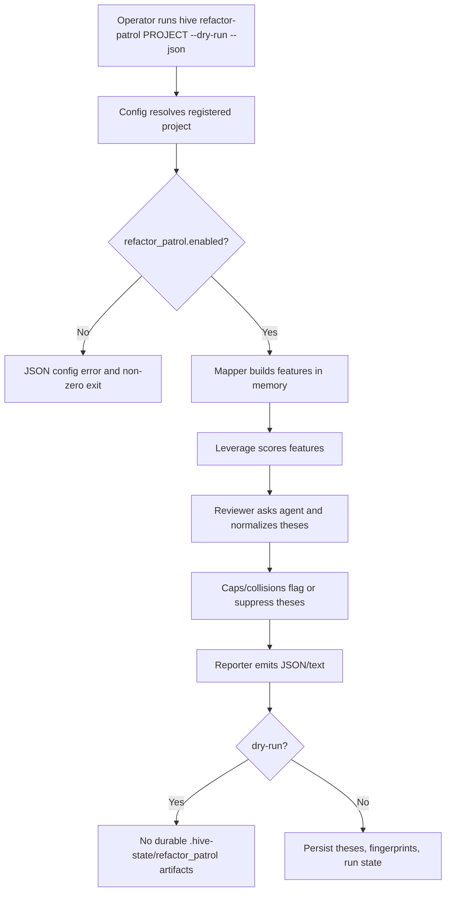
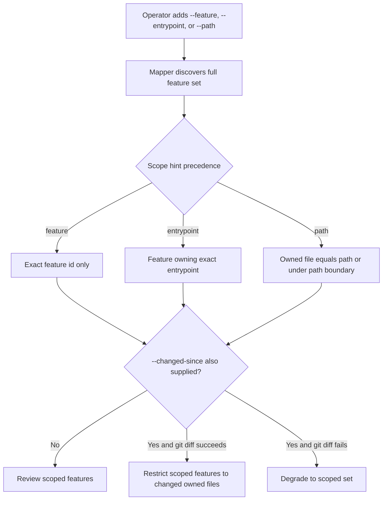
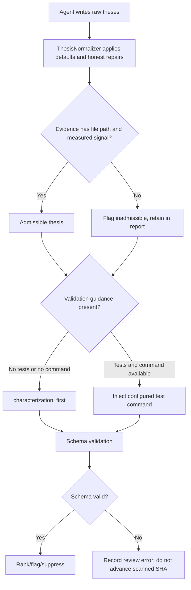

# Dogfood Report — add-a-refactor-patrol-architecture-260702-9048

> Diff-scoped CLI QA of `add-a-refactor-patrol-architecture-260702-9048` vs the trunk. Generated by `/ce-dogfood` on 2026-07-04.

## Diff Summary

- Adds `hive refactor-patrol PROJECT`, a reporting-only command that maps a registered project into feature slices, asks a configured agent for evidence-backed refactor theses, ranks them by measured leverage, flags guardrail risks, and emits text or `hive-refactor-patrol.v1` JSON.
- Adds refactor-patrol config, schemas, prompt template, durable state, fingerprints, collision suppression, leverage scoring, caps, reporter, reviewer orchestration, agent runner, and thesis normalization.
- Changes `Hive::Patrol::Mapper` so refactor-patrol dry runs can map features without writing durable patrol feature state.
- Adds command docs and wiki log entries for the new flow and follow-up review/dogfood fixes.
- This PR has no browser route. Dogfood was adapted to exercise the CLI and filesystem state directly; `agent-browser` was not installed and was not applicable to the changed surface.

## Personas

No STRATEGY.md, VISION.md, or persona docs were present in this repo. Personas inferred from the product and diff:

- **Hive maintainer/operator** — wants architecture drift surfaced as ranked, evidence-backed follow-up work without accidental worktree edits or surprise state writes during previews.
- **Automation reviewer** — wants machine-readable JSON, stable schemas, and clear flags/suppression semantics for follow-up pipelines.
- **Project contributor** — wants scoped patrol runs to be predictable, readable, and actionable before committing to a refactor.

## Flows Tested

## Test Matrix & Results

| # | Flow | Journey / Scenario | Status | Issue | Fix | Commit |
|---|------|--------------------|--------|-------|-----|--------|
| 1 | Dry-run JSON | Real CLI stack maps a temp project, runs a fake Codex-compatible agent through production `ReviewAgentRunner`, emits JSON with one ranked thesis, and creates no durable `.hive-state/refactor_patrol` state. | Pass | - | - | - |
| 2 | Persistent JSON | Non-dry run persists thesis JSON, fingerprints, and scan state; rerun suppresses the same fingerprint as `collision_already_seen`. | Pass | - | - | - |
| 3 | Scope hints | Feature exact match, entrypoint match, path boundary, and changed-since degradation behave as documented. | Pass | - | - | - |
| 4 | Evidence normalization | Dogfood-shaped `files`/`claim`/missing-value evidence is honestly repaired; empty/pathless evidence is retained as inadmissible. | Pass | - | - | - |
| 5 | Risk/caps reporting | Declared public API/cross-feature risks and heuristic caps are surfaced as flags and excluded from accepted count. | Pass | - | - | - |
| 6 | Error handling | Disabled project, internal command failure, and agent failure emit/record the expected error envelope or review error without advancing `last_scanned_sha`. | Pass | - | - | - |
| 7 | Full suite | Focused PR suites and RuboCop pass. Full `rake test` has one unrelated TUI footer failure outside this PR diff. | Blocked (human decision) | `test/unit/tui/bubble_model_test.rb:955` expects `tokens`, but the footer truncates at the exact boundary width. PR 656 does not touch TUI files. | Not fixed; outside PR scope. | - |
| 8 | Real Codex agent | Rerun the dry-run and persistent command paths with the actual Codex CLI (`CODEX_HOME=$HOME/.codex`) instead of the fake harness. | Pass | - | - | - |

## What Was Fixed

None. No PR-specific dogfood findings required code changes.

## Paper Cuts (by persona)

- **Hive maintainer/operator** — `bundle exec rake test` and `bundle exec rubocop` failed locally because mise had no active Ruby selected for the `bundle` shim. Severity: low; workaround used `mise exec ruby@$(cat .ruby-version) -- ...`.
- **Automation reviewer** — `agent-browser` was not installed, but the PR has no browser route. Severity: low; no effect on this CLI dogfood.

## Console Errors

Not applicable; no browser surface in this PR.

## Human Verifications

Not applicable; no OAuth/email/payment/SMS leg.

## Decisions for a Human

### Full-suite TUI footer failure
- **What's broken:** `HiveTuiBubbleModelTest#test_default_footer_fits_full_hint_at_exact_boundary_width` fails because the rendered footer truncates and omits `tokens`.
- **Why escalated:** The failing test is outside the refactor-patrol diff and should be handled separately from PR 656.
- **Options:** Fix the TUI footer width calculation in a separate PR; or update the test if the new truncation behavior is intentional.
- **Recommendation:** Track/fix separately. Do not block PR 656 on this unless branch policy requires a completely green local full suite independent of diff scope.

### Cap-blocked findings should file GitHub issues
- **What's broken:** Real Codex produced admissible refactor-patrol findings that failed caps and therefore did not count as accepted; those are still useful follow-up work.
- **Why escalated:** Creating external GitHub artifacts should be explicit/config-gated rather than silently added to the v1 reporting-only command.
- **Options:** Add an explicit `--file-issues` mode; or add config-gated issue filing for admissible cap-blocked theses.
- **Recommendation:** Track as follow-up issue [#667](https://github.com/ivankuznetsov/hive/issues/667).

## Learnings

- Real-stack dogfood should include the production agent runner path with a controlled fake agent. The existing focused tests cover many command seams, but the first harness attempt confirmed that agent failures are correctly recorded and keep `last_scanned_sha` from advancing.
- Real Codex dogfood needs the authenticated Codex home explicitly. In this OpenClaw session, `CODEX_HOME` pointed at the agent's isolated Codex home, which was not logged in; setting `CODEX_HOME=$HOME/.codex` let the spawned Codex CLI authenticate and produce theses.
- In this environment, prefer `mise exec ruby@$(cat .ruby-version) -- <command>` for repo-level Ruby checks when the plain `bundle` shim has no selected Ruby.

## Final Status

PR-specific dogfood passed. Verified with:

- Real CLI stack using a temporary registered project and fake Codex-compatible agent: dry-run non-persistence, persistent writes, ranking/flagging, and rerun suppression all behaved correctly.
- Real Codex CLI dogfood using `CODEX_HOME=$HOME/.codex`: dry-run produced ranked thesis `isolate-demo-command-adapter` with no durable state; persistent run produced and wrote thesis `align-demo-command-boundary`, fingerprint `ea27265c...`, and `last_scanned_sha`. Both real-Codex theses were admissible and correctly flagged by caps (`public_api_impact`, `cross_feature_impact`), so accepted count remained 0.
- `ruby -Itest -Ilib test/integration/refactor_patrol_command_test.rb`: 13 runs / 73 assertions / 0 failures.
- `ruby -Itest -Ilib test/unit/refactor_patrol/thesis_normalizer_test.rb test/unit/refactor_patrol/review_agent_runner_test.rb test/unit/refactor_patrol/reviewer_test.rb`: 11 runs / 38 assertions / 0 failures.
- `ruby -Itest -Ilib test/unit/refactor_patrol/caps_test.rb test/unit/refactor_patrol/collisions_test.rb test/unit/refactor_patrol/fingerprint_test.rb test/unit/refactor_patrol/leverage_test.rb`: 7 runs / 28 assertions / 0 failures.
- `ruby -Itest -Ilib test/unit/config_test.rb`: 254 runs / 1201 assertions / 0 failures.
- Targeted finding-verification tests: 23 runs / 92 assertions / 0 failures.
- `mise exec ruby@$(cat .ruby-version) -- rubocop`: 779 files inspected / no offenses.

Full `mise exec ruby@$(cat .ruby-version) -- rake test` ran 7311 tests / 75362 assertions with 1 unrelated failure in `test/unit/tui/bubble_model_test.rb:955` and 7 skips.
