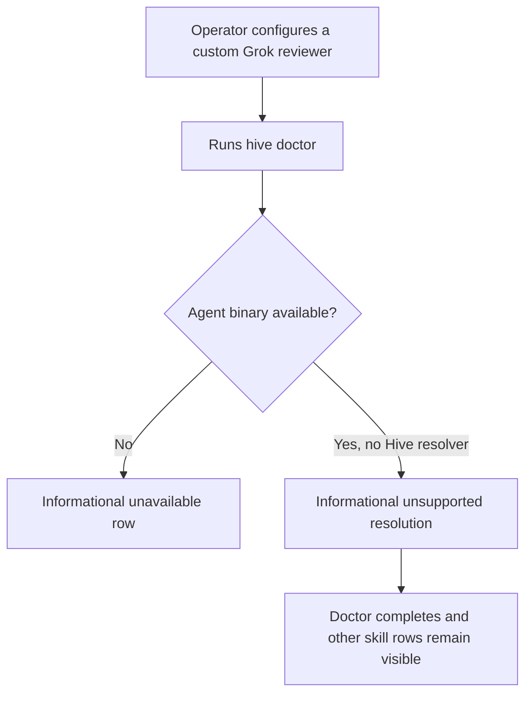
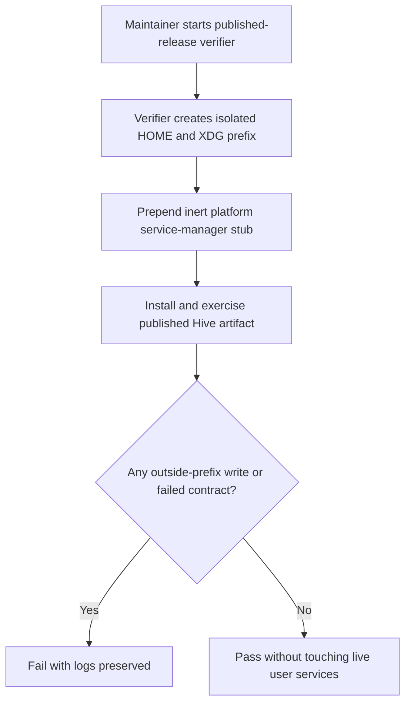
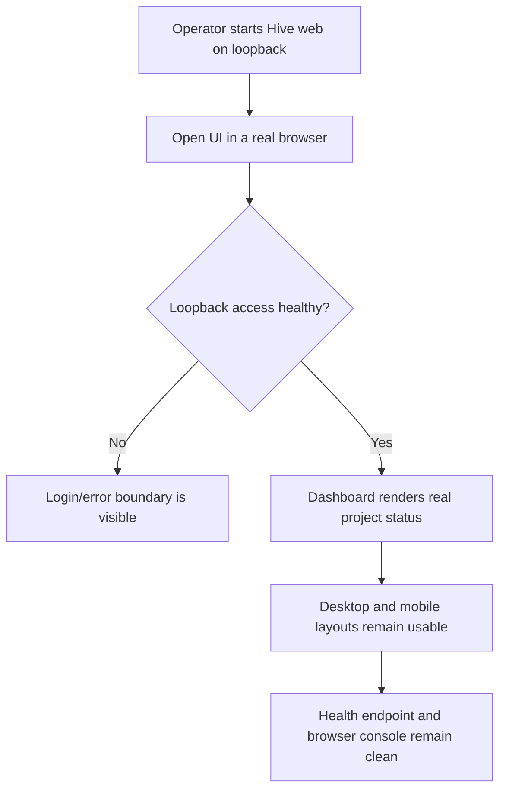

# Dogfood Report — fix/v050-dogfood

> Diff-scoped browser and CLI QA of `fix/v050-dogfood` vs `origin/main`. Generated by `/ce-dogfood` on 2026-07-18.

## Diff Summary

- Makes `hive doctor` report unmanaged reviewers on unsupported skill resolvers as informational instead of aborting the report.
- Isolates the local published-release verifier from the operator's live `systemctl --user` or `launchctl` manager.
- Adds regression coverage and operator/release documentation for the v0.5.0 dogfood findings.
- Declares the architecture-patrol schema validator as a runtime gem dependency and makes image publication wait for daemon-deep health.
- Changes no Rails routes or browser data flows; the bundled UI change is the small daemon-status truthfulness fix found during the live browser pass.

## Personas

No strategy or persona document exists in the repository, so these are inferred from the product and diff.

- **Hive operator** — needs diagnostics to remain usable with a mixed agent configuration and needs upgrades not to disrupt live automation.
- **Hive release maintainer** — needs a trustworthy end-to-end verifier that exercises lifecycle behavior without mutating the workstation being used to release.

## Flows Tested

## Test Matrix & Results

| # | Flow | Journey / Scenario | Status | Issue | Fix | Commit |
|---|------|--------------------|--------|-------|-----|--------|
| 1 | Doctor | Run the branch CLI against the operator's real mixed-agent config and confirm Grok is informational while the report succeeds. | Fixed | v0.5.0 aborted on the unsupported Grok resolver. | Treat unmanaged unsupported resolvers as informational evidence. | 9f314315 |
| 2 | Release verifier | Exercise published v0.5.0 through install, doctor, init, task, daemon install/force, uninstall, and leak checks. | Fixed | The original verifier reached the live user service manager; one concurrent run also conservatively detected an unrelated usage-DB writer. | Stub the manager before install and rerun after the external writer was quiet: 23/23 checks passed with no leaks. | 9f314315 |
| 3 | Web smoke | Start the published hivebox image and require stable daemon-backed deep health before browsing. | Fixed | Published image daemon crashed with `LoadError: json_schemer`; Rails alone stayed healthy, and arm64 could have been publicly tagged before native smoke. | Move `json_schemer` into runtime dependencies; bound every probe, require an eleven-probe stable window plus post-front-door check, and promote only exact amd64/arm64 digests after both pass. | bc2a982e |
| 4 | Web smoke | Render the live dashboard at desktop and 390x844 mobile widths. | Fixed | The daemon strip simultaneously said `running` and `daemon is down` in the supervised image. | Only show service-repair guidance when the daemon is not running; both layouts remained usable. | bc2a982e |
| 5 | Web smoke | Verify `/health`, `/health?deep=1`, container health, browser console, and page errors after the journey. | Passed | - | Both endpoints returned 200, Docker reported healthy with zero failures, and the browser reported no console or page errors. | - |
| 6 | Automated regression | Run the repository default test suite and RuboCop without an interactive TTY. | Passed | The first full run hit the real `/tmp` user quota after 9,310 tests; the affected attachment test passed on a home-backed temp root. | Final run: 9,311 tests, 131,590 assertions, 0 failures/errors, 7 skips; RuboCop: 1,029 files, 0 offenses. | - |

## What Was Fixed

### Live service-manager calls escaped the release verifier — `9f314315`

- **Symptom:** A verifier run with a sandboxed `HOME` disabled and stopped the operator's real Hive user service.
- **Root cause:** `systemctl --user` and `launchctl` contact the live per-user manager independently of where unit files are written.
- **Fix:** `packaging/verify-release.sh` puts inert per-prefix platform stubs first on `PATH` before the first installed Hive invocation and fails closed if resolution is shadowed.
- **Regression test:** `test/unit/packaging/verify_release_test.rb` pins the stub setup and ordering before `install.sh`.

### Custom Grok reviewer crashed `hive doctor` — `9f314315`

- **Symptom:** The published v0.5.0 doctor command exited with a configuration error instead of showing the rest of the diagnostic report.
- **Root cause:** Unmanaged reviewer inspection assumed every registered agent had a Hive-managed skill resolver.
- **Fix:** `lib/hive/agent_skills/inspector.rb` returns informational unsupported-resolution evidence for unmanaged custom skills.
- **Regression test:** `test/unit/agent_skills/inspector_test.rb` covers a registered Grok reviewer with no Hive resolver; the doctor suite pins unavailable-only exit behavior.

### Hivebox shipped a web-healthy but daemon-dead bundle — `bc2a982e`

- **Symptom:** The v0.5.0 image served Rails, but `/health?deep=1` returned 503 while the supervisor logged `LoadError: json_schemer`.
- **Root cause:** Architecture-patrol runtime code required the schema validator, but `json_schemer` remained in the root Gemfile's development/test group instead of the gemspec runtime dependencies.
- **Fix:** `hive.gemspec` owns the dependency; `packaging/docker/smoke.sh` bounds requests and blocks until deep health spans the supervisor's ten-second fast-failure window; the release workflow promotes the exact native digests only after both smokes pass.
- **Regression test:** `test/unit/gemspec_test.rb` pins the runtime dependency; `test/unit/packaging/verify_release_test.rb` executes a transient-success harness and pins digest-only promotion plus deep-health ordering around the front-door assertions.

### Supervised daemon rendered as both running and down — `bc2a982e`

- **Symptom:** The real dashboard showed `Daemon running` immediately followed by `daemon is down — run hive daemon install --force`.
- **Root cause:** The repair hint treated `service_installed: false` as an outage even when `running: true`; hivebox supervision deliberately does not install a separate platform service.
- **Fix:** The status partial now requires the daemon to be down before rendering service-repair guidance.
- **Regression test:** `web/test/integration/status_test.rb` covers a running supervisor without a platform service unit.

## Paper Cuts (by persona)

- **Hive release maintainer** — the leak detector can conservatively fail when a separate concurrent Hive process writes the real usage database during verification — low — deferred; rerun after the unrelated writer is quiet preserves the fail-closed safety boundary.
- **Hive contributor** — the default suite can exceed this workstation's user quota on the tmpfs `/tmp` — low — use a project-owned, home-backed `TMPDIR` for the full local gate.

## Console Errors

None. The desktop and mobile dashboard passes reported no browser console or page errors.

## Human Verifications

Not applicable; no OAuth, email, payment, or messaging delivery leg is changed by this branch.

## Decisions for a Human

None.

## Learnings

- Rewriting `HOME` isolates service files, not a live per-user service-manager IPC endpoint.
- Optional unmanaged agents must remain visible diagnostic evidence without becoming a global doctor failure.
- Ordinary patrol findings still require independent technical validation before implementation; the systemd ordering-cycle finding from this run was rejected and reverted after primary-source review.

## Final Status

Pass. All found v0.5.0 regressions are fixed locally with browser, packaging,
image, lint, and full-suite evidence; branch publication and CI remain the
shipping tail.
