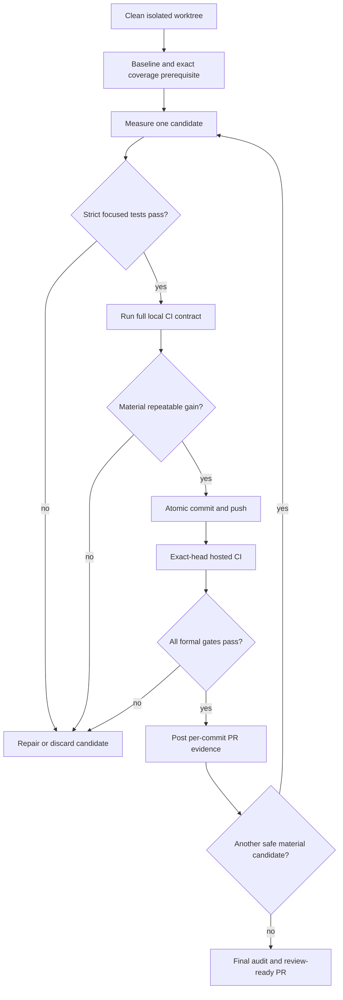

# Faster Strict CI Critical Path - Plan

## Goal Capsule

- **Objective:** Reduce pull-request CI wall-clock time materially while retaining every current formal gate and enforcing exact 100% line coverage.
- **Authority:** The user's strictness and iteration requirements override speed shortcuts; this plan defines the implementation and evidence contract; repository instructions govern wiki and test maintenance.
- **Execution profile:** Open a dedicated draft PR from an isolated worktree, land one correctness prerequisite followed by one independently measured optimization per commit, and wait for exact-head hosted CI before starting the next iteration.
- **Stop condition:** Stop only after the ranked candidate inventory is exhausted and no remaining safe candidate is expected to beat both the larger of 5%/30 seconds and the observed timing-noise floor without weaker isolation, weaker gates, or disproportionate complexity/cost. After the latest accepted win—or the baseline when none is retained—require two consecutive credible candidates to be rejected or remain inconclusive when at least two remain; when fewer remain, documented evaluation of every remaining credible candidate is sufficient.
- **Tail ownership:** Leave the PR open with all exact-head checks green and every iteration documented in PR comments. Merging, releasing, tagging, publishing, and deployment are outside this plan.

---

## Product Contract

### Summary

Make Hive's strict CI substantially faster by fixing the exact-coverage contract first, then removing proven test-harness waste and parallelizing independent proof layers. Preserve the full behavioral surface and make every retained speedup independently reviewable through its commit, local verification, hosted run, and PR comment.

### Problem Frame

The required `rake test (Ruby 3.4)` check is the current CI critical path. Six recent successful main runs put the job at a median of about 14 minutes; run `29938142652` spent 806.9 seconds executing 10,074 tests and 141,456 assertions while merging 1,205 process coverage results. The web job takes roughly four to five minutes, outer E2E roughly two and a half to three minutes, and the static/platform checks generally finish in under 45 seconds.

The suite is intentionally strict because code often lands without manual validation. Speed therefore must come from less setup work, fewer unnecessary subprocesses, and safe concurrency—not skipped tests, path filters, relaxed assertions, or lower coverage.

Current evidence also exposes a correctness defect that performance work must not preserve: `HiveTestCoverage` compares a two-decimal rounded percentage with `100.0`. Hosted run `29931570221` reported `100.00% (54789/54790)` and passed despite one uncovered executable line. Exact numerator equality must become the trustworthy baseline before optimization measurements begin.

### Actors

- A1. Contributors need quick, deterministic feedback from the same strict gates they trust today.
- A2. Maintainers need branch-protection contexts and PR evidence that remain stable across the refactor.
- A3. CI owns macOS, Windows, browser, packaging, E2E, security, style, and exact coverage proofs that cannot all be reproduced identically on one local Linux process.

### Requirements

**Strictness and compatibility**

- R1. Preserve every existing CI proof; no test, platform check, security scan, style gate, installer check, E2E scenario, incident budget, or artifact upload may be removed or conditionally skipped to improve time.
- R2. Enforce exact 100% line coverage as `line_covered == line_total` when the configured minimum is 100%, while retaining unloaded-file and result-error failures.
- R3. Preserve the exact protected contexts `rake test (Ruby 3.4)`, `rubocop (37signals omakase)`, `brakeman`, and `bundler-audit`.
- R4. Preserve shared-process contamination coverage until replacement invariants prove that any proposed process or job sharding cannot hide registry, cache, environment, signal-handler, filesystem, fixed-port, tmux, or operator-config leaks.

**Performance and evidence**

- R5. Establish a comparable local and hosted baseline before the first optimization and record suite duration, workflow critical-path duration, run/assertion/failure/skip counts, exact coverage numerator/denominator, and coverage process-result count.
- R6. Make each retained optimization one atomic commit; correctness prerequisites and documentation-only work may be separate commits but must not be presented as speedups.
- R7. After every optimization iteration, run the full locally available CI contract on the retained or restored tree and wait for hosted CI before beginning the next iteration. Push a retained candidate alone. For a candidate rejected before commit, restore the accepted head and rerun its hosted workflow without creating a meaningless candidate commit; for a pushed rejection, use the distinct revert flow in R10.
- R8. Post one PR comment per iteration containing the candidate and parent/restored identities; commit SHA or an explicit `not committed`; `head_sha`, `base_sha`, and `tested_checkout_sha`; hypothesis; exact commands; local and hosted before/after timings; test counts; exact coverage result; process-result count; CI link; delta; runner-image/cache/noise caveats; and keep/revert decision. Locally rejected candidates mark candidate-only SHA/timing fields not applicable but still record their local evidence and the restored-head hosted rerun.
- R9. Attribute every hosted sample with `head_sha`, `base_sha`, `tested_checkout_sha`, runner image, and cache state. Compare parent/candidate timing only on the same base and comparable runner/cache conditions; same-candidate reruns must use the full identity tuple. Use at least three paired or interleaved parent/candidate samples and medians when a claimed gain is close to observed noise or the stop threshold. Every process- or job-concurrency change requires repeated affected-suite stress runs plus three exact-head hosted runs with no unexplained variation in test, assertion, coverage, receipt, or artifact counts.
- R10. Retain an optimization only when its median saves at least the larger of 5% of the current critical path or 30 seconds, exceeds the observed noise floor, keeps the affected proof branch at or below twice the previous accepted head's total runner-seconds, and keeps artifact transfer plus aggregation below 10% of the resulting workflow critical path. Revert or leave uncommitted any candidate that fails strict verification or these bounds. Never rewrite a SHA after it has hosted evidence or a PR comment: a pushed rejection receives a distinct revert commit, another full local/hosted pass, and a rejection comment.

**Documentation and delivery**

- R11. Work in a dedicated branch/worktree and open a draft PR before the first optimization so baseline and per-iteration evidence have a durable home.
- R12. Update `wiki/testing.md` for changed commands/contracts, add one `wiki/log.d/<timestamp>-<slug>.md` fragment per behavior-changing iteration, and record unresolved uncertainty in `wiki/gaps.md`.
- R13. Finish with an open, reviewable PR whose exact head is green and whose final comment proves the ranked candidate inventory is exhausted, explains why every residual candidate is below the empirical threshold, unsafe, redundant, or disproportionately complex, and records either two consecutive credible rejected/inconclusive candidates after the latest accepted win (or baseline) or exhaustive evaluation of every remaining credible candidate when fewer than two remain.
- R14. Before the final audit, fetch `origin/main`. If it moved, merge it as a distinct non-optimization integration commit without rewriting published evidence, rerun the complete local and hosted contracts, post an integration-evidence comment, and refresh the critical-path baseline and stop audit when the merged base materially changes timing.

### Key Flows

- F1. **Correctness prerequisite:** Reproduce the rounded-near-100 false positive, tighten the comparison, run all local gates, push the isolated commit, wait for hosted CI, and comment with correctness evidence but no speed claim.
- F2. **Optimization iteration:** Capture the current baseline, implement one candidate, run focused and full local verification, retain only a material win, commit it alone, push it, wait for exact-head CI, and publish the comparison comment before selecting another candidate.
- F3. **Final audit:** Profile the latest green head, enumerate remaining candidates, reject those below the stop threshold or incompatible with strictness, update durable docs, post the audit comment, and make the PR ready for review.

### Acceptance Examples

- AE1. Given a report with 54,789 covered lines out of 54,790 executable lines and a 100% minimum, when the coverage gate evaluates it, then the gate fails even though the display rounds to `100.00%`.
- AE2. Given a report with every executable line covered, no unloaded source files, and no result errors, when the coverage gate evaluates it, then `rake test (Ruby 3.4)` passes under its existing protected context.
- AE3. Given an optimization commit that passes locally but fails any hosted macOS, Windows, browser, installer, E2E, security, style, or coverage proof, when the iteration is evaluated, then it is repaired or reverted before another optimization begins.
- AE4. Given an optimization whose measured improvement is within noise or below the stop threshold, when the iteration is assessed, then it is not retained as a speedup and the final audit records why.
- AE5. Given a retained optimization, when a reviewer reads the PR, then one comment maps that commit to local evidence, exact-head hosted evidence, before/after timing, strict coverage, and the keep decision.

### Success Metrics

- The final exact-head workflow critical path is materially lower than the six-run main baseline median of roughly 14 minutes.
- Every retained optimization independently meets the per-iteration materiality and cost rule. A prerequisite that enables a later speedup is retained only with a subsequently proven optimization and is reverted with that experiment when the material gain does not emerge.
- Exact line coverage remains 100% by numerator equality, all test counts remain explainably equivalent, and no existing formal gate disappears.
- The PR history and comments let a reviewer attribute each timing change to one commit without reconstructing the session transcript.

### Scope Boundaries

- No path-based CI skipping, draft-only weakening, test deletion, assertion relaxation, lower coverage threshold, mocked replacement for a real producer/consumer boundary, or removal of macOS/Windows/browser/E2E proof.
- No product-feature refactor unless a measured test-harness hotspot cannot be removed without a behavior-preserving extraction and that extraction is independently covered.
- No release metadata, release tag, package publication, deployment, or PR merge.

#### Deferred to Follow-Up Work

- Optimizations to workflows outside the PR `CI` and `Install smoke` feedback paths are deferred unless profiling proves they affect the requested pull-request critical path.
- Runner-cost policy changes are deferred; this plan may spend modestly more parallel runner time for a large wall-clock gain, but will reject unbounded fan-out.

---

## Planning Contract

### Key Technical Decisions

- KTD1. **Correctness before performance:** Land the exact-coverage comparison as a prerequisite commit so all later measurements are judged by the intended 100% contract.
- KTD2. **Target measured waste before process sharding:** Optimize repeated Git fixture setup and unnecessary coverage-injected Ruby children before splitting the root suite. Shared-process execution has previously caught workflow-registry contamination that naive sharding could hide.
- KTD3. **Parallelize already-independent proof layers:** Split E2E library/scenario commands and Rails integration/system/golden commands along existing process boundaries while retaining an aggregate check with the current human-facing name.
- KTD4. **Preserve protected identities:** Any coverage fan-out must terminate in the exact `rake test (Ruby 3.4)` check context, and the three protected static checks remain untouched.
- KTD5. **One commit, one measurement story:** Open the draft PR from the plan/baseline commit, then serialize optimization commits, hosted CI runs, and comments so later changes cannot contaminate an earlier result.
- KTD6. **Gate distributed coverage on contamination proof:** Root-suite process or job sharding uses coordinator/worker roles and is conditional on deterministic file allocation, exact merged coverage, missing/corrupt shard failure, portable result paths, and explicit cross-file global-state invariants. If those cannot be proven, retain shared-process execution.
- KTD7. **Use an empirical materiality stop rule:** Stop at the quality boundary rather than chasing noise: a retained candidate must beat the observed noise floor and save at least the larger of 5% of the current critical path or 30 seconds, while staying inside the runner-cost ceiling.

### Assumptions

- Faster review feedback may use up to twice the previous accepted head's total runner-seconds for the affected proof branch when it produces a material workflow-latency win. Artifact transfer plus aggregation must remain under 10% of the resulting workflow critical path; fan-out outside either ceiling is rejected.
- GitHub-hosted variance makes medians necessary for marginal candidates; a large non-concurrency gain may be retained after one comparable local and hosted parent/candidate pair when the delta is far outside recent variance, followed by confirmation on the next exact-head run. Concurrency changes always use R9's three-run rule.
- Timed local coverage samples run without concurrent web/E2E suites or unrelated heavy CPU, disk, or temporary-directory work; later full-gate validation is required but its contended duration is not benchmark evidence.
- `bundle exec rake coverage` remains the canonical local entry point even if its internals change; contributors should not need to learn a weaker or CI-only command.
- Existing E2E duration budgets and artifact retention remain authoritative after job splitting.

### High-Level Technical Design

The root suite remains one logical exact-coverage gate. Targeted harness work reduces its intrinsic cost first. Only if it still owns the critical path may execution fan out, with complete file allocation and coverage resultsets converging into one exact aggregate decision.

### Sequencing

1. Establish the draft PR, baseline, and exact coverage prerequisite.
2. Remove repeated Git repository bootstrap work and measured unnecessary Ruby-child coverage startup.
3. Consider root-suite sharding only after the safer intrinsic-cost work and begin with two workers before increasing fan-out.
4. Parallelize the already-independent web and E2E process boundaries only when each becomes material on the new critical path, then run the final no-more-worthwhile-work audit.

### Sources and Research

- `.github/workflows/ci.yml` defines the eight-job CI fan-out and the sequential root, E2E, and web proof layers.
- `Rakefile`, `test/hive_coverage_boot.rb`, and `test/support/coverage.rb` define the canonical coverage entry point and subprocess result merge contract.
- `test/test_helper.rb` initializes a real Git repository for hundreds of fixtures and owns the global ENV/worktree isolation seams.
- `web/test/test_helper.rb` documents why Rails currently uses one worker and a process-global `HIVE_HOME`.
- `wiki/testing.md`, `wiki/log.d/20260616T220338Z-clipboard-capture-coverage-fixture.md`, `wiki/log.d/20260716T173132Z-incident-e2e-regressions.md`, and `wiki/log.d/20260716T175615Z-e2e-ci-hermetic-runtime.md` preserve the strict coverage, executable-fixture, and E2E budget precedents.
- `docs/solutions/architecture-patterns/daemon-plan-approval-policy-exception-2026-05-15.md` warns against fast producer/consumer tests whose mocks can drift apart.

### System-Wide Impact

- **Ownership boundaries:** `HiveTestCoverage` validates and merges coverage data; the shard helper owns deterministic allocation/manifests/receipts; `Rakefile` owns local worker lifecycle; GitHub Actions owns cross-job transport and dependency verdicts. GitHub-specific behavior must not leak into the reusable coverage library.
- **Transactional isolation:** Every coverage invocation gets a unique workspace. Cleanup is limited to that workspace, final-report publication is atomic, stale-run cleanup is separately bounded, and no worker may delete sibling/shared state.
- **Artifact identity:** Distributed receipts/results bind workflow run and attempt, PR `head_sha`, `base_sha`, actual `tested_checkout_sha`, Ruby/runtime version, coverage schema, shard ID/count, manifest digest, and seed. The coordinator rejects mixed identities rather than flattening artifacts whose PID/object names can collide.
- **Fail-closed aggregation:** Each shard is validated before global merge for assignment, exit status, test/assertion totals, result count, normalized source identity, and artifact completeness. Aggregate jobs run even after dependency failure and succeed only when every required child and artifact validates; cancellation remains distinguishable from success.
- **Check topology:** Exactly one job per workflow run may emit each retained aggregate name, especially `rake test (Ruby 3.4)`. Workflow contract tests reject duplicate protected/human-facing contexts, not merely missing ones.
- **Contamination contract:** The shared-process lane is a required upstream proof with no `continue-on-error`. A checked-in ownership manifest inventories tests and helpers that mutate registries, caches, environment, signal handlers, filesystem state, fixed ports, tmux state, or operator configuration; every listed surface carries reset/invariant coverage, and unowned additions fail a contract check so future contributors cannot silently weaken the topology.
- **Local/hosted boundary:** Local coverage proves semantic parity for allocation, receipts, merging, and exact coverage. Only hosted exact-head CI proves artifact routing, dependency conclusions, queueing, macOS/Windows behavior, and protected-context identity.
- **Cache boundary:** Root and web caches are optional accelerators keyed by lockfile, OS/architecture, and Ruby version. Cache miss/restore failure falls back to full setup and can never skip a proof.

### Risks and Mitigations

| Risk | Mitigation / rejection signal |
|---|---|
| Hosted timing variance creates a false win | Separate queue, execution, artifact-transfer, aggregate-barrier, and workflow-created-to-decision time; compare with the previous accepted SHA; rerun the same SHA and use medians when the delta approaches the observed noise floor. |
| Parallel workers contend for CPU, disk, Git, tmp space, ports, or tmux | Pilot one then two workers before higher fan-out; record runner-seconds, result count/bytes, transfer/merge time, and timeouts; reject scaling when marginal wall-clock gain disappears or flakiness rises. |
| Sharding hides shared-process state leakage | Keep the mandatory extensible contamination lane and exact-seed replay data; reject U4/U8 if known registry/environment/signal invariants cannot remain fail-closed. |
| Splitting web/E2E duplicates setup and cache-miss work | Measure cold and warm end-to-end branch completion plus total runner usage, not only test-step sums; split only after that branch enters the critical-path/noise window. |
| Coverage artifacts from different runs/runtimes mix or disappear | Validate identity-bearing manifests and receipts before merge; require diagnostics upload after worker failure but treat missing/foreign/zero-result artifacts as aggregate failure. |
| A dependency aggregator is skipped or hides a failed child | Use always-running fail-closed verdict logic, require every declared conclusion/artifact, and contract-test failed/skipped/cancelled combinations. |
| Workflow concurrency cancels evidence for the previous SHA | Never push the next iteration until the current exact head is terminal and its PR comment is posted. Never rewrite a SHA with hosted evidence. |
| Runner cost grows faster than latency improves | Enforce the 2x affected-branch runner-seconds ceiling and 10% artifact/aggregation critical-path ceiling; revert even a locally faster topology when either fails. |
| A retained change later flakes or regresses | Revert that atomic commit, rerun the complete local and hosted contract, verify each protected context is emitted exactly once, and remove abandoned shard/cache artifacts. |

### Rollback Boundaries

- U2/U3 revert independently to the original fixture/subprocess behavior without touching coverage strictness.
- U4 restores the serial local coverage task without undoing intrinsic-cost improvements.
- U8 restores the single hosted coverage job while retaining the local coordinator contract.
- U5 recombines web jobs; U6 recombines E2E jobs while preserving all commands, budgets, and artifacts.
- Every pushed rollback is a new commit with its own local/hosted proof and PR comment; history with published evidence is never rewritten.

---

## Implementation Units

### U1. Enforce exact full coverage and establish the evidence baseline

- **Goal:** Make the 100% gate exact, create the isolated draft PR, and publish the comparison protocol before performance changes begin.
- **Requirements:** R2, R3, R5-R8, R11-R12; F1; AE1-AE2.
- **Dependencies:** None.
- **Files:** `test/support/coverage.rb`, `test/unit/coverage_test.rb`, `wiki/testing.md`, `wiki/log.d/<timestamp>-exact-coverage-gate.md`, `docs/plans/2026-07-22-001-perf-ci-critical-path-plan.md`.
- **Approach:** Compare exact covered and total counts when the configured minimum is 100%, retain percentage behavior for lower configurable thresholds, and make failure output show the honest numerator/denominator. Capture the local baseline before the code change and the hosted six-run baseline in the initial PR comment.
- **Execution note:** Start with the near-100 regression from hosted run `29931570221`; prove it fails before changing the comparison.
- **Patterns to follow:** Keep result-error and unloaded-file handling in `HiveTestCoverage`; mirror existing focused coverage-harness tests.
- **Test scenarios:**
  1. Covers AE1. A near-100 report that rounds to `100.00%` fails an exact 100% threshold.
  2. Covers AE2. Exact numerator equality with no unloaded files or result errors passes.
  3. A lower configured threshold continues to use numeric percentage comparison.
  4. Unloaded files and unreadable subprocess results still fail even with exact numerator equality.
- **Verification:** The focused coverage harness tests and the full local CI contract pass; the first exact-head hosted run keeps all protected contexts and demonstrates exact `line_covered == line_total`. The PR comment labels this as correctness, not an optimization.

### U2. Reuse a canonical Git fixture without sharing mutable repository state

- **Goal:** Remove hundreds of repeated Git bootstrap subprocesses while preserving the exact temporary-repository contract.
- **Requirements:** R1, R4-R10, R12; F2; AE3-AE5; KTD2.
- **Dependencies:** U1.
- **Files:** `test/test_helper.rb`, `test/unit/test_helper_test.rb`, `wiki/testing.md`, `wiki/log.d/<timestamp>-cached-git-test-fixture.md`.
- **Approach:** Build one canonical initialized repository per suite and copy it into each fresh temporary directory. Preserve branch name, identity config, disabled commit signing, README content, initial commit, no remote, independent `.git` storage, and race-tolerant cleanup.
- **Execution note:** Characterize `with_tmp_git_repo` before replacement and compare full-suite medians; do not trade real Git behavior for a mock.
- **Patterns to follow:** Use the existing `with_tmp_dir` cleanup boundary and retain real producer behavior per the daemon-plan approval learning.
- **Test scenarios:**
  1. A copied fixture starts on `master`, has the expected author config and initial README commit, and has no remote.
  2. Mutating files, refs, config, index, or objects in one fixture does not affect another fixture or the canonical source.
  3. Cleanup tolerates Git maintenance races exactly as `with_tmp_dir` does today.
  4. Exact-seed grouped tests that heavily use the helper pass in shared-process mode.
- **Verification:** Focused helper tests, representative integration groups with fixed seeds, and the full local CI contract pass. The hosted comment reports root-suite and workflow deltas against U1 plus unchanged counts and exact coverage.

### U3. Remove unnecessary coverage startup from generic Ruby child fixtures

- **Goal:** Reduce the 1,205-process coverage merge/startup burden only where a child exists to exercise generic process behavior rather than Ruby/Hive coverage propagation.
- **Requirements:** R1-R2, R4-R10, R12; F2; AE3-AE5; KTD2.
- **Dependencies:** U2 evaluated; U2 need not be retained.
- **Files:** `test/fixtures/`, measured files under `test/unit/` and `test/integration/`, `test/hive_coverage_boot.rb`, `test/support/coverage.rb`, `wiki/testing.md`, `wiki/log.d/<timestamp>-subprocess-coverage-fixtures.md`.
- **Approach:** Use tiny executable fixtures for measured timeout, capture, exit-status, and signal cases that do not need an instrumented Ruby child. Retain coverage propagation in real CLI/process-boundary tests and reject any change that lowers exact source coverage.
- **Execution note:** Change only profiler-confirmed Ruby-child hotspots, one coherent fixture conversion in this commit; leave unmeasured cleanup for the final audit.
- **Patterns to follow:** Mirror `test/unit/tui/clipboard_test.rb` and its executable-fixture precedent; keep `RUBYOPT` propagation for tests that prove it.
- **Test scenarios:**
  1. Each converted fixture preserves stdout, stderr, exit status, timeout, process-group, and cleanup behavior exercised by its original test.
  2. A dedicated coverage propagation test still produces more than the parent result and contributes child-only lines.
  3. The merged report remains exact 100%, with no missing or corrupt subprocess result accepted.
  4. Process-result count falls for the intended reason and test run/assertion counts remain equivalent.
- **Verification:** Focused converted tests, coverage harness tests, and the full local CI contract pass. Retain only a material median gain and document process-result reduction in the PR comment.

### U4. Add safe local root-suite workers only if the measured critical path still warrants them

- **Goal:** Reduce the remaining root coverage critical path through deterministic local worker processes without losing shared-state defect detection or exact merged coverage.
- **Requirements:** R1-R10, R12; F2; AE1-AE5; KTD4, KTD6-KTD7.
- **Dependencies:** U2 and U3 evaluated; neither need be retained, and the root suite must remain the material critical path.
- **Files:** `Rakefile`, `test/hive_coverage_boot.rb`, `test/support/coverage.rb`, `test/support/coverage_shard.rb`, `test/unit/coverage_test.rb`, `test/unit/coverage_shard_test.rb`, `wiki/testing.md`, `wiki/gaps.md`, `wiki/log.d/<timestamp>-local-coverage-workers.md`.
- **Approach:** Introduce coordinator and worker roles inside the canonical `bundle exec rake coverage` invocation. The coordinator creates and alone cleans its per-invocation workspace, writes the complete shard/file/seed manifest, launches workers, validates every receipt, and alone merges and enforces coverage. Workers run their exactly-once test-file assignment and emit raw uniquely named results without deleting shared state or writing the final report. Receipts include shard ID, manifest digest, seed, exit status, test/assertion totals, process-result count, and expected result paths. Normalize source identities to validated repository-relative paths before merge. Before sharding, inventory every current test/helper that mutates an R4 process-global surface into the checked-in contamination ownership manifest and run it unsharded with a recorded exact-seed order. Reject U4 if any current mutation cannot be owned by that lane without retaining the full serial suite.
- **Execution note:** Characterize one-worker equivalence, then pilot exactly two workers as this unit's single topology. A later worker-count change is a separate optimization commit and evidence cycle. Abandon this unit if equivalence cannot be proven, contention increases flakiness/timeouts, or worker startup merely shifts cost without a material critical-path win.
- **Patterns to follow:** Reuse transactional result merging and fail-loud error markers in `HiveTestCoverage`; preserve the direct exact-seed loader fallback documented in the wiki.
- **Test scenarios:**
  1. Every discovered root test file belongs to exactly one shard for worker counts including one, two, typical CI fan-out, and more workers than files.
  2. Workers never clean the coordinator result root or race to write `coverage/coverage.json`; only the coordinator produces the aggregate report.
  3. A missing, duplicate, failed, mismatched-manifest, or corrupt worker makes the coordinator fail before publishing a final report.
  4. Absolute paths outside the invocation checkout are rejected or safely rebased to validated repo-relative identities before merge.
  5. Exact merged coverage passes only when covered and total lines are equal and no unloaded files/result errors exist.
  6. The checked-in contamination manifest covers registries, caches, environment, signal handlers, filesystem state, fixed ports, tmux state, and operator configuration; its shared-process/exact-seed contracts fail when reset behavior is deliberately broken or a process-global helper lacks ownership.
  7. Local `bundle exec rake coverage` remains canonical, deterministic, and strict with a safe worker default/fallback.
- **Verification:** Focused sharding/coverage tests, repeated exact-seed contamination/stress runs, multiple isolated local coverage samples, and the full local CI contract pass. Three exact-head hosted runs show stable counts and receipts. The PR comment reports worker count, per-worker times, aggregate critical path, total worker-seconds, exact coverage, receipt completeness, and variance; retain only if KTD7 is satisfied.

### U8. Fan root coverage across GitHub jobs only if local workers remain critical

- **Goal:** Reduce hosted root-coverage latency beyond U4 by transporting its proven coordinator/worker protocol across independent GitHub jobs while retaining one exact protected verdict.
- **Requirements:** R1-R10, R12; F2; AE1-AE5; KTD4, KTD6-KTD7.
- **Dependencies:** U4 retained, the root suite still materially owns the hosted critical path, and projected fan-out stays inside both cost ceilings.
- **Files:** `.github/workflows/ci.yml`, `test/support/coverage_shard.rb`, `test/unit/coverage_shard_test.rb`, `test/unit/ci_workflow_test.rb`, `wiki/testing.md`, `wiki/gaps.md`, `wiki/log.d/<timestamp>-distributed-coverage-ci.md`.
- **Approach:** Reuse U4's manifest, receipt, and merge semantics with GitHub artifacts as transport. Start with exactly two worker jobs. Bind every artifact to workflow run and attempt, PR `head_sha`, `base_sha`, actual `tested_checkout_sha`, Ruby/runtime version, coverage schema, shard ID/count, manifest digest, and seed; preserve hidden files; reject foreign, stale, duplicate, zero-result, missing, and corrupt artifacts. Worker jobs use distinct non-protected names. One aggregate job runs under `if: always()`, validates every declared dependency conclusion and artifact, publishes the exact report, and is the only job named `rake test (Ruby 3.4)`.
- **Execution note:** Do not combine cross-job transport and higher fan-out in one commit. If two jobs are retained, a later two-to-four change is a new optimization iteration with its own cost, transfer, barrier, local, hosted, and comment evidence. Restore the single hosted coverage job if artifact transfer, queue skew, or runner cost defeats the materiality rule.
- **Patterns to follow:** Keep GitHub expressions and artifact routing in the workflow, coverage validation in Ruby, and workflow topology assertions in `ci_workflow_test.rb`; do not add GitHub-specific branches to `HiveTestCoverage`.
- **Test scenarios:**
  1. Workflow contract coverage proves every worker is required, has a unique non-protected name, and exactly one aggregate emits `rake test (Ruby 3.4)`.
  2. The aggregate executes and fails for failed, skipped, or cancelled dependencies and for missing, duplicate, stale, foreign, empty, or corrupt artifacts.
  3. Run/attempt/head/base/tested-checkout/runtime/schema/shard/count/manifest/seed mismatches are diagnosed and rejected before merge.
  4. Hidden result files survive artifact upload/download and repo-relative source identities merge to exact complete coverage.
  5. The original serial job is absent, every root test file is assigned exactly once, and shared-process contamination coverage remains mandatory upstream.
- **Verification:** Workflow contract, coverage shard, repeated exact-seed contamination/stress runs, and full local CI tests pass; three exact-head hosted runs prove real routing, stable counts, and fail-closed aggregation. The PR comment separates queue time, worker execution, transfer, aggregate barrier, workflow-created-to-decision time, total runner-seconds, artifact bytes, exact coverage, and keep/revert rationale.

### U5. Parallelize Rails integration, system, and golden-path proofs when web becomes critical

- **Goal:** Reduce the web branch from a four-minute serial chain to the slowest independent Rails proof without changing the single-worker semantics inside each process.
- **Requirements:** R1, R4, R6-R10, R12; F2; AE3-AE5; KTD3, KTD5.
- **Dependencies:** U4 and optional U8 evaluated; neither need be retained, and the web branch must now be material on the workflow critical path.
- **Files:** `.github/workflows/ci.yml`, `test/unit/ci_workflow_test.rb`, `web/test/test_helper.rb`, `wiki/testing.md`, `wiki/log.d/<timestamp>-parallel-web-ci.md`.
- **Approach:** Split Rails integration/style, Playwright system, and golden-path E2E into separate jobs. Install Playwright only in browser jobs, keep `parallelize(workers: 1)` within each process, and give the golden path a correctly cached root bundle. Preserve an aggregate `Hive web (Rails tests + system)` decision.
- **Execution note:** Do not enable Rails in-process parallel workers; the process-global `HIVE_HOME` and cached Hive paths remain intentionally isolated by job/process boundaries.
- **Patterns to follow:** Preserve the existing golden-path bundle preflight and browser installation contract.
- **Test scenarios:**
  1. Workflow contract coverage proves integration, system, golden, and web RuboCop commands all run for the original event set.
  2. Only browser-bearing jobs install Playwright; golden E2E receives a valid root bundle and still spawns the real daemon.
  3. Failure of any web proof fails the aggregate web decision.
  4. Integration, system, golden, and style counts/results remain equivalent to the serial job.
- **Verification:** All web commands, repeated affected-suite stress runs, and the full local CI contract pass. Three exact-head hosted runs demonstrate stable counts, concurrent jobs, and a material web-path reduction; the PR comment records each job duration, setup tradeoff, and total path delta.

### U6. Parallelize the independent E2E library and scenario proofs when E2E becomes critical

- **Goal:** Reduce the E2E branch from sequential library-plus-scenario duration to the slower of the two independent proofs.
- **Requirements:** R1, R3, R6-R10, R12; F2; AE3-AE5; KTD3-KTD5.
- **Dependencies:** The latest retained optimization state; U5 need not be retained, and E2E must be material on the then-current critical path.
- **Files:** `.github/workflows/ci.yml`, `test/unit/ci_workflow_test.rb`, `wiki/testing.md`, `wiki/e2e.md`, `wiki/log.d/<timestamp>-parallel-e2e-ci.md`.
- **Approach:** Run `e2e:lib_test` and real scenarios as separate jobs with unique artifact roots. Retain tmux setup, complete scenario metadata, combined incident duration enforcement, and hidden failure-evidence upload with the scenario owner. Use an aggregate `real CLI scenario harness` decision with fail-closed always semantics so a failed sibling cannot skip or falsely pass the decision.
- **Execution note:** This is a workflow-structure change; run both underlying commands locally before pushing and use hosted CI as the authoritative concurrency proof. Skip this unit whenever E2E remains below the stop threshold on the latest retained state.
- **Patterns to follow:** Preserve current incident budgets, hidden-file artifact upload, retention, and failure evidence.
- **Test scenarios:**
  1. Workflow contract coverage proves both suites run on every push/PR where the original E2E job ran.
  2. The scenario branch still installs tmux, enforces all incident budgets after every scenario, and uploads complete evidence on failure.
  3. Failure of either branch makes the aggregate E2E decision run and fail; neither branch can be skipped or obscured by a successful sibling.
  4. Existing E2E library and scenario suites retain their current run/assertion and incident sets.
- **Verification:** Both local E2E commands, repeated affected-suite stress runs, and the full local CI contract pass. Three exact-head hosted runs demonstrate stable counts, parallel start times, and a material E2E-path reduction; the PR comment includes both job durations, artifact/budget completeness, and the aggregate outcome.

### U7. Audit the final critical path and close the optimization loop

- **Goal:** Demonstrate that no remaining safe, material CI optimization is being left behind and leave a clean review-ready PR.
- **Requirements:** R5-R14; F3; AE3-AE5; KTD7.
- **Dependencies:** U1 completed and every ranked candidate unit evaluated; U2-U6 and U8 may each be retained, rejected, or skipped with evidence.
- **Files:** `wiki/testing.md`, `wiki/gaps.md`, `wiki/log.d/<timestamp>-ci-optimization-final-audit.md` when the audit changes durable documentation.
- **Approach:** Fetch `origin/main` first. If the base moved, merge it in a distinct integration commit, rerun and comment on the complete proof, and refresh timing evidence when material before profiling every current critical-path component on the latest tested head/base/checkout tuple. Compare with the original and per-iteration baselines, inspect remaining setup/serialization/cache candidates, and classify each as below threshold, unsafe, redundant, deferred, or disproportionately complex. After the latest accepted win—or baseline when none is retained—require two consecutive credible rejections/inconclusive results when at least two candidates remain; otherwise exhaustively evaluate every remaining credible candidate. Remove experimental residue and ensure PR narrative/comments match the final commit history.
- **Execution note:** This unit produces no optimization commit unless it discovers and executes another qualifying independent candidate through F2; base-sync and documentation-only corrections are distinct, clearly labeled non-optimization commits.
- **Patterns to follow:** Use exact-head hosted evidence and a quiet settle window before the final readiness verdict.
- **Test scenarios:**
  - **Test expectation: none —** the final audit changes no runtime behavior; any discovered code change becomes a new independently tested optimization iteration.
- **Verification:** The final full local CI contract and exact-head hosted CI are green, all PR comments exist, the working tree is clean, wiki fragments are present, abandoned attempts are absent, and the final PR comment records the stop rationale.

---

## Verification Contract

| Gate | Applicability | Command or evidence | Passing signal |
|---|---|---|---|
| Focused Ruby tests | Each unit | `bundle exec ruby -Itest -Ilib <affected-test-files> --seed=<recorded-seed>` | Relevant contracts pass with the seed recorded in the PR comment. |
| Exact root coverage | Every correctness/optimization iteration | `/usr/bin/time -p bundle exec rake coverage` | All tests pass; `line_covered == line_total`; no unloaded files or result errors; duration and process-result count captured. |
| Root style/security | Every iteration | `bundle exec rubocop --parallel --format github`; `bundle exec brakeman --force --no-pager --quiet --ignore-config config/brakeman.ignore`; `bundle exec bundler-audit check --update` | All three protected-equivalent gates pass. |
| Outer E2E | Every iteration | `bundle exec rake e2e:lib_test`; `HIVE_E2E_RUNS_DIR=<fresh-temp-dir> bundle exec rake e2e`; `bundle exec ruby test/e2e/check_incident_budget.rb <fresh-temp-dir>` | Library tests and scenarios pass, budgets pass, and evidence exists. |
| Rails web | Every iteration | From `web/`: `bin/rails test`; `bin/rails test:system`; `bin/rails test test/e2e/golden_path_e2e.rb` with the same root-bundle contract as CI; `bin/rubocop --format github` | Integration, browser, golden-path, and style proofs pass. |
| Installer/platform fixtures | Every iteration where locally available | Linux installer/shell fixtures plus `pwsh packaging/docker/test-install-box.ps1` when PowerShell is available | Local fixtures pass; unavailable real macOS/Windows mechanics remain mandatory hosted evidence. |
| Workflow contract | U5, U6, U8 | `bundle exec ruby -Itest -Ilib test/unit/ci_workflow_test.rb` | Every original proof has one fail-closed owner, every aggregate validates all dependencies, and each protected name is emitted exactly once. |
| Hosted CI | Every iteration | Exact-head GitHub Actions run for a pushed candidate/revert, or a rerun of the restored accepted head for an uncommitted rejection | All CI and Install smoke checks decide green before the next iteration begins; evidence records head, base, and tested checkout identities. |
| Performance evidence | Every retained optimization | Comparable before/after local and hosted samples, with medians for marginal changes | Queue and execution are separated; gain clears the empirical materiality rule; cost ceilings hold; evidence is documented in one commit-specific PR comment. |

---

## Definition of Done

- The rounded-near-100 regression fails and exact complete coverage passes.
- Every existing formal proof remains present, and all four protected check contexts retain their exact names.
- Every retained optimization is one atomic commit with full local verification, exact-head hosted CI, and one evidence-rich PR comment before the next optimization begins.
- Exact line coverage is 100% by numerator equality on the final head, with no unloaded files or result errors.
- The final workflow critical path is materially below the roughly 14-minute baseline, or every attempted safe candidate has been honestly rejected with evidence.
- `wiki/testing.md`, relevant supporting wiki pages, `wiki/gaps.md`, and `wiki/log.d/` describe the final test/CI contracts and remaining uncertainty.
- The final PR comment lists remaining candidates and the stop reason for each; after a final `origin/main` fetch/base sync when needed, the PR is open and review-ready with the current head/base/tested-checkout tuple green.
- No abandoned benchmark harness, temporary workflow, stale artifact, dead code, or unrelated workspace change remains in the diff.
- No PR merge, release, tag, publication, deployment, or version change has been performed.
