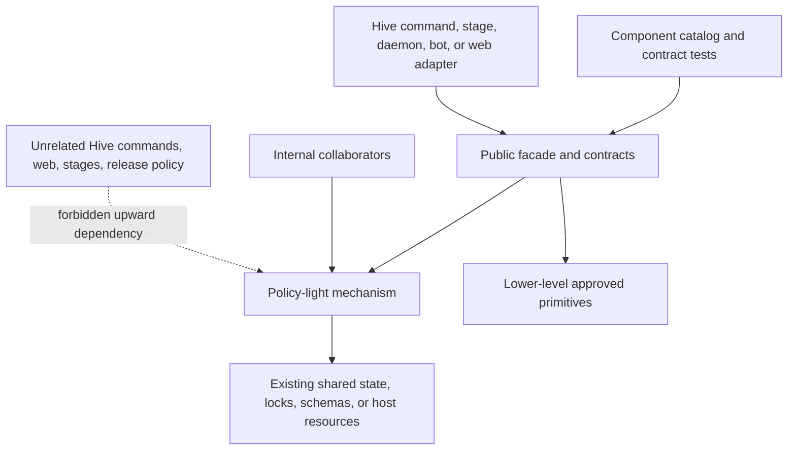

# Internal Component Boundaries - Plan

## Goal Capsule

- **Objective:** Turn Hive's strongest reusable mechanisms into explicit, enforced in-monorepo component boundaries while keeping Hive as their first and primary consumer.
- **Authority:** The monorepo and boundary-first decisions in this plan are settled; repository instructions govern wiki maintenance, focused test loops, and final verification.
- **Execution profile:** Land one component boundary per pull request, beginning with the boundary catalog and UserService; characterize behavior before moving it, migrate Hive consumers before declaring a boundary complete, and wait for exact-head CI before starting the next component.
- **Stop condition:** Stop when every retained candidate has either passed the internal-boundary contract or has a documented reason to remain coupled; a clean directory alone is not success.
- **Tail ownership:** Leave each component PR review-ready with focused tests, the broad local checkpoint, hosted CI, and current wiki documentation. Merging, creating package directories, choosing gem names or versions, tagging, publishing, releasing, and splitting repositories are outside this plan.

---

## Product Contract

### Summary

Keep Hive as one agent-friendly Ruby monorepo while making its reusable mechanisms behave like well-owned components.
Each component gets one supported entry point, an explicit public contract, an allowed dependency direction, documented state and schema ownership, and Hive consumers that use the boundary rather than internal collaborators.
The work starts from the already-landed `Hive::Attempts::API` precedent and applies the pattern incrementally, with UserService as the next low-coupling boundary.

### Problem Frame

Hive already contains credible standalone mechanisms, but most are reusable by inspection rather than by contract.
Moving them directly into gems would freeze accidental Hive coupling, multiply release work, and make the repository less useful to agents.
Leaving the seams implicit has the opposite failure mode: commands, stages, web code, and daemon code can construct internal collaborators directly, so future extraction remains expensive and local refactors can silently widen the dependency graph.

The plan therefore separates three rankings:

1. **Standalone product value:** RunReceipt, UserService, Agent Artifact Firewall, Agent ABI, Skillpack, Safe Agent Git Gate, WorkLedger.
2. **Internal implementation readiness:** Attempts precedent, UserService, Agent ABI, Agent Artifact Firewall, Skillpack, Safe Agent Git Gate, WorkLedger.
3. **Publication eligibility:** deliberately unset until a future non-Hive consumer and the gates in `docs/plans/2026-07-25-002-feat-standalone-component-gems-plan.md` exist.

RunReceipt remains the strongest standalone product opportunity, but that does not justify genericizing the full Attempts subsystem now.
UserService is the safest next internal extraction, but that does not preselect it as the first published gem.

### Actors

- A1. Hive maintainers need refactors that preserve behavior and do not create a multi-repository coordination burden.
- A2. Coding agents need one canonical place to discover component entry points, ownership, dependencies, state, schemas, and tests.
- A3. Hive CLI, daemon, bot, web, setup, patrol, and stage code need stable facades instead of knowledge of internal collaborators.
- A4. Future non-Hive consumers need policy-light mechanisms that do not load Hive commands, workflows, web code, or release configuration.
- A5. Operators need existing files, locks, service definitions, JSON envelopes, and long-running process behavior to remain compatible throughout internal refactors.

### Requirements

**Monorepo and ownership**

- R1. Hive remains the canonical repository, integration environment, documentation home, and first consumer for every component in this plan; no repository split, gemspec, package directory, or independent version is introduced.
- R2. Add one canonical component catalog that records each component's supported require path and facade, public values and errors, stability level, owned files and state, lock and schema contracts, allowed dependencies, internal collaborators, Hive consumers, mutation authority, recovery surface, and focused tests.
- R3. Existing module wiki pages remain the human and agent context source; do not add `.context.md` sidecars or duplicate component narratives across new documentation systems.

**API and dependency boundaries**

- R4. Every component exposes one documented facade or existing module entry point plus structured values and errors; new Hive consumers may not construct or require collaborators declared internal by the catalog.
- R5. Component dependencies form an acyclic downward graph. Policy-light mechanisms may depend on lower-level primitives such as atomic files or redaction, but may not depend upward on `Hive::Commands`, Thor, web controllers, stages, Hive release constants, or the root CLI aggregate unless the catalog explicitly classifies the dependency as a temporary migration exception.
- R6. A component entry point must load in a clean Ruby process without loading unrelated commands, web code, stages, or candidate components; temporary exceptions are named, tested, and removed before the component reaches `boundary-ready`.
- R7. Hive-specific workflow, coding, benchmark, presentation, notification, and release policy stays in Hive adapters. Components own only the mechanism required by their current Hive consumers.

**State, compatibility, and authority**

- R8. Treat Ruby APIs, CLI JSON envelopes, persisted workspace schemas, and service-manager files as separate compatibility layers. A boundary refactor preserves each layer unless a separately approved migration or schema/version change says otherwise.
- R9. Durable components accept an explicit workspace or state root and use the same records, generations, locks, and receipts as Hive. No component creates a parallel agent-only copy of Hive state.
- R10. Read-only inspection and planning never mutate files, service managers, Git state, processes, or durable records. Plans bind the content, path identity, and relevant observed state they were derived from, and apply revalidates them. Mutating operations require explicit inputs such as force, expected revision, generation, process identity, or publication lease when stale context could cause damage.
- R11. Public results use typed statuses, outcomes, errors, schema versions, and bounded redacted diagnostics. Human-readable messages explain outcomes but are not the branching contract.
- R12. Long-running boundaries preserve operation IDs, request idempotency, accepted/live/terminal/lost states, deadlines, attach and replay behavior, recovery lineage, and the distinction between detaching a client and cancelling an owned process.
- R13. Historical records and additive newer envelopes remain readable where current Hive behavior promises tolerance; incompatible writers fail closed with actionable restart or upgrade guidance rather than rewriting state.

**Execution and proof**

- R14. Characterize current behavior before relocating it, including rendered bytes, structured outcomes, messages, side effects, error propagation, and adapter-specific hooks that broad tests can miss.
- R15. Migrate all production Hive consumers through the facade before declaring a component boundary complete, and add enforcement that detects new direct use of internal collaborators.
- R16. Land one component per pull request in readiness order. Each PR runs focused component and consumer tests during development, `bundle exec rake test` once before handoff, and exact-head hosted CI; exhaustive coverage and packaged merge gates remain CI-owned unless the change specifically affects them.
- R17. Every component PR updates its module wiki page, the component catalog, affected testing or architecture pages, and one `wiki/log.d/<timestamp>-<slug>.md` fragment without editing compiled `wiki/log.md`.
- R18. A failed boundary attempt may leave the component internal indefinitely. Remove experimental abstractions and record the coupling that blocked the boundary instead of preserving a misleading facade.

### Key Flows

- F1. **Adopt the boundary contract**
  - **Trigger:** A mechanism is selected for boundary work.
  - **Actors:** A1, A2, A3.
  - **Steps:** Characterize current behavior; record the proposed entry point, public contracts, state, schemas, dependencies, consumers, and authority in the catalog; add clean-load and dependency-direction proof.
  - **Outcome:** The component has an explicit contract before production consumers move.
  - **Covered by:** R2-R8, R14.
- F2. **Migrate Hive first**
  - **Trigger:** The facade and contracts pass focused tests.
  - **Actors:** A3, A5.
  - **Steps:** Route one consumer family at a time through the facade; retain presentation and product policy in its adapter; compare outputs and side effects; remove direct construction of internal collaborators.
  - **Outcome:** Hive dogfoods the boundary without changing operator-visible behavior.
  - **Covered by:** R1, R7-R16.
- F3. **Reject an artificial seam**
  - **Trigger:** Clean loading, downward dependencies, shared state, or behavior compatibility cannot be achieved without widening scope.
  - **Actors:** A1, A2.
  - **Steps:** Remove experimental boundary code; document the concrete coupling and the condition that would justify revisiting it.
  - **Outcome:** The component remains honestly internal and the monorepo does not accumulate fake modularity.
  - **Covered by:** R5-R6, R18.
- F4. **Verify a completed boundary**
  - **Trigger:** All current Hive consumers have migrated.
  - **Actors:** A1, A2, A3, A5.
  - **Steps:** Run clean-load, dependency, focused, cross-consumer, compatibility, broad local, and hosted proofs; update the catalog and wiki from `candidate` to `boundary-ready`.
  - **Outcome:** The next component may begin without relying on an unproven boundary.
  - **Covered by:** R15-R17.

### Acceptance Examples

- AE1. Given `Hive::Attempts::API` is the documented admission facade, when a new producer dispatches work, then it calls the facade and does not construct `Entrypoint`, `ConfiguredDispatcher`, `Dispatcher`, `Store`, or launcher classes directly.
- AE2. Given a UserService definition on Linux, when inspection or planning runs against a temporary home with a fake command runner, then no unit file is written and no `systemctl` command that changes state is invoked.
- AE3. Given an existing customized service unit, when apply runs without force, then the typed result reports drift, the file remains byte-identical, no manager activation occurs, and Hive's current JSON/message presentation remains unchanged.
- AE4. Given a force upgrade, when replacement succeeds, then the prior unit is preserved at the reported backup path, the write is atomic, and the result states whether restart was actually invoked. Given the unit or manager state changes after planning, apply refuses the stale plan instead.
- AE5. Given an agent provider that cannot prove a requested read-only or workspace-write mode, when the Agent ABI compiles the invocation, then it fails closed rather than mapping a similarly named weaker flag.
- AE6. Given a protected regular file is replaced by a symlink or directory during an agent spawn, when the Artifact Firewall validates custody, then it reports typed tampering and does not claim OS sandboxing or successful restoration it could not prove.
- AE7. Given a canonical skill and a disposable agent home, when Skillpack plans and applies a projection, then the preview is non-mutating, the complete directory is swapped atomically, and the resulting files and provenance match the canonical source.
- AE8. Given hostile repository Git configuration, when the Safe Agent Git Gate performs an allowed operation, then forbidden hooks, helpers, diff drivers, fsmonitor, and transports cannot execute, and publication requires the exact expected remote object ID.
- AE9. Given historical task journal and projection fixtures, when WorkLedger mechanics replay them through the internal boundary, then current Hive state is reproduced without rewriting the source files or silently renaming durable stages.

### Success Criteria

- Every retained component has one discoverable facade, a catalog entry, a module wiki page, clean-process load proof, dependency-direction proof, focused contract tests, and production Hive consumers using the facade.
- Direct construction of internal collaborators fails a repository contract test or an equivalent enforceable check.
- Existing CLI JSON, persisted state, service files, agent projections, Git receipts, and workflow fixtures remain compatible.
- The implementation and publication rankings remain visibly separate; no internal boundary is described as a promise to publish.
- No package directory, gemspec, version line, tag, release, publication, or repository split is introduced.

### Scope Boundaries

**Included now**

- Boundary catalog and enforcement.
- Attempts admission as the reference completed slice.
- UserService, Agent ABI, Agent Artifact Firewall, Skillpack, Safe Agent Git Gate, and WorkLedger internal boundaries in readiness order.
- Hive-first consumer migrations and compatibility tests.

**Deferred to the standalone-gem plan**

- Generic RunReceipt lifecycle APIs beyond current Hive demand.
- Neutral product names and namespaces.
- `components/` or `gems/` package directories, gemspecs, independent versions, changelogs, package CI, and RubyGems publication.
- Non-Hive CLIs and public migration guarantees.

**Outside the retained extraction set**

- Operational status or Statewatch, layout migration, a standalone capability probe, a separate lease broker, RunCapsule, a generic local agent execution stack, a separate WorkLedger read API, a speculative skill supply chain, ExactBranch as a separate product, and status/TUI rendering.
- Windows services, OpenRC, or other UserService platforms during the internal boundary refactor.
- A generic agent loop, OS sandbox, distributed workflow engine, or full Git/GitHub wrapper.

---

## Planning Contract

### Key Technical Decisions

- KTD1. **Keep the monorepo as the product-development unit.** (session-settled: user-approved — chosen over splitting components into separate repositories because one checkout preserves agent navigation, integrated debugging, and cross-component change visibility.)
- KTD2. **Establish boundaries before packages.** (session-settled: user-approved — chosen over moving candidate code directly into gems because Hive must prove a stable API and real demand before accepting packaging and release costs.)
- KTD3. **Hive remains the first and primary consumer.** (session-settled: user-directed — chosen over designing for hypothetical external callers because real Hive use supplies compatibility pressure and prevents speculative abstraction.)
- KTD4. **Use focused component proof plus full Hive integration.** (session-settled: user-approved — chosen over path-only selective verification because component isolation and whole-product behavior are both required.)
- KTD5. **Implementation order follows readiness, not standalone value.** Record Attempts first, then implement UserService, Agent ABI, Agent Artifact Firewall, Skillpack, Safe Agent Git Gate, and WorkLedger. RunReceipt keeps the highest product-value rank without forcing the largest refactor first.
- KTD6. **Use one facade and explicit contracts, not a public class collection.** Public callers receive structured value and error types; constructors, stores, launchers, platform runners, parsers, and validators remain internal unless Hive has a concrete need to compose them.
- KTD7. **Separate policy from mechanism at the adapter boundary.** Components own inspect, plan, validate, persist, reconcile, or apply mechanics. Hive owns task semantics, provider selection, stage policy, command wording, JSON presentation, notifications, release policy, and operator approval.
- KTD8. **Keep shared durable state singular.** A component receives state roots and lock/process dependencies explicitly and operates on Hive's existing records. Parallel storage or copied agent context is forbidden.
- KTD9. **Treat security components as different guarantees.** Agent ABI proves invocation capabilities, Artifact Firewall proves application-level artifact custody, and Safe Agent Git Gate hardens a narrow Git publication vocabulary. None is named or documented as a sandbox for the others.
- KTD10. **Use the managed wiki as agent context.** The component catalog provides the cross-repository map and each existing module page owns the narrative. No competing `.context.md` hierarchy is added.
- KTD11. **One component per PR.** The Attempts catalog/reference increment and UserService may share the initial foundation PR only if the diff remains reviewable; every later component gets its own exact-head evidence and may be abandoned without blocking the others.

### High-Level Technical Design

Each boundary has four independently recorded compatibility surfaces:

1. Ruby entry point, values, errors, and stability.
2. CLI JSON envelopes that Hive adapters expose.
3. Persisted files, schemas, locks, and migration ownership.
4. Host artifacts such as systemd units, launchd plists, Git refs, or agent-skill projections.

The catalog is machine-checkable metadata, while module wiki pages explain purpose, integration patterns, and limitations.
The enforcement harness validates catalog completeness, clean loading, the allowed dependency DAG, and selected forbidden namespace edges without pretending a Ruby source scan is a security sandbox.

### Component Boundary Matrix

| Component | Internal entry point and public surface | Mechanism retained below facade | Hive policy retained above facade | Readiness note |
|---|---|---|---|---|
| Attempts / future RunReceipt | Existing `Hive::Attempts::API` and contracts | Admission, durable records, leases, supervision, streams, receipts | Task generation, dependency and capacity policy, marker projection, healer decisions | Reference boundary; do not widen lifecycle API without Hive demand |
| UserService | New `Hive::UserService` entry point, definition, plan/status/result contracts | Drift, backup, atomic replace, systemd-user/launchd inspect, apply, and remove | Templates, binary/channel resolution, wording, JSON, web environment, restart warnings, global uninstall sequencing | Next boundary |
| Agent ABI | Existing `Hive::AgentProfile` and `Hive::AgentProfiles` plus request/result contract | Provider adapter, capability/version probe, invocation compilation, observable result | Stage orchestration, timeout ownership, artifact acceptance, workflow policy | Mature seam with provider drift |
| Agent Artifact Firewall | New facade over custody manifest and report | Snapshot, capture, validate, restore, required-output checks, redaction adapter | Which paths are protected/allowed/required and what stage failure means | Security contract must stay narrow |
| Skillpack | New facade over canonical source, adapter registry, manifest, inspect/plan/apply | Deterministic projection, provenance, foreign-tree refusal, atomic publish | Hive capability selection and canonical Hive skill content | Coherent mechanism; generic schema remains later |
| Safe Agent Git Gate | New narrow facade over hardened Git and exact-OID publication | Allowed reads, materialization, hostile-config neutralization, lease and receipt | GitHub workflow, credentials, PR policy, branch naming, action approvals | High security maintenance cost |
| WorkLedger | New internal facade around descriptor structure and journal storage/replay | Structural validation, append durability, replay, projection plumbing | Hive events, conditions, task paths, transitions, Git, migrations | Last; lowest extraction readiness |

### Sequencing

1. Establish the catalog and enforcement using Attempts as the reference.
2. Extract and migrate UserService, first read-only inspect/plan and then apply, while preserving adapter presentation.
3. Normalize the Agent ABI before building the Artifact Firewall facade so custody can consume one invocation/result boundary.
4. Boundary Skillpack after the agent contract is stable.
5. Boundary the Git gate only with its narrow security vocabulary and exact publication authority.
6. Attempt WorkLedger last, after every simpler component has exercised the catalog and enforcement pattern.
7. Run a final dependency and documentation audit; record any candidate intentionally left coupled.

### Sources and Research

- `lib/hive/attempts/api.rb`, `lib/hive/attempts/contracts.rb`, `test/unit/attempts/api_test.rb`, and `wiki/modules/attempts.md` define the existing admission-facade precedent.
- `lib/hive/commands/service_installer/base.rb`, its three adapters, and `docs/solutions/architecture-patterns/cross-platform-service-installer-base-2026-05-27.md` record the successful base-first service extraction and the missed restart-warning hook.
- `lib/hive/agent_profile.rb`, `lib/hive/agent_profiles.rb`, and `wiki/modules/agent_profile.md` define the documented provider contract and fail-closed capability behavior.
- `lib/hive/protected_files.rb`, `lib/hive/secret_patterns.rb`, `wiki/modules/protected_files.md`, and `wiki/modules/secret_patterns.md` define the current custody and redaction guarantees.
- `lib/hive/agent_skills/`, `config/agent-skills.yml`, and `wiki/commands/setup-agents.md` define canonical source, projections, provenance, preview revalidation, and atomic directory publication.
- `lib/hive/managed_git.rb`, selected exact-OID behavior in `lib/hive/gh.rb`, and their tests define the current hostile-repository controller boundary.
- `lib/hive/task_journal.rb`, `lib/hive/task_projection.rb`, `lib/hive/workflow.rb`, `lib/hive/workflows/`, `wiki/state-model.md`, and `wiki/modules/workflows.md` define the WorkLedger opportunity and its compatibility burden.
- `docs/solutions/architecture-patterns/silent-stage-rename-state-drift.md` records why durable workflow names and producer compatibility cannot change silently.

### System-Wide Impact

- **Require graph:** Component entry points become supported load boundaries. The aggregate Hive load remains available, but component code must not depend on it to pull in unrelated constants accidentally.
- **Construction ownership:** Commands, stages, daemon services, bot, and web stop constructing component internals. Dependency injection remains available at the facade for tests and host adapters.
- **State lifecycle:** Attempts, WorkLedger, and any custody records continue using existing Hive roots and locks. No file migration occurs solely to improve directory shape.
- **Long-running processes:** Daemon, bot, and web can run older loaded code against newer on-disk artifacts. Compatibility fixtures and actionable skew diagnostics remain mandatory.
- **Agent operation:** Agents discover the same component map and workspace as humans. Read operations do not gain mutation authority, and destructive actions retain explicit approval or revalidation.
- **Security posture:** Boundary enforcement reduces accidental coupling but is not runtime isolation. Artifact custody, agent capability truth, and Git hardening keep separate threat statements and tests.
- **Documentation:** The wiki gains a catalog page during U1 and existing module pages gain consistent boundary sections as their components are migrated.

### Risks and Mitigations

| Risk | Mitigation or rejection signal |
|---|---|
| A facade merely wraps internals while still loading the whole application | Require clean-process load proof, catalog the actual dependency closure, and reject `boundary-ready` while unrelated commands/web/stages load. |
| Behavior changes during class movement | Add characterization tests first, compare rendered bytes and messages, and test every relocated adapter hook directly. |
| The catalog becomes unaudited prose | Back it with schema validation, path/entry-point checks, dependency-cycle checks, and direct-consumer enforcement. |
| Dependency scanning creates false confidence | Describe it as architecture enforcement, keep runtime/security tests, and allow reviewed migration exceptions with expiry rather than claiming containment. |
| Newer and older long-running processes disagree on files or schemas | Preserve historical fixtures, additive-read tolerance where already promised, and actionable restart/update errors for incompatible writes. |
| UserService generalization expands to every init system | Scope the internal boundary to current systemd-user and launchd behavior; reject Windows/OpenRC work from this plan. |
| Agent security seams collapse into one vague module | Keep Agent ABI, Artifact Firewall, and Safe Git contracts, names, threat statements, and tests separate. |
| WorkLedger becomes generic machinery without a user | Expose only mechanics already demanded by Hive, preserve Hive formats as internal, and leave the component coupled if policy cannot be separated cleanly. |
| A multi-component refactor becomes unreviewable | Enforce one component per PR, exact-head CI, and a clean handoff before the next component begins. |

---

## Implementation Units

### U1. Establish the component catalog and enforcement harness

- **Goal:** Make component ownership, entry points, dependencies, state, authority, consumers, and tests discoverable and machine-checkable.
- **Requirements:** R1-R7, R14-R18; F1, F4; KTD1-KTD4, KTD6, KTD10-KTD11.
- **Dependencies:** None.
- **Files:** `config/component-boundaries.yml`, `test/unit/component_boundaries_test.rb`, `test/support/component_boundary_contract.rb`, `wiki/component-boundaries.md`, `wiki/index.md`, `wiki/testing.md`, `wiki/decisions.md`, `wiki/log.d/<timestamp>-component-boundary-contract.md`.
- **Approach:** Define catalog states such as `candidate` and `boundary-ready`; validate required metadata, existing paths and entry points, unique ownership, acyclic dependencies, declared migration exceptions, clean-process loading, and forbidden upward requires. Use existing module wiki pages for narrative details and add the new catalog page to the wiki index.
- **Patterns to follow:** `config/agent-skills.yml` and its manifest tests for machine-readable ownership; `test/unit/web/supervisor_test.rb` for a fresh-process require regression; `wiki/modules/attempts.md` for a concise facade/internal-collaborator description.
- **Test scenarios:**
  1. A valid Attempts catalog entry resolves its facade, contracts, owned paths, consumers, state/schema surfaces, and focused tests.
  2. A missing entry point, duplicate owned path, unknown dependency, dependency cycle, or absent wiki page fails with the component ID and offending field.
  3. A boundary-ready fixture that directly requires `Hive::Commands`, web, stages, or an undeclared component fails dependency enforcement.
  4. A clean-process load reports the documented constant without loading Thor commands, web, stages, or unrelated candidate entry points.
  5. A reviewed temporary exception must name its reason and removal unit; an unbounded exception fails validation.
- **Verification:** Focused catalog tests pass, the wiki index count and links remain correct, and `bundle exec rake test` plus exact-head hosted CI pass before U2.

### U2. Record Attempts as the reference boundary without widening it

- **Goal:** Prove the catalog and enforcement against the already-landed `Hive::Attempts::API` and record which RunReceipt capabilities remain intentionally internal.
- **Requirements:** R1-R13, R15-R17; F1, F4; AE1; KTD3, KTD5-KTD8.
- **Dependencies:** U1.
- **Files:** `config/component-boundaries.yml`, `lib/hive/attempts/api.rb`, `lib/hive/attempts/contracts.rb`, `test/unit/attempts/api_test.rb`, `test/unit/component_boundaries_test.rb`, `wiki/modules/attempts.md`, `wiki/component-boundaries.md`, `wiki/log.d/<timestamp>-attempts-boundary-catalog.md`.
- **Approach:** Catalog admission as the supported facade and keep launcher, store, dispatcher, client, supervisor, reconciliation, capacity, and loss-policy classes internal. Enumerate durable record and schema ownership, shared store injection, and current Hive consumers. Do not add generic lifecycle, cancellation, export, or non-Hive command APIs merely to make the future RunReceipt idea look complete.
- **Patterns to follow:** Existing `API` dependency injection and `Contracts` values; the module wiki's explicit statement that this is an in-monorepo seam, not a gem.
- **Test scenarios:**
  1. The API facade delegates foreground, queued, and successor admission through one injected store.
  2. Consumers can interpret dispatch and client results without constructing dispatcher, launcher, client, or store collaborators.
  3. The documented entry point loads cleanly and the catalog rejects a new direct production construction of an internal Attempts collaborator.
  4. Existing v1/v2 record, lease, replay, and loss fixtures remain unchanged and readable.
- **Verification:** Attempts API, store, client, dispatcher, and command-dispatch tests pass; the catalog test proves the reference boundary; broad local and hosted checkpoints are green.

### U3. Extract UserService inspect, plan, apply, status, and remove behind one facade

- **Goal:** Move platform-neutral per-user service mechanics below commands while preserving daemon, bot, web, setup, init, status, and global uninstall behavior.
- **Requirements:** R1-R11, R14-R18; F1-F4; AE2-AE4; KTD3-KTD8, KTD11.
- **Dependencies:** U2.
- **Files:** New files under `lib/hive/user_service/` and `lib/hive/user_service.rb`; `lib/hive/commands/service_installer/{base,outcome,result_presenter}.rb`; `lib/hive/commands/{daemon,bot,web}/service_installer.rb`; service consumers in `lib/hive/commands/{daemon,bot,web,setup,init,uninstall}.rb` and `lib/hive/web/service_status.rb`; new tests under `test/unit/user_service/`; existing service-installer, command, setup, and web tests; `config/component-boundaries.yml`; relevant command wiki pages; `wiki/component-boundaries.md`; `wiki/testing.md`; `wiki/log.d/<timestamp>-user-service-boundary.md`.
- **Approach:** First characterize current rendered units, lifecycle probes, result values, messages, backups, restart warnings, manager calls, and service removal. Introduce neutral definition and typed plan/status/result contracts; make inspect and plan side-effect-free; bind plans to content/path/manager observations; then place revalidated apply and remove behind the facade. Keep Hive templates, executable and install-channel resolution, service nouns, command messages, JSON envelopes, web environment, daemon drain warning, prompts, and global purge sequencing in adapters. Do not promise transactionality across the filesystem and service manager: return the final observed state, backup, and retry guidance after partial failure. Limit platforms to systemd user services and launchd.
- **Patterns to follow:** The existing template-method base and its thin daemon/bot/web subclasses; the documented base-first extraction and direct hook coverage learning.
- **Test scenarios:**
  1. Linux and macOS definitions render byte-identically before and after migration for daemon, bot, and web.
  2. Inspect and plan against absent, matching-disabled, matching-enabled-stopped, matching-running, drifted, manager-unavailable, and unsupported states perform no writes or mutating manager calls.
  3. Apply is idempotent for matching content; refuses drift without force; creates a timestamped backup and atomically replaces on force; refuses a stale content/path/manager observation before mutation.
  4. Linux reload/start/restart and macOS unload/load partial failures produce typed outcomes with the final observed state and preserve current messages without claiming rollback or success.
  5. The daemon's 900-second restart warning, bot launchd crash-loop circuit breaker, web environment, WSL degradation, and corrupt-state teardown behavior retain direct tests.
  6. Remove is idempotent, reports manager/file partial failure truthfully, and leaves Hive's multi-service uninstall ordering, prompts, and data purge outside the component.
  7. Daemon, bot, web, setup, init, status, and uninstall use the facade or thin Hive adapters and no longer construct the former base directly.
- **Verification:** New UserService tests and all existing installer/consumer tests pass, RuboCop passes on changed Ruby files, the clean-load/dependency checks pass, and the broad local plus hosted checkpoints are green.

### U4. Stabilize the Agent ABI below Hive orchestration

- **Goal:** Give every agent invocation one provider-neutral request/result contract while preserving the documented `AgentProfile` constructor and registry extension point.
- **Requirements:** R1-R7, R10-R18; F1-F4; AE5; KTD5-KTD9, KTD11.
- **Dependencies:** U3.
- **Files:** `lib/hive/agent_profile.rb`, `lib/hive/agent_profiles.rb`, `lib/hive/agent_profiles/`, new policy-light contract files under `lib/hive/agent_runtime/` if needed, `lib/hive/agent.rb`, affected stage/reviewer/diagnosis/web consumers, agent profile and spawn tests under `test/unit/`, `config/component-boundaries.yml`, `wiki/modules/agent_profile.md`, `wiki/component-boundaries.md`, `wiki/testing.md`, `wiki/log.d/<timestamp>-agent-abi-boundary.md`.
- **Approach:** Preserve existing profile registration while introducing explicit invocation request, compiled invocation, capability evidence, and observable result values. Move provider-specific argv, prompt transport, model/effort, version, capability, status, and usage behavior behind adapters incrementally. Keep process lifetime, workflow selection, retries, timeouts, artifact acceptance, and stage success policy in Hive.
- **Patterns to follow:** Existing immutable profiles, optional constructor keywords, fail-closed capability probes, and current provider test matrices. Route `Hive::Agent` or the shared spawn base first, then reviewers, diagnosis, and UI consumers.
- **Test scenarios:**
  1. Existing custom profile construction continues to work without new required keywords.
  2. Positional, stdin, and flag-value prompt styles compile the same argv and input as before for Claude, Codex, Pi, and Grok.
  3. Unsupported headless, read-only, workspace-write, add-directory, model, effort, or named capability requests fail closed with typed evidence.
  4. Version and capability probe timeouts terminate descendant process groups and return bounded redacted diagnostics.
  5. Status evidence and usage extraction normalize into the observable result contract without moving stage success policy into the component.
  6. Production consumers use the supported registry/runtime boundary and provider-name branches remaining above it are documented as policy rather than hidden ABI gaps.
- **Verification:** Agent profile, provider, agent spawn, reviewer, diagnosis, and affected web tests pass; clean-load and dependency checks pass; broad local and hosted checkpoints are green.

### U5. Build the Agent Artifact Firewall as an application-level custody boundary

- **Goal:** Consolidate the existing protected-file, required-output, and redaction mechanics into a structured custody manifest and report used around Hive agent spawns.
- **Requirements:** R1-R7, R9-R18; F1-F4; AE6; KTD5-KTD9, KTD11.
- **Dependencies:** U4.
- **Files:** `lib/hive/protected_files.rb`, `lib/hive/secret_patterns.rb`, new files under `lib/hive/artifact_firewall/`, nonce and output validation in affected stage classes, `lib/hive/stages/agent_worktree.rb`, protected-file, secret-pattern, execute, review, open-PR, and finalize tests, `config/component-boundaries.yml`, `wiki/modules/protected_files.md`, `wiki/modules/secret_patterns.md`, `wiki/component-boundaries.md`, `wiki/testing.md`, `wiki/log.d/<timestamp>-artifact-firewall-boundary.md`.
- **Approach:** Define a policy-neutral manifest for protected anchors, permitted writable roots, required regular outputs, and an injectable redactor. Expose snapshot/capture, post-run validate, bounded report, and safe restore through one facade. Hive adapters decide which paths and outputs apply to a stage and how a failed report becomes a marker or stage result. State explicitly that the guarantee is same-user application-level custody, not OS sandboxing or transactional filesystem isolation.
- **Patterns to follow:** Existing `ProtectedFiles` no-follow fingerprints, in-memory capture, atomic restore, structured stage failure paths, and `SecretPatterns` redaction.
- **Test scenarios:**
  1. Add, change, delete, symlink substitution, directory substitution, mode change, and unchanged protected anchors produce the correct typed custody report.
  2. Missing, empty, symlinked, non-regular, or outside-root required outputs fail acceptance.
  3. Safe restoration recreates missing/changed regular files atomically; unreconstructable or failed restoration reports failure without recursive deletion or false success.
  4. Reports and bounded diagnostics redact credentials, capability values, prompts, and unrestricted environment data.
  5. Execute, review, open-PR, and finalize consumers supply stage policy through adapters and receive equivalent current markers/outcomes.
- **Verification:** Firewall, protected-file, secret-pattern, and affected stage tests pass; clean-load and dependency checks pass; broad local and hosted checkpoints are green.

### U6. Boundary Skillpack around canonical compilation and atomic projection

- **Goal:** Expose deterministic render, inspect, plan, and apply operations for canonical agent skills while Hive's skill remains the first source and consumer.
- **Requirements:** R1-R11, R14-R18; F1-F4; AE7; KTD5-KTD8, KTD10-KTD11.
- **Dependencies:** U5.
- **Files:** `lib/hive/agent_skills.rb`, `lib/hive/agent_skills/`, `config/agent-skills.yml`, tests under `test/unit/agent_skills/`, setup-agents command and packaging tests, `config/component-boundaries.yml`, `wiki/commands/setup-agents.md`, `wiki/component-boundaries.md`, `wiki/testing.md`, `wiki/log.d/<timestamp>-skillpack-boundary.md`.
- **Approach:** Separate canonical source and platform projection/publisher mechanics from Hive configuration and workflow surface resolution. Keep one adapter registry for OpenClaw, Claude, Codex, and Pi; keep inspect and plan non-mutating; require preview revalidation before apply; retain private staging, foreign/symlink/mode refusal, complete-directory atomic swap, provenance, and rollback behavior. Do not design a generic marketplace, signature system, or OCI distribution protocol.
- **Patterns to follow:** Existing manifest, adapter, filesystem inventory, directory publisher, inspector, provisioner, and exact packaged projection tests.
- **Test scenarios:**
  1. One canonical fixture renders deterministic platform projections and provenance manifests for all four supported agents.
  2. Inspect and plan report missing, matching, drifted, foreign, symlinked, and invalid-mode destinations without mutation.
  3. Apply revalidates the preview, stages privately, swaps the whole directory atomically, and rolls back or preserves the prior tree on failure.
  4. Hive configuration resolves targets above the facade while compiler/publisher tests run without Hive workflow or stage loading.
  5. Packaged Hive projections remain byte-identical to the canonical Hive skill and include every manifest-declared file.
- **Verification:** All agent-skill, setup-agents, manifest, and packaging contract tests pass; clean-load and dependency checks pass; broad local and hosted checkpoints are green.

### U7. Boundary the Safe Agent Git Gate around a narrow authority vocabulary

- **Goal:** Expose hardened repository reads, exact materialization, and expected-OID publication with a structured receipt, without extracting all of `Hive::Gh`.
- **Requirements:** R1-R13, R14-R18; F1-F4; AE8; KTD5-KTD11.
- **Dependencies:** U6.
- **Files:** `lib/hive/managed_git.rb`, selected behavior in `lib/hive/gh.rb`, new files under `lib/hive/agent_git_gate/`, draft-PR handoff and refactor-patrol publication consumers, managed Git/GitHub/handoff/bare-remote tests, `config/component-boundaries.yml`, relevant Git and PR wiki pages, `wiki/component-boundaries.md`, `wiki/testing.md`, `wiki/log.d/<timestamp>-safe-agent-git-boundary.md`.
- **Approach:** Keep the supported vocabulary small: hardened reads, immutable remote object materialization, exact expected-OID publication, and a receipt. Inject credential and transport policy; keep GitHub PR workflow, branch naming, configuration lookup, and approval policy in Hive. Preserve hooks/fsmonitor/diff/helper/transport neutralization and durable action authority. Describe the boundary as hardening, not complete Git or OS confinement.
- **Patterns to follow:** `ManagedGit` command and environment allowlists, exact `--force-with-lease` behavior, immutable worktree materialization, and real bare-remote tests.
- **Test scenarios:**
  1. Allowed operations neutralize hostile hooks, helpers, textconv/diff drivers, fsmonitor, pager/help dispatch, and forbidden transports.
  2. Unknown commands, unsafe options, absolute-path escapes, undeclared environment, and repository-controlled executable helpers fail closed.
  3. Materialization binds the expected remote and immutable object ID; ref movement after observation cannot silently change the checkout.
  4. Publication succeeds only when the remote branch still matches the expected object ID and records the before/after identity in a typed receipt.
  5. Credentials and GitHub policy are injected by Hive and never appear in reports or component-owned persistent state.
- **Verification:** Managed Git, GitHub wrapper, worktree/handoff, publication, and bare-remote integration tests pass; clean-load and dependency checks pass; broad local and hosted checkpoints are green.

### U8. Isolate WorkLedger mechanics last without publishing a public disk format

- **Goal:** Separate descriptor structure and durable journal storage/replay mechanics from Hive workflow, condition, task-path, transition, Git, and migration policy.
- **Requirements:** R1-R18; F1-F4; AE9; KTD5-KTD8, KTD10-KTD11.
- **Dependencies:** U7.
- **Files:** `lib/hive/task_journal.rb`, `lib/hive/task_projection.rb`, `lib/hive/task_projection/store.rb`, `lib/hive/workflow.rb`, `lib/hive/workflows/`, new policy-light files under `lib/hive/work_ledger/` if the boundary holds, journal/projection/workflow/condition/integration tests, historical fixtures, `config/component-boundaries.yml`, `wiki/state-model.md`, `wiki/modules/workflows.md`, `wiki/component-boundaries.md`, `wiki/testing.md`, `wiki/gaps.md`, `wiki/log.d/<timestamp>-work-ledger-boundary.md`.
- **Approach:** First split structural descriptor parsing from Hive semantic validation, then split append durability and replay plumbing from Hive event validation and projection rules. Preserve current journal and projection formats as Hive-owned compatibility contracts; do not label them public WorkLedger formats. Keep task folders, condition vocabulary, coding/content/bench policies, Git commits, stage moves, legacy migrations, and operational status above the facade. Abandon the boundary cleanly if the mechanism cannot be isolated without inventing a generic product model.
- **Patterns to follow:** `TaskJournal::Validator` and writer durability, `TaskProjection` replay, canonical workflow descriptors with derived legacy projections, project overlay synchronization, and direct migration maps.
- **Test scenarios:**
  1. Structural descriptors reject malformed identities, duplicate or gapped stages, and invalid topology without loading Hive coding policy.
  2. Append operations are locked, fsynced, idempotent, and rolled back after partial writes; conflicting idempotency keys fail closed.
  3. v1/v2 and legacy fixtures replay to equivalent current Hive projections without source rewriting.
  4. Project overlays remain require-order independent and cannot silently shadow built-ins or leak between projects/tests.
  5. Direct old-to-current migration maps preserve durable stages and producer warnings; a silent stage rename remains a failing regression.
  6. Hive conditions, task paths, transitions, Git actions, and operational status remain outside the mechanism and continue to pass integration tests.
- **Verification:** Focused journal, projection, workflow, condition, migration, and integration tests pass; clean-load and dependency checks pass; broad local and hosted checkpoints are green. If the seam is rejected, the reverted experiment and documented coupling are the passing result for this unit.

### U9. Audit the complete internal boundary graph

- **Goal:** Confirm the monorepo now has honest component boundaries and a current map for agents and future packaging decisions.
- **Requirements:** R1-R18; F4; KTD1-KTD11.
- **Dependencies:** U1-U8 complete or explicitly rejected with evidence.
- **Files:** `config/component-boundaries.yml`, `test/unit/component_boundaries_test.rb`, `wiki/component-boundaries.md`, `wiki/index.md`, affected module pages, `wiki/gaps.md`, `wiki/log.d/<timestamp>-component-boundary-audit.md`.
- **Approach:** Re-run the graph, clean-load, direct-consumer, state/schema, and documentation audits. Remove expired migration exceptions and dead experimental code. Record which components are boundary-ready, which remain candidates, and the exact reason for any rejection. Do not convert readiness into a publication commitment.
- **Test scenarios:**
  - **Test expectation: none —** this unit changes no runtime behavior; any discovered boundary defect returns to the owning unit and its focused test scenarios.
- **Verification:** Catalog validation, all component clean-load checks, `bundle exec rake test`, RuboCop for changed files, and exact-head hosted CI pass; the wiki and catalog agree and the working tree contains no abandoned extraction code.

---

## Verification Contract

| Gate | Applicability | Command or evidence | Passing signal |
|---|---|---|---|
| Component catalog | Every unit | `bundle exec ruby -Itest -Ilib test/unit/component_boundaries_test.rb` | Catalog schema, paths, ownership, dependency DAG, clean loads, and forbidden edges pass. |
| Attempts | U2 and later graph audits | `bundle exec ruby -Itest -Ilib test/unit/attempts/api_test.rb` plus affected Attempts tests | Admission delegation, contracts, shared store, durable compatibility, and direct-consumer rules pass. |
| UserService | U3 | New `test/unit/user_service/` tests plus existing service-installer, daemon, bot, web, setup, init, and uninstall tests | Rendering, inspection, planning, apply, outcomes, messages, adapters, and teardown remain compatible. |
| Agent ABI | U4 | Agent profile, provider, spawn, reviewer, diagnosis, and affected web tests | Provider requests/results normalize honestly and unsupported guarantees fail closed. |
| Artifact Firewall | U5 | Firewall, protected-file, secret-pattern, and affected stage tests | Custody, required outputs, restoration, redaction, and stage integration pass. |
| Skillpack | U6 | `test/unit/agent_skills/` plus setup-agents and packaged projection contract tests | Canonical projections, provenance, preview/apply, atomic publication, and packaged bytes pass. |
| Safe Git Gate | U7 | Managed Git, GitHub, worktree/handoff, publication, and bare-remote tests | Hostile configuration is neutralized and exact-OID authority is enforced. |
| WorkLedger | U8 | Task journal, task projection, workflow, condition, migration, and relevant integration tests | Durable append/replay, overlays, compatibility fixtures, and Hive policy separation pass. |
| Style | Every behavior-changing PR | `bundle exec rubocop <changed-ruby-and-test-files>` | No new style violations in the changed surface. |
| Broad local checkpoint | Once before each component PR handoff | `bundle exec rake test` | The default local suite passes without running exhaustive coverage or CI-only merge gates. |
| Hosted integration | Every component PR | Exact-head GitHub Actions checks | All required hosted checks are green on the reviewed head before the next component begins. |
| Documentation | Every component PR | Wiki link/catalog checks and one new `wiki/log.d/` fragment | Component catalog, owning module pages, testing guidance, and log fragment match the code; compiled `wiki/log.md` is untouched. |

---

## Definition of Done

- The monorepo remains the canonical development and release repository, with no package split or repository split.
- `config/component-boundaries.yml` and `wiki/component-boundaries.md` give agents one current map of supported entry points, public contracts, dependencies, state/schema ownership, consumers, authority, maturity, and tests.
- Attempts is recorded as the reference admission boundary without speculative lifecycle API expansion.
- UserService, Agent ABI, Agent Artifact Firewall, Skillpack, and Safe Agent Git Gate are consumed by Hive only through their supported boundaries and retain their documented compatibility and security guarantees.
- WorkLedger either reaches an honest policy-light internal boundary or is explicitly retained as coupled with the failed experiment removed and the blocking coupling documented.
- Every boundary-ready component passes clean-process loading, dependency-direction enforcement, direct-consumer enforcement, focused component tests, the broad local checkpoint, and exact-head hosted CI.
- Ruby APIs, CLI JSON envelopes, persisted workspace schemas, and service/host artifacts remain compatible or carry separately approved migration evidence.
- Read-only operations remain non-mutating, mutation authority remains explicit and stale-safe, long-running state remains reconnectable, and diagnostics remain typed, bounded, and redacted.
- Existing module wiki pages and the component catalog are current, every behavior-changing PR has a `wiki/log.d/` fragment, and no `.context.md` shadow documentation or compiled-log edit was added.
- No abandoned abstraction, duplicate implementation, expired migration exception, dead compatibility shim, or unrelated workspace change remains.
- No gem name or namespace was chosen, no package directory or gemspec was added, no version was selected or changed, and no tag, publication, release, deployment, or merge was performed by this plan.
