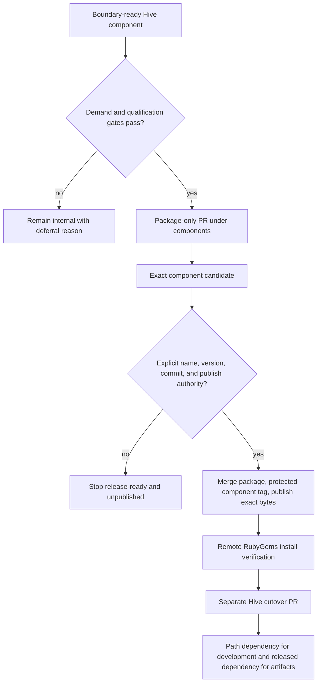

# Standalone Component Gems - Plan

## Goal Capsule

- **Objective:** Package and eventually publish only Hive components that have already proven a stable internal boundary and concrete value outside Hive, while retaining one canonical monorepo.
- **Authority:** `docs/plans/2026-07-25-001-refactor-internal-component-boundaries-plan.md` is a prerequisite. This plan may prepare an exact release candidate, but selecting a public gem name or version, registering ownership, merging a coordinated cutover, tagging, publishing, yanking, releasing Hive, or deploying requires a separate explicit user decision at the named gate.
- **Execution profile:** Qualify one candidate at a time; land its self-contained package without changing the released Hive dependency graph; prove a stacked Hive dogfood cutover; build and install exact artifacts; then stop at an unpublished release-ready checkpoint unless publication authority is supplied.
- **Stop condition:** A candidate that lacks non-Hive demand, an independent contract, clean loading, downward dependencies, compatibility ownership, isolated artifact proof, or a maintainer remains internal. That is a successful gate outcome, not a failed plan.
- **Tail ownership:** Under the authority available from this plan alone, finish at a reviewed, reproducible, unpublished component candidate and a held Hive cutover. With a later explicit release instruction, publish and remotely verify the component first, then land Hive's dependency cutover in a separate PR. Never select a version or trigger public distribution implicitly.

---

## Product Contract

### Summary

Operate a Rails-style multi-gem Ruby monorepo without turning Hive into a collection of repositories or an automatic multi-package release train.
Each published component remains developed beside Hive, has independent package metadata and versioning, and is consumed from its monorepo path during development.
Released `hive-cli` artifacts depend on the already-published component version normally, and release proof installs the exact built gems rather than trusting source-checkout load paths.

This plan does not promise that every internally clean component becomes a gem.
It defines the evidence and release choreography that let one genuinely valuable component cross the package boundary safely.

### Problem Frame

The original extraction analysis found seven retained opportunities:

| Product-value rank | Candidate | Standalone value | Current extraction posture |
|---|---|---|---|
| 1 | RunReceipt | Durable local commands, leases, streams, recovery, and terminal receipts without a server | Strongest product; highest subsystem extraction cost |
| 2 | UserService | Safe plan/apply/status/remove for systemd-user and launchd services | Safest first internal boundary |
| 3 | Agent Artifact Firewall | Artifact custody and bounded attestation around untrusted agent spawns | Differentiated; security contract still scattered |
| 4 | Agent ABI | Provider-neutral contract for installed headless agent CLIs | Coherent profile seam; provider churn |
| 5 | Skillpack | One canonical skill projected safely to multiple agent ecosystems | Coherent mechanism; generic author schema unproven |
| 6 | Safe Agent Git Gate | Hardened Git operations and exact-object publication authority | Real security need; high maintenance burden |
| 7 | WorkLedger | Human-readable folder workflows with an append-only evidence ledger | Deepest idea; least ready and most policy-coupled |

Product rank must not become a publication schedule.
RunReceipt can remain the most valuable idea while UserService is easier to boundary, and either can remain internal if no adopter appears.

Ruby and Bundler already support multiple gemspecs and filesystem path dependencies inside one repository.
The hard problem is not repository layout; it is preventing a path-resolved development checkout from masquerading as a publishable artifact, and preventing an unpublished component dependency from making the released Hive gem uninstallable.

### Actors

- A1. Hive maintainers need one checkout, one issue and PR history, and one integration suite across every component.
- A2. Component maintainers need self-contained package tests, documentation, versioning, security ownership, and an explicit release path.
- A3. Hive contributors and agents need local path dependencies so changes to a component and Hive can be developed and reviewed together.
- A4. Non-Hive adopters need a normal RubyGems install, one documented require path, direct dependencies, SemVer compatibility, and no hidden `hive-cli` runtime dependency.
- A5. Release operators need an exact-commit, build-once, install-tested, approval-gated publication chain that cannot trigger Hive's root release by accident.
- A6. Existing Hive operators need the same workspace, persisted state, schemas, services, and behavior through the package cutover.

### Requirements

**Qualification**

- R1. A candidate is eligible only after its entry in `config/component-boundaries.yml` is `boundary-ready`, all production Hive consumers use the supported facade, and the internal-boundary plan's clean-load, dependency, compatibility, and integration gates pass.
- R2. Record concrete non-Hive demand: a named adopter, issue, integration, or maintained prototype that uses the boundary for a real job. Hypothetical reuse, a tidy directory, or an internal maintainer preference is insufficient.
- R3. Record the independent user journey, public Ruby surface, library-versus-CLI decision, supported Ruby and OS matrix, persistence and migration ownership, security posture, maintainer, and maintenance/release burden before choosing a public package identity.
- R4. Qualification has three honest terminal results: `package-ready`, `deferred-no-demand`, and `deferred-coupled-to-hive`. A deferred result leaves the component internal without creating empty packaging infrastructure.
- R5. Candidate selection follows current evidence at qualification time; this plan does not preselect UserService, RunReceipt, or any other ranked candidate.

**Monorepo package shape**

- R6. Keep the component in the Hive repository under `components/<gem-name>/` only after it reaches `package-ready`. The package owns its gemspec, `lib/`, tests, README, changelog, license metadata, schemas/templates/assets, and optional executable.
- R7. Use one documented require path and a neutral public namespace chosen at qualification. The package must not require `hive-cli`, `require "hive"`, Hive commands, stages, web code, task/config/schema constants, or Hive release metadata.
- R8. Declare every direct runtime dependency in the component gemspec. Do not rely on dependencies arriving transitively or as default gems.
- R9. Default to a library gem. Add a CLI only when the external operator journey is independently valuable and its argv, exit-status, structured-output, mutation, recovery, and approval contracts are specified and tested.
- R10. Give each published component independent SemVer and a component changelog. Do not force all packages to share `Hive::VERSION`, and do not add a monorepo package registry or release framework until at least two real gems demonstrate the need.

**Hive dogfood and cutover**

- R11. Develop Hive against the component through a Bundler path dependency while `hive.gemspec` declares a normal compatible released dependency for built Hive artifacts. Update both `Gemfile.lock` and `web/Gemfile.lock` when the real dependency lands.
- R12. The component package PR and Hive cutover PR remain separate. The package may land without changing Hive's released dependency graph; the cutover remains stacked or held until the component version is publicly available and remotely verified.
- R13. Temporary duplication between the internal implementation and the package is allowed only across the coordinated publication window, with parity tests and an explicit removal unit. Main must never contain two independently evolving authoritative implementations.
- R14. Hive and the component use the same state root, records, locks, schemas, service files, and compatibility fixtures. Packaging does not copy durable state or silently migrate it.
- R15. Path-selected component tests are fast feedback only. Every package or cutover PR still runs the complete relevant Hive integration gate and exact-head hosted CI.

**Artifact and release proof**

- R16. Build the component gem once from an expected protected-main commit and inspect its file manifest, metadata, require path, direct dependencies, executables, schemas, templates, and license/readme/changelog inventory.
- R17. Install the exact built gem into a clean gem home with no repository load path, no Hive gem, and no Bundler path source; exercise its public library API and CLI when present on the supported Ruby, Linux, and macOS matrix.
- R18. Prove Hive against the exact built component artifact as well as the development path dependency. Lowest and highest compatible dependency versions must follow the declared compatibility policy.
- R19. Component publication uses a separate protected tag namespace such as `components/<gem-name>/vX.Y.Z` and a component-specific workflow. It must not match `.github/workflows/release.yml`'s root `v*.*.*` trigger.
- R20. Path changes may trigger tests but never publication. Publication requires an expected commit, explicitly selected package and version, protected tag or equivalent approval-bearing trigger, package-scoped credentials or trusted publishing, and the already-proven artifact.
- R21. Publish the exact candidate bytes; do not rebuild between verification and publication. After RubyGems accepts the version, it is immutable: a later failure fixes forward, and yanking requires a separate explicit emergency decision.
- R22. Remote verification installs the published version from RubyGems in a fresh environment and repeats the public require/CLI smoke plus checksum and metadata checks before the component is considered released.
- R23. A Hive release may consume the new dependency only after R22 passes. Component publication and the later Hive version/tag/release remain separate explicit decisions.

**Documentation and authority**

- R24. Add component development and release instructions, package-specific changelog rules, compatibility/deprecation policy, rollback guidance, and one wiki log fragment per behavior-changing PR. Do not edit compiled `wiki/log.md`.
- R25. Choosing or registering the public gem name, selecting a version, changing a public compatibility promise, merging the coordinated cutover, creating or pushing a tag, publishing, yanking, transferring ownership, or releasing Hive stays human-authorized.
- R26. Execution without R25 authority stops at the release-ready checkpoint with no public or irreversible side effect.

### Key Flows

- F1. **Qualify or defer a candidate**
  - **Trigger:** An internal component appears useful outside Hive.
  - **Actors:** A1-A4.
  - **Steps:** Verify the internal boundary; collect demand; define the external journey and compatibility/security ownership; assess maintenance burden; record `package-ready` or a concrete deferral reason.
  - **Outcome:** One candidate advances, or it remains internal without packaging scaffolding.
  - **Covered by:** R1-R5.
- F2. **Prepare the package and stacked Hive cutover**
  - **Trigger:** A candidate reaches `package-ready` and its public identity is explicitly approved.
  - **Actors:** A1-A4, A6.
  - **Steps:** Create the self-contained component package; keep the package-only PR safe for Hive releases; prepare a separate stacked Hive path-dependency cutover; prove parity, shared state, and compatibility; hold the cutover.
  - **Outcome:** The package can land and be published without making `hive-cli` depend on an unavailable gem.
  - **Covered by:** R6-R15.
- F3. **Build and prove an exact candidate**
  - **Trigger:** The package PR is on an expected commit.
  - **Actors:** A2, A5.
  - **Steps:** Build once; inspect; install in clean environments; exercise public behavior; run Hive against the same artifact; save checksums and provenance.
  - **Outcome:** An unpublished candidate is release-ready, or the package returns to implementation without registry mutation.
  - **Covered by:** R16-R18, R24-R26.
- F4. **Publish the component with explicit authority**
  - **Trigger:** The user approves the public gem name, exact version, expected protected-main commit, and publication.
  - **Actors:** A2, A5.
  - **Steps:** Merge the package-only PR; create the component-scoped protected tag; verify tag/metadata/commit identity; publish the previously proven bytes; install from RubyGems; verify remote metadata and behavior.
  - **Outcome:** `remotely-verified`, or `registry-published-fix-forward` if post-publication proof fails.
  - **Covered by:** R19-R22, R25.
- F5. **Cut Hive over after publication**
  - **Trigger:** The component version is remotely verified.
  - **Actors:** A1, A3, A6.
  - **Steps:** Rebase the held cutover; use the local path for development and the published compatible dependency for built artifacts; remove the internal duplicate; update both lockfiles; rerun artifact and full Hive integration proof; merge separately.
  - **Outcome:** Hive consumes the published gem while the monorepo remains the canonical development workspace.
  - **Covered by:** R11-R15, R18, R23-R25.

### Acceptance Examples

- AE1. Given a boundary-ready component with no named non-Hive adopter or maintained prototype, when qualification runs, then the result is `deferred-no-demand` and no `components/` directory, gemspec, or public name is created.
- AE2. Given a component that loads only after `require "hive"` or imports Hive commands/stages, when qualification runs, then the result is `deferred-coupled-to-hive` even if its focused tests pass.
- AE3. Given a package-ready candidate, when its package-only PR lands before publication, then current `hive-cli` releases remain installable because `hive.gemspec` has not yet gained the unpublished dependency.
- AE4. Given a stacked Hive cutover before publication, when CI runs, then Bundler resolves the component by path for development and exact-artifact tests install the locally built component before the Hive candidate; the cutover remains unmergeable.
- AE5. Given a built component gem, when it is installed into a fresh gem home without the repository or `hive-cli`, then its documented require path and standalone behavior work and every required schema/template is present.
- AE6. Given a changed component path, when normal CI runs, then focused package tests may be selected but no tag, RubyGems push, GitHub release, or Hive release begins.
- AE7. Given a component tag `components/example/v1.2.3`, when GitHub evaluates workflows, then the component workflow validates it and Hive's root `v*.*.*` release workflow does not run.
- AE8. Given no explicit publication instruction or selected version, when the candidate workflow completes, then it stores proof artifacts and stops without creating a tag or contacting RubyGems publication endpoints.
- AE9. Given RubyGems has accepted a version but the remote-install smoke fails, when the release is handled, then the version is not overwritten or silently yanked; the maintainer records the state and prepares a fix-forward release.
- AE10. Given the component is remotely verified, when the Hive cutover lands, then source development uses the monorepo path, built `hive-cli` declares the released dependency, both lockfiles are current, and the duplicate internal implementation is gone.

### Success Criteria

- At most one candidate is packaged per execution of this plan, and it passed every qualification gate using current evidence.
- The component is self-contained, independently installable, directly documented, and free of upward Hive dependencies.
- Hive path dogfood and exact built-artifact integration both pass against the same public contract and shared state.
- The component release trigger cannot activate Hive's release workflow, and ordinary path changes cannot publish.
- Without separate release authority, the terminal state is a proven unpublished candidate and held cutover.
- With separate release authority, the exact component bytes are remotely verified before Hive's dependency cutover or release.

### Scope Boundaries

**Included**

- Qualification and deferral criteria for all seven retained candidates.
- One component package under `components/`.
- Independent gemspec, version file, changelog, documentation, tests, assets, and optional CLI.
- Path-based monorepo development, exact artifact proof, component-scoped release automation, and a coordinated Hive cutover.

**Deferred until a second real gem**

- A generalized component registry, dependency graph tool, release orchestrator, shared version command, or multi-package changelog system.
- Cross-component automated release ordering.

**Outside this plan**

- Separate repositories, Git submodules, vendored source copies as a permanent architecture, or npm-oriented monorepo tools.
- Publishing every retained candidate, synchronizing all package versions, or promising a public extraction roadmap.
- Auto-publishing based on path changes.
- A new external composition framework combining RunReceipt, Agent ABI, and Artifact Firewall.
- Choosing a public name, namespace, version, or registry owner in advance of the qualification and authority gates.

---

## Planning Contract

### Key Technical Decisions

- KTD1. **Keep one canonical monorepo.** (session-settled: user-approved — chosen over one repository per gem because integrated investigation, cross-component changes, and agent navigation are more valuable than repository-level isolation.)
- KTD2. **Publish only after a proven internal boundary.** (session-settled: user-approved — chosen over package-first extraction because a gem must expose a real contract rather than relocate accidental Hive coupling.)
- KTD3. **Keep Hive as the primary dogfood consumer.** (session-settled: user-directed — chosen over an external-first rewrite because Hive provides the first compatibility and integration pressure.)
- KTD4. **Use explicit releases, never path-change publication.** (session-settled: user-approved — chosen over automatic selective publishing because version choice and public registry mutation require deliberate authority.)
- KTD5. **Do not preselect the first gem.** Qualification re-evaluates demand, coupling, risk, and ownership. Internal readiness and standalone value remain different rankings.
- KTD6. **Create `components/<gem-name>/` only after qualification.** This keeps package-owned code, tests, metadata, and assets together without creating an empty framework before a real component exists.
- KTD7. **Give components independent SemVer.** `hive-cli` declares a compatible range; components do not inherit `Hive::VERSION` or require synchronized releases.
- KTD8. **Use a package-first, publish-first, cutover-last choreography.** Land the self-contained package without changing Hive's released dependency graph, publish and remotely verify it, then land Hive's dependency cutover. This avoids a period where released Hive cannot install.
- KTD9. **Dogfood both the path and the exact artifact.** Bundler path resolution keeps monorepo development fast, while clean gem installation catches missing files, undeclared dependencies, and repository-only assumptions.
- KTD10. **Build once and publish the proven bytes.** Component release follows Hive's exact-candidate discipline but uses its own workflow, tag namespace, artifact, and registry credentials.
- KTD11. **Default to a library gem.** A CLI is earned by a complete independent operator flow; it is not added merely because Hive is a CLI.
- KTD12. **Delay package-management infrastructure until two packages need it.** One real package uses explicit Rake/workflow targets; duplication pressure from a second package justifies a registry or shared release helper.
- KTD13. **Treat public registry mutation as human-only.** Candidate automation may build, inspect, install, and attest. Name registration, version selection, tags, publication, yanking, ownership transfer, Hive release, and destructive migration remain explicit operator actions.

### High-Level Technical Design



The safe dependency transition uses two pull requests:

1. **Package PR:** introduces the self-contained component, release tests, and component workflow without changing `hive.gemspec` to depend on an unpublished gem.
2. **Hive cutover PR:** dogfoods the component by path, declares the normal compatible runtime dependency, preserves any forwarding compatibility surface, deletes the former internal implementation, and updates both lockfiles. It stays stacked or held until the component is remotely verified.

The package and Hive use one public contract and one shared compatibility fixture set.
Temporary implementation duplication is bounded to this release window and protected by parity tests; it is never accepted as the final state.

### Qualification Matrix

| Gate | Required evidence | Failure state |
|---|---|---|
| Internal boundary | `boundary-ready` catalog entry and all Hive callers behind the facade | `deferred-coupled-to-hive` |
| External demand | Named adopter, issue, integration, or maintained non-Hive prototype | `deferred-no-demand` |
| Independent journey | Library or CLI use case with success, error, mutation, and recovery behavior | `deferred-no-demand` |
| Clean load | Public require works without Hive aggregate or upward constants | `deferred-coupled-to-hive` |
| Dependency direction | `hive-cli -> component`, never component -> Hive | `deferred-coupled-to-hive` |
| Compatibility ownership | Public API, persisted format, migration, SemVer, deprecation, Ruby/OS policy | `deferred-coupled-to-hive` |
| Artifact proof | Built-gem inventory, clean install, standalone smoke, Hive integration | Return to implementation |
| Maintenance ownership | Named maintainer and release/security response commitment | `deferred-no-demand` |

### Release State Model

```text
internal
  -> package-ready
  -> candidate-proven
  -> publication-authorized
  -> registry-published
  -> remotely-verified
  -> hive-cutover-merged
```

`deferred-no-demand` and `deferred-coupled-to-hive` are terminal qualification states.
Before `registry-published`, failures repair or revert without public side effects.
After `registry-published`, the version is immutable and failures move to a fix-forward state.
`remotely-verified` is required before Hive's cutover may merge or a Hive release may consume the dependency.

### Sequencing

1. Run qualification and stop immediately on an honest deferral result.
2. Obtain explicit approval for the public identity before creating package metadata.
3. Build the package-only PR and the separately held Hive cutover.
4. Add exact artifact and release-workflow proof.
5. Reach the unpublished release-ready checkpoint.
6. Continue only after explicit package/version/commit/publication authority.
7. Merge and publish the package; remotely verify RubyGems.
8. Rebase, verify, and merge the Hive cutover; any later Hive version/tag/release is a separate decision.

### Sources and Research

- `docs/plans/2026-07-25-001-refactor-internal-component-boundaries-plan.md` defines the prerequisite internal contract.
- `hive.gemspec`, `Gemfile`, `Gemfile.lock`, `web/Gemfile`, and `web/Gemfile.lock` define Hive's current single-gem dependency and packaged-install surfaces.
- `docs/RELEASING.md` and `.github/workflows/release.yml` provide the build-once, exact-candidate, native install, explicit tag, and no-rebuild publication precedent.
- `wiki/decisions.md` ADR-031 and `wiki/modules/digest.md` record PRDigest as the existing dependency-first externalization precedent: the standalone package is the engine and Hive remains the adapter.
- Bundler's official Gemfile reference documents multiple gemspecs in one repository, filesystem `path` dependencies, and the `path 'components'` block: `https://bundler.io/v4.0/man/gemfile.5.html`.
- RubyGems' official publishing guide defines the normal gem build and push surface: `https://guides.rubygems.org/publishing/`.
- `hive.gemspec` comments record why direct runtime dependencies and installed-gem file inventories are required instead of relying on source checkout or transitive/default gems.

### System-Wide Impact

- **Repository layout:** The root remains authoritative for shared CI, issues, wiki, and integration. A component owns only its package subtree and referenced shared fixtures.
- **Dependency resolution:** Development favors the component path; built and remote Hive artifacts use the published dependency. Tests must make the selected source visible so path and artifact proof cannot be confused.
- **Release topology:** Root `vX.Y.Z` remains exclusively Hive's release trigger. Component tags and workflows are namespaced, independently protected, and separately credentialed.
- **Lockfiles:** A real Hive cutover changes the root and web lockfiles. Package-only work must not leave locks pointing at an unpublished dependency on main.
- **Persistent state:** Packaging changes code ownership, not state ownership by fiat. Shared state roots, schema versions, migrations, and older-process behavior stay compatible through the cutover.
- **Security:** RubyGems credentials or trusted publishing apply only to the selected package workflow. Candidate jobs have read-only registry posture and cannot publish.
- **Agents:** Agents continue navigating one repo, use package-local README/tests for focused work, and use root wiki/integration tests for cross-component behavior. Nested agent instructions are added only if package workflows materially differ.
- **Support:** A published component creates a real compatibility and vulnerability-response obligation independent of Hive's release cadence.

### Risks and Mitigations

| Risk | Mitigation or rejection signal |
|---|---|
| A neat internal seam is mistaken for market demand | Require a named adopter, issue, integration, or maintained prototype and accept `deferred-no-demand`. |
| Path tests hide missing files or dependencies | Install the exact built gem in a clean gem home with no repo path or Hive gem, inspect the file manifest, and declare all direct dependencies. |
| Hive main depends on an unpublished gem | Land package-only first, hold the separate cutover, remotely verify publication, then merge the dependency change. |
| Temporary duplicate implementations drift | Keep the window short, share/parity-test the contract fixtures, forbid unrelated changes, and delete the internal implementation in the cutover. |
| A component tag triggers Hive's release chain | Use and test a protected `components/<name>/vX.Y.Z` namespace that cannot match root `v*.*.*`. |
| Publication starts from an ordinary path change | Give candidate workflows no publish credentials and make publication depend on an explicit protected trigger plus expected commit/version inputs. |
| Verification and publication use different bytes | Build once, checksum and attest the candidate, and publish the exact retained artifact without rebuilding. |
| Registry accepted the version but later proof fails | Treat the version as immutable, record the partial release, fix forward, and require separate authority for any yank. |
| Independent versions create compatibility drift | Declare component SemVer/deprecation policy, test supported dependency bounds, and keep Hive's compatible range explicit. |
| Persistent formats strand existing Hive workspaces | Keep shared fixtures and migration ownership explicit; reject packaging until old and new consumers interoperate safely. |
| Release tooling becomes a framework project | Use explicit per-package tasks/workflows for the first gem and defer a registry/orchestrator until a second package produces real duplication. |
| Public namespace selection causes churn before demand | Choose and register the neutral name only after qualification and explicit approval. |

---

## Implementation Units

### U1. Qualify one component or record an honest deferral

- **Goal:** Decide from current evidence whether exactly one boundary-ready component has earned package work.
- **Requirements:** R1-R5, R24-R26; F1; AE1-AE2; KTD1-KTD5, KTD13.
- **Dependencies:** The owning units in `docs/plans/2026-07-25-001-refactor-internal-component-boundaries-plan.md` are complete.
- **Files:** `config/component-boundaries.yml`, `wiki/component-boundaries.md`, the candidate's module wiki page, a candidate-specific document under `docs/notes/` only when demand evidence needs durable detail, `wiki/gaps.md`, `wiki/log.d/<timestamp>-component-package-qualification.md`.
- **Approach:** Re-score the retained candidates using the qualification matrix, verify demand and ownership, define the external journey and compatibility/security obligations, and select no more than one. Record `package-ready`, `deferred-no-demand`, or `deferred-coupled-to-hive` with evidence. If package-ready, propose the library/CLI shape and neutral identity for explicit owner approval; do not register a name or select a version automatically.
- **Patterns to follow:** The component catalog's maturity evidence and ADR-031's separation between a standalone engine and Hive adapter.
- **Test scenarios:**
  - **Test expectation: none —** this unit changes no runtime behavior; its evidence is the completed qualification matrix and an explicit terminal state.
- **Verification:** Catalog validation passes and every qualification claim links to a current contract test, consumer, compatibility fixture, or external demand artifact. A deferred result completes this execution without creating U2-U8 files.

### U2. Create a self-contained package-only component

- **Goal:** Establish the approved component under `components/<gem-name>/` without changing Hive's released dependency graph.
- **Requirements:** R6-R10, R12-R14, R24-R25; F2; AE3; KTD6-KTD8, KTD11-KTD13.
- **Dependencies:** U1 returned `package-ready` and the owner explicitly approved the public gem name, namespace, and library-versus-CLI shape.
- **Files:** `components/<gem-name>/<gem-name>.gemspec`, `components/<gem-name>/lib/`, `components/<gem-name>/test/`, `components/<gem-name>/README.md`, `components/<gem-name>/CHANGELOG.md`, package license/metadata, package-owned schemas/templates/assets, root `Rakefile`, package documentation and wiki log fragment.
- **Approach:** Move or copy only the policy-light mechanism required by the approved journey, expose one require path, declare direct dependencies, and place package tests beside the source. Keep the current internal Hive implementation authoritative until the published cutover. Share compatibility fixtures or add parity tests so temporary duplication cannot diverge. Do not add the new dependency to `hive.gemspec` in this PR.
- **Patterns to follow:** Existing gemspec file-inventory and direct-dependency discipline; package-local tests that require the installed-style entry point rather than relative source files.
- **Test scenarios:**
  1. The gemspec contains complete metadata, direct dependencies, required Ruby, files, license, README, changelog, schemas/templates, and executable only when approved.
  2. The documented require path loads without `hive-cli`, root Hive load paths, or upward constants.
  3. Package behavior and shared compatibility fixtures match the boundary-ready Hive implementation for success, error, state, and security cases.
  4. The package-only change does not alter `hive.gemspec`, root/web lockfiles, Hive runtime requires, or root release installability.
- **Verification:** Package-focused tests, gemspec/file-inventory tests, clean-process require smoke, parity tests, root `bundle exec rake test`, and exact-head hosted CI pass in a package-only PR.

### U3. Prepare the held Hive path-dependency cutover

- **Goal:** Prove Hive as the primary consumer of the package while keeping the dependency cutover separate and unmerged until publication.
- **Requirements:** R11-R15, R18, R23-R26; F2, F5; AE4, AE10; KTD3, KTD8-KTD9, KTD13.
- **Dependencies:** U2 package-only branch exists.
- **Files:** `Gemfile`, `hive.gemspec`, `Gemfile.lock`, `web/Gemfile.lock`, Hive facade/compatibility files, former internal implementation, focused Hive consumer tests, package/Hive shared fixtures, affected wiki pages and log fragment.
- **Approach:** Create a stacked cutover PR. Resolve the component from `components/<gem-name>` for development, declare the approved compatible runtime range in `hive.gemspec`, route Hive through the package entry point, preserve any documented forwarding compatibility surface, and remove the old implementation. Keep the PR held and visibly non-mergeable until U7 remotely verifies the component.
- **Patterns to follow:** Current root `gemspec` dependency resolution and PRDigest's published-engine/Hive-adapter boundary.
- **Test scenarios:**
  1. Bundler selects the component path in the source checkout while `hive.gemspec` records the normal compatible dependency.
  2. Hive's focused consumers run exclusively through the package and observe the same state, locks, schemas, results, and errors.
  3. Existing documented Hive constants either forward compatibly or receive an explicit separately approved break; no silent constant disappearance occurs.
  4. Both root and web lockfiles resolve consistently.
  5. Removing the component path or locally installed candidate makes the artifact test fail rather than falling back to copied internal code.
- **Verification:** Component tests, Hive focused consumer/compatibility tests, both frozen Bundler installs, root `bundle exec rake test`, and exact-head hosted CI pass on the stacked PR; the PR remains unmerged.

### U4. Prove exact component and Hive artifacts

- **Goal:** Catch package omissions and repository-only assumptions before any public release.
- **Requirements:** R8, R14-R18, R24-R26; F3; AE5; KTD9-KTD10, KTD13.
- **Dependencies:** U2 and U3.
- **Files:** Package build/install scripts under `components/<gem-name>/`, root packaging helpers where genuinely shared, component artifact tests, Hive candidate install tests, `.github/workflows/ci.yml` or a separate non-publishing component candidate workflow, documentation and wiki log fragment.
- **Approach:** Build one component candidate from the expected commit, inspect it, and install it into clean environments without repository load paths. Build a Hive candidate from the held cutover and install the exact component artifact before Hive, proving the normal dependency path. Exercise supported Ruby and OS targets and dependency bounds without contacting publication endpoints.
- **Patterns to follow:** Hive's release candidate build-once and private gem-home install gates; existing `test/unit/gemspec_test.rb` and installed-gem integration tests.
- **Test scenarios:**
  1. The built gem contains every declared Ruby file, schema, template, executable, README, changelog, and license and excludes tests or repository-only files as intended.
  2. A clean gem home requires and exercises the component without Bundler path sources or `hive-cli`.
  3. A missing direct dependency, omitted asset, accidental root-relative path, or upward Hive require fails the installed smoke.
  4. The exact component artifact satisfies the built Hive candidate and all shared state/compatibility tests.
  5. Lowest and highest supported component dependency versions follow the documented compatibility policy.
- **Verification:** Exact checksums and provenance identify one component artifact, clean install smokes pass on supported Ruby/Linux/macOS targets, the Hive candidate consumes those bytes, and full hosted CI is green.

### U5. Add an isolated component release workflow and runbook

- **Goal:** Make release mechanics explicit, package-scoped, build-once, and unable to trigger from ordinary code changes.
- **Requirements:** R16-R26; F3-F4; AE6-AE9; KTD4, KTD7-KTD10, KTD13.
- **Dependencies:** U4.
- **Files:** `.github/workflows/component-release.yml`, component release verification scripts/tests, `docs/RELEASING.md` or a component-specific release guide, workflow contract tests, package README/changelog, wiki release documentation and log fragment.
- **Approach:** Define the protected `components/<gem-name>/vX.Y.Z` trigger, validate package/tag/version/expected-main-commit identity, build the candidate once, run U4 proof, retain the exact artifact, and publish only in an approval-bearing job with package-scoped RubyGems authority. Test that root Hive tags cannot enter this workflow and component tags cannot enter `.github/workflows/release.yml`. Document pre-publication, partial-publication, remote verification, fix-forward, and emergency-yank states.
- **Patterns to follow:** `.github/workflows/release.yml` exact candidate and install gates, but not its Hive web/Homebrew/AUR/GHCR publication chain.
- **Test scenarios:**
  1. Only the exact protected component tag shape with matching package version and reachable protected-main commit passes preflight.
  2. Root `vX.Y.Z`, ordinary branches, pull requests, path changes, malformed tags, and mismatched versions cannot reach publication.
  3. Candidate and install jobs have no RubyGems publish authority; only the approval-bearing publish job can access package-scoped credentials.
  4. Publication consumes the exact checksummed candidate artifact and does not rebuild.
  5. Workflow contracts prove component tags do not match Hive release triggers and vice versa.
  6. A dry candidate run completes without registry mutation and preserves enough evidence for the release-ready checkpoint.
- **Verification:** Workflow contract tests, local candidate scripts, component/Hive artifact gates, root `bundle exec rake test`, and exact-head hosted CI pass without publishing.

### U6. Reach the unpublished release-ready checkpoint

- **Goal:** Produce a complete, reviewable candidate and held cutover while preserving the explicit release boundary.
- **Requirements:** R1-R26; F1-F3; AE1-AE8; KTD1-KTD13.
- **Dependencies:** U1-U5.
- **Files:** Package and cutover PR descriptions/evidence, candidate checksums and workflow artifacts, package changelog draft, release checklist, affected wiki pages and `wiki/gaps.md`.
- **Approach:** Revalidate qualification and maintenance ownership, exact commit and candidate identity, artifact proofs, workflow isolation, package-only PR safety, stacked cutover status, compatibility policy, and rollback/fix-forward instructions. Do not select a version, merge the coordinated changes, tag, or publish without a new explicit instruction.
- **Patterns to follow:** Hive's explicit release-decision boundary in `docs/RELEASING.md`.
- **Test scenarios:**
  - **Test expectation: none —** this unit changes no runtime behavior; any defect returns to its owning implementation unit.
- **Verification:** Package and cutover PRs are review-ready on exact tested heads, candidate proof is reproducible, no publication credentials were used, RubyGems has no new version, and the next irreversible action is visibly blocked on explicit owner authority.

### U7. Publish and remotely verify the component only when authorized

- **Goal:** Publish the exact candidate and prove the public registry/install surface before Hive depends on it.
- **Requirements:** R16-R26; F4; AE7-AE9; KTD4, KTD7-KTD10, KTD13.
- **Dependencies:** U6 plus a new explicit user instruction naming the approved gem, version, expected protected-main commit, and publication authority.
- **Files:** Component version file and changelog, exact package tag/release metadata, immutable candidate and checksum evidence, remote-install verification record, wiki release log fragment.
- **Approach:** Merge the package-only PR, confirm the exact protected-main candidate, apply the explicitly selected version, create the protected component tag, let the release workflow publish the already-proven bytes, and install that exact version from RubyGems in fresh environments. If registry mutation occurs and later proof fails, stop Hive cutover and fix forward.
- **Patterns to follow:** Hive's exact-tag release verification and PRDigest's dependency-before-Hive precedent.
- **Test scenarios:**
  1. Remote RubyGems metadata matches the approved name, version, checksum, dependencies, Ruby requirement, source, and MFA/trusted-publishing expectations.
  2. Fresh remote installs on the supported matrix require and exercise the public API/CLI without the repository or Hive.
  3. Re-running publication for the same version is rejected; no workflow attempts to overwrite accepted bytes.
  4. A failed post-publish smoke records `registry-published-fix-forward` and blocks U8.
- **Verification:** RubyGems serves the exact proven version and all remote smokes pass. No Hive tag or release is created.

### U8. Land the Hive cutover after remote verification

- **Goal:** Make the released component the production dependency while retaining path-based monorepo development.
- **Requirements:** R11-R15, R18, R23-R25; F5; AE10; KTD1-KTD3, KTD7-KTD9, KTD13.
- **Dependencies:** U7 is `remotely-verified` and the user explicitly authorizes merging the coordinated Hive cutover. A later Hive version/tag/release still requires separate direction.
- **Files:** Held U3 files and PR, `Gemfile.lock`, `web/Gemfile.lock`, compatibility shims, former internal source deletion, Hive release/install contract tests, wiki/component docs and log fragment.
- **Approach:** Rebase the held cutover onto current main, pin the compatible range to the remotely verified component, keep the monorepo path source for development, remove temporary duplication, rerun source and built-artifact integration, and land the cutover separately. Preserve forwarding compatibility where promised and record any restart guidance for long-running Hive processes.
- **Patterns to follow:** PRDigest as standalone engine with a thin Hive adapter and Hive's dependency/file-inventory tests.
- **Test scenarios:**
  1. Source checkout resolves the component path and built `hive-cli` resolves the published dependency.
  2. Fresh `hive-cli` candidate installation downloads the component normally and runs all affected commands.
  3. Existing state/schema/service fixtures remain readable and writable under the documented compatibility policy.
  4. Both lockfiles are current and frozen installs pass.
  5. No duplicate authoritative implementation or accidental component source copy remains inside the Hive gem.
- **Verification:** Focused component/Hive tests, both frozen installs, exact built Hive install smoke, root `bundle exec rake test`, and exact-head hosted CI pass. The cutover PR may merge only under the explicit authority above; no Hive version, tag, release, or deployment is implied.

---

## Verification Contract

| Gate | Applicability | Command or evidence | Passing signal |
|---|---|---|---|
| Qualification | U1 and final audit | Completed qualification matrix backed by catalog, tests, demand artifact, maintainer, and compatibility policy | Exactly one `package-ready` candidate or an honest terminal deferral with no packaging scaffold. |
| Package focused tests | U2 onward | Package-local test task executed from `components/<gem-name>/` and from the root Rake integration | Public behavior passes without Hive load paths. |
| Clean require | U2 onward | Fresh Ruby process with only the installed component gem | The documented require path loads; `hive-cli`, Thor commands, web, stages, and Hive constants are absent. |
| File/dependency inventory | U2-U7 | Gem specification and built-artifact inspection | All runtime files/assets and direct dependencies are present; repository-only and test files are excluded as intended. |
| Path dogfood | U3 onward | Root Bundler resolution and focused Hive consumer tests | Development selects `components/<gem-name>` and Hive uses the package facade against shared state. |
| Exact component artifact | U4-U7 | Build once, checksum, clean private install, public API/CLI smoke | One retained artifact passes supported Ruby/Linux/macOS proof with no repo load path. |
| Exact Hive artifact | U4 and U8 | Install the exact component gem then the exact Hive candidate in a clean gem home | Hive invokes the packaged component and all affected commands work. |
| Lockfiles | U3 and U8 | Frozen root and web Bundler installs | `Gemfile.lock` and `web/Gemfile.lock` agree with source path and released dependency policy. |
| Release workflow contract | U5-U7 | Workflow parser/contract tests and a non-publishing candidate run | Component and Hive tags are disjoint; candidate jobs cannot publish; publish uses the proven bytes. |
| Broad local checkpoint | Every behavior-changing PR | `bundle exec rake test` | The default Hive suite passes; exhaustive coverage remains CI-owned unless packaging machinery itself changes coverage. |
| Hosted CI | Every PR and release candidate | Exact-head GitHub Actions checks | All required checks are green on the reviewed commit; full Hive integration remains mandatory. |
| Remote registry | U7 | Fresh RubyGems metadata lookup and install on supported targets | Name, version, checksum, dependencies, and behavior match the approved candidate. |
| Documentation | Every behavior-changing PR | Package docs, component wiki, release guide, compatibility policy, and one `wiki/log.d/` fragment | Documentation describes the actual source/artifact/release state and compiled `wiki/log.md` is untouched. |

---

## Definition of Done

### Default completion under this plan's current authority

- Exactly one boundary-ready component was qualified, or the execution ended with `deferred-no-demand` or `deferred-coupled-to-hive` and created no empty package framework.
- A package-ready candidate has one approved public shape, a self-contained `components/<gem-name>/` subtree, one require path, direct dependencies, package-local tests, documentation, compatibility policy, and named maintenance owner.
- The package-only PR does not make current Hive releases depend on an unpublished gem.
- The separate Hive cutover dogfoods the component by path, declares the future released dependency, preserves shared state and compatibility, updates both lockfiles, and remains held.
- One exact component artifact passes inventory, clean install, supported platform, public API/CLI, dependency-bound, and exact Hive candidate integration proof.
- Component and Hive release triggers are disjoint, candidate automation has no publication authority, and ordinary path changes cannot publish.
- Package and cutover PRs are review-ready on exact tested heads, release and rollback/fix-forward instructions are complete, and no public version has been selected or created.
- No tag, RubyGems publication, yank, ownership change, Hive version, Hive release, deployment, or cutover merge occurred without a separate explicit user instruction.

### Additional completion after explicit publication and cutover authority

- The package-only PR merged to protected main and the approved component tag bound the approved version to the exact tested commit.
- RubyGems serves the exact proven artifact, remote metadata and clean installs match it, and any partial publication failure is recorded and fixed forward.
- Only after remote verification, the separate Hive cutover removed temporary duplication, retained path-based monorepo development, declared the compatible released dependency, updated both lockfiles, and passed exact built-artifact plus full Hive integration proof.
- The component and Hive have independent versions and changelogs; no later Hive tag, release, or deployment is assumed.
- Package, wiki, release, and compatibility documentation match the final state, and no abandoned scaffold, duplicate implementation, leaked credential, stale candidate artifact, or unrelated workspace change remains.
