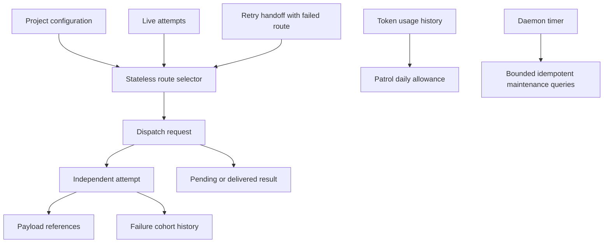
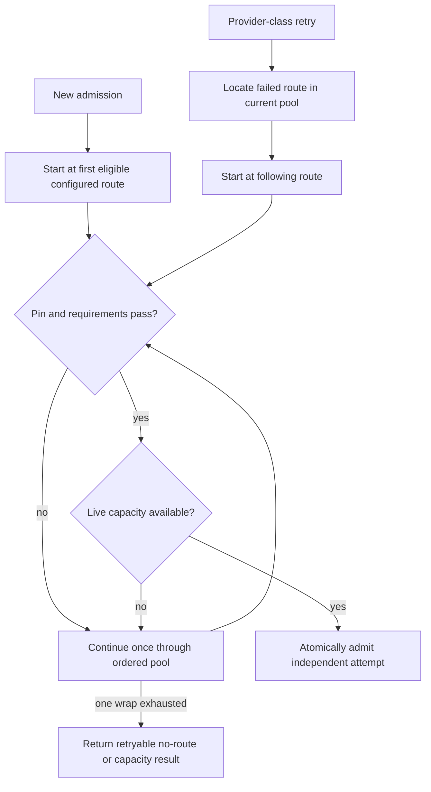
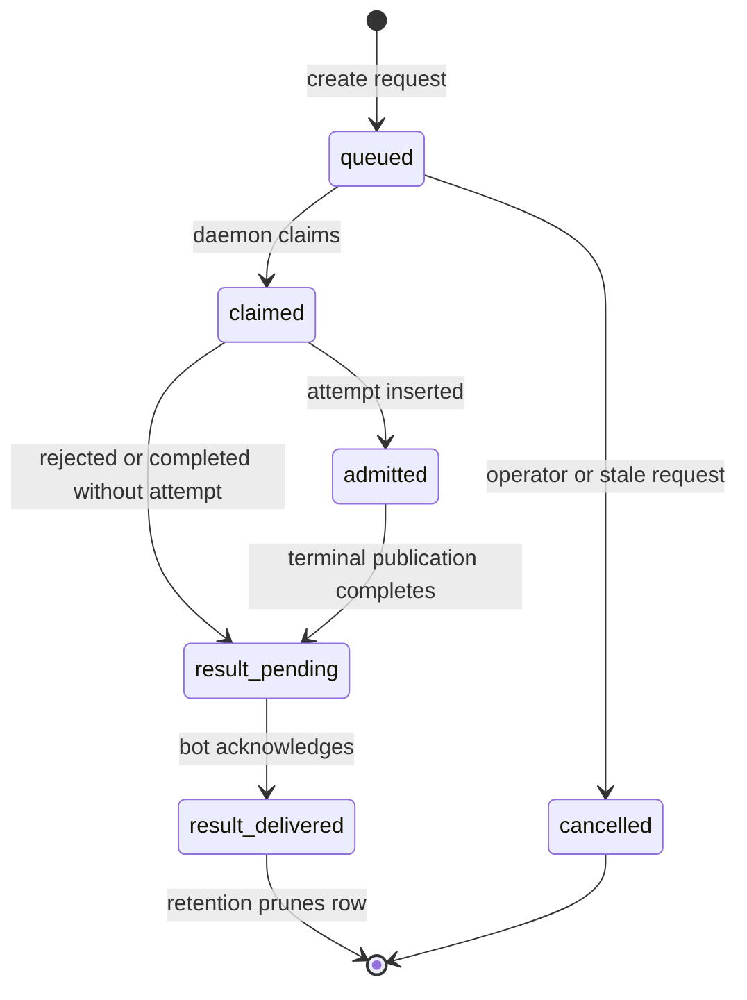
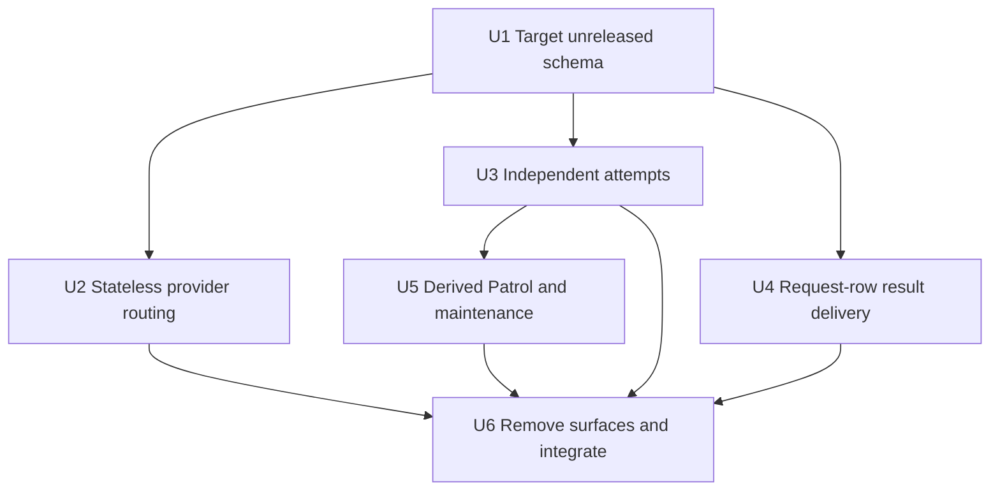

# Stateless Attempt Runtime - Plan

## Goal Capsule

- **Objective:** Keep Hive work resumable after crashes while making routine scheduling behavior understandable from current configuration, current attempts, and token history instead of a web of remembered runtime state.
- **Means:** Collapse one-to-one attempt state into `attempts`, replace persisted provider health with ordered retry rotation, and derive Patrol limits and cleanup schedules from existing facts (KTD1-KTD7).
- **Authority:** Project and task Markdown remain authored authority. SQLite remains the machine-local authority for live coordination, dispatch delivery, attempts, leases, payload references, PR reconciliation, and token history.
- **Execution profile:** Define the target unreleased schema first, convert one subsystem at a time with focused tests, delete each retired API with its consuming subsystem, then run the broad Ruby checkpoint once. Temporary cross-unit schema/consumer mismatch is allowed only inside the working branch.
- **Stop condition:** Stop if crash recovery would require a second authority, if a provider failure can permanently poison future work, or if removing lineage can admit duplicate live work.
- **Tail ownership:** This plan ends at an open, CI-decided PR. It does not merge, deploy, dogfood, publish, or choose a release version.

---

## Product Contract

### Summary

Simplify Hive's unreleased SQLite runtime into current facts and idempotent operations.
Attempts become independent rows, provider routing becomes ordered stateless rotation, dispatch results share their request row, Patrol allowances come from token-usage history, and periodic attempt cleanup no longer has a durable scheduler checkpoint.

### Problem Frame

The first SQLite cutover preserved several mechanisms that had grown around file-backed coordination: frozen policy snapshots, provider circuits and audit, attempt relationship rows, one-row satellite tables, an outbox table, allowance counters, and a maintenance checkpoint.
Those mechanisms make the database faster than the old files, but they keep the old architecture's number of authorities and recovery protocols.

Hive runs on one operator machine and already has stronger facts available.
Configuration defines the ordered provider pool, attempts define live capacity and terminal state, dispatch requests define resumable delivery, and token usage records accepted Patrol launches.
The runtime should recompute decisions from those facts and make retries safe through deterministic request identity rather than durable relationship graphs.

### Key Decisions

- **Keep task content in files and runtime coordination in SQLite.** (session-settled: user-directed — chosen over moving authored tasks into the database because Markdown remains the inspectable editing and review surface.) Governs R1, R2.
- **Use Sequel Core for the runtime database.** (session-settled: user-approved — chosen over Active Record because the CLI needs a small explicit SQL boundary without loading Rails.) Governs R2, R15.
- **Make provider routing stateless.** (session-settled: user-directed — chosen over persistent policy, circuit, and audit state because configured providers should rotate after failure without retained usability state.) Governs R3-R5.
- **Keep dispatch delivery resumable on one request row.** (session-settled: user-directed — chosen over deleting durable delivery or retaining a separate outbox because service restarts must resume results without a second queue.) Governs R6-R8.
- **Keep attempts independent.** (session-settled: user-approved — chosen over a durable predecessor and successor graph because retry identity belongs to the request that creates the next attempt.) Governs R9-R12.
- **Derive Patrol allowance from token history.** (session-settled: user-approved — chosen over mutable allowance and provider-hold rows because accepted launches are already recorded and UTC date supplies the reset.) Governs R13.
- **Do not persist a maintenance scheduler.** (session-settled: user-approved — chosen over durable sweep claims and cursors because cleanup operations are bounded and idempotent.) Governs R14.
- **Rewrite the unreleased schema in place.** (session-settled: user-directed — chosen over a compatibility migration because no released Hive version owns this database contract.) Governs R15-R17.

### Requirements

**Authority and durability**

- R1. Project and task Markdown remain the sole authored workflow authority; SQLite must not become a second task-history or configuration store.
- R2. SQLite retains only machine-local coordination and historical token usage that must survive process restarts.
- R3. Provider accounts, order, pins, requirements, models, effort, launch bindings, and concurrency limits come only from current configuration.
- R4. The first routed attempt uses the first eligible configured route, and a provider-class retry starts after the failed route and wraps once through the configured order.
- R5. Provider failure changes only that retry decision; it creates no durable circuit, audit stream, policy snapshot, probe, cooldown, or operator mutation surface.

**Dispatch and attempts**

- R6. A dispatch request and its eventual result use one SQLite row and one stable request identity.
- R7. Rewriting the same result is idempotent only when the complete result payload matches; a conflicting result fails closed.
- R8. Pending, delivered, retained, and pruned result delivery remains resumable and at-least-once across daemon and bot restarts without a separate outbox; a crash after an external send and before acknowledgement may repeat the notification.
- R9. Every attempt is independently understandable from its own record plus its request and task identity.
- R10. Retry handoff may name the failed route and inherited outputs until the replacement attempt is admitted, but the admitted attempt stores no predecessor, successor, retry, or supersedes relationship.
- R11. A lost attempt may create at most one deterministic recovery request; admission atomically records an irreversible recovery-complete phase on the lost attempt so request pruning cannot reopen retry authority.
- R12. Fixed one-to-one accounting, capacity, lost-recovery, and terminal-publication state belongs on `attempts`; true histories and one-to-many payload references may remain separate.

**Derived scheduling**

- R13. Patrol keeps complete `token_usage` history and derives each engine's daily allowance from idempotent `patrol_discovery_launch` reservation rows for the current UTC date.
- R14. Only the daemon starts periodic attempt maintenance, and each run uses bounded direct queries and idempotent operations without a durable claim or cursor.

**Unreleased schema and proof**

- R15. Rewrite migration `001` and its expected schema digest without adding migration `002`, changing `SCHEMA_VERSION`, or adding a compatibility reader.
- R16. Delete unused tables, columns, enum members, commands, schemas, wiki promises, and component-boundary entries in the same PR as their consumers.
- R17. Add foreign-key indexes for every retained child lookup or cascade path that SQLite would otherwise scan.
- R18. Retain attempt failure cohorts only for task/runtime runaway containment; they must not encode provider usability or route health.

### Key Flows

- F1. **Select and rotate a route**
  - **Trigger:** A task with an explicit routing pool is admitted or retried after a provider-class failure.
  - **Steps:** Load current configuration; apply pin and hard requirements; count current live attempts; start at the first route or after the failed route; if the failed route is absent, start at the first current route; choose the first eligible route within one wrap.
  - **Outcome:** Selection is reproducible from current facts and does not mutate provider state.
  - **Covered by:** R3-R5, R18.
- F2. **Deliver a result after restart**
  - **Trigger:** A daemon finishes a claimed dispatch request.
  - **Steps:** Store the result on the request row; leave it pending; a bot reads and delivers it; mark that same row delivered; prune it after retention.
  - **Outcome:** A restart at any boundary resumes from one row without losing the result or creating a second result record; the external notification is at-least-once.
  - **Covered by:** R6-R8.
- F3. **Recover a lost attempt**
  - **Trigger:** Ownership is proven lost and cleanup is safe.
  - **Steps:** Advance lost-recovery fields on the attempt; create or find one deterministic recovery request; atomically admit a fresh independent attempt and mark the lost source recovery complete; use the source attempt's completed phase after request retention expires.
  - **Outcome:** Concurrent or repeated healing creates at most one replacement request and no attempt graph.
  - **Covered by:** R9-R12.
- F4. **Reserve Patrol allowance**
  - **Trigger:** Ordinary or architecture Patrol is about to launch discovery.
  - **Steps:** Inside one shared database transaction, recognize an existing idempotent reservation first; otherwise count accepted reservations for that project, engine, source, and UTC date and insert the new zero-token reservation only when the existing count is below the configured limit; update the same usage record after execution.
  - **Outcome:** Token history and allowance cannot disagree, and the next UTC date resets naturally.
  - **Covered by:** R13.
- F5. **Run attempt maintenance**
  - **Trigger:** The daemon's process-local timer reaches the interval.
  - **Steps:** Select pending finalizations and expired payload/log candidates in bounded keyset order; continue past individual row failures within a bounded visit/time budget; apply idempotent promotion or deletion; report errors in the current operational snapshot.
  - **Outcome:** A daemon restart may repeat safe work but cannot duplicate authority or skip forever behind a stale cursor.
  - **Covered by:** R14.

### Acceptance Examples

- AE1. Given routes A and B, when a new task is admitted, it chooses A; when a provider-class failure from A is retried, it chooses B; when B fails, the next retry wraps to A.
- AE2. Given route A failed yesterday, when unrelated work starts today, it still begins with A because no provider health survives the retry handoff.
- AE3. Given a completed request with a pending result, when the daemon and bot restart, the bot reads that result from the request row, retries delivery without losing it, and marks the same row delivered; a crash after the external send may repeat the notification.
- AE4. Given the same request result is written twice with identical content, the second write returns the stable request identity; given different content, the write raises a typed integrity error.
- AE5. Given two healers observe the same lost attempt, when both request recovery, one deterministic dispatch request is created and any admitted replacement has no predecessor or relationship row.
- AE6. Given three accepted Patrol reservation rows today and a limit of four, the next reservation succeeds and a fifth is refused; tomorrow the count begins at zero without a reset write.
- AE7. Given the daemon crashes after maintenance processes its first bounded page, when it restarts, it may inspect earlier rows again but idempotently reaches later eligible rows without a persisted cursor.
- AE8. Given a fresh explicit bootstrap, the database contains no provider policy/health/audit, attempt relationship/satellite, Patrol allowance, maintenance, or dispatch-outbox tables, and all retained foreign keys have supporting indexes.

### Success Criteria

- The database schema and runtime code have one authority for each surviving fact.
- The refactor reports before-and-after production LOC, table count, public command count, and durable-state mechanism count; the combined production surface and every named public/state count decrease.
- Provider rotation and lost-attempt recovery remain deterministic under concurrent and repeated calls.
- Dispatch results and terminal publication remain resumable across process death.
- Patrol token history remains complete while daily allowance needs no counter or reset record.
- Focused concurrency and restart tests pass, the broad Ruby checkpoint passes, and the PR is CI-decided.
- Production code, schemas, and wiki pages for retired mechanisms are deleted rather than left as dormant compatibility layers.

### Scope Boundaries

**Included**

- Runtime schema, Sequel repositories, attempt records, dispatch delivery, provider routing, Patrol launch accounting, maintenance scheduling, CLI/status surfaces, component catalog, tests, and managed wiki pages.
- Test fixture conversion needed to prove the new single-authority model.

**Deferred to Follow-Up Work**

- Changing opaque task-generation identifiers to numeric generations. Existing task and ownership generations include string identities and are equality keys, so this is not a safe schema-only cleanup.
- General token-usage analytics changes beyond the idempotent Patrol reservation query.

**Outside this refactor**

- Rails web ORM changes, Active Job adoption, PostgreSQL portability, cloud synchronization, and moving authored tasks or projects into SQLite.
- Changes to task journals, artifact collection, PR reconciliation semantics, workflow packages, or Patrol Fix/Architecture Patrol behavior except where they consume retired attempt/provider APIs.
- Merge, deployment, dogfood cutover, release, version bump, or compatibility with an unreleased local database.

---

## Planning Contract

### Key Technical Decisions

- KTD1. **Keep Sequel datasets explicit and domain-owned.** (session-settled: user-approved — chosen over Active Record or a generic repository layer because the CLI database is local, narrow, and independent of Rails.) Each repository owns bounded queries and transactions; no ORM model callbacks are introduced.
- KTD2. **Rotate from retry context, not retained health.** (session-settled: user-directed — chosen over circuit state because only the retry needs to avoid the route that just failed.) The request handoff carries the failed route ID until admission; current configuration supplies the candidate order.
- KTD3. **Use live attempts as capacity reservations.** The atomic admission transaction checks the count of `launching` and `running` attempts, then inserts the new attempt. Terminal or lost state releases capacity by definition.
- KTD4. **Make the dispatch request the result envelope.** (session-settled: user-directed — chosen over a separate outbox because request and result have a one-to-one lifecycle.) Result fields use the request ID as their stable identity and a partial ready index for delivery.
- KTD5. **Fold fixed per-attempt protocols into the attempt row.** Accounting fields, lost-recovery phase, pending terminal receipt, and fixed consumer acknowledgements become typed columns on `attempts`; `record_json` remains the complete immutable attempt value. `lease_version` and `record_digest` fence execution-state updates, a separate lost-recovery revision fences healer transitions, and accounting plus acknowledgement fields use monotonic conditional updates that do not rewrite `record_json`.
- KTD6. **Keep only genuine collections outside attempts.** `payload_references` remains because an attempt may own multiple payloads. `attempt_failure_cohorts` remains because it aggregates multiple attempts; each attempt row holds its own counted failure fact. `dispatch_requests` remains because it exists before admission and may never create an attempt.
- KTD7. **Derive schedules from facts.** (session-settled: user-approved — chosen over Patrol counters and a maintenance checkpoint because existing token rows and bounded idempotent queries already express the safe decision.) The daemon owns the only periodic timer.
- KTD8. **Treat migration 001 as the target schema.** (session-settled: user-directed — chosen over migration 002 because the SQLite contract is unreleased.) The application ID, schema version 1, exact schema digest, and explicit bootstrap remain safety gates rather than a historical migration ladder.
- KTD9. **Delete public health administration and its projection.** The `hive circuits` command, its JSON schema, and the orphaned provider-routing operational projection disappear with the state they administer. Generic operational status keeps its existing non-provider sections.
- KTD10. **Keep failure cohorts route-agnostic.** Cohort identity may contain task/runtime failure classification used to stop runaways, but never provider account, model health, circuit generation, or probe ownership.

### High-Level Technical Design

The diagrams are directional architecture guidance. Requirements and KTDs own the exact behavior.

### Assumptions

- Current routing pins remain hard. A pinned provider failure cannot rotate outside the pin and returns the existing retryable no-route result.
- Provider-class failure is already available when recovery creates a retry handoff; adapter-local transient retries remain inside the adapter and do not enter the route selector.
- Terminal publication has a fixed consumer set in this release, so typed attempt columns are simpler than a dynamic obligations table.
- Retained failure cohorts still prevent the previously observed runaway retry pattern and are not provider-health state.
- Repeating an idempotent maintenance query after daemon restart is acceptable; exact once-per-hour diagnostics are not product state.

### Sequencing

### Risks & Dependencies

- **Lost recovery duplication:** Removing relationship rows can create two replacement attempts if request identity is not deterministic. Mitigate with a unique recovery request key and multiprocess contention tests.
- **Capacity race:** Deriving capacity from live attempts is safe only when count and insert share the same immediate transaction. Preserve the current single-writer admission boundary and test with independent database connections.
- **Dispatch retention:** Deleting a request before its result is delivered would lose bot output. Keep result-bearing rows through delivery retention and exercise crash points before and after acknowledgement.
- **Patrol double charge:** Reservation and telemetry update must share one stable usage identity. Enforce uniqueness and test retrying the same reservation ID.
- **Provider semantics drift:** Remove only shared health memory. Preserve hard requirements, pins, configured order, current live capacity, adapter-local retries, and route identity on the admitted attempt.
- **Local dogfood database:** This branch cannot open the prior experimental layout after the exact schema changes. Verification uses fresh explicit databases; later dogfood deployment must perform the already-defined irreversible cutover.

---

## Implementation Units

### U1. Define the single-authority schema

- **Goal:** Express the final unreleased database layout and exact integrity/index contract before consumer conversion.
- **Requirements:** R2, R6, R9, R12, R15-R17.
- **Dependencies:** None.
- **Files:** `lib/hive/runtime_control_plane/migrations/001_create_runtime_control_plane.rb`, `lib/hive/runtime_control_plane/database.rb`, `test/unit/runtime_control_plane/schema_test.rb`, `test/unit/runtime_control_plane/database_test.rb`, `test/fixtures/runtime_control_plane/affected_production.yml`.
- **Approach:**
  1. Remove provider policy/health/audit/decision, attempt relationship/accounting/lost/capacity/publication/failure-event, Patrol allowance, maintenance, and dispatch outbox tables.
  2. Add typed one-to-one attempt fields for accounting, lost recovery, and terminal publication acknowledgements.
  3. Add request-row result fields and partial delivery/retention indexes.
  4. Remove the write-only attempt JSON copies and unused routing-policy digest.
  5. Narrow retained CHECK enums to values that current producers emit.
  6. Add indexes for every retained foreign-key cascade, set-null, or lookup path.
  7. Recompute the exact schema digest while keeping migration and application schema version 1.
- **Execution note:** Start with exact-schema tests that fail on every retired table and missing retained index.
- **Patterns to follow:** Exact schema verification in `RuntimeControlPlane::Database`; constrained Sequel Core tables in migration `001`.
- **Test scenarios:**
  - Fresh bootstrap creates exactly the retained table set and passes the expected schema digest.
  - Every removed table and write-only column is absent.
  - Every retained CHECK enum accepts all current producer values and rejects retired values.
  - Every retained foreign key has an index whose leading columns support its parent-side action.
  - Attempt, request-result, and publication checks reject invalid combinations.
  - A database with the previous experimental schema fails the exact-schema gate without an implicit migration.
- **Verification:** Schema and database tests prove exact DDL, foreign keys, indexes, application identity, and no compatibility path.

### U2. Replace provider state with ordered rotation

- **Goal:** Select providers from current configuration, live capacity, and retry context without stored health or policy state.
- **Requirements:** R3-R5, R18; AE1-AE2.
- **Dependencies:** U1.
- **Files:** `lib/hive/provider_routing.rb`, `lib/hive/provider_routing/router.rb`, `lib/hive/provider_routing/request.rb`, `lib/hive/provider_routing/decision.rb`, `lib/hive/provider_routing/candidate.rb`, `lib/hive/provider_routing/operational_projection.rb` (delete), `lib/hive/provider_routing/policy_repository.rb` (delete), `lib/hive/provider_health.rb` (delete), `lib/hive/provider_health/` (delete), `lib/hive/runtime_control_plane/admission_transition.rb`, `lib/hive/attempts/dispatcher.rb`, `lib/hive/attempts/finalization_maintenance.rb`, `test/unit/provider_routing/router_test.rb`, `test/unit/provider_routing/operational_projection_test.rb` (delete), `test/integration/provider_routing_admission_test.rb`, `test/integration/provider_routing_recovery_test.rb`, `test/integration/provider_health_attempt_lifecycle_test.rb` (delete), `test/unit/provider_health/` (delete), `test/e2e/lib/provider_routing_incident_matrix.rb`.
- **Approach:**
  1. Narrow routing values to configured candidates, exclusions, live capacity, and optional failed-route context.
  2. Rotate once through configured order for provider-class retries while preserving pin and requirement semantics.
  3. Revalidate task source and capacity in the admission transaction; remove policy freeze, circuit generation, probe claim, health observation, decision persistence, and finalization observation.
  4. Keep route identity on the admitted attempt for execution and token attribution.
  5. Delete the provider-routing operational projection with the circuits command rather than creating a new status payload.
- **Execution note:** Characterize configured-order, hard-pin, saturation, and provider-class retry behavior before deleting health objects.
- **Patterns to follow:** Immutable provider-routing values; `Attempts::CapacitySnapshot` bounded live queries; atomic admission in `AdmissionTransition`.
- **Test scenarios:**
  - Covers AE1. New work selects the first eligible route and provider-class retry starts after the failed route with one wrap.
  - Covers AE2. A prior failure has no effect without retry context.
  - A hard pin never falls through to another provider.
  - Requirements and configured live concurrency still exclude routes in stable order.
  - Two concurrent admissions cannot exceed provider or global capacity.
  - Removing or reordering a route between failure and retry uses current configuration and never reads a stale snapshot.
  - A missing failed route restarts selection at the first current route, and an empty pool returns the existing no-route result.
- **Verification:** Routing and admission suites contain no provider-health repository, policy repository, circuit generation, probe, or audit fixtures.

### U3. Make attempts independent and fold one-to-one state

- **Goal:** Remove attempt lineage and satellite repositories while preserving live ownership, crash-safe finalization, lost recovery, accounting, and runaway protection.
- **Requirements:** R9-R12, R18; AE5.
- **Dependencies:** U1.
- **Files:** `lib/hive/attempts/record.rb`, `lib/hive/attempts/repository.rb`, `lib/hive/attempts/coordination.rb`, `lib/hive/attempts/publication.rb`, `lib/hive/attempts/lost_outcome.rb`, `lib/hive/attempts/finalization_maintenance.rb`, `lib/hive/attempts/dispatcher.rb`, `lib/hive/attempts/context.rb`, `lib/hive/task_journal.rb`, `lib/hive/task_projection.rb`, `lib/hive/task_workspace/attempts.rb`, `lib/hive/runtime_control_plane/admission_transition.rb`, `lib/hive/runtime_control_plane/dispatch_repository.rb`, `test/unit/attempts/store_test.rb`, `test/unit/attempts/decision_index_test.rb`, `test/unit/attempts/lost_outcome_test.rb`, `test/unit/attempts/finalization_maintenance_test.rb`, `test/unit/attempts/dispatcher_test.rb`, `test/unit/task_journal_test.rb`, `test/unit/task_projection_test.rb`, `test/unit/task_workspace/attempts_test.rb`, `test/unit/runtime_control_plane/admission_transition_test.rb`.
- **Approach:**
  1. Remove predecessor fields, relationship methods, successor lookup, lineage validation, and successor-specific context acceptance.
  2. Move accounting/refund fields and pending publication data onto the attempt row.
  3. Replace consumer obligation rows with fixed journal, accounting, and dispatch acknowledgement columns updated by revision-checked operations.
  4. Replace lost-outcome rows and successor IDs with typed lost-recovery fields plus one deterministic dispatch request identity; replacement admission and the source attempt's recovery-complete phase commit together.
  5. Derive capacity from live attempt states and indexed provider-account/project columns.
  6. Move each attempt's terminal failure identity, outcome, occurrence time, and counted marker onto `attempts`; keep only the route-agnostic cross-attempt cohort aggregate.
- **Execution note:** Use real independent SQLite connections for recovery and admission races; add failing tests before removing the relationship gates.
- **Patterns to follow:** Attempt revision CAS in `Attempts::Repository`; idempotent terminal publication in `Attempts::Publication`; deterministic dispatch request insertion.
- **Test scenarios:**
  - Covers AE5. Concurrent lost healers create one recovery request and no relationship.
  - A replacement attempt is complete without its failed attempt being present.
  - Replaying terminal publication after each acknowledgement boundary completes exactly once.
  - Live capacity increments on admission and releases when state becomes terminal or lost.
  - Refund and daily charge queries read attempt columns and fail closed on invalid row combinations.
  - Failure cohorts still pause identical runaway failures but do not inspect provider account or route health.
  - Task journal and workspace replay no longer require predecessor attempts.
- **Verification:** Attempt lifecycle, finalization, recovery, task projection, and concurrency tests pass with all relationship and satellite APIs absent.

### U4. Put result delivery on dispatch requests

- **Goal:** Delete the outbox while preserving durable request/result delivery across service restarts.
- **Requirements:** R6-R8; AE3-AE4.
- **Dependencies:** U1.
- **Files:** `lib/hive/runtime_control_plane/dispatch_repository.rb`, `lib/hive/bot/dispatch_request_writer.rb`, `lib/hive/bot/supervisor.rb`, `lib/hive/daemon/dispatcher.rb`, `lib/hive/daemon/recovery_coordinator.rb`, `test/unit/runtime_control_plane/dispatch_repository_test.rb`, `test/unit/bot/dispatch_request_writer_test.rb`, `test/unit/bot/supervisor_test.rb`, `test/unit/daemon/dispatcher_test.rb`, `test/unit/daemon/recovery_coordinator_test.rb`.
- **Approach:**
  1. Store the closed result envelope and delivery state on its request row using the request ID as result identity.
  2. Make identical writes idempotent and reject payload conflicts.
  3. Query pending results by a partial state/time index, acknowledge them on the same row, and retain result-bearing requests until expiry.
  4. Remove outbox-specific delivery IDs, attempt counters, dead state, joins, and cleanup.
- **Execution note:** Prove crashes after result write and after external delivery but before acknowledgement.
- **Patterns to follow:** Existing request CAS/revision updates and closed JSON codec validation.
- **Test scenarios:**
  - Covers AE3. Pending delivery survives repository, daemon, and bot reconstruction.
  - Covers AE4. Identical result replay returns the request ID and conflicting replay fails closed.
  - Request removal retains an undelivered result and pruning removes only expired completed rows.
  - Concurrent acknowledgement changes one pending result to delivered once.
  - Malformed stored result JSON produces a typed unavailable/integrity failure without dropping the row.
- **Verification:** Dispatch, daemon, and bot suites pass without any `dispatch_outbox` query or fixture.

### U5. Derive Patrol allowance and maintenance timing

- **Goal:** Delete mutable Patrol allowance and maintenance scheduler rows while retaining token history and bounded cleanup.
- **Requirements:** R13-R14; AE6-AE7.
- **Dependencies:** U1, U3.
- **Files:** `lib/hive/patrol/launch_budget.rb`, `lib/hive/usage_db.rb`, `lib/hive/attempts/finalization_maintenance.rb`, `lib/hive/attempts/entrypoint.rb`, `lib/hive/daemon/dispatcher.rb`, `test/unit/patrol/launch_budget_test.rb`, `test/unit/usage_db_test.rb`, `test/unit/attempts/finalization_maintenance_test.rb`, `test/unit/daemon/dispatcher_test.rb`.
- **Approach:**
  1. Use the Patrol reservation ID as the existing unique `token_usage.session_id` and atomically recognize, count, or insert today's discovery reservation.
  2. Update the reserved row with observed usage at completion instead of inserting a second launch row.
  3. Remove provider parking, allowance counters, reservation ID arrays, reset logic, and unavailable-store fallbacks tied to `patrol_allowances`.
  4. Restrict periodic maintenance scheduling to the daemon and use process-local timing.
  5. Replace persisted maintenance cursor/result/error with bounded keyset traversal that catches individual row failures, continues to later candidates, and reports current operational errors.
- **Execution note:** Use multiprocess allowance contention and forced maintenance restarts as the primary proof.
- **Patterns to follow:** `UsageDb` Sequel transactions and canonical UTC timestamps; idempotent payload/finalization cleanup.
- **Test scenarios:**
  - Covers AE6. Concurrent reservations admit exactly the configured daily count and repeat reservation IDs do not double charge.
  - A reservation row is retained when launch crashes and is updated, not duplicated, when usage arrives.
  - UTC date boundaries reset the derived count without a write.
  - Foreground status and run commands never start periodic maintenance.
  - Covers AE7. Repeating a maintenance page after restart is harmless and later eligible rows are reached by bounded ordering.
  - A permanently failing oldest cleanup row is reported while a later eligible row still succeeds in the same bounded run.
  - Maintenance failure appears in the current operational status and does not create a durable checkpoint.
- **Verification:** Patrol, usage, entrypoint, daemon, and finalization tests pass with full token history and no allowance/maintenance table.

### U6. Remove obsolete surfaces and verify the complete cut

- **Goal:** Delete all public and internal promises for retired state, update documentation, and prove the complete runtime remains coherent.
- **Requirements:** R1-R18; AE8.
- **Dependencies:** U2-U5.
- **Files:** `lib/hive/commands/circuits.rb` (delete), `lib/hive/cli.rb`, `lib/hive/schemas.rb`, `schemas/hive-circuits.v1.json` (delete), `config/component-boundaries.yml`, `test/unit/commands/circuits_test.rb` (delete), `test/unit/schema_files_test.rb`, `test/unit/component_boundaries_test.rb`, `test/unit/runtime_control_plane/deletion_contract_test.rb`, `test/integration/provider_routing_admission_test.rb`, `test/e2e/scenarios/provider_routing_durable_matrix.yml`, `wiki/architecture.md`, `wiki/state-model.md`, `wiki/component-boundaries.md`, `wiki/modules/attempts.md`, `wiki/modules/provider_routing.md`, `wiki/modules/provider_health.md` (delete), `wiki/modules/patrol.md`, `wiki/token-usage.md`, `wiki/commands/circuits.md` (delete), `wiki/commands/status.md`, `wiki/testing.md`, `wiki/gaps.md`, `wiki/log.d/20260902T132600Z-stateless-attempt-runtime.md`.
- **Approach:**
  1. Remove the circuits command, schema registry entry, provider-health component, provider-routing operational projection, and stale operational fields.
  2. Update component-boundary and deletion-contract inventories so deleted mechanisms cannot return unnoticed.
  3. Rewrite wiki authority and retry descriptions to match current configuration, independent attempts, request-row delivery, derived allowance, and daemon-only maintenance.
  4. Record any remaining uncertainty in `wiki/gaps.md` and add one log fragment without editing compiled `wiki/log.md`.
  5. Run focused integration, syntax, style, diff, broad Ruby, and hosted CI gates.
- **Patterns to follow:** Managed wiki frontmatter and links; component-boundary deletion assertions; exact schema tests.
- **Test scenarios:**
  - Covers AE8. A fresh runtime contains only the target table set and deleted constants/files cannot be loaded.
  - CLI help and schema registry expose no circuits action or `hive-circuits` envelope.
  - Generic operational status remains valid after all provider-health/projection fields are removed.
  - End-to-end provider retry, lost recovery, dispatch result delivery, Patrol allowance, and maintenance flows work after repository reconstruction.
  - Static scans find no retired table, column, constant, or public command references outside the historical log.
- **Verification:** All focused suites and `bundle exec rake test` pass; RuboCop is clean on changed Ruby files; hosted exact-head CI decides the open PR.

---

## Verification Contract

| Gate | Scope | Done signal |
|---|---|---|
| Exact schema | Runtime schema and database tests | Fresh bootstrap matches the expected digest, removed storage is absent, and retained FKs are indexed. |
| Routing and admission | Provider-routing unit and integration tests | Ordered rotation, pins, requirements, capacity, and contention pass without provider state. |
| Attempt lifecycle | Attempts, recovery, task journal, and workspace tests | Independent attempts, lost recovery, publication, accounting, and cohorts pass without relationship/satellite storage. |
| Dispatch durability | Dispatch repository, daemon, recovery, and bot tests | One-row result write, restart, acknowledgement, conflict, retention, and pruning pass. |
| Patrol and maintenance | Launch budget, usage, finalization, entrypoint, and daemon tests | Daily count derives from token rows and only daemon-local scheduling remains. |
| Repository contracts | Component boundary, deletion contract, schema files, syntax, RuboCop, and diff check | No retired API, schema, or ownership claim survives. |
| Simplification receipt | Before-and-after production LOC, table count, public command count, and durable-state mechanism count | Every named public/state count decreases and total production LOC decreases. |
| Broad checkpoint | `bundle exec rake test` | Ruby suite passes once after focused work is green. |
| Hosted gates | Exact PR head CI | Required checks reach a terminal successful state; no merge is performed. |

---

## Definition of Done

- U1-U6 meet their verification outcomes and every R-ID is represented by code or tests.
- Provider policy snapshots, circuits, audit, probes, routing decisions, and `hive circuits` are deleted.
- Dispatch results survive restarts on `dispatch_requests` with no outbox.
- Attempts have no relationship graph and no one-to-one accounting, capacity, lost, or publication satellite table.
- Patrol uses idempotent token-usage reservations and retains historical usage while mutable allowances and provider holds are gone.
- Periodic maintenance is daemon-only, bounded, idempotent, and has no durable scheduler record.
- Migration `001`, schema version 1, expected digest, fresh bootstrap tests, and retained FK indexes agree.
- Retained CHECK enums contain only values emitted by current producers.
- The PR records before-and-after production LOC, table count, public command count, and durable-state mechanism count; every named public/state count and total production LOC decrease.
- Managed wiki pages and one log fragment describe the new authorities; compiled `wiki/log.md` is untouched.
- Abandoned helpers, compatibility branches, test adapters, schemas, and comments from rejected approaches are removed from the diff.
- The isolated worktree is clean after commit, the branch is pushed, the PR is open, and exact-head CI is decided without merge or deployment.
