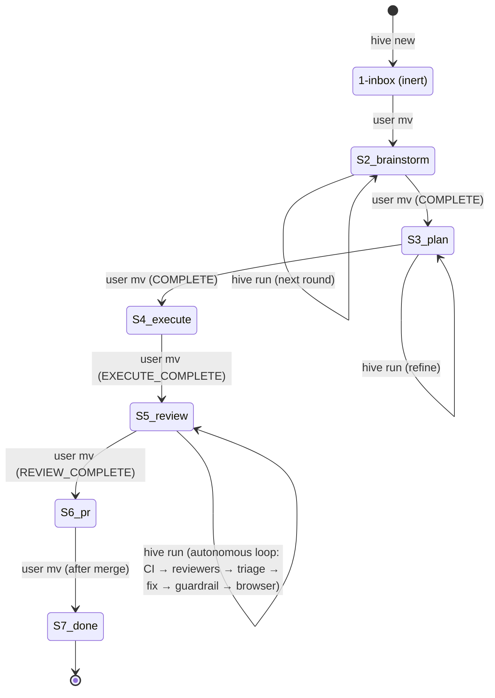

**TLDR**: Hive is a small Ruby 3.4 / Thor CLI that drives a six-stage filesystem state machine. The CLI dispatches into per-stage runners; each runner spawns `claude -p` as a subprocess inside a per-task lock and a per-project commit lock. There is no daemon, no server, no database. Two filesystem trees per project hold all state.

## Layer cake

```
bin/hive                          Thor entry; rescues Hive::Error → exit
  └─ lib/hive/cli.rb              command class (init / new / run / status)
       └─ lib/hive/commands/      Init · New · Run · Status
            └─ lib/hive/stages/   Inbox · Brainstorm · Plan · Execute · Pr · Done
                 ├─ Stages::Base  template render + agent spawn helpers
                 └─ Hive::Agent   `claude -p` subprocess wrapper
                      └─ Hive::Markers / Lock / Worktree / GitOps / Config / Task
```

Top-down, each layer only depends on the ones below it. There are no cycles. Stage runners are module-level functions (`run!`) with no shared mutable state.

## Two filesystem trees per project

1. **`<project>/.hive-state/`** — a worktree of the orphan branch `hive/state`. Holds task folders, configs, locks, logs. Never appears in master because master's `.gitignore` excludes it.
2. **`<worktree_root>/<slug>/`** (default `~/Dev/<project>.worktrees/<slug>/`) — the feature worktree. Contains actual code, branched off `<default_branch>`. Created by `4-execute/`.

Master is never modified by Hive (apart from one initial `chore: ignore .hive-state worktree` commit). All hive metadata lives on `hive/state` so master `git log` stays code-only.

## Process model

`hive run` is synchronous, single-process, single-task:

1. Parent acquires per-task lock (`<task>/.lock`, EXCL with stale-PID detection).
2. Parent spawns `claude -p` via `Process.spawn(..., pgroup: true, out:/err: pipe)` (`lib/hive/agent.rb:51`).
3. Parent traps SIGINT/SIGTERM to forward `kill -TERM -<pgid>` to the child group.
4. Parent's reader thread streams stdout/stderr into `<.hive-state>/logs/<slug>/<label>-<ts>.log`.
5. Parent polls `Process.wait(pid, WNOHANG)` until completion or timeout. On timeout, sends TERM, waits 3s grace, escalates to KILL.
6. Parent records pre/post inode of the state file; mismatch → `<!-- ERROR concurrent_edit_detected -->` (an editor save with atomic rename happened during the run).
7. Marker is read again to derive the run's status; runner returns `{commit:, status:}`.
8. Parent acquires per-project commit lock (`<.hive-state>/.commit-lock` flock) and runs `git add . && git commit` in the hive-state worktree.
9. Parent prints the marker + a `next:` hint and releases the task lock.

Concurrency: any number of `hive run` processes on **different** tasks can proceed in parallel; the per-project commit lock serialises only the brief `git commit` window.

## Stage-runner dispatch

`Commands::Run#pick_runner` (`lib/hive/commands/run.rb:27`) is a `case` on `task.stage_name`:

| Stage | Runner | Calls claude? | Touches code? |
|-------|--------|---------------|----------------|
| `inbox` | `Stages::Inbox` | no | no |
| `brainstorm` | `Stages::Brainstorm` | yes | no |
| `plan` | `Stages::Plan` | yes | no |
| `execute` | `Stages::Execute` | yes (impl-only since ADR-014) | yes (in feature worktree) |
| `review` | `Stages::Review` (orchestrator) → `Review::{CiFix,Triage,BrowserTest,FixGuardrail}` + `Reviewers::Agent` | yes (CI-fix + reviewers + triage + fix + browser; sub-spawns use `status_mode: :exit_code_only` per ADR-021) | yes (fix agent commits in feature worktree) |
| `pr` | `Stages::Pr` | yes (unless idempotent) | yes (`git push`, `gh pr create`) |
| `done` | `Stages::Done` | no | no |

Inbox/Done are the two non-working stages: capture-only and archive-only.

## Agent invocation contract

`Hive::Agent#build_cmd` (`lib/hive/agent.rb:121`) always assembles:

```
claude -p
  --dangerously-skip-permissions
  [--add-dir <dir> ...]
  --max-budget-usd <stage_budget>
  --output-format stream-json
  --include-partial-messages
  --verbose
  --no-session-persistence
  <prompt>
```

`HIVE_CLAUDE_BIN` env var overrides the binary (used by tests with `test/fixtures/fake-claude`). `--verbose` is mandatory whenever `-p` is paired with `--output-format stream-json` (claude rejects the invocation otherwise).

`--dangerously-skip-permissions` is a deliberate single-developer trust model. The plan documents this trade-off explicitly: security boundaries come from (a) **per-spawn prompt-injection wrapping** with a fresh random nonce per spawn — `<user_supplied_<hex16>>…</user_supplied_<hex16>>` — so attacker-supplied closing tags can't terminate the wrapper, and a hostile reviewer output saved into `accepted_findings` can't leak into the next spawn (ADR-019 supersedes ADR-008's per-process memoization), (b) physical cwd isolation — every stage's `add-dir` is narrowed to `task.folder` (brainstorm/plan deliberately do **not** add the project root, so prompt-injected user input cannot reach project source); per-CLI variation in the isolation flag is logged to `<task>/logs/isolation-warnings.log` (ADR-018), (c) SHA-256 integrity checks on `plan.md` + `worktree.yml` (+ `task.md` for triage / fix in 5-review) around every code-touching spawn; tampering yields `<!-- ERROR reason=implementer_tampered|triage_tampered|fix_tampered -->` (ADR-013), and (d) the post-fix diff guardrail (ADR-020 / `Hive::Stages::Review::FixGuardrail`) which scans `git diff base..head` after Phase 4 fix commits for `shell_pipe_to_interpreter`, `ci_workflow_edit`, secrets (via `Hive::SecretPatterns`), `dotenv_edit`, lockfile churn, and `100755` mode flips — match → `REVIEW_WAITING reason=fix_guardrail`. A separate post-PR secret-scan in `Stages::Pr` blocks publishing on api-key/AWS/GH-token regex hits.

## State machine (cross-stage)



`mv` between directories is the only approval gesture. The user can always interrupt by editing files in place.

## Key external integrations

- **`claude` CLI** ≥ 2.1.118 — verified via `claude --version` at agent spawn time (`Hive::Agent.check_version!`).
- **`gh` CLI** — used by `6-pr` for `gh auth status`, `gh pr list`, `gh pr create`.
- **`git`** ≥ 2.40 — uses `worktree add --no-checkout --detach`, `worktree list --porcelain`, `worktree remove`, `commit`, `show-ref`, `symbolic-ref`. All invoked through `Open3.capture3` array form (no shell).

## Code conventions

- Ruby 3.4, frozen-string-literal **disabled** (per `.rubocop.yml`).
- Double-quoted strings (`Style/StringLiterals: double_quotes`).
- Layout/LineLength max 120; Metrics/MethodLength max 30; Metrics/AbcSize max 35; Metrics/ClassLength max 200.
- Module-level functions (`module_function`) for stateless helpers (`Stages::*`, `Markers`, `Lock`, `Config`).
- Classes for stateful entities (`Task`, `Worktree`, `GitOps`, `Agent`, `CLI`, `Commands::*`).

## Related pages

- [[state-model]] — directory layout, marker grammar, configs.
- [[cli]] — command surface.
- [[dependencies]] — gem choices.
- [[decisions]] — architectural decisions (ADR style).
- [[modules/agent]] · [[modules/worktree]] · [[modules/git_ops]] · [[modules/markers]] · [[modules/lock]] · [[modules/task]] · [[modules/config]]
