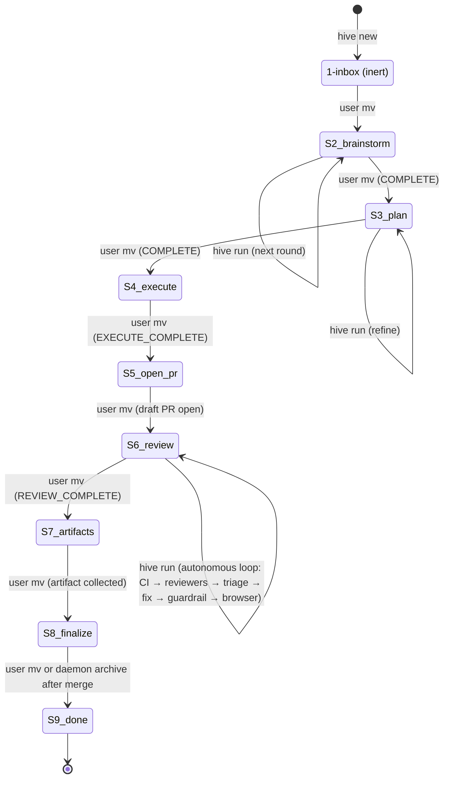

**TLDR**: Hive is a Ruby 3.4 / Thor agent workflow engine over folder-backed state machines. Built-in and project-authored workflows share one workflow/data layer. Accepted task-stage agents run as durable attempts under detached supervisor wrappers; CLI, bot, web, and daemon surfaces attach or observe instead of owning agent lifetime. Workflow and attempt state are filesystem records plus global YAML config, while token-usage metrics use a small SQLite store.

## Layer cake

```
bin/hive                          Thor entry; rescues Hive::Error -> exit
  └─ lib/hive/cli.rb              command class (init / new / run / status / daemon / bot / web / tui)
       └─ lib/hive/commands/      Init · New · Run · Status · StageAction · Daemon · Bot · TUI helpers
            └─ lib/hive/stages/   Inbox · Brainstorm · Plan · Execute · OpenPr · Review · Artifacts · Finalize · Done
                 ├─ Stages::Base      template render + AgentProfile spawn helpers
                 ├─ ClaudeLauncher    project-global tmux/headless Claude routing
                 └─ Hive::Agent       headless subprocess wrapper
                      └─ Hive::Markers / Lock / Worktree / GitOps / Config / Task
```

Top-down, each layer only depends on the ones below it. There are no cycles. Stage runners are module-level functions (`run!`) with no shared mutable state.

## Two filesystem trees per project

1. **`<project>/.hive-state/`** — a worktree of the orphan branch `hive/state`. Holds task folders, configs, locks, logs. Never appears in master because master's `.gitignore` excludes it.
2. **`<worktree_root>/<slug>/`** (default `~/Dev/<project>.worktrees/<slug>/`) — the feature worktree. Contains actual code, branched off `<default_branch>`. Created by `4-execute/`.

Master is never modified by Hive (apart from one initial `chore: ignore .hive-state worktree` commit). All hive metadata lives on `hive/state` so master `git log` stays code-only.

## Process model

Public task commands admit through `Hive::Attempts::Dispatcher`. Admission
creates one `launching` lease for the task generation, then a short launcher
creates a detached POSIX session. Its supervisor claims the lease, wins first
heartbeat, and only then starts the existing Hive command in a worker group.
That internal command still takes the task lock, runs auto-rebase/stage/provider
logic, commits state under the project lock, and writes normal markers.

The wrapper owns heartbeat, checkpoints, ordered output frames, timeout,
worker identity, exit capture, and terminal receipt. The foreground CLI is a
read-only client: Ctrl-C/caller death detaches without signalling the attempt.
Bot, web, daemon auto-advance, and recovery share generation admission. The
daemon adopts wrappers by PID/start fingerprint without `wait2`;
`ChildSupervisor` remains for non-task ancillary work. See
[[modules/attempts]].

Concurrency is reconstructed from live/reserved leases after restart. The
project commit lock still serialises brief state commits, and a generation
lock prevents duplicate task-stage ownership.

## Scheduled architecture-patrol boundary

Architecture patrol is a post-merge subsystem beside the ordinary task state
machine. `RefactorPatrolMergeReconciler` turns finalize observations and
paginated GitHub catch-up into immutable, checksummed merge manifests. A
durable job aggregate then owns feature-level discovery progress, exhaustive
thesis dispositions, generation-fenced claims, and per-thesis action receipts.
`PatrolArbiter` shares one per-project scan budget between ordinary patrol and
architecture patrol and alternates kinds so neither queue can starve the
other.

Discovery is language-neutral and read-only. The mapper forms bounded
package/component slices from common and unfamiliar text-source extensions,
manifests, source roots, build files, infrastructure layouts, and shebang
scripts; lightweight import resolution supplies a source-only dependency graph
without treating tests, docs, assets, generated files, or chunk boundaries as
architectural coupling. Fixture/test manifests never become review slices. A
mapper failure is retained as an incomplete-measurement diagnostic, so fallback
zero signals cannot be mistaken for evidence that a component has no leverage.
The reviewer starts from affected feature slices from the merge manifest, but a
refactoring thesis may span mapped features when it removes duplicated ownership
or an unstable dependency direction. Cross-feature scope is recorded rather than
treated as a risk by itself. The prompt retains a fixed-size list of mapped
dependency, peer-entrypoint, and test paths so the agent can inspect the relevant
neighboring boundary without broad repository search. The reviewer runs under provider-specific read-only
enforcement and must leave the registered checkout byte-for-byte unchanged. A strict run-wide thesis
budget leaves later slices resumable, and every cited file/line/snippet is
verified against the pinned checkout's real bytes before a thesis is admissible.
The mutation boundary is intentionally narrower. Each accepted thesis is
processed in an isolated worktree only when certified public-contract guards,
root confinement, `.hive-state` control-plane protection, secret scanning,
dependency guards, applicable
configured validation (or the built-in diff check for inert documentation
formats), and the
independently enabled `auto_fix` policy all pass. Cross-feature patches remain
eligible regardless of file count or diff size, and every changed path
participates in trunk-overlap reanalysis. Contract-changing,
dependency-changing, or otherwise high-risk work may instead become one
deduplicated strategic issue when issue filing is independently enabled.
Architecture patrol never
merges its own PRs; an OPEN or MERGED publication succeeds only after entering
the normal `6-review` flow.

The daemon passes large child results through an atomic, job-bound result file
instead of relying on the bounded stdout tail. Full authority requires the
target's exact live registration; enabled owners and disabled registrations
with pending remote continuations participate in fresh repository-ownership
checks. PR and issue creation persist an intent before the first remote
mutation and re-check both ownership and the exact claim generation around
publication. Canonical actions bind source host, repository, kind, and thesis
identity; fixes publish through the repository-global
`hive-refactor/<canonical-action-id>` branch. Exact-host PR verification, a
fresh handoff fence, remote branch OID checks, and action marker reconciliation
make crash recovery fail closed. Family, fingerprint, and global canonical
catalog indexes are rebuildable projections. Validated terminal effects are
also copied into immutable global per-action proof archives, allowing exact
cross-registration reuse even after owner deregistration or path removal;
corrupt/conflicting proof blocks. Immutable manifests and job aggregates remain
the per-occurrence authority. See
[[commands/refactor-patrol]], [[modules/daemon]], [[modules/gh]], and
[[state-model]].

## Stage-runner dispatch

`Commands::Run#pick_runner` (`lib/hive/commands/run.rb:27`) is a `case` on `task.stage_name`:

| Stage | Runner | Calls claude? | Touches code? |
|-------|--------|---------------|----------------|
| `inbox` | `Stages::Inbox` | no | no |
| `brainstorm` | `Stages::Brainstorm` | yes | no |
| `plan` | `Stages::Plan` | yes | no |
| `execute` | `Stages::Execute` | yes (impl-only since ADR-014) | yes (in feature worktree) |
| `open-pr` | `Stages::OpenPr` | yes | no code edits (`git push`, `gh pr create --draft`) |
| `review` | `Stages::Review` (orchestrator) → `Review::{CiFix,Triage,BrowserTest,FixGuardrail}` + `Hive::Reviewers` adapters | yes (CI-fix + reviewers + triage + fix + browser; sub-spawns use `status_mode: :exit_code_only` per ADR-021) | yes (fix agent commits in feature worktree) |
| `artifacts` | `Stages::Artifacts` | yes | no code edits (`artifact.md` collection handoff) |
| `finalize` | `Stages::Finalize` | yes | no code edits (`gh pr edit`, `gh pr ready`, `summary.md`) |
| `done` | `Stages::Done` | no | no |

Inbox/Done are the two non-working stages: capture-only and archive-only.

## Agent invocation contract

Headless agent spawns are profile-driven. `Hive::Agent#build_cmd`
starts with the selected `AgentProfile` binary/headless flag, then adds
profile-specific permission, add-dir, budget, per-run CLI extras, and
output-format flags. Claude, Codex, Pi, and Grok therefore share one subprocess
wrapper while keeping their CLI-specific argv and status-detection
contracts in `lib/hive/agent_profiles/`.

Claude-backed stages add one config-specific layer on top of the profile:
`Hive::Config.claude_cli_flags(cfg)` turns `claude.model` and
`claude.effort` into an argv fragment used by both headless
`Hive::Agent` and tmux `Hive::ClaudeLauncher` sessions. Fresh projects
default `claude.model` to `default`, so Hive passes Claude Code's live
recommended-model alias instead of inheriting the operator's interactive
selection. `model: inherit` (or blank) omits `--model`; aliases/full
model names pass through. `effort: default`, `inherit`, or blank omits
`--effort`; other explicit values pass through, with fresh init offering
`low`, `medium`, and `high`.

Fresh project setup separates reviewer policy by source. Normal feature
PRs use `review.reviewers`, populated by `hive init` from the normal
reviewer prompt. Synthetic patrol PR tasks whose `task.md` frontmatter
has `source: patrol` use `patrol.review.reviewers` instead; the fresh
default is the native single-pass `codex-native-review`
(`kind: codex_review`) adapter. `hive init` can add the Codex or Claude
CE `ce-code-review` fan-out reviewers for broader patrol review coverage;
`pr-review-toolkit` remains a normal-reviewer option only. The review runner
selects between those lists at Phase 2, before dispatching reviewer adapters.

For the built-in Claude profile, the default headless argv is:

```
claude -p
  --dangerously-skip-permissions
  [--add-dir <dir> ...]
  --max-budget-usd <stage_budget>
  [--model <claude.model>]
  [--effort <claude.effort>]
  --output-format stream-json
  --include-partial-messages
  --verbose
  --no-session-persistence
  <prompt>
```

`HIVE_CLAUDE_BIN` env var overrides the binary (used by tests with
`test/fixtures/fake-claude`). `--verbose` is mandatory whenever `-p` is
paired with `--output-format stream-json` (claude rejects the invocation
otherwise). When a Claude spawn receives `permission_mode` other than
`bypassPermissions`, the skip flag is replaced with
`--permission-mode <mode>`.

Claude-backed stages normally route through `Hive::ClaudeLauncher`,
which honors project config `claude.mode`. `tmux` runs an attachable
interactive Claude session using the configured
`claude.permission_mode`; `headless` delegates back to `Hive::Agent`.

Provider-limit handling is shared across headless and tmux paths through
`Hive::AgentLimit`. Headless failures inspect the captured final message
before generic timeout/exit-code handling; tmux readiness, terminal-marker,
and expected-output waits inspect the pane tail so Claude's usage-credit menu
surfaces as `limits reached for claude:` / `ERROR reason=limits_reached`
instead of being masked as a timeout or session failure.

The default Claude permission path (`bypassPermissions`, which maps to `--dangerously-skip-permissions`) is a deliberate single-developer trust model. The plan documents this trade-off explicitly: security boundaries come from (a) **per-spawn prompt-injection wrapping** with a fresh random nonce per spawn — `<user_supplied_<hex16>>…</user_supplied_<hex16>>` — so attacker-supplied closing tags can't terminate the wrapper, and a hostile reviewer output saved into `accepted_findings` can't leak into the next spawn (ADR-019 supersedes ADR-008's per-process memoization), (b) physical cwd isolation — every stage's `add-dir` is narrowed to `task.folder` (brainstorm/plan deliberately do **not** add the project root, so prompt-injected user input cannot reach project source); per-CLI variation in the isolation flag is logged to `<task>/logs/isolation-warnings.log` (ADR-018), (c) SHA-256 integrity checks on `plan.md` + `worktree.yml` (+ `task.md` for triage / fix in 6-review) around every code-touching spawn; tampering yields `<!-- ERROR reason=implementer_tampered|triage_tampered|fix_tampered -->` (ADR-013), (d) the Phase 4 auto-commit scope gate, which checks staged fallback-commit paths against `review.fix.auto_commit.scope_check` before Hive writes trailered fix commits, and (e) the post-fix diff guardrail (ADR-020 / `Hive::Stages::Review::FixGuardrail`) which scans `git diff base..head` after Phase 4 fix commits for `shell_pipe_to_interpreter`, `ci_workflow_edit`, secrets (via `Hive::SecretPatterns`), `dotenv_edit`, lockfile churn, and `100755` mode flips — match → `REVIEW_WAITING reason=fix_guardrail`. PR publishing paths (`OpenPr`, `Review::GithubPublisher`, `Finalize`) also secret-scan before sending content to GitHub.

## State machine (cross-stage)


```mermaid
stateDiagram-v2
    [*] --> S1_inbox: hive new
    S1_inbox: 1-inbox (inert)
    S1_inbox --> S2_brainstorm: user mv
    S2_brainstorm --> S2_brainstorm: hive run (next round)
    S2_brainstorm --> S3_plan: user mv (COMPLETE)
    S3_plan --> S3_plan: hive run (refine)
    S3_plan --> S4_execute: user mv (COMPLETE)
    S4_execute --> S5_open_pr: user mv (EXECUTE_COMPLETE)
    S5_open_pr --> S6_review: user mv (draft PR open)
    S6_review --> S6_review: hive run (autonomous loop: CI → reviewers → triage → fix → guardrail → browser)
    S6_review --> S7_artifacts: user mv (REVIEW_COMPLETE)
    S7_artifacts --> S8_finalize: user mv (artifact collected)
    S8_finalize --> S9_done: user mv or daemon archive after merge
    S9_done --> [*]
```

`mv` between directories is the only approval gesture. The user can always interrupt by editing files in place.

## Key external integrations

- **`claude` CLI** ≥ 2.1.118 — verified via `claude --version` at agent spawn time (`Hive::Agent.check_version!`).
- **`gh` CLI** — used by `5-open-pr`, review comment mirroring, and `8-finalize`.
- **`git`** ≥ 2.40 — uses `worktree add --no-checkout --detach`, `worktree list --porcelain`, `worktree remove`, `commit`, `show-ref`, `symbolic-ref`. All invoked through `Open3.capture3` array form (no shell).

## TUI / MVU pipeline

The TUI ([[commands/tui]]) is built on the bubbletea-ruby Model–View–Update loop, with a Hive-flavoured split that keeps state transitions pure and side effects honest.

```
bin/hive tui  →  Hive::Tui::App.run_charm
                    ├─ StateSource (1 Hz background poll)
                    │     └─ runner.send(SnapshotArrived | PollFailed)
                    └─ PasteAwareRunner < Bubbletea::Runner
                          ├─ InputDecoder.drain(raw_bytes)  → [Hive::Tui::Messages::*]
                          └─ BubbleModel#update(message)
                                ├─ translate(framework_msg → hive_msg)
                                │     └─ KeyMap.message_for(mode, key, row, pane_focus)
                                ├─ handle_side_effect(hive_msg)   ── I/O & runner-aware ──
                                │     (DispatchCommand, OpenLogTail,
                                │      OpenInputEditor, NewIdeaSubmitted, …)
                                └─ Update.apply(hive_model, msg)  ── pure state transition ──
```

### Layer responsibilities

- **`Hive::Tui::Model`** — frozen `Data` record holding the entire UI state (snapshot, scope, filter, cursor, mode, prompt buffers). Mutated only via `Model#with(...)`.
- **`Hive::Tui::Update`** (`lib/hive/tui/update.rb`) — pure dispatch on `Messages::*`. Returns `[new_model, cmd]` where `cmd` is either `nil` or a Bubbletea command (e.g., `Bubbletea.quit`). No I/O, no Bubbletea coupling — fully unit-testable without a terminal.
- **`Hive::Tui::Messages`** (`lib/hive/tui/messages.rb`) — closed enum of `Data.define` records / singleton classes, one per state-transition kind. New transitions add a Message + an `Update.apply` branch + a test.
- **`Hive::Tui::KeyMap`** (`lib/hive/tui/key_map.rb`) — pure `(mode, key, row, pane_focus) → Message`. Centralises every keystroke binding so curses/Bubbletea backends share one contract.
- **`Hive::Tui::BubbleModel`** (`lib/hive/tui/bubble_model.rb`) — `Bubbletea::Model` adapter. Translates framework messages (`KeyMessage`, `WindowSizeMessage`, `RawTextInput`) into Hive Messages, then either delegates to `Update.apply` (pure path) or runs them through `#handle_side_effect` (impure path) for messages that need a runner reference (`DispatchCommand`) or perform synchronous I/O (`OpenLogTail`, `OpenInputEditor`, `NewIdeaSubmitted`, …). I/O lives here so Update stays pure.
- **`Hive::Tui::PasteAwareRunner`** (`lib/hive/tui/paste_aware_runner.rb`) — `Bubbletea::Runner` subclass overriding `run_loop` / `process_input` to drain every raw read through `InputDecoder`. Pinned to bubbletea 0.1.4 (boot-time `VERSION` check) because the override touches private superclass instance variables.
- **`Hive::Tui::InputDecoder`** (`lib/hive/tui/input_decoder.rb`) — stateful byte-level decoder. Exists because the stock `Program#poll_event` parses one event per raw read and drops the rest of the bytes, breaking paste of more than ~16 bytes. The decoder buffers partial escape sequences across reads, brackets paste content with `\e[200~`/`\e[201~`, normalises paste content (CR/LF/TAB → space, C0/DEL stripped), caps `@pending` at 4 KiB and `@paste_buffer` at 1 MiB, and force-flushes a stalled paste after 5 seconds.
- **`Hive::Tui::Views::Format`** (`lib/hive/tui/views/format.rb`) — shared view formatting helpers. Truncation and left/right padding measure terminal display cells via `unicode-display_width`, so wide glyphs in task names or status icons do not shift fixed TUI columns.

### Key seams

- **Side-effect seam** — `BubbleModel#handle_side_effect` returns `[new_model, cmd]` to short-circuit `Update.apply`, or `nil` to fall through. This is the single line where impurity is allowed; everything else flows through `Update.apply`.
- **Paste routing-by-mode** — `InputDecoder` emits a `Messages::RawTextInput(text:, paste:)` for any text-bearing chunk; `BubbleModel#translate_raw_text_input` rewrites it to `NewIdeaTextInserted` / `FilterTextInserted` based on `model.mode`, so a paste landing in `:grid` mode never mutates a hidden prompt buffer.
- **Decoder reset on cancel** — `PasteAwareRunner` watches for transitions away from the previous editable mode (`:new_idea` / `:filter`, including `:new_idea ↔ :filter` jumps) and calls `InputDecoder#reset!` so an orphan paste held mid-prompt cannot dump into the next prompt.
- **GVL yielding** — bubbletea-ruby's input reader holds the GVL for the full `input_timeout`; `BubbleModel` schedules a recurring 10 ms `YieldTick` whose handler calls `Thread.pass`, keeping the StateSource poller and other background threads alive. See `docs/solutions/2026-04-27-charm-bubbletea-api-gaps.md`.

Cross-link: [[commands/tui]] for the user-facing surface, [[state-model]] for the snapshot grammar the TUI renders.

## Telegram bot pipeline

The Telegram bot ([[commands/bot]]) is the mobile-shaped companion to
the daemon. It watches the same `hive status --json` stream, uses the
same `Hive::TaskAction` classification, and turns rows that require
human input into inline-keyboard or free-text conversations.

```
hive bot start  →  Hive::Commands::Bot
                    └─ Hive::Bot::Supervisor
                         ├─ Telegram long-poll loop
                         │    └─ Router → slash/callback/free-text handlers
                         ├─ StatusWatcher loop
                         │    └─ NotificationDispatcher → inline keyboards
                         └─ ChildSupervisor reaper
                              └─ replies when spawned hive commands finish
```

The trust boundary matches the daemon: the bot is a thin command/draft
surface, not an alternate approval engine. Stage approvals call workflow
verbs with `--from <stage> --json`; recovery buttons call
`hive markers clear`; triage buttons call `hive accept-finding` /
`reject-finding`; text-only idea capture calls `hive new`. Two
in-process writes are intentionally scoped: brainstorm answer insertion,
which is limited to `### A<N>.` blocks under
`Hive::Lock.with_task_lock`, and Telegram idea-draft submission with
attachments or voice-note transcripts. Attachment capture downloads
allowed media into a temp staging dir; voice capture downloads the
Telegram voice file, transcribes it through `Hive::Bot::Transcriber`,
keeps only the confirmed transcript on the happy path, then calls
`Hive::Commands::New#call!` with the same body/attachment arguments as
other idea drafts. Final task files are still written through the same
`hive new` command path.

The Telegram bot answers brainstorm questions deterministically: an
operator replies in chat (or via `/answer <slug>`), the bot writes the
literal reply into the next unanswered slot of `brainstorm.md`, then
sends the next question. The earlier "Codex draft-assist" flow — where
Path A spawned Codex to draft an answer with write-draft/edit/cancel
buttons — has been retired; see [[modules/bot]] and [[state-model]].

## Hive Web and Hivebox pipeline

`hive web` serves a vanilla Rails 8 + Turbo app from `web/` (ADR-037; the
original Sinatra/Puma + SSE tier is gone). Local Hive Web is a browser control
plane over the same registry and workflow state as the CLI/TUI; loopback
requests use the `hive` identity without mandatory sign-in, including through
a local reverse proxy whose socket peer is loopback. GitHub is an optional
connection for repository listing and cloning and does not claim ownership.
Hivebox is the distinct owner-gated container mode. Its auth is the GitHub
device flow (ADR-036): a configured `web.github.owner` gates entry, while an
ownerless fresh box is claimable and the first successful login writes
`web.github.owner` under the global config lock. Owner-gated requests re-check
the current owner on every request and evict old sessions when
`web.github.owner` changes, so a repo-scoped session token cannot survive an
ownership rotation. Managed local installs stage `bundle install` plus a
production asset precompile and verify the CSS/JavaScript manifest before the
atomic bundle swap; same-version installs with missing assets are repaired.
Reads render
`Commands::Status#json_payload` snapshots; live updates flow over Turbo
Streams, with production Action Cable accepting same-origin-as-host and
`HIVEBOX_ORIGIN` only as an extra allow for split-origin deployments:
`StatusBroadcaster` (self-healing subscriber loop) bridges
`Hive::Web::StatusFeed` — one shared poller, volatile-field-deduped — to a
broadcast of the projects frame over solid_cable. Mutations reuse gem
primitives: `Commands::Approve` in-process, `Commands::Drop` in-process for
Advanced hard deletes, daemon dispatch queue for stage runs, the bot's
`RecoverySequence` for task-page Retry recovery (`markers clear` plus the
stage rerun as one queued request sequence), `BrainstormAnswerWriter` for Q&A
answers, and `Commands::New` (with the TUI's `attachments:` contract) for the
idea composer. Repo setup clones via `gh`, reuses the `hive init` prompt seam,
and normalizes GitHub SSH origins to https so later daemon-owned `5-open-pr`
pushes use token-backed credentials; the Agents page can run the `gh` PTY
login relay so the image's `gh auth git-credential` helper supplies those
push credentials without docker-exec setup. The container supervisor (tini →
`Hive::Web::Supervisor`) runs daemon + web + optional bot, restarts crashed or
signal-killed children with backoff, survives malformed config, and
SIGHUP-reloads the bot set. Details: [[commands/web]].

The Rails layer wraps each registry entry in a `Project` model. Project lookup,
config-backed workflow/default/daemon behavior, and the non-interactive
`Hive::Commands::Init` setup seam live there; controllers and views use named
project attributes instead of passing registry hashes around. Gem adapters can
still call `fetch` at the explicit compatibility boundary.

Repository admission is a separate `Repository` model: it validates GitHub
source/name input, owns the clone target, bounds and cleans up `gh repo clone`,
and normalizes origins before handing the checkout to `Project#setup!`.
`ReposController` only selects between new admission and existing-project
setup, then renders or redirects.

Workflow list rows are typed `Workflow` models rather than anonymous adapter
hashes. The model owns the shared `Hive::Web::WorkflowLifecycle` boundary for
listing and scaffolding. Reviewed install/update/remove state is represented by
`WorkflowChange`: it creates the dry-run, signs the operation/project/identity
receipt, verifies consent and expiry, preserves the separate escalation gate,
and applies only the reviewed identity. Existing workflow URLs now enter
`Workflows::PreviewsController#create` or
`Workflows::ChangesController#create`; route defaults supply the operation from
the matched route rather than accepting an operator-controlled action name.
`WorkflowsController` is left with the collection page and authored-workflow
creation.

A task page is a filesystem-backed `Task`, built from the matching status
snapshot row and its `Project`. That model owns task
reads and their invariants — workflow-aware artifact ordering, brainstorm
questions, bounded log tails, worktree presence, and media-manifest/path
validation. `TasksController` renders that resource. Namespaced task-resource
controllers expose diff, log, media, approval, rejection, drop, run, recovery,
answer, and intervention through standard `show`/`create` actions; each remains
a thin HTTP boundary over `Task` or `Hive::Web::Dispatcher`.

## Dispatch flow (durable generation ownership)

Every task-stage producer resolves through one semantic admission protocol.
CLI calls admit locally and attach. Bot/web requests remain file-backed
deliveries, consumed by the daemon when present. Daemon auto-advance and loss
healing call the same dispatcher. A daemon is optional after acceptance.

```text
CLI ───────────────────────────────┐
bot/web → request queue → daemon ──┼→ Attempts::Dispatcher
daemon auto-advance / recovery ────┘          │
                                      generation lock + lease
                                               │
                                      detached supervisor
                                               │
                                      internal Hive worker
                                               │
                                      provider agent group
```

Queue claims are delivery metadata and store the resolved attempt reference.
The daemon reconciles leases before healing or admission, reconstructs
capacity, and completes a delivery from the wrapper receipt. It never reaps an
adopted wrapper. Read-only/ancillary bot commands may still use the bot child
supervisor, but task ownership never does. Filesystem locks, atomic rename,
and fsync keep the protocol host-local without adding an event bus. See
[[modules/attempts]] and [[modules/daemon]].

## Code conventions

- Ruby 3.4, frozen-string-literal **disabled** (per `.rubocop.yml`).
- Double-quoted strings (`Style/StringLiterals: double_quotes`).
- Layout/LineLength max 120; Metrics/MethodLength max 30; Metrics/AbcSize max 35; Metrics/ClassLength max 200.
- Module-level functions (`module_function`) for stateless helpers (`Stages::*`, `Markers`, `Lock`, `Config`).
- Classes for stateful entities (`Task`, `Worktree`, `GitOps`, `Agent`, `CLI`, `Commands::*`).

## Related pages

- [[state-model]] — directory layout, marker grammar, configs.
- [[cli]] — command surface.
- [[dependencies]] — gem choices.
- [[decisions]] — architectural decisions (ADR style).
- [[modules/agent]] · [[modules/agent_profile]] · [[modules/worktree]] · [[modules/git_ops]] · [[modules/markers]] · [[modules/lock]] · [[modules/task]] · [[modules/config]] · [[modules/daemon]] · [[modules/gh]] · [[modules/bot]] · [[commands/refactor-patrol]]
