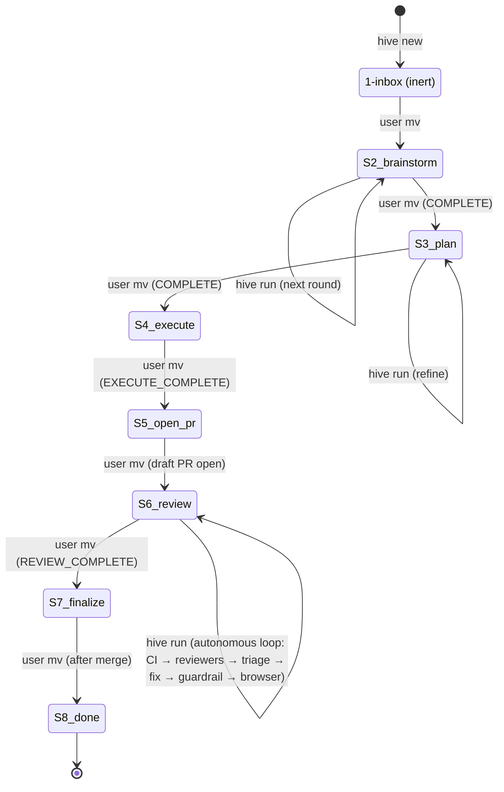

**TLDR**: Hive is a Ruby 3.4 / Thor control plane over a nine-stage filesystem state machine. The CLI dispatches into per-stage runners; stage agents run through configured AgentProfile CLIs inside per-task and per-project locks. Optional long-running surfaces sit beside the CLI: `hive daemon` advances safe tasks automatically, `hive tui` renders a terminal dashboard, and `hive bot` turns human-input gates into Telegram interactions. There is still no database; durable state is the filesystem plus global YAML config.

## Layer cake

```
bin/hive                          Thor entry; rescues Hive::Error → exit
  └─ lib/hive/cli.rb              command class (init / new / run / status / daemon / bot)
       └─ lib/hive/commands/      Init · New · Run · Status · StageAction · Daemon · Bot
            └─ lib/hive/stages/   Inbox · Brainstorm · Plan · Execute · OpenPr · Review · Finalize · Done
                 ├─ Stages::Base  template render + agent spawn helpers
                 └─ Hive::Agent   `claude -p` subprocess wrapper
                      └─ Hive::Markers / Lock / Worktree / GitOps / Config / Task
```

Top-down, each layer only depends on the ones below it. There are no cycles. Stage runners are module-level functions (`run!`) with no shared mutable state.

## Two filesystem trees per project

1. **`<project>/.hive-state/`** — a worktree of the orphan branch `hive/state`. Holds task folders, configs, locks, logs. Never appears in master because master's `.gitignore` excludes it.
2. **`<worktree_root>/<slug>/`** (default `~/Dev/<project>.worktrees/<slug>/`) — the feature worktree. Contains actual code, branched off `<default_branch>`. Created by `4-execute/`.

Master is never modified by Hive (apart from one initial `chore: ignore .hive-state worktree` commit). All hive metadata lives on `hive/state` so master `git log` stays code-only.

## Process model

`hive run` is synchronous, single-process, single-task:

1. Parent acquires per-task lock (`<task>/.lock`, EXCL with stale-PID detection).
2. Parent spawns `claude -p` via `Process.spawn(..., pgroup: true, out:/err: pipe)` (`lib/hive/agent.rb:51`).
3. Parent traps SIGINT/SIGTERM to forward `kill -TERM -<pgid>` to the child group.
4. Parent's reader thread streams stdout/stderr into `<.hive-state>/logs/<slug>/<label>-<ts>.log`.
5. Parent polls `Process.wait(pid, WNOHANG)` until completion or timeout. On timeout, sends TERM, waits 3s grace, escalates to KILL.
6. Parent records pre/post inode of the state file; mismatch → `<!-- ERROR concurrent_edit_detected -->` (an editor save with atomic rename happened during the run).
7. Marker is read again to derive the run's status; runner returns `{commit:, status:}`.
8. Parent acquires per-project commit lock (`<.hive-state>/.commit-lock` flock) and runs `git add . && git commit` in the hive-state worktree.
9. Parent prints the marker + a `next:` hint and releases the task lock.

Concurrency: any number of `hive run` processes on **different** tasks can proceed in parallel; the per-project commit lock serialises only the brief `git commit` window.

## Stage-runner dispatch

`Commands::Run#pick_runner` (`lib/hive/commands/run.rb:27`) is a `case` on `task.stage_name`:

| Stage | Runner | Calls claude? | Touches code? |
|-------|--------|---------------|----------------|
| `inbox` | `Stages::Inbox` | no | no |
| `brainstorm` | `Stages::Brainstorm` | yes | no |
| `plan` | `Stages::Plan` | yes | no |
| `execute` | `Stages::Execute` | yes (impl-only since ADR-014) | yes (in feature worktree) |
| `open-pr` | `Stages::OpenPr` | yes | no code edits (`git push`, `gh pr create --draft`) |
| `review` | `Stages::Review` (orchestrator) → `Review::{CiFix,Triage,BrowserTest,FixGuardrail}` + `Reviewers::Agent` | yes (CI-fix + reviewers + triage + fix + browser; sub-spawns use `status_mode: :exit_code_only` per ADR-021) | yes (fix agent commits in feature worktree) |
| `finalize` | `Stages::Finalize` | yes | no code edits (`gh pr edit`, `gh pr ready`, `summary.md`) |
| `done` | `Stages::Done` | no | no |

Inbox/Done are the two non-working stages: capture-only and archive-only.

## Agent invocation contract

`Hive::Agent#build_cmd` (`lib/hive/agent.rb:121`) always assembles:

```
claude -p
  --dangerously-skip-permissions
  [--add-dir <dir> ...]
  --max-budget-usd <stage_budget>
  --output-format stream-json
  --include-partial-messages
  --verbose
  --no-session-persistence
  <prompt>
```

`HIVE_CLAUDE_BIN` env var overrides the binary (used by tests with `test/fixtures/fake-claude`). `--verbose` is mandatory whenever `-p` is paired with `--output-format stream-json` (claude rejects the invocation otherwise).

`--dangerously-skip-permissions` is a deliberate single-developer trust model. The plan documents this trade-off explicitly: security boundaries come from (a) **per-spawn prompt-injection wrapping** with a fresh random nonce per spawn — `<user_supplied_<hex16>>…</user_supplied_<hex16>>` — so attacker-supplied closing tags can't terminate the wrapper, and a hostile reviewer output saved into `accepted_findings` can't leak into the next spawn (ADR-019 supersedes ADR-008's per-process memoization), (b) physical cwd isolation — every stage's `add-dir` is narrowed to `task.folder` (brainstorm/plan deliberately do **not** add the project root, so prompt-injected user input cannot reach project source); per-CLI variation in the isolation flag is logged to `<task>/logs/isolation-warnings.log` (ADR-018), (c) SHA-256 integrity checks on `plan.md` + `worktree.yml` (+ `task.md` for triage / fix in 6-review) around every code-touching spawn; tampering yields `<!-- ERROR reason=implementer_tampered|triage_tampered|fix_tampered -->` (ADR-013), (d) the Phase 4 auto-commit scope gate, which checks staged fallback-commit paths against `review.fix.auto_commit.scope_check` before Hive writes trailered fix commits, and (e) the post-fix diff guardrail (ADR-020 / `Hive::Stages::Review::FixGuardrail`) which scans `git diff base..head` after Phase 4 fix commits for `shell_pipe_to_interpreter`, `ci_workflow_edit`, secrets (via `Hive::SecretPatterns`), `dotenv_edit`, lockfile churn, and `100755` mode flips — match → `REVIEW_WAITING reason=fix_guardrail`. PR publishing paths (`OpenPr`, `Review::GithubPublisher`, `Finalize`) also secret-scan before sending content to GitHub.

## State machine (cross-stage)


```mermaid
stateDiagram-v2
    [*] --> S1_inbox: hive new
    S1_inbox: 1-inbox (inert)
    S1_inbox --> S2_brainstorm: user mv
    S2_brainstorm --> S2_brainstorm: hive run (next round)
    S2_brainstorm --> S3_plan: user mv (COMPLETE)
    S3_plan --> S3_plan: hive run (refine)
    S3_plan --> S4_execute: user mv (COMPLETE)
    S4_execute --> S5_open_pr: user mv (EXECUTE_COMPLETE)
    S5_open_pr --> S6_review: user mv (draft PR open)
    S6_review --> S6_review: hive run (autonomous loop: CI → reviewers → triage → fix → guardrail → browser)
    S6_review --> S7_finalize: user mv (REVIEW_COMPLETE)
    S7_finalize --> S8_done: user mv (after merge)
    S8_done --> [*]
```

`mv` between directories is the only approval gesture. The user can always interrupt by editing files in place.

## Key external integrations

- **`claude` CLI** ≥ 2.1.118 — verified via `claude --version` at agent spawn time (`Hive::Agent.check_version!`).
- **`gh` CLI** — used by `5-open-pr`, review comment mirroring, and `8-finalize`.
- **`git`** ≥ 2.40 — uses `worktree add --no-checkout --detach`, `worktree list --porcelain`, `worktree remove`, `commit`, `show-ref`, `symbolic-ref`. All invoked through `Open3.capture3` array form (no shell).

## TUI / MVU pipeline

The TUI ([[commands/tui]]) is built on the bubbletea-ruby Model–View–Update loop, with a Hive-flavoured split that keeps state transitions pure and side effects honest.

```
bin/hive tui  →  Hive::Tui::App.run_charm
                    ├─ StateSource (1 Hz background poll)
                    │     └─ runner.send(SnapshotArrived | PollFailed)
                    └─ PasteAwareRunner < Bubbletea::Runner
                          ├─ InputDecoder.drain(raw_bytes)  → [Hive::Tui::Messages::*]
                          └─ BubbleModel#update(message)
                                ├─ translate(framework_msg → hive_msg)
                                │     └─ KeyMap.message_for(mode, key, row, pane_focus)
                                ├─ handle_side_effect(hive_msg)   ── I/O & runner-aware ──
                                │     (DispatchCommand, OpenLogTail,
                                │      OpenInputEditor, NewIdeaSubmitted, …)
                                └─ Update.apply(hive_model, msg)  ── pure state transition ──
```

### Layer responsibilities

- **`Hive::Tui::Model`** — frozen `Data` record holding the entire UI state (snapshot, scope, filter, cursor, mode, prompt buffers). Mutated only via `Model#with(...)`.
- **`Hive::Tui::Update`** (`lib/hive/tui/update.rb`) — pure dispatch on `Messages::*`. Returns `[new_model, cmd]` where `cmd` is either `nil` or a Bubbletea command (e.g., `Bubbletea.quit`). No I/O, no Bubbletea coupling — fully unit-testable without a terminal.
- **`Hive::Tui::Messages`** (`lib/hive/tui/messages.rb`) — closed enum of `Data.define` records / singleton classes, one per state-transition kind. New transitions add a Message + an `Update.apply` branch + a test.
- **`Hive::Tui::KeyMap`** (`lib/hive/tui/key_map.rb`) — pure `(mode, key, row, pane_focus) → Message`. Centralises every keystroke binding so curses/Bubbletea backends share one contract.
- **`Hive::Tui::BubbleModel`** (`lib/hive/tui/bubble_model.rb`) — `Bubbletea::Model` adapter. Translates framework messages (`KeyMessage`, `WindowSizeMessage`, `RawTextInput`) into Hive Messages, then either delegates to `Update.apply` (pure path) or runs them through `#handle_side_effect` (impure path) for messages that need a runner reference (`DispatchCommand`) or perform synchronous I/O (`OpenLogTail`, `OpenInputEditor`, `NewIdeaSubmitted`, …). I/O lives here so Update stays pure.
- **`Hive::Tui::PasteAwareRunner`** (`lib/hive/tui/paste_aware_runner.rb`) — `Bubbletea::Runner` subclass overriding `run_loop` / `process_input` to drain every raw read through `InputDecoder`. Pinned to bubbletea 0.1.4 (boot-time `VERSION` check) because the override touches private superclass instance variables.
- **`Hive::Tui::InputDecoder`** (`lib/hive/tui/input_decoder.rb`) — stateful byte-level decoder. Exists because the stock `Program#poll_event` parses one event per raw read and drops the rest of the bytes, breaking paste of more than ~16 bytes. The decoder buffers partial escape sequences across reads, brackets paste content with `\e[200~`/`\e[201~`, normalises paste content (CR/LF/TAB → space, C0/DEL stripped), caps `@pending` at 4 KiB and `@paste_buffer` at 1 MiB, and force-flushes a stalled paste after 5 seconds.

### Key seams

- **Side-effect seam** — `BubbleModel#handle_side_effect` returns `[new_model, cmd]` to short-circuit `Update.apply`, or `nil` to fall through. This is the single line where impurity is allowed; everything else flows through `Update.apply`.
- **Paste routing-by-mode** — `InputDecoder` emits a `Messages::RawTextInput(text:, paste:)` for any text-bearing chunk; `BubbleModel#translate_raw_text_input` rewrites it to `NewIdeaTextInserted` / `FilterTextInserted` based on `model.mode`, so a paste landing in `:grid` mode never mutates a hidden prompt buffer.
- **Decoder reset on cancel** — `PasteAwareRunner` watches for transitions away from the previous editable mode (`:new_idea` / `:filter`, including `:new_idea ↔ :filter` jumps) and calls `InputDecoder#reset!` so an orphan paste held mid-prompt cannot dump into the next prompt.
- **GVL yielding** — bubbletea-ruby's input reader holds the GVL for the full `input_timeout`; `BubbleModel` schedules a recurring 10 ms `YieldTick` whose handler calls `Thread.pass`, keeping the StateSource poller and other background threads alive. See `docs/solutions/2026-04-27-charm-bubbletea-api-gaps.md`.

Cross-link: [[commands/tui]] for the user-facing surface, [[state-model]] for the snapshot grammar the TUI renders.

## Telegram bot pipeline

The Telegram bot ([[commands/bot]]) is the mobile-shaped companion to
the daemon. It watches the same `hive status --json` stream, uses the
same `Hive::TaskAction` classification, and turns rows that require
human input into inline-keyboard or free-text conversations.

```
hive bot start  →  Hive::Commands::Bot
                    └─ Hive::Bot::Supervisor
                         ├─ Telegram long-poll loop
                         │    └─ Router → slash/callback/free-text handlers
                         ├─ StatusWatcher loop
                         │    └─ NotificationDispatcher → inline keyboards
                         └─ ChildSupervisor reaper
                              └─ replies when spawned hive commands finish
```

The trust boundary matches the daemon: the bot is a subprocess caller,
not an orchestrator. Stage approvals call workflow verbs with
`--from <stage> --json`; recovery buttons call `hive markers clear`;
triage buttons call `hive accept-finding` / `reject-finding`; `/idea`
calls `hive new`. The one direct write is brainstorm answer insertion,
which is scoped to `### A<N>.` blocks and protected by
`Hive::Lock.with_task_lock`.

Path A brainstorm help uses Codex as a short-lived subprocess per turn
through `Hive::Bot::CodexConversation`. Telegram-sourced text is wrapped
with the same per-spawn `<user_supplied_<hex>>` nonce boundary as stage
prompts, and Codex only returns a draft. The bot writes the literal
confirmed draft; Codex never edits `brainstorm.md` directly.

## Code conventions

- Ruby 3.4, frozen-string-literal **disabled** (per `.rubocop.yml`).
- Double-quoted strings (`Style/StringLiterals: double_quotes`).
- Layout/LineLength max 120; Metrics/MethodLength max 30; Metrics/AbcSize max 35; Metrics/ClassLength max 200.
- Module-level functions (`module_function`) for stateless helpers (`Stages::*`, `Markers`, `Lock`, `Config`).
- Classes for stateful entities (`Task`, `Worktree`, `GitOps`, `Agent`, `CLI`, `Commands::*`).

## Related pages

- [[state-model]] — directory layout, marker grammar, configs.
- [[cli]] — command surface.
- [[dependencies]] — gem choices.
- [[decisions]] — architectural decisions (ADR style).
- [[modules/agent]] · [[modules/worktree]] · [[modules/git_ops]] · [[modules/markers]] · [[modules/lock]] · [[modules/task]] · [[modules/config]] · [[modules/bot]]
