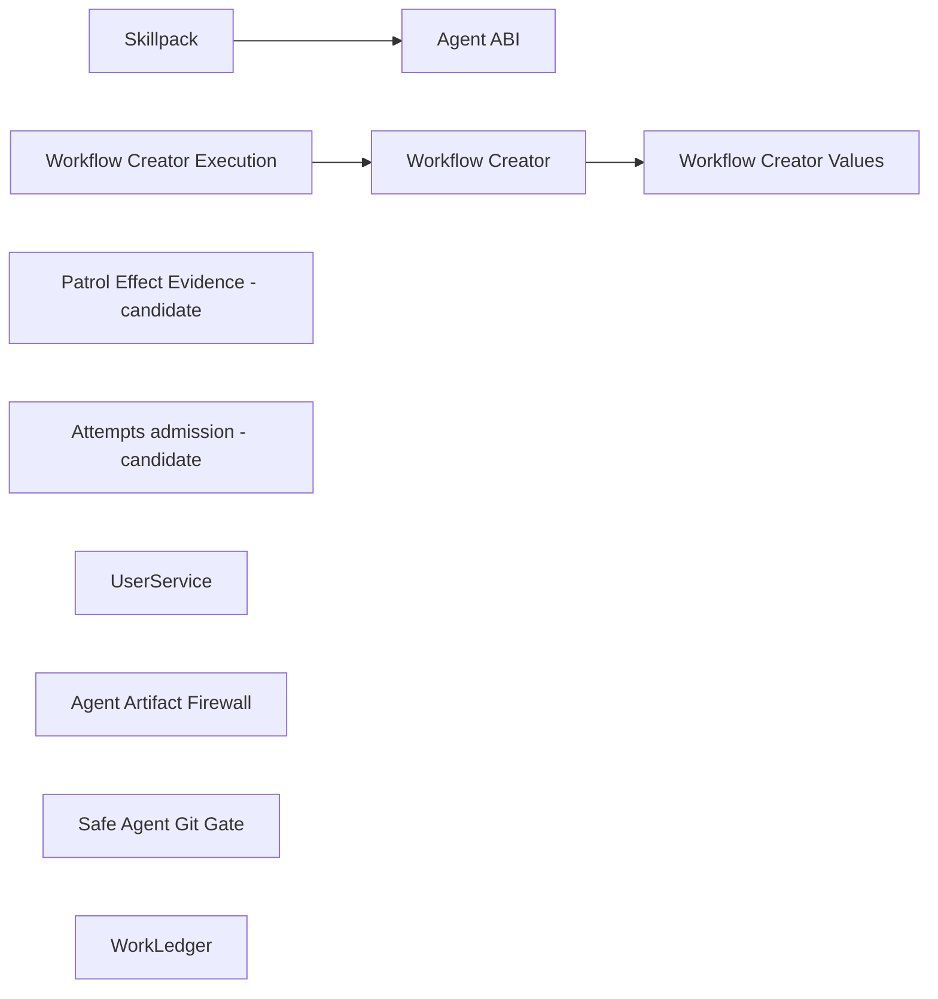

**TLDR**: Hive keeps reusable mechanisms in this monorepo and makes their
supported Ruby seams explicit before considering gems. The machine-readable
catalog records ownership, entry points, contracts, dependencies, consumers,
state and recovery responsibilities, maturity, and focused tests. Hive remains
the first and primary consumer.

## Current catalog

| Component | State | Current entry point | Narrative context |
|-----------|-------|---------------------|-------------------|
| Patrol Effect Evidence | `candidate` (U3a protocol complete; U3b/U3c proof pending) | `require "hive/modules/migration/patrol_evidence"` → `Hive::Modules::Migration::PatrolEvidence` | [[modules/patrol]] |
| Attempts admission / future RunReceipt | `candidate` (guarded reference) | `require "hive/attempts/api"` → `Hive::Attempts::API` | [[modules/attempts]] |
| Workflow Creator Values | `boundary-ready` | `require "./packaging/live_agent_skills/workflow_creator_text_safety"` → `HiveLiveAgentProof::WorkflowCreator::TextSafety` | [[component-boundaries]] |
| Workflow Creator | `boundary-ready` | `require "./packaging/live_agent_skills/workflow_creator_evidence"` → `HiveLiveAgentProof::WorkflowCreatorEvidence` | [[component-boundaries]] |
| Workflow Creator Execution | `boundary-ready` (deterministic U14 substrate; U15 live orchestration pending) | `require "./packaging/live_agent_skills/workflow_creator_execution"` → `HiveLiveAgentProof::WorkflowCreatorExecution` | [[component-boundaries]] |
| UserService | `boundary-ready` | `require "hive/user_service"` → `Hive::UserService` | [[modules/user_service]] |
| Agent ABI | `boundary-ready`; standalone package candidate | `require "hive/agent_runtime"` → `Hive::AgentRuntime` | [[modules/agent_cli_runtime]], [[modules/agent_profile]] |
| Agent Artifact Firewall | `boundary-ready` | `require "hive/artifact_firewall"` → `Hive::ArtifactFirewall` | [[modules/protected_files]] |
| Skillpack | `boundary-ready` | `require "hive/agent_skills"` → `Hive::AgentSkills` | [[commands/setup-agents]] |
| Safe Agent Git Gate | `boundary-ready` | `require "hive/agent_git_gate"` → `Hive::AgentGitGate` | [[modules/agent_git_gate]] |
| WorkLedger | `boundary-ready` | `require "hive/work_ledger"` → `Hive::WorkLedger` | [[state-model]] |

`candidate` means the current code is mapped, but callers, dependencies, or
policy still need refactoring before the seam is supported. `boundary-ready`
means the entry point, allowed dependency direction, consumer construction
rules, and clean-process load are enforced. It does not mean that a component
has earned a gem, version, repository, or release.

## Final graph audit

The catalog on 2026-08-04 retains eleven components: nine are
`boundary-ready`; Attempts and Patrol Effect Evidence remain `candidate`.
Patrol retains one bounded U3 exception for deterministic public-path and
independently authorized installed/live proof. Workflow Creator is composed
through its U1b typed publication facade, and Workflow Creator Execution adds
the stable deterministic U14 custody seam below still-pending U15 authenticated
orchestration.
Every retained entry point has focused clean-process load proof, every
catalog-owned path and focused test resolves inside this repository, and the
direct-construction guards pass against all production Ruby sources.

The component dependency graph has three edges:



All other cataloged components depend only on explicitly allowed lower-level
Hive primitives. The source audit found no retained experimental facade outside
the catalog: each promoted facade is owned by a catalog row and used by Hive,
while Attempts and Patrol Effect Evidence are deliberately retained as guarded
candidates rather than being promoted ahead of their remaining lifecycle or
qualification proof.

This is an internal architecture verdict, not a packaging verdict. None of the
nine ready components currently has the named non-Hive adopter and independent
package proof required by the standalone-gem plan.

`Patrol Effect Evidence` owns the immutable cross-product capture, selection,
intent, and receipt values, the single lower-level occurrence facade, bounded
observational indices, and the two deliberately separate product gateways.
Separate ordinary and architecture projectors validate their own input
vocabularies before producing the strict shared selection value; terminal
outcome is a different capture field. The facade composes one pure validator,
one occurrence store that alone writes work/effect/outbox records, one bounded
coordination-state writer, one outbox, and one effect state machine. The
coordination cell owns compacted sequence fences, the bounded non-sequence
retirement fence, and durable recovery backoff, but no product work or delivery
state. Both product gateways compose the same admission, sender, and
receipt-projection collaborators without inheriting from a shared product
superclass. `TransitionGateway` is a persistence-free Architecture
Patrol port: it routes `job`, `discovery`, and `action` mutations into the
architecture gateway but can only mutate by invoking JobStore. ActionRunner and
the scheduler delegate transition identities, claim fencing, reconciliation,
and occurrence finalization to bounded coordinators while retaining product
decisions and cadence. Command and daemon manifest intake share
`ArchitectureIntakeTransitions`; `ArchitectureOccurrenceStore` validates the
job scope over the shared journal from the immutable occurrence pointer in the
v3 JobStore aggregate. There is no binding sidecar or compatibility lookup.
StateStore and JobStore expose the separate product recovery APIs over the one
streamed occurrence journal. Terminal outcomes and canonical projection bytes
commit together; sequenced completions compact through high-water/floor state,
and a saturated non-sequence fence retains terminal proof rather than replaying.
EvidenceStore is never consulted to decide a retry or mutation.
U3a extends this same candidate row with exactly six pure or schema-conversion
owners: receipt, independent verifier, bounded effect index, qualification,
report projection, and report migration. Their dependency chain is one-way
from U2 public values toward report projection; the migration owner alone also
depends on the existing report storage facade. The six do not construct a
scheduler, runner, provider, process-custody component, recovery store,
qualification runtime, or the deferred `ModulePackage::ManagedStore`,
`Commands::Module::Lifecycle`, and `Modules::Dispatcher` U5-U7 owners. Report and Patrols
share one descriptor-confined `.mutation.lock`; schema conversion archives the
exact released v1 bytes, read-only probes validate source/archive/receipt
linkage, and interrupted receipt publication resumes only under that lock.
Report replacement, contradiction invalidation, and forward/reverse conversion
use digest CAS without acquiring cutover, rollback, retry, redispatch, or
effect-recovery authority. Qualification counts unique comparable
trigger/repository/SHA/change-window decision identities, and verifier tokens
can be constructed only after full independent binding checks.
Ordinary Patrol publication recovery additionally treats a durable binding or
uncertain-effect seed as custody of one exact validated patch. If its receipt
is missing, mismatched, or unreadable, Fixer stops without resetting the
branch, rerunning the agent, minting another patch, or deleting the worktree.
A terminal PR effect permits error cleanup only after the projected binding
is byte-for-byte equivalent to the complete binding derived from its terminal
receipt and matches the attempted patch; absent, partial, or conflicting
bindings retain the checkout for operator-visible recovery.

`JobStoreFreshStart` is the only cross-generation JobStore boundary. It has no
v2 reader or converter: an explicitly confirmed, daemon-fenced command
atomically exchanges only `v2/jobs` with a canonical marker, retains the exact
opaque directory under its transaction-bound archive name, and admits an empty
v3 store. `JobStore` is its only runtime composition root. Existing non-empty
v3 state and malformed or incomplete transaction evidence fail closed.
The reset first holds the stable profile activation lock and drains the exact
daemon generation, then takes the existing Patrol effect lock exclusively.
That effect lock, a stable JobStore generation lock, and an independent
PID/start-time writer fence remain held across the exchange, empty-v3
admission, and receipt publication. A restarted daemon is accepted only after
the same generation-bound operational snapshot reports runtime readiness.
The deterministic archive name is also a generation-presence sentinel:
archive-without-marker is corrupt/incomplete state and can never be treated as
a fresh project.
The shared Patrol capture and shadow-decision protocols contain no
`job_store.schema_v2_import` trigger or `schema_v2_import` outcome. Opaque
reset, not an effect-journal import, is the only released-JobStore transition.

The Patrol row has a non-empty construction boundary. Shared stores and
mechanisms, both product gateways, and intake/discovery/action/claim-maintenance
coordinators are forbidden outside their exact command, scheduler, state, and
action-runner composition roots. A separate static source contract allows
JobStore semantic mutators only inside those transition ports. This enforces
dependency direction; it is not runtime isolation.

The row remains `candidate`. U3a now proves the bounded value, verification,
duplicate-index, qualification, report-v2, and one-off report-conversion
contracts in focused tests, but does not produce qualification. U3b still owns
the committed deterministic scenario catalogue, independent controls, pure
collector, and complete both-module fault matrix; U3c still owns independently
authorized installed/live candidate, project, artifact, credential, sandbox,
process-custody, and publication proof. That exception is not permission for
another recovery store, compatibility effect map, qualification runner, or
cutover claim.

`Hive::Attempts::API` is the guarded reference admission slice. Its public
result contracts, focused clean-load proof, and exact internal construction
sites are enforced while it remains a `candidate`. U8 removed its former
catalog dependency and reciprocal-source exception by recognizing
`TaskProjection` as a Hive adapter rather than WorkLedger-owned source.
Attempts intentionally remains the guarded reference instead of claiming that
its full lifecycle is a supported component boundary: the slice does not
publish raw storage, reconciliation, supervision, capacity, loss-policy,
cancellation, export, or generic lifecycle operations.

`Workflow Creator Values` is the boundary-ready values-and-projection seam. Its
singular entry point is
`HiveLiveAgentProof::WorkflowCreator::TextSafety`; loading it real-requires the
sibling `Values` leaf so both public modules become available. `Values.capture`
accepts exact core JSON-shaped Ruby values and returns an anonymous frozen
snapshot exposing only fresh recursively frozen owned values and compact
canonical UTF-8 bytes. Unsupported subclasses, non-finite floats, ambiguous or
invalid encodings, normalized-key collisions, cycles, and declared depth, node,
source-byte, canonical-byte, logical-work, and integer-bit ceilings fail through
one fixed secret-free error.

`Workflow Creator Core` is its first production consumer and the only upward
component edge. The core owns an immutable schema-v1 vocabulary and validates
failed, primary, installed-closure, and declarative execution receipts only
after caller values have been imported into owned snapshots. Successful
validation returns the primary snapshot. Its nine-command plan assigns one
semantic label to each position. Because `hive new` owns slug generation,
position 7 is an explicit `{created_slug}` template: the execution receipt binds
argument 1 to the `slug` field returned by position 6, and the primary task row
must carry that same value. Failure construction separately
captures stable inputs and diagnostic detail, substitutes a fixed omitted-detail
marker when projection exceeds its bounded work ceiling, and snapshots only the
internally constructed result afterward. It owns no retention, publication,
process, provider, credential, archive I/O, or recovery authority.

`WorkflowCreatorBundle` is the component's bounded custody owner above that
semantic facade. `proof.rb` requires only this owner, which requires the Core;
the Core never requires upward into custody or proof. Source admission accepts
exactly the four vocabulary-named canonical JSON files from an owner-private
directory through no-follow, single-link, current-owner, size-bounded,
identity-stable descriptors. It validates both installation manifests, the
primary and exact bundle records, then the execution receipt through the Core's
public facade. Attestation retains those exact four bytes. Verification repeats
the same validation from the retained evidence directory, where platform JSON
may coexist, and compares the independently captured attested primary by
canonical bytes. Before retention, the incumbent attestor applies its raw
credential-pattern scan to every admitted member, so the aggregate scan count
describes bytes that were actually scanned. No one-file compatibility path
remains.

`WorkflowCreatorEvidence` is the composed component entry point and the only
constructor of the private `WorkflowCreatorReceiptPublisher`. Its public API
accepts a bundle directory, derives the primary target exclusively from the
frozen creator vocabulary, and publishes only canonical non-passing receipts
admitted by the semantic core. Initialization descriptor-tightens a newly
created regular staging inode to 0600 before writing any bytes, fsyncs it, and
uses descriptor-relative no-clobber linking. A bounded cooperative
directory lock serializes complete initialization and replacement transitions.
Exact retries and one-link or two-link interrupted states converge; different bytes,
unsafe types or permissions, excess or outside-prefix links, parent rebinding,
and native failures fail through typed evidence errors. Replacement revalidates
the expected identity and bytes under a cooperative lock on the held target
directory descriptor immediately before descriptor-relative rename,
and a retry after rename re-fsyncs the exact desired target. Directory scanning
is bounded and FIFO/special entries use no-follow, nonblocking opens. The boundary
assumes all supported writers use the facade; arbitrary same-user raw filesystem
mutation is outside its cooperative contract and does not justify a second
cross-platform exchange subsystem in U1b. The protected smoke adapter currently
emits an explicit non-passing U14-custody gap
even after its model loop succeeds; U14/U15 retain execution and live-claim
authority.

The approved U1a1c budget re-scope permits only named private semantic-helper
decomposition. Its ceilings are 140/7/4 for the facade, 260/15/24 for the
contract, 235/14/20 for execution, 635/36/48 for U1a1c, and 1135/70/104 for the
Values/TextSafety/Core composition (lines/callables/decisions). The U1a2 bundle
owner is independently capped at 220/10/28 and currently measures 146/10/26. Public APIs,
owned files, responsibilities, dependency direction, and decision ceilings did
not widen.

`TextSafety` projects exact frozen plain strings and arrays produced through a
snapshot's `value`. That plain-shape check is a documented internal ownership
contract, not authentication of object origin. `text` makes bounded valid UTF-8,
`safe_relative_path?` rejects absolute, ambiguous, control-bearing, or traversal
paths without segment splitting, `secret_findings` reports exact-secret indexes
before fixed credential-pattern labels, and `redact` merges overlapping ranges
into one marker. Inputs, outputs, and exact secrets are capped at 4,096 bytes;
exact-secret lists are capped at 64. Public failures normalize to a fixed
secret-free error with no cause. Each leaf captures its own private core-method
handles, and focused subprocess proof covers both load orders and post-load core
replacement. The sources load without JSON, I/O, workflow, process, credential,
or provider dependencies.

The Values seam and composed Workflow Creator are boundary-ready, have production
consumers, and retain no migration exception. U1a2 adds proof custody and
independent retained verification; U1b adds the fixed non-passing receipt
publication boundary, but neither claims provider/process custody or that the live
workflow already emits the complete bundle.
The exact R43 proof is 298 lines / 20 callables / 32 decisions for `Values`, 200
lines / 14 callables / 23 decisions for `TextSafety`, and 498 / 34 / 55 when
composed. The Values source retains its leaf-local `Ripper.lex` no-require proof;
the TextSafety entry point has exactly one downward `require_relative` to Values.
This is not generic Ruby grammar, require-path analysis, or provenance security.

`WorkflowCreatorExecution` is the boundary-ready U14 entry point above exactly
six runtime owners: execution/session composition, installed closure, audit
gateway, archive admission, Linux process supervision, and bounded capture. Its
only component dependency is Workflow Creator Core; it imports no Hive runtime
dependency. `start!` returns one typed session exposing `gateway_path`,
`workspace_path`, the two closed outer model-loop launch methods, `draft!`,
`finish!`, `result`, and `close`. It exposes no generic archive reader,
installation scanner, receipt publisher, process runner, or cleanup machinery.

Construction is correspondingly narrow. `WorkflowCreatorExecution` alone may
construct `WorkflowCreatorGateway` and `WorkflowCreator::ProcessSupervisor`;
the supervisor alone may construct `WorkflowCreator::Capture`. The Core's
private `WorkflowCreatorReceiptPublisher` remains private: the evidence facade
constructs it for the primary receipt, while execution may construct it only
for the three vocabulary-fixed support filenames
`candidate-installed-manifest.json`, `openclaw-installed-manifest.json`, and
`execution-receipt.json`. The downstream `proof.rb` consumer observes those
members only through `WorkflowCreatorBundle`'s exact retained-bundle
revalidation. `finish!` now performs that same full retained-bundle check before
returning `passed`; a missing or divergent independently written primary leaves
the support publication retryable but non-passing. U14 cannot publish
`openclaw-workflow-creator.json`.

The mutation boundary is exact. Callers supply candidate/OpenClaw roots,
versions, manifests, inventories, executable/launcher/lock/package paths,
environment, and secrets. U14 may validate those bytes, admit only the two
fixed archive labels, create one absent owner-private proof workspace, serialize
the nine Vocabulary command positions through its fixed local gateway, launch
the two fixed outer labels only with their vocabulary-bound prompts, capture
bounded redacted output, supervise teardown, publish the three support members,
and remove only the workspace whose current device/inode still matches its
creation row. The wrapper stays inside the stable candidate closure while its
private socket lives in the proof workspace; permanent gateway poison admits no
later command. Final rescans must match the pre-launch installation snapshots.
It cannot choose or expose a
provider, model, credential, installed version, workflow policy, primary-receipt
writer, or passing/live classification.

Process custody is deliberately Linux-only: the supervisor depends on child
subreaping and `/proc` ancestry and fails closed elsewhere. Focused proof covers
caller loss while the trusted custody root remains alive, including containment,
TERM/KILL escalation, output drain, descendant reaping, and one teardown receipt
per launch. It does not claim survival after an external actor SIGKILLs that
trusted custody root itself, and coherent arbitrary same-UID compromise remains
outside the contract. Boundary readiness therefore means the deterministic U14
substrate is stable; U15 still must supply authenticated provider/credential
routing, live orchestration, and translation of a completed run into a passing
proof claim.

The `Agent ABI` is boundary-ready below orchestration. `AgentRuntime` exposes
immutable request, compiled invocation, capability/probe evidence, and
observable-result values while preserving `AgentProfile.new(...)` and
`AgentProfiles.register` as extension points. Claude, Codex, Pi, Grok, and
custom profiles remain adapters inside the boundary. Hive owns process
lifetime, timeouts, retries, workflow selection, artifact acceptance, and
stage success.

The `Agent Artifact Firewall` is boundary-ready below stage policy. Its
immutable manifest declares protected anchors, permitted writable roots,
required regular outputs, and an injectable redactor. Snapshot, typed
validation, bounded reporting, descriptor-bound baseline identities,
protected-parent substitution checks, and verified safe restore sit below the
facade; execute, open-PR, finalize, review, and managed-worktree adapters
continue to choose paths and markers. Headless Agent and interactive Claude
expected-output polling also use the regular-file admission seam.
`Hive::ProtectedFiles` is now an internal compatibility engine and production
consumers cannot bypass the facade. The guarantee is same-user application
custody only: it is not an OS sandbox, a write monitor, a multi-file
transaction, or the Safe Agent Git Gate.

`Hive::SecretPatterns` remains shared lower-level Hive infrastructure rather
than component-owned state. Both the Agent ABI and Artifact Firewall use it for
bounded diagnostics, while the firewall also accepts an injected redactor.

The package-only extraction lives at `components/agent-cli-runtime/` and
publishes the neutral `AgentCliRuntime` namespace plus the bounded
`agent-runtime` diagnostic executable. Until the separately held Hive cutover,
`Hive::AgentRuntime` remains Hive's authoritative implementation and package
parity tests prevent the temporary publication-window copy from drifting.
Landing the package does not change Hive's gem dependency graph. See
[[modules/agent_cli_runtime]] for the public surface and release boundary.

Its public standalone repository is deliberately a one-way distribution
projection. Scheduled main snapshots and manually requested release snapshots
record the exact Hive component commit. The canonical checkout owns projection
logic and the release workflow independently reconstructs the expected tag tree
before publication. Repository-scoped deploy-key authentication lets canonical
administration updates include workflow files without granting cross-repository
access; immutable mirror tag rules protect the verified result. Development,
issues, pull requests, version selection, and RubyGems publication remain owned
by this monorepo. The mirror improves focused discovery without creating a
second source of truth.

`Hive::UserService` is also a promoted `boundary-ready` component. Its
Definition, Plan, Status, and Result values keep file drift, stale observation,
atomic replacement, backups, manager operations, and removal below one clean
entry point. The daemon, bot, web, setup, init, status, and uninstall surfaces
remain Hive-owned adapters for templates, policy, messages, JSON, prompts, and
global sequencing.

`Skillpack` is boundary-ready around canonical compilation and atomic
projection. The clean entry point exposes deterministic `Projection`,
`ProjectionReport`, and `Plan` values plus typed validation, unsafe-path,
stale-plan, and foreign-content errors. `render`, `inspect`, and `plan` are
non-mutating; `apply` accepts only a preview-bound plan and revalidates it
before a private staged whole-directory swap. OpenClaw, Claude, Codex, and Pi
share one closed projection registry. Hive configuration, workflow target
selection, native plugin/package inventory, consent, CLI JSON, and
presentation remain lazily loaded Hive adapters above that mechanism.
Production commands and web code require only the facade; the catalog rejects
new direct requires or construction of the compiler, publisher, inspector,
provisioner, target resolver, command runner, manifest, or adapter registry.
This internal boundary is not a gem or a publication commitment.

The `Safe Agent Git Gate` is boundary-ready around post-agent Git process and
ref authority. Its clean facade exposes immutable read, remote-observation,
materialization, and publication receipts; a closed read vocabulary; exact
detached worktree materialization; and exact expected-OID or expected-absence
publication with before/after remote proof. Hostile hooks, fsmonitor,
diff/textconv helpers, inherited config/executable selectors, and forbidden
transports remain neutralized below the facade. `Hive::ManagedGit` is now the
private executor and the catalog rejects direct production bypasses.

Hive still owns credentials and transport permission, durable mutation intent,
branch/PR policy, GitHub API behavior, and operator approval. Refactor patrol's
append-only publication ledger decides which superseded OID is replaceable;
the gate only enforces that exact authority. Receipts retain a non-secret
transport fingerprint rather than URLs or command output. This is Git process
hardening, not an agent, Git, or operating-system sandbox.

`WorkLedger` is boundary-ready around three policy-light mechanisms: structural
validation of ordered stage descriptors, locked/fsynced JSONL append with
idempotency conflict detection and partial-write rollback, and deterministic
JSONL replay with caller-supplied validation and duplicate-identity rejection.
The facade returns a narrow `JournalHandle`; its receipts bind descriptor
identity or exact ledger cursor, last record identity, and SHA-256. The entry
point loads without Attempts, conditions, task journals, projections,
workflows, commands, stages, or web runtime.

Receipt strings and record trees are detached, deeply frozen JSON snapshots,
so mutating a caller-owned input after append or validation cannot rewrite the
reported durable identity. Replay snapshots its source bytes before invoking
caller validation. Idempotent lookup checks every matching historical key and
fails closed if any stored signature conflicts with the requested operation.

WorkLedger deliberately defines no public disk schema. `Hive::Workflow` maps
its stage structure into the validator, while `Hive::TaskJournal` owns the
authoritative event envelope and attempt/condition validation and
`Hive::TaskProjection` owns compatibility replay and projection rules.
`TaskProjection::Store` remains a Hive composition adapter that may open
`Hive::Attempts::Store`; it is not WorkLedger source and creates no component
cycle. Task directories, condition vocabulary, transition and migration
policy, overlays, snapshots, Git behavior, and operational status all remain
Hive-owned. Boundary readiness is an internal API verdict, not a public format,
gem, version, or release commitment.

## Catalog contract

`config/component-boundaries.yml` is the canonical agent-readable inventory.
Each row names:

- the supported entry point and current public values/errors;
- owned source paths and explicit component dependencies;
- state, schema, lock, mutation-authority, and recovery responsibilities;
- known Hive consumers and internal collaborators;
- exact existing Hive files allowed to construct a named internal collaborator,
  with a non-blank architectural reason;
- the narrative wiki page and focused tests; and
- reviewed migration exceptions, if any.

Owned paths cannot overlap between components, component dependencies must form
an acyclic graph, and every path in the catalog must resolve inside the
repository. A temporary exception must include both a reason and the
implementation unit that removes it. A `boundary-ready` component cannot keep
an exception or depend on a `candidate` component. A consumer list may be
empty only for a `candidate` with exactly one bounded migration exception;
hierarchical plan identifiers such as `U1a1c` are valid removal units.

## Enforcement

`test/support/component_boundary_contract.rb` is test-only architecture
tooling. U1 establishes this catalog and promotion guard; for every
`boundary-ready` row it:

1. parses literal Ruby `require` and `require_relative` calls and rejects upward
   dependencies on Hive commands, stages, web, release, or CLI code;
2. maps every component-owned Ruby file to its require path and rejects
   undeclared direct component dependencies;
3. for every row that declares forbidden constructions, scans production Ruby
   outside the component's owned paths and rejects literal `Constant.new`
   construction of listed internals except exact file/constant pairs recorded
   as current composition or compatibility sites; stale or newly listed-file
   authorizations fail validation; and
4. loads each ready entry point—and any explicitly requested candidate entry
   point—in a fresh Ruby process, verifies the documented
   constant, and rejects unrelated commands, stages, web code, or files owned
   by undeclared components.

Run the focused contract with:

```bash
bundle exec ruby -Itest -Ilib test/unit/component_boundaries_test.rb
```

Workflow Creator Values now clean-loads through its repository-relative catalog
entry point without widening the generic loader. Its Values no-require proof, composed
R43 proof, direct entry-point load-order proof, and projection behavior live in
`test/unit/packaging/workflow_creator_values_test.rb` and
`test/unit/packaging/workflow_creator_text_safety_test.rb`; semantic-core proof
lives in `test/unit/packaging/workflow_creator_core_test.rb`, while exact source
and retained bundle custody is covered by
`test/unit/packaging/live_agent_proof_test.rb`. Publication state, crash,
concurrency, path, special-file, native-platform, and cleanup proof lives in
`test/unit/packaging/workflow_creator_evidence_test.rb`.

The syntax scan is an architecture regression guard, not a Ruby sandbox. Its
construction rule covers literal parenthesized and parenthesis-free
`Constant.new` calls, not aliases or factory
methods. Construction authorization is file-granular: it rejects a named
internal from a newly listed file, but it does not distinguish multiple call
sites for that internal inside an already authorized composition root. It does
not claim to stop dynamic requires, reflection, monkeypatching, or arbitrary
same-user code. Those limits must not be weakened into security claims.

## Changing a boundary

Change one component per PR. Update its catalog row, focused consumer tests,
narrative wiki page, this page, and a `wiki/log.d/` fragment together. Promote
to `boundary-ready` only after clean loading, dependency direction, direct
consumer routing, focused tests, the broad Hive suite, and exact-head hosted CI
all pass. Packaging remains a separate decision gated by demonstrated non-Hive
demand and explicit release authority. Agent CLI Runtime has passed that gate
with HiveBench as the named adopter; no other catalog row inherits that
decision.
