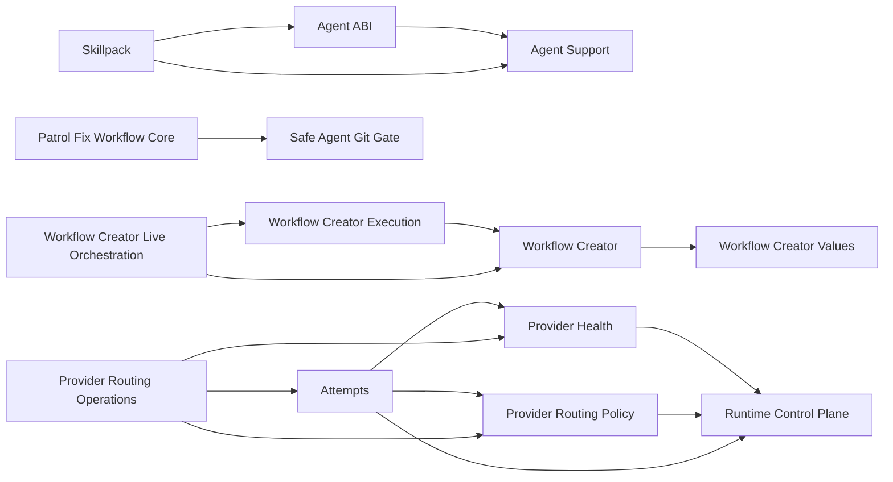

**TLDR**: The machine-readable component catalog defines supported entry
points, ownership, dependencies, consumers, state, recovery, and clean-load
requirements. Hive remains the first consumer. Patrol migration/effect evidence
is no longer a component; Patrol Fix is the only retained Patrol component
boundary.

## Current catalog

| Component | State | Current entry point | Narrative context |
|-----------|-------|---------------------|-------------------|
| Runtime Control Plane | `boundary-ready` | `require "hive/runtime_control_plane"` → `Hive::RuntimeControlPlane` | [[component-boundaries]] |
| Provider Health | `candidate` | `require "hive/provider_health"` → `Hive::ProviderHealth` | [[modules/provider_health]] |
| Provider Routing Policy | `candidate` | `require "hive/provider_routing"` → `Hive::ProviderRouting` | [[modules/provider_routing]] |
| Provider Routing Operations | `candidate` | `require "hive/provider_routing/operational_projection"` → `Hive::ProviderRouting::OperationalProjection` | [[modules/provider_routing]] |
| Patrol Fix Workflow Core | `boundary-ready` | `require "hive/patrol_fix"` → `Hive::PatrolFix` | [[modules/patrol]] |
| Attempts admission / future RunReceipt | `candidate` | `require "hive/attempts/api"` → `Hive::Attempts::API` | [[modules/attempts]] |
| UserService | `boundary-ready` | `require "hive/user_service"` → `Hive::UserService` | [[modules/user_service]] |
| Agent Support | `boundary-ready` | `require "hive/agent_support"` → `Hive::AgentSupport` | [[modules/agent_support]] |
| Agent ABI | `boundary-ready` | `require "hive/agent_runtime"` → `Hive::AgentRuntime` | [[modules/agent_profile]] |
| Agent Artifact Firewall | `boundary-ready` | `require "hive/artifact_firewall"` → `Hive::ArtifactFirewall` | [[modules/protected_files]] |
| Skillpack | `boundary-ready` | `require "hive/agent_skills"` → `Hive::AgentSkills` | [[commands/setup-agents]] |
| Safe Agent Git Gate | `boundary-ready` | `require "hive/agent_git_gate"` → `Hive::AgentGitGate` | [[modules/agent_git_gate]] |
| WorkLedger | `boundary-ready` | `require "hive/work_ledger"` → `Hive::WorkLedger` | [[state-model]] |
| Workflow Creator Values | `boundary-ready` | `require "./packaging/live_agent_skills/workflow_creator_text_safety"` → `HiveLiveAgentProof::WorkflowCreator::TextSafety` | [[component-boundaries]] |
| Workflow Creator | `boundary-ready` | `require "./packaging/live_agent_skills/workflow_creator_evidence"` → `HiveLiveAgentProof::WorkflowCreatorEvidence` | [[component-boundaries]] |
| Workflow Creator Live Orchestration | `boundary-ready` | `require "./packaging/live_agent_skills/workflow_creator_live_setup"` → `HiveLiveAgentProof::WorkflowCreatorLiveSetup` | [[component-boundaries]] |
| Workflow Creator Execution | `boundary-ready` | `require "./packaging/live_agent_skills/workflow_creator_execution"` → `HiveLiveAgentProof::WorkflowCreatorExecution` | [[component-boundaries]] |

`candidate` means the seam is mapped but not yet supported for extraction.
`boundary-ready` means dependency direction, construction rules, and
clean-process loading are enforced. It does not authorize a gem, package,
version, tag, or release.

## Graph audit

The catalog retains seventeen components: thirteen are `boundary-ready`; Provider
Health, Provider Routing Policy, Provider Routing Operations, and Attempts
remain `candidate`. There are no migration exceptions.

All other dependencies are explicit lower-level Hive primitives. Every retained
entry point has focused clean-load proof, and the production construction scan
enforces internal-owner boundaries.

The Runtime Control Plane boundary owns the lazy process-local Sequel connection,
exact integer migration gate, SQLite application identity, canonical codecs,
and the complete target coordination schema. The
boundary does not activate any legacy runtime consumer or move task/workflow
authority out of project task folders.

The clean cutover keeps two focused helpers outside the minimal entry point.
`PayloadStore` moves retained bytes from stable open paths to immutable SHA-256
addresses only at terminal publication; and `CutoverManifest` publishes a
digest-bound, owner-private phase record outside both the legacy roots and the
candidate database. Attempts and routing-policy persistence now use the
activated runtime control plane directly. Dispatch, provider health, and PR
merge reconciliation now use the same database through their typed
repositories. Cutover rejects live legacy owners, discards derived runtime
rows, and directly imports only validated token-usage history. Fresh bootstrap
loads no legacy decoder. Normal runtime never creates, imports, or repairs
legacy state.

## Patrol Fix boundary

`Patrol Fix Workflow Core` owns strict source snapshots, direct admission,
task manifests, semantic decisions, task materialization, exact worktree
generations, validation/review/publication receipts, route transitions, and
projections. Thin ordinary and Architecture adapters translate source records
and reserve them directly in one project `AdmissionStore`.

The component has no discovery scheduler, occurrence journal, effect delivery,
migration ownership, shadow comparison, cutover, rollback, status schema, or
remote transport. It depends downward on Safe Agent Git Gate and normal task
capture. The workflow-owned Publish stage composes the separate
`Hive::GithubPublication` mechanism.

## Boundary enforcement

The contract validates:

- unique component IDs and owned paths;
- declared component and lower-level Hive dependencies;
- explicit public values and forbidden internal constructions;
- named construction sites where a consumer must instantiate an internal
  collaborator;
- clean-process entry-point loading;
- candidate versus boundary-ready migration-exception rules;
- consistency between this inventory and the YAML catalog.

## Backlinks

- [[architecture]]
- [[modules/patrol]]
- [[testing]]
