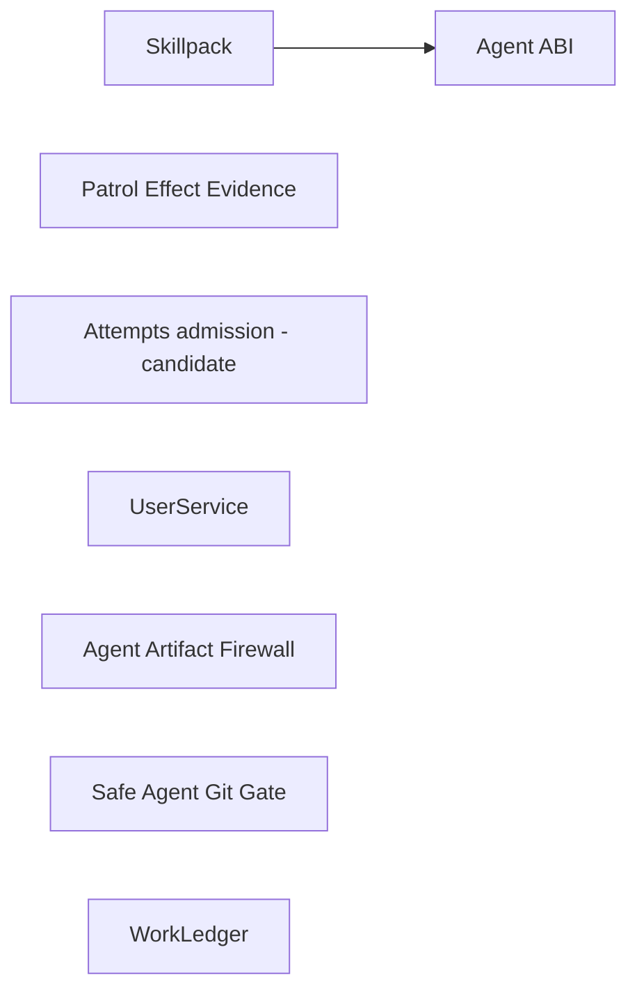

**TLDR**: Hive keeps reusable mechanisms in this monorepo and makes their
supported Ruby seams explicit before considering gems. The machine-readable
catalog records ownership, entry points, contracts, dependencies, consumers,
state and recovery responsibilities, maturity, and focused tests. Hive remains
the first and primary consumer.

## Current catalog

| Component | State | Current entry point | Narrative context |
|-----------|-------|---------------------|-------------------|
| Patrol Effect Evidence | `boundary-ready` | `require "hive/modules/migration/patrol_evidence"` → `Hive::Modules::Migration::PatrolEvidence` | [[modules/patrol]] |
| Attempts admission / future RunReceipt | `candidate` (guarded reference) | `require "hive/attempts/api"` → `Hive::Attempts::API` | [[modules/attempts]] |
| UserService | `boundary-ready` | `require "hive/user_service"` → `Hive::UserService` | [[modules/user_service]] |
| Agent ABI | `boundary-ready`; standalone package candidate | `require "hive/agent_runtime"` → `Hive::AgentRuntime` | [[modules/agent_cli_runtime]], [[modules/agent_profile]] |
| Agent Artifact Firewall | `boundary-ready` | `require "hive/artifact_firewall"` → `Hive::ArtifactFirewall` | [[modules/protected_files]] |
| Skillpack | `boundary-ready` | `require "hive/agent_skills"` → `Hive::AgentSkills` | [[commands/setup-agents]] |
| Safe Agent Git Gate | `boundary-ready` | `require "hive/agent_git_gate"` → `Hive::AgentGitGate` | [[modules/agent_git_gate]] |
| WorkLedger | `boundary-ready` | `require "hive/work_ledger"` → `Hive::WorkLedger` | [[state-model]] |

`candidate` means the current code is mapped, but callers, dependencies, or
policy still need refactoring before the seam is supported. `boundary-ready`
means the entry point, allowed dependency direction, consumer construction
rules, and clean-process load are enforced. It does not mean that a component
has earned a gem, version, repository, or release.

## Final graph audit

The U2 update on 2026-07-28 retains eight components: seven are
`boundary-ready`, Attempts remains the sole `candidate`, and no migration
exceptions remain. Every retained entry point has a focused clean-process load
proof, every catalog-owned path and focused test resolves inside this
repository, and the direct-construction guards pass against all production
Ruby sources.

The component dependency graph has one edge:



All other cataloged components depend only on explicitly allowed lower-level
Hive primitives. The source audit found no retained experimental facade outside
the catalog: each promoted facade is owned by a catalog row and used by Hive,
while Attempts is deliberately retained as a guarded candidate rather than
misrepresented as a complete lifecycle API.

This is an internal architecture verdict, not a packaging verdict. None of the
seven ready components currently has the named non-Hive adopter and independent
package proof required by the standalone-gem plan.

`Patrol Effect Evidence` owns only the immutable cross-product capture, intent,
receipt, and append-only observation contract plus the two deliberately
separate authorization gateways. Ordinary Patrol keeps fingerprint and
ReviewHandoff recovery; Architecture Patrol keeps JobStore recovery. The
evidence store is never consulted to decide a retry or mutation.

`Hive::Attempts::API` is the guarded reference admission slice. Its public
result contracts, focused clean-load proof, and exact internal construction
sites are enforced while it remains a `candidate`. U8 removed its former
catalog dependency and reciprocal-source exception by recognizing
`TaskProjection` as a Hive adapter rather than WorkLedger-owned source.
Attempts intentionally remains the guarded reference instead of claiming that
its full lifecycle is a supported component boundary: the slice does not
publish raw storage, reconciliation, supervision, capacity, loss-policy,
cancellation, export, or generic lifecycle operations.

The `Agent ABI` is boundary-ready below orchestration. `AgentRuntime` exposes
immutable request, compiled invocation, capability/probe evidence, and
observable-result values while preserving `AgentProfile.new(...)` and
`AgentProfiles.register` as extension points. Claude, Codex, Pi, Grok, and
custom profiles remain adapters inside the boundary. Hive owns process
lifetime, timeouts, retries, workflow selection, artifact acceptance, and
stage success.

The `Agent Artifact Firewall` is boundary-ready below stage policy. Its
immutable manifest declares protected anchors, permitted writable roots,
required regular outputs, and an injectable redactor. Snapshot, typed
validation, bounded reporting, descriptor-bound baseline identities,
protected-parent substitution checks, and verified safe restore sit below the
facade; execute, open-PR, finalize, review, and managed-worktree adapters
continue to choose paths and markers. Headless Agent and interactive Claude
expected-output polling also use the regular-file admission seam.
`Hive::ProtectedFiles` is now an internal compatibility engine and production
consumers cannot bypass the facade. The guarantee is same-user application
custody only: it is not an OS sandbox, a write monitor, a multi-file
transaction, or the Safe Agent Git Gate.

`Hive::SecretPatterns` remains shared lower-level Hive infrastructure rather
than component-owned state. Both the Agent ABI and Artifact Firewall use it for
bounded diagnostics, while the firewall also accepts an injected redactor.

The package-only extraction lives at `components/agent-cli-runtime/` and
publishes the neutral `AgentCliRuntime` namespace plus the bounded
`agent-runtime` diagnostic executable. Until the separately held Hive cutover,
`Hive::AgentRuntime` remains Hive's authoritative implementation and package
parity tests prevent the temporary publication-window copy from drifting.
Landing the package does not change Hive's gem dependency graph. See
[[modules/agent_cli_runtime]] for the public surface and release boundary.

Its public standalone repository is deliberately a one-way distribution
projection. Scheduled main snapshots and manually requested release snapshots
record the exact Hive component commit. The canonical checkout owns projection
logic and the release workflow independently reconstructs the expected tag tree
before publication. Repository-scoped deploy-key authentication lets canonical
administration updates include workflow files without granting cross-repository
access; immutable mirror tag rules protect the verified result. Development,
issues, pull requests, version selection, and RubyGems publication remain owned
by this monorepo. The mirror improves focused discovery without creating a
second source of truth.

`Hive::UserService` is also a promoted `boundary-ready` component. Its
Definition, Plan, Status, and Result values keep file drift, stale observation,
atomic replacement, backups, manager operations, and removal below one clean
entry point. The daemon, bot, web, setup, init, status, and uninstall surfaces
remain Hive-owned adapters for templates, policy, messages, JSON, prompts, and
global sequencing.

`Skillpack` is boundary-ready around canonical compilation and atomic
projection. The clean entry point exposes deterministic `Projection`,
`ProjectionReport`, and `Plan` values plus typed validation, unsafe-path,
stale-plan, and foreign-content errors. `render`, `inspect`, and `plan` are
non-mutating; `apply` accepts only a preview-bound plan and revalidates it
before a private staged whole-directory swap. OpenClaw, Claude, Codex, and Pi
share one closed projection registry. Hive configuration, workflow target
selection, native plugin/package inventory, consent, CLI JSON, and
presentation remain lazily loaded Hive adapters above that mechanism.
Production commands and web code require only the facade; the catalog rejects
new direct requires or construction of the compiler, publisher, inspector,
provisioner, target resolver, command runner, manifest, or adapter registry.
This internal boundary is not a gem or a publication commitment.

The `Safe Agent Git Gate` is boundary-ready around post-agent Git process and
ref authority. Its clean facade exposes immutable read, remote-observation,
materialization, and publication receipts; a closed read vocabulary; exact
detached worktree materialization; and exact expected-OID or expected-absence
publication with before/after remote proof. Hostile hooks, fsmonitor,
diff/textconv helpers, inherited config/executable selectors, and forbidden
transports remain neutralized below the facade. `Hive::ManagedGit` is now the
private executor and the catalog rejects direct production bypasses.

Hive still owns credentials and transport permission, durable mutation intent,
branch/PR policy, GitHub API behavior, and operator approval. Refactor patrol's
append-only publication ledger decides which superseded OID is replaceable;
the gate only enforces that exact authority. Receipts retain a non-secret
transport fingerprint rather than URLs or command output. This is Git process
hardening, not an agent, Git, or operating-system sandbox.

`WorkLedger` is boundary-ready around three policy-light mechanisms: structural
validation of ordered stage descriptors, locked/fsynced JSONL append with
idempotency conflict detection and partial-write rollback, and deterministic
JSONL replay with caller-supplied validation and duplicate-identity rejection.
The facade returns a narrow `JournalHandle`; its receipts bind descriptor
identity or exact ledger cursor, last record identity, and SHA-256. The entry
point loads without Attempts, conditions, task journals, projections,
workflows, commands, stages, or web runtime.

Receipt strings and record trees are detached, deeply frozen JSON snapshots,
so mutating a caller-owned input after append or validation cannot rewrite the
reported durable identity. Replay snapshots its source bytes before invoking
caller validation. Idempotent lookup checks every matching historical key and
fails closed if any stored signature conflicts with the requested operation.

WorkLedger deliberately defines no public disk schema. `Hive::Workflow` maps
its stage structure into the validator, while `Hive::TaskJournal` owns the
authoritative event envelope and attempt/condition validation and
`Hive::TaskProjection` owns compatibility replay and projection rules.
`TaskProjection::Store` remains a Hive composition adapter that may open
`Hive::Attempts::Store`; it is not WorkLedger source and creates no component
cycle. Task directories, condition vocabulary, transition and migration
policy, overlays, snapshots, Git behavior, and operational status all remain
Hive-owned. Boundary readiness is an internal API verdict, not a public format,
gem, version, or release commitment.

## Catalog contract

`config/component-boundaries.yml` is the canonical agent-readable inventory.
Each row names:

- the supported entry point and current public values/errors;
- owned source paths and explicit component dependencies;
- state, schema, lock, mutation-authority, and recovery responsibilities;
- known Hive consumers and internal collaborators;
- exact existing Hive files allowed to construct a named internal collaborator,
  with a non-blank architectural reason;
- the narrative wiki page and focused tests; and
- reviewed migration exceptions, if any.

Owned paths cannot overlap between components, component dependencies must form
an acyclic graph, and every path in the catalog must resolve inside the
repository. A temporary exception must include both a reason and the
implementation unit that removes it. A `boundary-ready` component cannot keep
an exception or depend on a `candidate` component.

## Enforcement

`test/support/component_boundary_contract.rb` is test-only architecture
tooling. U1 establishes this catalog and promotion guard; for every
`boundary-ready` row it:

1. parses literal Ruby `require` and `require_relative` calls and rejects upward
   dependencies on Hive commands, stages, web, release, or CLI code;
2. maps every component-owned Ruby file to its require path and rejects
   undeclared direct component dependencies;
3. for every row that declares forbidden constructions, scans production Ruby
   outside the component's owned paths and rejects literal `Constant.new`
   construction of listed internals except exact file/constant pairs recorded
   as current composition or compatibility sites; stale or newly listed-file
   authorizations fail validation; and
4. loads each ready entry point—and any explicitly requested candidate entry
   point—in a fresh Ruby process, verifies the documented
   constant, and rejects unrelated commands, stages, web code, or files owned
   by undeclared components.

Run the focused contract with:

```bash
bundle exec ruby -Itest -Ilib test/unit/component_boundaries_test.rb
```

The syntax scan is an architecture regression guard, not a Ruby sandbox. Its
construction rule covers literal `Constant.new`, not aliases or factory
methods. Construction authorization is file-granular: it rejects a named
internal from a newly listed file, but it does not distinguish multiple call
sites for that internal inside an already authorized composition root. It does
not claim to stop dynamic requires, reflection, monkeypatching, or arbitrary
same-user code. Those limits must not be weakened into security claims.

## Changing a boundary

Change one component per PR. Update its catalog row, focused consumer tests,
narrative wiki page, this page, and a `wiki/log.d/` fragment together. Promote
to `boundary-ready` only after clean loading, dependency direction, direct
consumer routing, focused tests, the broad Hive suite, and exact-head hosted CI
all pass. Packaging remains a separate decision gated by demonstrated non-Hive
demand and explicit release authority. Agent CLI Runtime has passed that gate
with HiveBench as the named adopter; no other catalog row inherits that
decision.
