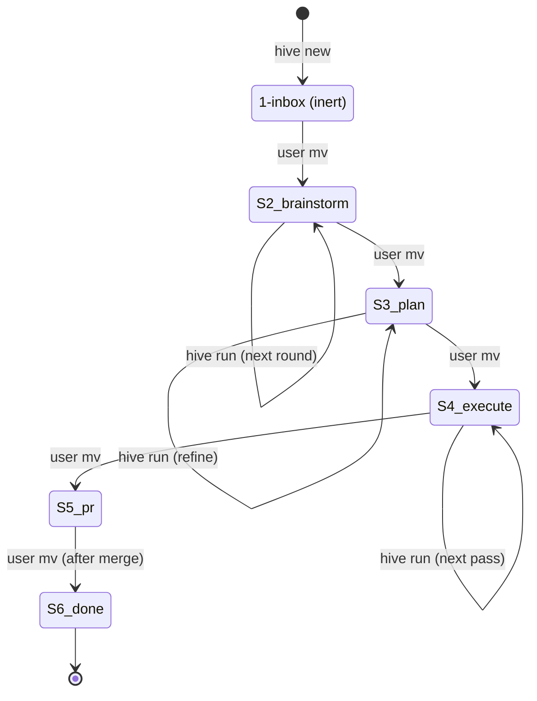

**TLDR**: Hive has no database. Persistent state lives entirely in two filesystem trees per project — `<project>/.hive-state/` (an orphan-branch worktree holding task folders, configs, locks, logs) and `~/Dev/<project>.worktrees/<slug>/` (feature worktrees holding actual code) — plus one global `~/Dev/hive/config.yml`. The "data model" is the directory layout, marker grammar, and YAML schemas described below.

## Stage directory layout

Per project, every task is a folder in exactly one stage subdirectory. Stage = location; `mv` between stages = approval.

```
<project>/.hive-state/
├── config.yml                # per-project config
├── .commit-lock              # short-lived flock around git commits
├── stages/
│   ├── 1-inbox/<slug>/
│   ├── 2-brainstorm/<slug>/
│   ├── 3-plan/<slug>/
│   ├── 4-execute/<slug>/
│   ├── 5-pr/<slug>/
│   └── 6-done/<slug>/
└── logs/<slug>/<stage>-<UTC-ts>.log
```

The constant `Hive::Stages::DIRS = %w[1-inbox 2-brainstorm 3-plan 4-execute 5-pr 6-done]` is the canonical list (`lib/hive/stages.rb`). `GitOps`, `Status`, `Run#next_stage_dir`, and `Approve` all delegate to that single constant. See [[modules/stages]].

`Hive::Task::PATH_RE` (`lib/hive/task.rb:14`) is the only validator for task paths and parses `<root>/.hive-state/stages/<N>-<stage>/<slug>/`.

## Per-stage state file

Each stage has exactly one "state file" the runner writes the marker into. This is the single source of truth for stage progress.

| Stage | State file | Created by |
|-------|------------|------------|
| `1-inbox` | `idea.md` | `hive new` (rendered from `templates/idea.md.erb`) |
| `2-brainstorm` | `brainstorm.md` | `Stages::Brainstorm` agent on first run |
| `3-plan` | `plan.md` | `Stages::Plan` agent on first run |
| `4-execute` | `task.md` | `Stages::Execute#write_initial_task_md` (with frontmatter `slug`, `started_at`, `pass`) |
| `5-pr` | `pr.md` | `Stages::Pr` agent (or `write_pr_md` for idempotent re-entry) |
| `6-done` | `task.md` | reused from `4-execute` |

Mapping is encoded in `Hive::Task::STATE_FILES` (`lib/hive/task.rb:6`).

## Slug grammar

`Hive::Commands::New::SLUG_RE = /\A[a-z][a-z0-9-]{0,62}[a-z0-9]\z/` (`lib/hive/commands/new.rb:15`).

- 3–64 chars, must start with a letter and end with a letter or digit.
- Auto-derived shape: `<5-words-kebab>-<YYMMDD>-<4hex>`. Empty/non-ASCII text falls back to `task-<YYMMDD>-<4hex>`.
- Reserved tokens rejected: `head`, `fetch_head`, `orig_head`, `merge_head`, `master`, `main`, `origin`, `hive`. Also rejects `..`, `/`, `@`. See [[commands/new]].

## Marker grammar

Markers are HTML comments at end-of-file in the state file. Exactly one is "current" — the *last* marker scanned by `Hive::Markers.current` (`lib/hive/markers.rb:17`).

| Marker | Meaning | Set by |
|--------|---------|--------|
| `<!-- WAITING -->` | stage agent finished a round, awaits human edits | brainstorm/plan/pr agents |
| `<!-- COMPLETE -->` | stage finished, ready for `mv` to next stage | brainstorm/plan/pr agents; `done` runner |
| `<!-- AGENT_WORKING pid=N started=ISO -->` | claude subprocess is running right now | `Hive::Agent#run!` pre-spawn |
| `<!-- ERROR reason=... -->` | runner detected timeout / non-zero exit / concurrent edit / reviewer tamper | `Hive::Agent#handle_exit`, `Stages::Execute#run_review_pass` |
| `<!-- EXECUTE_WAITING findings_count=N pass=K -->` | review pass produced findings to triage | `Stages::Execute#finalize_review_state` |
| `<!-- EXECUTE_COMPLETE pass=K -->` | review pass found no findings (or no accepted findings remained) | `Stages::Execute#finalize_review_state` / `run_iteration_pass` |
| `<!-- EXECUTE_STALE max_passes=N pass=K -->` | hit `cfg["max_review_passes"]` (default 4) | `Stages::Execute#run_iteration_pass` |

Marker name allowlist: `Hive::Markers::KNOWN_NAMES`. Regex: `Hive::Markers::MARKER_RE`. Attributes are `key=value` (or `key="quoted value"`).

`Markers.set` writes via tempfile + `File.rename` for atomicity, holding `LOCK_EX` on a `.markers-lock` sidecar (not the data file) so readers never see partial writes. UTF-8 is pinned. See [[modules/markers]].

## Concurrency files

- **Per-task lock**: `<task folder>/.lock` — YAML payload `{pid, started_at, process_start_time, claude_pid?, slug?, stage?}`. Acquired EXCL by `Hive::Lock.acquire_task_lock` (`lib/hive/lock.rb:18`). Stale check uses `Process.kill(0, pid)` plus `/proc/<pid>/stat` field-22 cross-check to defeat PID reuse.
- **Per-project commit lock**: `<project>/.hive-state/.commit-lock` — short flock around the `git add && git commit` in the hive-state worktree to serialize concurrent writers. See [[modules/lock]].

## Worktree pointer

When a task enters `4-execute/`, `Stages::Execute#run_init_pass` creates `~/Dev/<project>.worktrees/<slug>/` (or `cfg["worktree_root"]/<slug>`) and writes `<task folder>/worktree.yml`:

```yaml
path: /home/asterio/Dev/<project>.worktrees/<slug>
branch: <slug>
created_at: <UTC-ISO>
```

`Hive::Worktree.read_pointer` is the only reader; `Hive::Worktree.validate_pointer_path` rejects paths outside the configured `worktree_root` prefix. See [[modules/worktree]].

## Review artefacts

Inside `4-execute/<slug>/`:

```
reviews/
├── ce-review-01.md          # findings from pass 1
├── ce-review-02.md          # findings from pass 2 after triage
└── ...
```

Format per file:

```
## High
- [ ] finding A: justification
## Medium
- [x] finding B: justification     # accepted by user
## Nit
- [ ] finding C: justification
```

`Stages::Execute#count_findings` counts checkbox lines. `collect_accepted_findings` filters `[x]` rows from the previous pass's review file and feeds them into the next implementation prompt. The `task.md` frontmatter `pass:` integer is the canonical counter; reviewer agents must update it.

## Configs

### Global: `~/Dev/hive/config.yml`

```yaml
registered_projects:
  - name: <project_name>
    path: /abs/path/to/project
    hive_state_path: /abs/path/to/project/.hive-state
```

Managed by `Hive::Config.register_project` (`lib/hive/config.rb:79`). `HIVE_HOME` env var overrides the default `~/Dev/hive`.

### Per-project: `<project>/.hive-state/config.yml`

```yaml
project_name: <name>
default_branch: master              # detected by GitOps#detect_default_branch
worktree_root: /home/.../<name>.worktrees
hive_state_path: .hive-state
max_review_passes: 4
budget_usd:
  brainstorm: 10
  plan: 20
  execute_implementation: 100
  execute_review: 50
  pr: 10
timeout_sec:
  brainstorm: 300
  plan: 600
  execute_implementation: 2700
  execute_review: 600
  pr: 300
```

Loaded by `Hive::Config.load`, merged onto `Hive::Config::DEFAULTS` (`lib/hive/config.rb:6`). Templated from `templates/project_config.yml.erb`.

## Logs

`<project>/.hive-state/logs/<slug>/<log_label>-<UTC-ts>.log` — one file per agent invocation. `log_label` is `brainstorm` / `plan` / `execute-impl-NN` / `execute-review-NN` / `pr`. Append-only; no rotation in MVP. Stream contains both spawn metadata and full stdout/stderr of the claude subprocess.

## Frontmatter conventions

- `idea.md` (Step 0 capture): `slug`, `created_at`, `original_text` (multiline).
- `task.md` (4-execute / 6-done): `slug`, `started_at`, `pass`. Reviewer agents must update `pass:` to match marker `pass=`.
- `pr.md`: `pr_url`, `pr_number` (when populated by 5-pr runner from existing PR lookup).

## State machine diagram



See [[stages/index]] for one page per stage.

## Backlinks

- [[architecture]]
- [[stages/inbox]] · [[stages/brainstorm]] · [[stages/plan]] · [[stages/execute]] · [[stages/pr]] · [[stages/done]]
- [[modules/task]] · [[modules/markers]] · [[modules/lock]] · [[modules/worktree]] · [[modules/config]]
