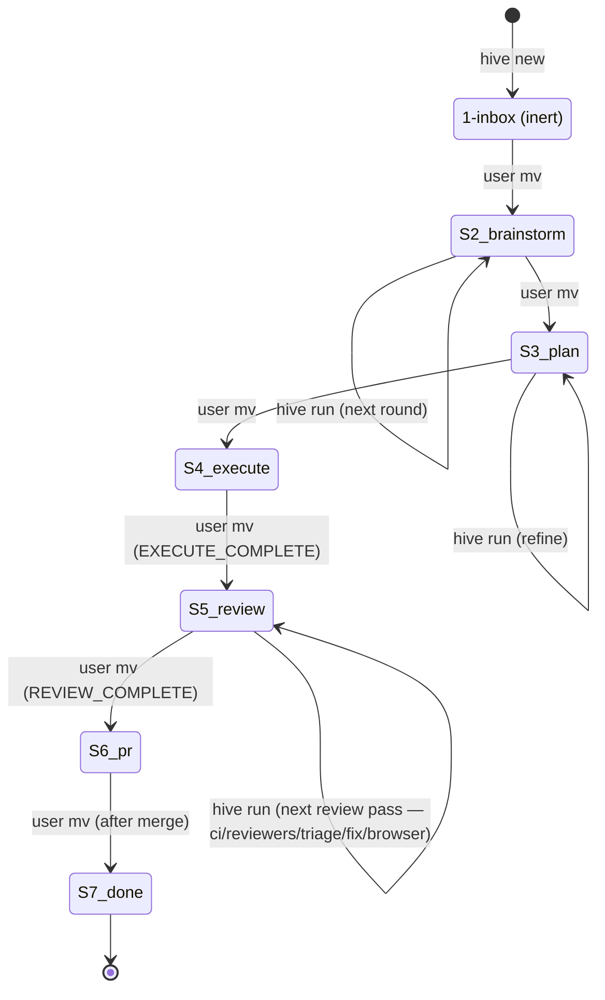

**TLDR**: Hive has no database. Persistent state lives entirely in two filesystem trees per project — `<project>/.hive-state/` (an orphan-branch worktree holding task folders, configs, locks, logs) and `~/Dev/<project>.worktrees/<slug>/` (feature worktrees holding actual code) — plus one global `~/Dev/hive/config.yml`. The "data model" is the directory layout, marker grammar, and YAML schemas described below.

## Stage directory layout

Per project, every task is a folder in exactly one stage subdirectory. Stage = location; `mv` between stages = approval.

```
<project>/.hive-state/
├── config.yml                # per-project config
├── .commit-lock              # short-lived flock around git commits
├── stages/
│   ├── 1-inbox/<slug>/
│   ├── 2-brainstorm/<slug>/
│   ├── 3-plan/<slug>/
│   ├── 4-execute/<slug>/
│   ├── 5-review/<slug>/
│   ├── 6-pr/<slug>/
│   └── 7-done/<slug>/
└── logs/<slug>/<stage>-<UTC-ts>.log
```

The constant `Hive::Stages::DIRS = %w[1-inbox 2-brainstorm 3-plan 4-execute 5-review 6-pr 7-done]` is the canonical list (`lib/hive/stages.rb`). `GitOps`, `Status`, `Run#next_stage_dir`, and `Approve` all delegate to that single constant. As of U9 the slot `5-review` is filled (no gap). See [[modules/stages]] and [[stages/review]].

`Hive::Task::PATH_RE` (`lib/hive/task.rb:14`) is the only validator for task paths and parses `<root>/.hive-state/stages/<N>-<stage>/<slug>/`.

## Per-stage state file

Each stage has exactly one "state file" the runner writes the marker into. This is the single source of truth for stage progress.

| Stage | State file | Created by |
|-------|------------|------------|
| `1-inbox` | `idea.md` | `hive new` (rendered from `templates/idea.md.erb`) |
| `2-brainstorm` | `brainstorm.md` | `Stages::Brainstorm` agent on first run |
| `3-plan` | `plan.md` | `Stages::Plan` agent on first run |
| `4-execute` | `task.md` | `Stages::Execute#write_initial_task_md` (with frontmatter `slug`, `started_at`) |
| `5-review` | `task.md` | reused from `4-execute`; markers driven by `Stages::Review` orchestrator |
| `6-pr` | `pr.md` | `Stages::Pr` agent (or `write_pr_md` for idempotent re-entry) |
| `7-done` | `task.md` | reused from `4-execute` |

Mapping is encoded in `Hive::Task::STATE_FILES` (`lib/hive/task.rb:6`).

## Slug grammar

`Hive::Commands::New::SLUG_RE = /\A[a-z][a-z0-9-]{0,62}[a-z0-9]\z/` (`lib/hive/commands/new.rb:15`).

- 3–64 chars, must start with a letter and end with a letter or digit.
- Auto-derived shape: `<5-words-kebab>-<YYMMDD>-<4hex>`. Empty/non-ASCII text falls back to `task-<YYMMDD>-<4hex>`.
- Reserved tokens rejected: `head`, `fetch_head`, `orig_head`, `merge_head`, `master`, `main`, `origin`, `hive`. Also rejects `..`, `/`, `@`. See [[commands/new]].

## Marker grammar

Markers are HTML comments at end-of-file in the state file. Exactly one is "current" — the *last* marker scanned by `Hive::Markers.current` (`lib/hive/markers.rb:17`).

| Marker | Meaning | Set by |
|--------|---------|--------|
| `<!-- WAITING -->` | stage agent finished a round, awaits human edits | brainstorm/plan/pr agents |
| `<!-- COMPLETE -->` | stage finished, ready for `mv` to next stage | brainstorm/plan/pr agents; `done` runner |
| `<!-- AGENT_WORKING pid=N started=ISO -->` | claude subprocess is running right now | `Hive::Agent#run!` pre-spawn |
| `<!-- ERROR reason=... -->` | runner detected timeout / non-zero exit / concurrent edit / reviewer tamper | `Hive::Agent#handle_exit`, `Stages::Execute#run_review_pass` |
| `<!-- EXECUTE_COMPLETE -->` | impl pass committed cleanly; ready for `mv` to `5-review/` | `Stages::Execute#run!` (impl-only since U9) |
| `<!-- REVIEW_WORKING phase=ci\|reviewers\|triage\|fix\|browser pass=NN -->` | 5-review phase in flight (transient — replaced at phase exit) | `Stages::Review` phase entry |
| `<!-- REVIEW_WAITING escalations=N pass=NN -->` | review pass produced escalations awaiting human edit | `Stages::Review` orchestrator |
| `<!-- REVIEW_CI_STALE attempts=N -->` | CI hard-block — `cfg.review.ci.max_attempts` reached without green; reviewers don't run on red CI | `Stages::Review` CI phase |
| `<!-- REVIEW_STALE pass=NN -->` | hit `cfg.review.max_passes` (default 4) | `Stages::Review` orchestrator |
| `<!-- REVIEW_COMPLETE pass=NN browser=passed\|warned\|skipped -->` | review loop done — ready to mv to 6-pr (`browser=warned` = soft-warn surfaced in PR body) | `Stages::Review` orchestrator |
| `<!-- REVIEW_ERROR phase=… reason=… -->` | agent-level error or protected-file tampering (mirrors ADR-013's `:error` shape for `EXECUTE_*`) | `Stages::Review` orchestrator |

Marker name allowlist: `Hive::Markers::KNOWN_NAMES`. Regex: `Hive::Markers::MARKER_RE`. Adding a marker requires updating BOTH (two sources of truth). Attributes are `key=value` (or `key="quoted value"`). U9 dropped `EXECUTE_WAITING` and `EXECUTE_STALE` from the live grammar (review iteration moved out of 4-execute); the names remain in `KNOWN_NAMES` for back-compat parsing of historical state files but are never written by current code.

Recovery from a stale or error marker is agent-callable via `hive markers clear FOLDER --name <NAME>` (LFG-4, see [[commands/markers]]). The clear allowlist is `REVIEW_STALE`, `REVIEW_CI_STALE`, `REVIEW_ERROR`, `EXECUTE_STALE`, `ERROR`; terminal-success markers (`REVIEW_COMPLETE`, `EXECUTE_COMPLETE`, `COMPLETE`) are refused. The `Stages::Review` pre-flight warn text now embeds the concrete `hive markers clear …` command for each stale-marker case.

`Markers.set` writes via tempfile + `File.rename` for atomicity, holding `LOCK_EX` on a `.markers-lock` sidecar (not the data file) so readers never see partial writes. UTF-8 is pinned. See [[modules/markers]].

## Concurrency files

- **Per-task lock**: `<task folder>/.lock` — YAML payload `{pid, started_at, process_start_time, claude_pid?, slug?, stage?}`. Acquired EXCL by `Hive::Lock.acquire_task_lock` (`lib/hive/lock.rb:18`). Stale check uses `Process.kill(0, pid)` plus `/proc/<pid>/stat` field-22 cross-check to defeat PID reuse.
- **Per-project commit lock**: `<project>/.hive-state/.commit-lock` — short flock around the `git add && git commit` in the hive-state worktree to serialize concurrent writers. See [[modules/lock]].

## Worktree pointer

When a task enters `4-execute/`, `Stages::Execute#run_init_pass` creates `~/Dev/<project>.worktrees/<slug>/` (or `cfg["worktree_root"]/<slug>`) and writes `<task folder>/worktree.yml`:

```yaml
path: /home/asterio/Dev/<project>.worktrees/<slug>
branch: <slug>
created_at: <UTC-ISO>
```

`Hive::Worktree.read_pointer` is the only reader; `Hive::Worktree.validate_pointer_path` rejects paths outside the configured `worktree_root` prefix. See [[modules/worktree]].

## Review artefacts

Inside `5-review/<slug>/reviews/` (since U9; pre-U9 review iteration lived under `4-execute/<slug>/reviews/`):

```
reviews/
├── <reviewer-name>-01.md      # per-reviewer finding file, pass 1
├── <reviewer-name>-02.md      # per-reviewer finding file, pass 2
├── escalations-01.md          # triage output: items needing user judgment
├── ci-blocked-NN.md           # written when CI hard-blocks (REVIEW_CI_STALE)
├── browser-result-NN-AA.json  # per-attempt browser-test result
├── browser-blocked-NN.md      # written when all browser attempts fail (browser=warned)
├── fix-guardrail-NN.md        # written when post-fix diff guardrail flags a match
└── ...
```

Per-reviewer file format (checkbox triage lines):

```
## High
- [ ] finding A: justification
## Medium
- [x] finding B: justification     # accepted by triage (or by user during REVIEW_WAITING)
## Nit
- [ ] finding C: justification
```

Pass derivation is filesystem-native: `Stages::Review` reads the max `-NN` suffix across per-reviewer files in `reviews/` to derive the current pass. No `pass:` frontmatter or sidecar — recovery is "delete the highest-NN files to drop pass back". Accepted findings (`[x]` lines) are concatenated and passed to the Phase 4 fix agent via the per-spawn nonce wrap; orchestrator-owned files (`escalations-`, `ci-blocked-`, `browser-`, `fix-guardrail-`) are excluded from the `Hive-Reviewer-Sources` trailer derivation.

## Configs

### Global: `~/Dev/hive/config.yml`

```yaml
registered_projects:
  - name: <project_name>
    path: /abs/path/to/project
    hive_state_path: /abs/path/to/project/.hive-state
```

Managed by `Hive::Config.register_project` (`lib/hive/config.rb:79`). `HIVE_HOME` env var overrides the default `~/Dev/hive`.

### Per-project: `<project>/.hive-state/config.yml`

```yaml
project_name: <name>
default_branch: master              # detected by GitOps#detect_default_branch
worktree_root: /home/.../<name>.worktrees
hive_state_path: .hive-state
max_review_passes: 4
# Budgets and timeouts are GENEROUS sanity caps for runaway agents — not
# cost targets. Bumped ~5× from pre-2026-05-04 values (ADR-023). The
# `execute_review` key was DROPPED from DEFAULTS in plan 2026-05-04-001:
# 5-review owns reviewer budgets per ADR-014. Old project configs that
# still set `execute_review` survive deep-merge but the key is no longer
# rendered for fresh projects and nothing reads it.
budget_usd:
  brainstorm: 50
  plan: 100
  execute_implementation: 500
  pr: 50
  review_ci: 100
  review_triage: 75
  review_fix: 500
  review_browser: 100
timeout_sec:
  brainstorm: 1800
  plan: 3600
  execute_implementation: 14400
  pr: 1800
  review_ci: 3600
  review_triage: 1800
  review_fix: 14400
  review_browser: 3600
# Stage-level agent for the three single-agent stages (ADR-023). The
# 5-review stage keeps per-role agent fields under `review.{ci,triage,
# fix,browser_test}.agent`. Runtime fallback in stage code stays
# `cfg.dig("<stage>", "agent") || "claude"`, so legacy configs without
# these keys keep working.
brainstorm: { agent: claude }
plan:       { agent: claude }
execute:    { agent: claude }   # rendered template recommends `codex`; DEFAULTS stays `claude`
agents:                 # per-CLI profile overrides (claude, codex, pi)
  claude: { bin: claude, env_override: HIVE_CLAUDE_BIN, min_version: 2.1.118 }
  codex:  { bin: codex,  env_override: HIVE_CODEX_BIN,  min_version: 0.125.0 }
  pi:     { bin: pi,     env_override: HIVE_PI_BIN,     min_version: 0.70.2 }
review:                 # 5-review stage config (U2)
  ci:           { command: null, max_attempts: 3, agent: claude, prompt_template: ci_fix_prompt.md.erb }
  triage:       { enabled: true, agent: claude, bias: courageous, prompt_template: null, custom_prompt: null }
  fix:          { agent: claude, prompt_template: fix_prompt.md.erb }
  browser_test: { enabled: false, agent: claude, prompt_template: browser_test_prompt.md.erb, max_attempts: 2 }
  max_passes: 4
  max_wall_clock_sec: 5400
  reviewers: [...]      # Array — REPLACED wholesale on override (no per-element merge)
```

`Config::ROLE_AGENT_PATHS` (validated by `validate_role_agent_names!`) now also covers the three new stage-agent paths: `%w[brainstorm agent]`, `%w[plan agent]`, `%w[execute agent]` — alongside the existing `review.{ci,triage,fix,browser_test}.agent` paths.

Loaded by `Hive::Config.load`, recursively deep-merged onto `Hive::Config::DEFAULTS` (`lib/hive/config.rb:6`) and validated via `Config.validate!` before return. Templated from `templates/project_config.yml.erb`. The `review.reviewers` Array is replaced wholesale (not per-element merged) — see [[modules/config]].

## Logs

`<project>/.hive-state/logs/<slug>/<log_label>-<UTC-ts>.log` — one file per agent invocation. `log_label` is `brainstorm` / `plan` / `execute-impl-NN` / `execute-review-NN` / `pr`. Append-only; no rotation in MVP. Stream contains both spawn metadata and full stdout/stderr of the claude subprocess.

## Frontmatter conventions

- `idea.md` (Step 0 capture): `slug`, `created_at`, `original_text` (multiline).
- `task.md` (4-execute / 5-review / 7-done): `slug`, `started_at`. Pre-U9 carried `pass:`; the field was dropped when review iteration moved to 5-review and pass became filesystem-derived.
- `pr.md`: `pr_url`, `pr_number` (when populated by 6-pr runner from existing PR lookup).

## Commit trailers (fix-agent metric)

Fix-agent commits (Phase 4 review-fix and Phase 1 ci-fix) MUST end with these git trailers — the templates `templates/fix_prompt.md.erb` and `templates/ci_fix_prompt.md.erb` instruct the LLM to emit them, and `Hive::Metrics.rollback_rate` is the consumer.

| Trailer | Phase | Source |
|---------|-------|--------|
| `Hive-Task-Slug: <slug>` | ci, fix | template var `task_slug` |
| `Hive-Fix-Pass: <NN>` | ci, fix | `attempt` (ci) / `pass` (fix) |
| `Hive-Fix-Phase: <ci\|fix>` | ci, fix | template literal |
| `Hive-Fix-Findings: <int>` | fix only | filled by LLM (count of `[x]` items applied in this commit) |
| `Hive-Triage-Bias: <courageous\|safetyist\|custom>` | fix only | `cfg.review.triage.bias` via `Stages::Review#triage_bias_for` |
| `Hive-Reviewer-Sources: <names>` | fix only | sorted, comma-joined reviewer-file basenames for the pass via `Stages::Review#reviewer_sources_for`; orchestrator-owned files (escalations-/ci-blocked/browser-/fix-guardrail-) excluded; `none` when empty |

Trailers are not validated server-side — commits without trailers are silently excluded from the rollback metric, so missing trailers degrade signal but never block work. `Hive::Metrics.parse_trailers` (`lib/hive/metrics.rb:104`) lower-cases keys and accepts any `[A-Za-z][A-Za-z0-9-]*: value` line in the body. See [[modules/metrics]] · [[commands/metrics]].

## State machine diagram



Since U9 (2026-04-26), `Hive::Stages::DIRS` has all seven slots filled in order; `Stages.next_dir(4)` returns `"5-review"`, and `Stages.next_dir(5)` returns `"6-pr"`. See [[stages/review]] for the autonomous-loop semantics.

See [[stages/index]] for one page per stage.

## Backlinks

- [[architecture]]
- [[stages/inbox]] · [[stages/brainstorm]] · [[stages/plan]] · [[stages/execute]] · [[stages/review]] · [[stages/pr]] · [[stages/done]]
- [[modules/task]] · [[modules/markers]] · [[modules/lock]] · [[modules/worktree]] · [[modules/config]]
