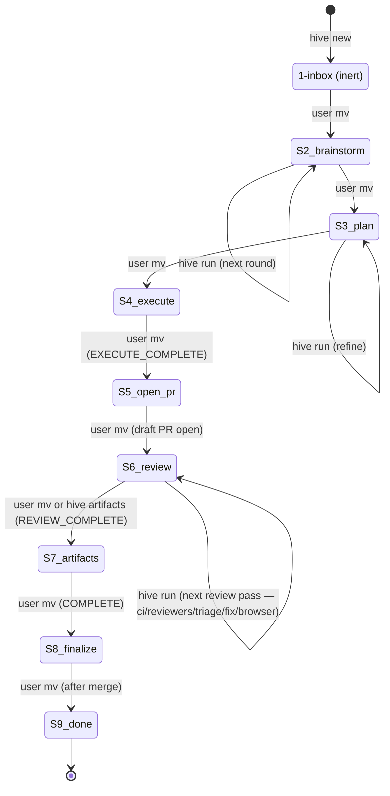

**TLDR**: Hive has no database. Persistent state lives entirely in two filesystem trees per project — `<project>/.hive-state/` (an orphan-branch worktree holding task folders, configs, locks, logs) and `~/Dev/<project>.worktrees/<slug>/` (feature worktrees holding actual code) — plus one global `~/.config/hive/config.yml` (or `HIVE_HOME/config.yml` / a migrated legacy registry). The "data model" is the directory layout, marker grammar, and YAML schemas described below.

## Stage directory layout

Per project, every task is a folder in exactly one stage subdirectory. Stage = location; `mv` between stages = approval.

```
<project>/.hive-state/
├── config.yml                # per-project config
├── .commit-lock              # short-lived flock around git commits
├── stages/
│   ├── 1-inbox/<slug>/
│   ├── 2-brainstorm/<slug>/
│   ├── 3-plan/<slug>/
│   ├── 4-execute/<slug>/
│   ├── 5-open-pr/<slug>/
│   ├── 6-review/<slug>/
│   ├── 7-artifacts/<slug>/
│   ├── 8-finalize/<slug>/
│   └── 9-done/<slug>/
└── logs/<slug>/<stage>-<UTC-ts>.log
```

The constant `Hive::Stages::DIRS = %w[1-inbox 2-brainstorm 3-plan 4-execute 5-open-pr 6-review 7-artifacts 8-finalize 9-done]` is the canonical list (`lib/hive/stages.rb`). `GitOps`, `Status`, `Run#next_stage_dir`, and `Approve` all delegate to that single constant. See [[modules/stages]] and [[stages/review]].

`Hive::Task::PATH_RE` (`lib/hive/task.rb:14`) is the only validator for task paths and parses `<root>/.hive-state/stages/<N>-<stage>/<slug>/`.

## Per-stage state file

Each stage has exactly one "state file" the runner writes the marker into. This is the single source of truth for stage progress.

| Stage | State file | Created by |
|-------|------------|------------|
| `1-inbox` | `idea.md` | `hive new` (rendered from `templates/idea.md.erb`) |
| `2-brainstorm` | `brainstorm.md` | `Stages::Brainstorm` agent on first run |
| `3-plan` | `plan.md` | `Stages::Plan` agent on first run |
| `4-execute` | `task.md` | `Stages::Execute#write_initial_task_md` (with frontmatter `slug`, `started_at`) |
| `5-open-pr` | `pr.md` | `Stages::OpenPr` writes frontmatter `pr_url` / `pr_number` |
| `6-review` | `task.md` | reused from `4-execute`; markers driven by `Stages::Review` orchestrator |
| `7-artifacts` | `artifact.md` | `Stages::Artifacts` asks the configured artifact agent to write the artifact summary and stamp `COMPLETE` |
| `8-finalize` | `pr.md` | reused from `5-open-pr`; `Stages::Finalize` appends the final `COMPLETE` marker and writes `summary.md` |
| `9-done` | `task.md` | reused from `4-execute` |

Mapping is encoded in `Hive::Task::STATE_FILES` (`lib/hive/task.rb:6`).

## Slug grammar

`Hive::Commands::New::SLUG_RE = /\A[a-z][a-z0-9-]{0,62}[a-z0-9]\z/` (`lib/hive/commands/new.rb:15`).

- 3–64 chars, must start with a letter and end with a letter or digit.
- Auto-derived shape: `<5-words-kebab>-<YYMMDD>-<4hex>`. Empty/non-ASCII text falls back to `task-<YYMMDD>-<4hex>`.
- Reserved tokens rejected: `head`, `fetch_head`, `orig_head`, `merge_head`, `master`, `main`, `origin`, `hive`. Also rejects `..`, `/`, `@`. See [[commands/new]].

## Marker grammar

Markers are HTML comments at end-of-file in the state file. Exactly one is "current" — the *last* marker scanned by `Hive::Markers.current` (`lib/hive/markers.rb:17`).

| Marker | Meaning | Set by |
|--------|---------|--------|
| `<!-- WAITING -->` | stage agent finished a round, awaits human edits | brainstorm/plan agents |
| `<!-- COMPLETE -->` | stage finished, ready for `mv` to next stage | brainstorm/plan/open-pr/finalize agents; `done` runner |
| `<!-- AGENT_WORKING pid=N started=ISO -->` | claude subprocess is running right now | `Hive::Agent#run!` pre-spawn |
| `<!-- ERROR reason=... marker_id=<hex16> -->` | runner detected timeout / non-zero exit / concurrent edit / reviewer tamper; `Markers.set` generates `marker_id` for new `ERROR` markers | `Hive::Agent#handle_exit`, `Stages::Execute#run_review_pass` |
| `<!-- ERROR reason=ensure_clean_on_exit_failed residue_paths=<rel,paths> marker_id=<hex16> -->` | the clean-exit invariant (`Hive::Stages::CleanExit`, gated on `stages.ensure_clean_on_exit`) overwrote a stage's outcome marker because residue at stage exit was out-of-scope for `review.fix.auto_commit.scope_check` or git add/commit failed. `residue_paths` is the comma-joined list of worktree-relative paths. The bot routes this reason through manual-only reply (no inline retry); operator must inspect, commit or discard residue, then `hive markers clear <folder> --name ERROR --match-attr reason=ensure_clean_on_exit_failed` and re-run the stage verb. | `Hive::Stages::Base#enforce_clean_exit!` via `with_stage_events` exit hook + `Stages::Finalize` entry backstop |
| `<!-- EXECUTE_WAITING reason=no_worktree_changes\|dirty_worktree\|missing_research_output\|branch_mismatch\|head_not_descendant -->` | impl spawn exited cleanly but cannot be marked done yet; inspect `## Execute Output`, revise/mark research, clean/commit worktree changes, or recover the expected task branch | `Stages::Execute#run!` |
| `<!-- EXECUTE_COMPLETE mode=research? -->` | impl pass committed cleanly on the expected task branch, or explicit research-mode pass captured structured output; ready for `mv` to `5-open-pr/` | `Stages::Execute#run!` (impl-only since U9) |
| `<!-- REVIEW_WORKING phase=ci\|reviewers\|triage\|fix\|browser pass=NN -->` | 6-review phase in flight (transient — replaced at phase exit) | `Stages::Review` phase entry |
| `<!-- REVIEW_WAITING escalations=N pass=NN -->` | review pass produced escalations awaiting human edit | `Stages::Review` orchestrator |
| `<!-- REVIEW_CI_STALE attempts=N -->` | CI hard-block — `cfg.review.ci.max_attempts` reached without green; reviewers don't run on red CI | `Stages::Review` CI phase |
| `<!-- REVIEW_STALE pass=NN -->` | hit `cfg.review.max_passes` (default 2) | `Stages::Review` orchestrator |
| `<!-- REVIEW_COMPLETE pass=NN browser=passed\|warned\|skipped -->` | review loop done — ready to run `hive artifacts` into 7-artifacts (`browser=warned` = soft-warn surfaced in PR body) | `Stages::Review` orchestrator |
| `<!-- REVIEW_ERROR phase=… reason=… -->` | agent-level error or protected-file tampering (mirrors ADR-013's `:error` shape for `EXECUTE_*`) | `Stages::Review` orchestrator |

`5-open-pr` and `8-finalize` reuse the generic `COMPLETE` / `ERROR` marker names with stage-specific attrs such as `pr_url=...`, `is_draft=true|false`, `idempotent=true`, and `reason=...`.

Marker name allowlist: `Hive::Markers::KNOWN_NAMES`. Regex: `Hive::Markers::MARKER_RE`. Adding a marker requires updating BOTH (two sources of truth). Attributes are `key=value` (or `key="quoted value"`). New `ERROR` markers get a generated `marker_id` attr; human labels hide it, but recovery surfaces use it as the preferred `hive markers clear --match-attr marker_id=...` guard. Legacy `ERROR` rows without `marker_id` fall back to observed attrs such as `reason=exit_code,exit_code=143`. U9 dropped `EXECUTE_STALE` from the live grammar (review iteration moved out of 4-execute); the name remains in `KNOWN_NAMES` for back-compat parsing of historical state files but is never written by current code. `EXECUTE_WAITING` remains live for implementation-output pauses, not review iteration.

Recovery from a stale or error marker is agent-callable via `hive markers clear FOLDER --name <NAME>` (LFG-4, see [[commands/markers]]). The clear allowlist is `REVIEW_STALE`, `REVIEW_CI_STALE`, `REVIEW_ERROR`, `EXECUTE_STALE`, `ERROR`; terminal-success markers (`REVIEW_COMPLETE`, `EXECUTE_COMPLETE`, `COMPLETE`) are refused. Race-sensitive callers should pass `--match-attr`: `ERROR` recovery prefers `marker_id`, while review markers use pass/phase/reason attrs. The `Stages::Review` pre-flight warn text now embeds the concrete `hive markers clear …` command for each stale-marker case.

`Markers.set` writes via tempfile + `File.rename` for atomicity, holding `LOCK_EX` on a `.markers-lock` sidecar (not the data file) so readers never see partial writes. UTF-8 is pinned. See [[modules/markers]].

## Concurrency files

- **Per-task lock**: `<task folder>/.lock` — YAML payload `{pid, started_at, process_start_time, claude_pid?, slug?, stage?}`. Acquired EXCL by `Hive::Lock.acquire_task_lock` (`lib/hive/lock.rb:18`). Stale check uses `Process.kill(0, pid)` plus `/proc/<pid>/stat` field-22 cross-check to defeat PID reuse.
- **Per-project commit lock**: `<project>/.hive-state/.commit-lock` — short flock around the `git add && git commit` in the hive-state worktree to serialize concurrent writers. See [[modules/lock]].

## Worktree pointer

When a task enters `4-execute/`, `Stages::Execute#run_init_pass` creates `~/Dev/<project>.worktrees/<slug>/` (or `cfg["worktree_root"]/<slug>`) and writes `<task folder>/worktree.yml`:

```yaml
path: /home/asterio/Dev/<project>.worktrees/<slug>
branch: <slug>
created_at: <UTC-ISO>
execute_base_head: <sha>
```

`Hive::Worktree.read_pointer` is the only reader; `Hive::Worktree.validate_pointer_path` rejects paths outside the configured `worktree_root` prefix. See [[modules/worktree]].

## Review artefacts

Inside `6-review/<slug>/reviews/` (since U9; pre-U9 review iteration lived under `4-execute/<slug>/reviews/`):

```
reviews/
├── <reviewer-name>-01.md      # per-reviewer finding file, pass 1
├── <reviewer-name>-02.md      # per-reviewer finding file, pass 2
├── escalations-01.md          # triage output: items needing user judgment
├── ci-blocked-NN.md           # written when CI hard-blocks (REVIEW_CI_STALE)
├── browser-result-NN-AA.json  # per-attempt browser-test result
├── browser-blocked-NN.md      # written when all browser attempts fail (browser=warned)
├── fix-guardrail-NN.md        # written when post-fix diff guardrail flags a match
└── ...
```

Per-reviewer file format (checkbox triage lines):

```
## High
- [ ] finding A: justification
## Medium
- [x] finding B: justification     # accepted by triage (or by user during REVIEW_WAITING)
## Nit
- [ ] finding C: justification
```

Pass derivation is filesystem-native: `Stages::Review` reads the max `-NN` suffix across per-reviewer files in `reviews/` to derive the current pass. Pass-N completion is classified by `pass_completion_status(folder, N)`:

- **`:complete`** — pass-`N+1` reviewer files exist OR `reviews/fix-success-NN.md` sentinel exists. The runner moved past pass N cleanly; advance to `NN+1`.
- **`:triage_incomplete`** — reviewer files for pass N exist but no `escalations-NN.md`. Triage never ran. The next markerless run retries pass N at Phase 2/3.
- **`:fix_incomplete`** — both reviewer files and `escalations-NN.md` exist, but neither the fix-success sentinel nor any pass-`N+1` reviewer file exists. The fix phase failed (`REVIEW_ERROR phase=fix`) or the runner was interrupted mid-fix. The next markerless run **skips Phase 2/3** and re-runs Phase 4 on the operator's existing `[x]` marks — preserving accepted findings instead of regenerating them.

The runner writes the `fix-success-NN.md` sentinel at every "pass N is done, advance" decision (post-guardrail-not-tripped, and the Phase 2 zero-findings short-circuit to Phase 5). The current pass's sentinel path is protected during the fix-agent spawn so only the runner can mark a pass complete. For repos created before the sentinel existed, the pass-`N+1` reviewer files act as a back-compat fallback at non-topmost passes (the topmost pass on a legacy repo may re-run its fix once on first encounter — accepted migration cost).

No `pass:` frontmatter or sidecar — recovery is "delete the highest-NN files to drop pass back" for completed stale passes. Accepted findings (`[x]` lines) are concatenated and passed to the Phase 4 fix agent via the per-spawn nonce wrap; orchestrator-owned files (`escalations-`, `ci-blocked-`, `browser-`, `fix-guardrail-`, `fix-success-`) are excluded from the `Hive-Reviewer-Sources` trailer derivation.

## Configs

### Global: `~/.config/hive/config.yml`

```yaml
registered_projects:
  - name: <project_name>
    path: /abs/path/to/project
    hive_state_path: /abs/path/to/project/.hive-state
    real_path: /resolved/path/to/project   # private; only present when resolvable
bot:
  enabled: false
  chat_id_allowlist: []          # integers; token comes from HIVE_TELEGRAM_BOT_TOKEN
  poll_interval_sec: 30
  long_poll_timeout_sec: 25
  notification_dedupe_window_sec: 300
  alert_state_file: ~/.local/state/hive/.bot.alert_state.json
  recovery_reminder_window_sec: 28800
  conversation_ttl_sec: 3600
  codex_budget_usd: 1
  codex_timeout_sec: 120
  shutdown_grace_sec: 60
  pid_file: ~/.local/state/hive/.bot.pid
  log_file: ~/.local/state/hive/logs/bot.log
  log_max_bytes: 10485760
  log_max_files: 5
  last_seen_state_file: ~/.local/state/hive/.bot.last_seen_update_id
update:                          # update-check knobs (plan 2026-05-27-002, U4)
  check: true                    # daemon probes GitHub latest release when idle
  auto: true                     # self-update when possible; false keeps checks/nudges only
```

`update:` is a global block merged over `DEFAULTS["update"]` by `Config.load_global_update` (used by `hive daemon start`). Both keys are booleans validated by `Config.validate_update!` (a non-Hash block or non-boolean key raises `ConfigError`, exit 78). `auto: false` keeps the daily check and brew/AUR nudge but never self-updates. The check's bookkeeping lives in the `update_check.json` runtime file (see below), not in this config.

Managed by `Hive::Config.register_project`; deregistered by `unregister_project` (one row, by name) and `prune_missing_projects!` (every row whose `path` is missing, whose stored valid `real_path` no longer matches the current target, OR whose shape is invalid). Registry writers serialize on the sticky sibling `config.yml.lock` and replace `config.yml` via tempfile + `fsync` + atomic rename. `HIVE_HOME` overrides the XDG default `~/.config/hive`; legacy `~/Dev/hive/config.yml` is migrated when no XDG config exists.

Loader tolerance (`Config.registered_projects` / `load_global_config`): a non-Hash row, a row missing `name`, or a row whose `path` isn't a String is *skipped silently* instead of raising — a single hand-edit accident can no longer brick `status`/`forget`/`prune`/TUI. `Psych::Exception` (any malformed YAML — syntax, disallowed-class, alias-not-enabled) plus `Errno::EACCES`/`EISDIR` are rewrapped as `ConfigError` (exit 78); `chmod 000 ~/.config/hive/config.yml` no longer leaks as exit-70 InternalError. `prune` is the cleanup verb for invalid rows surfaced this way (predicate `Config.droppable_registry_entry?` covers missing paths, stored valid-realpath mismatches, and invalid shape; `valid_registry_entry?` is the shared shape gate). Read-modify-write paths go through `update_global_config!` so concurrent `hive init` / `hive forget` / `hive prune` calls cannot lose updates; direct writes go through `write_global_config!` and take the same lock. See [[commands/forget]] · [[commands/prune]] · [[modules/config]]. Writer filesystem failures (`Errno::EACCES`/`EPERM`/`EISDIR`/`ENOTDIR`/`ELOOP`/`EROFS`/`ENOSPC`/rename-class errors) are rewrapped as `Hive::ConfigError` (exit 78). The reader (`load_global_config`) likewise rewraps `Psych::SyntaxError` AND `Errno::EACCES`/`EISDIR` to `ConfigError` so a `chmod 000` on `~/.config/hive/config.yml` surfaces as exit 78, not exit 70. Name matching in `unregister_project` is `to_s`-symmetric so a hand-edited Integer `name:` in YAML still resolves. `forget`/`prune` `--json` envelopes use `Hive::Schemas::EnvelopeEmitter` (`lib/hive.rb`) and `File.expand_path` raw `path` / `hive_state_path` to honor the schemas' "Absolute path" contract regardless of how the registry row was hand-edited.

`bot:` is a global operator-surface block, not a per-project enrollment knob. `Config.load_global_bot(require_runtime: true)` merges it over `Config.global_bot_defaults`, validates integer chat IDs, poll bounds, and path strings, then requires both a non-empty allowlist and `HIVE_TELEGRAM_BOT_TOKEN` before `hive bot start` can run. Runtime files are global under `~/.local/state/hive/`: `.bot.pid` for the single-instance lock, `logs/bot.log` for structured JSON lines, `.bot.last_seen_update_id` for Telegram reconnect summaries, and `.bot.alert_state.json` for persisted notification fingerprints, row snapshots, first-seen timestamps, and reminder timestamps.

### Per-project: `<project>/.hive-state/config.yml`

```yaml
project_name: <name>
default_branch: master              # detected by GitOps#detect_default_branch
worktree_root: /home/.../<name>.worktrees
hive_state_path: .hive-state
# Budgets and timeouts are GENEROUS sanity caps for runaway agents — not
# cost targets. Bumped ~5× from pre-2026-05-04 values (ADR-023). The
# `execute_review` key was DROPPED from DEFAULTS in plan 2026-05-04-001:
# 6-review owns reviewer budgets per ADR-014. Old project configs that
# still set `execute_review` survive deep-merge but the key is no longer
# rendered for fresh projects and nothing reads it.
budget_usd:
  brainstorm: 50
  plan: 100
  execute_implementation: 500
  pr: 50
  review_ci: 100
  review_triage: 75
  review_fix: 500
  review_browser: 100
timeout_sec:
  brainstorm: 1800
  plan: 3600
  execute_implementation: 14400
  pr: 1800
  review_ci: 3600
  review_triage: 1800
  review_fix: 14400
  review_browser: 3600
# Stage-level agent for the three single-agent stages (ADR-023). The
# 6-review stage keeps per-role agent fields under `review.{ci,triage,
# fix,browser_test}.agent`. Runtime fallback in stage code stays
# `cfg.dig("<stage>", "agent") || "claude"`, so legacy configs without
# these keys keep working.
claude:     { mode: tmux, permission_mode: bypassPermissions }  # mode is tmux | headless; permission_mode applies to every Claude-backed launch in both tmux and headless mode via `AgentProfile#permission_flags` (`bypassPermissions` default → `--dangerously-skip-permissions`, otherwise `--permission-mode <mode>`; `auto` for Claude Code auto-mode rules). DEFAULTS-seeded — always non-nil after Config.load. `Config.explicit_claude_mode?` is a strict `EXPLICIT_CLAUDE_MODE_KEY == true` check (no dig fallback) so synthesised cfgs in tests/daemon helpers must set the flag themselves. Applies to every Claude-backed launch via `Hive::ClaudeLauncher` (shared tmux envelope across brainstorm/plan/execute/open_pr/artifacts/finalize/review). `hive doctor` surfaces the active mode.
brainstorm: { agent: claude, runtime: headless }  # runtime is legacy read-back-compat only
plan:       { agent: claude }
execute:    { agent: claude }   # rendered template recommends `codex`; DEFAULTS stays `claude`
open_pr:    { agent: claude }
artifacts:  { agent: claude }
finalize:   { agent: claude }
agents:                 # per-CLI profile overrides (claude, codex, pi)
  claude: { bin: claude, env_override: HIVE_CLAUDE_BIN, min_version: 2.1.118 }
  codex:  { bin: codex,  env_override: HIVE_CODEX_BIN,  min_version: 0.125.0 }
  pi:     { bin: pi,     env_override: HIVE_PI_BIN,     min_version: 0.70.2 }
review:                 # 6-review stage config (U2)
  ci:           { command: null, max_attempts: 3, agent: claude, prompt_template: ci_fix_prompt.md.erb }
  triage:       { enabled: true, agent: claude, bias: courageous, prompt_template: null, custom_prompt: null }
  fix:
    agent: claude
    prompt_template: fix_prompt.md.erb
    auto_commit:
      sign_policy: inherit   # inherit | bypass | fail
      scope_check:
        enabled: true
        allowed_paths: [...] # default source/test/docs/wiki/manifests allowlist
        denied_paths: [...]  # default bin/config/CI/env/lockfile denylist
  browser_test: { enabled: false, agent: claude, prompt_template: browser_test_prompt.md.erb, max_attempts: 2 }
  max_passes: 2
  max_wall_clock_sec: 5400
  reviewers: [...]      # Array — REPLACED wholesale on override (no per-element merge)
rebase:                 # auto-rebase pre-step for `hive run` (plan 2026-05-14-001)
  enabled: true                         # opt out per-project
  conflict_resolution_timeout_sec: 2700 # min 60; per-spawn cap on conflict agent
stages:                  # stage-runner-level invariants enforced by `Hive::Stages::Base.with_stage_events`
  ensure_clean_on_exit: true            # default true; `Hive::Stages::CleanExit` runs as a post-yield hook on every WORKTREE_OWNING stage (`4-execute`, `6-review`, `8-finalize`). Clean worktree → no-op. Residue that passes `review.fix.auto_commit.scope_check.allowed_paths` → auto-commit via the shared `Hive::Stages::AutoCommit` primitives. Out-of-scope residue or git failure → overwrite the marker to `<!-- ERROR reason=ensure_clean_on_exit_failed residue_paths=... -->`. PAUSE_MARKERS (`:execute_waiting`, `:review_waiting`) skip enforcement. Finalize also runs CleanExit as an *entry* backstop so 6-review residue self-heals before finalize logic begins. Set to `false` to opt the entire invariant out (not recommended outside legacy projects).
```

The `rebase:` block (added 2026-05-14) drives a pre-dispatch step in `hive run`: before invoking the stage runner, the runner detects whether the task's worktree branch is behind `origin/<default_branch>`, fetches, attempts `git rebase`, and on conflict spawns the project's `cfg.execute.agent` against `templates/rebase_conflict_resolution.md.erb` to resolve them. Fail-soft — any failure aborts the rebase, cleans agent-created untracked files, and proceeds with the stale base. The agent-dispatch cap (`MAX_CONFLICT_RESOLUTIONS = 5`) is a Ruby constant in `lib/hive/rebase.rb`, not config. See [[modules/git_ops]] and [[modules/config]].

`Config::ROLE_AGENT_PATHS` (validated by `validate_role_agent_names!`) now also covers the three new stage-agent paths: `%w[brainstorm agent]`, `%w[plan agent]`, `%w[execute agent]` — alongside the existing `review.{ci,triage,fix,browser_test}.agent` paths.

Loaded by `Hive::Config.load`, recursively deep-merged onto `Hive::Config::DEFAULTS` (`lib/hive/config.rb:6`) and validated via `Config.validate!` before return. Templated from `templates/project_config.yml.erb`. The `review.reviewers` Array is replaced wholesale (not per-element merged) — see [[modules/config]].

## Logs

`<project>/.hive-state/logs/<slug>/<log_label>-<UTC-ts>.log` — one file per agent invocation. `log_label` is `brainstorm` / `plan` / `execute-impl-NN` / `execute-review-NN` / `open-pr` / `finalize`. (Pre-renumber log files used the unified `pr` label; new tasks emit `open-pr`/`finalize` separately.) Append-only; no rotation in MVP. Stream contains both spawn metadata and full stdout/stderr of the claude subprocess.

## Frontmatter conventions

- `idea.md` (Step 0 capture): `slug`, `created_at`, `original_text` (multiline).
- `task.md` (4-execute / 6-review / 9-done): `slug`, `started_at`. Pre-U9 carried `pass:`; the field was dropped when review iteration moved to 6-review and pass became filesystem-derived.
- `pr.md`: `pr_url`, `pr_number` (when populated by 8-finalize runner from existing PR lookup).

## Commit trailers (fix-agent metric)

Fix-agent commits (Phase 4 review-fix and Phase 1 ci-fix) MUST end with these git trailers — the templates `templates/fix_prompt.md.erb` and `templates/ci_fix_prompt.md.erb` instruct the LLM to emit them, and `Hive::Metrics.rollback_rate` is the consumer.

| Trailer | Phase | Source |
|---------|-------|--------|
| `Hive-Task-Slug: <slug>` | ci, fix | template var `task_slug` |
| `Hive-Fix-Pass: <NN>` | ci, fix | `attempt` (ci) / `pass` (fix) |
| `Hive-Fix-Phase: <ci\|fix>` | ci, fix | template literal |
| `Hive-Fix-Findings: <int>` | fix only | filled by LLM for self-authored fix commits; auto-commit fallback fills it from the accepted-findings collector. Counts accepted reviewer findings plus answered escalations applied in this commit, not raw markdown checkboxes inside answered-escalation context. |
| `Hive-Triage-Bias: <courageous\|safetyist\|custom>` | fix only | `cfg.review.triage.bias` via `Stages::Review#triage_bias_for` |
| `Hive-Reviewer-Sources: <names>` | fix only | sorted, comma-joined reviewer-file basenames for the pass via `Stages::Review#reviewer_sources_for`; orchestrator-owned files (escalations-/ci-blocked/browser-/fix-guardrail-) excluded; `none` when empty |

Trailers are not validated server-side — commits without trailers are silently excluded from the rollback metric, so missing trailers degrade signal but never block work. `Hive::Metrics.parse_trailers` (`lib/hive/metrics.rb:104`) lower-cases keys and accepts any `[A-Za-z][A-Za-z0-9-]*: value` line in the body. See [[modules/metrics]] · [[commands/metrics]].

## State machine diagram


```mermaid
stateDiagram-v2
    [*] --> S1_inbox: hive new
    S1_inbox: 1-inbox (inert)
    S1_inbox --> S2_brainstorm: user mv
    S2_brainstorm --> S2_brainstorm: hive run (next round)
    S2_brainstorm --> S3_plan: user mv
    S3_plan --> S3_plan: hive run (refine)
    S3_plan --> S4_execute: user mv
    S4_execute --> S5_open_pr: user mv (EXECUTE_COMPLETE)
    S5_open_pr --> S6_review: user mv (draft PR open)
    S6_review --> S6_review: hive run (next review pass — ci/reviewers/triage/fix/browser)
    S6_review --> S7_artifacts: user mv or hive artifacts (REVIEW_COMPLETE)
    S7_artifacts --> S8_finalize: user mv (COMPLETE)
    S8_finalize --> S9_done: user mv (after merge)
    S9_done --> [*]
```

Since 2026-05-22, `Hive::Stages::DIRS` has all nine slots filled in order; `Stages.next_dir(4)` returns `"5-open-pr"`, `Stages.next_dir(6)` returns `"7-artifacts"`, and `Stages.next_dir(8)` returns `"9-done"`. See [[stages/review]] for the autonomous-loop semantics.

See [[stages/index]] for one page per stage.

## Backlinks

- [[architecture]]
- [[stages/inbox]] · [[stages/brainstorm]] · [[stages/plan]] · [[stages/execute]] · [[stages/open-pr]] · [[stages/review]] · [[stages/artifacts]] · [[stages/finalize]] · [[stages/done]]
- [[modules/task]] · [[modules/markers]] · [[modules/lock]] · [[modules/worktree]] · [[modules/config]]
