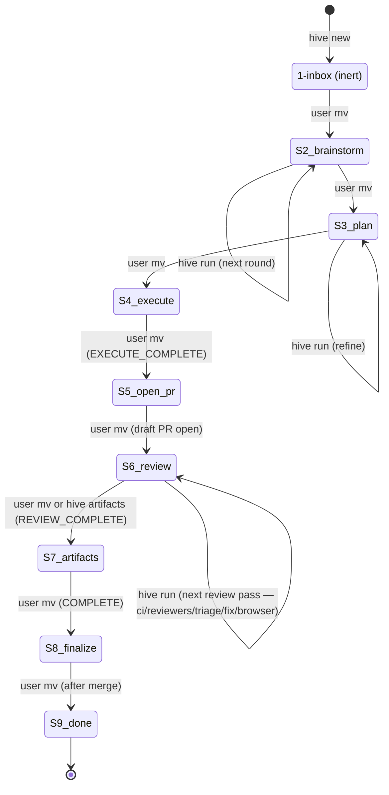

**TLDR**: Hive's workflow state has no application database. Persistent task/project state lives in two filesystem trees per project — `<project>/.hive-state/` (an orphan-branch worktree holding task folders, configs, locks, logs) and `~/Dev/<project>.worktrees/<slug>/` (feature worktrees holding actual code) — plus one global `~/.config/hive/config.yml` (or `HIVE_HOME/config.yml` / a migrated legacy registry). Token-usage metrics are the exception and use the SQLite store described in [[token-usage]]. Hivebox web adds no workflow tables: it reads `hive status` snapshots through `StatusFeed`/`StatusBroadcaster` and writes daemon dispatch requests as JSON files under the global state home. The workflow "data model" is the directory layout, marker grammar, YAML sidecars, and runtime JSON queue files described below.

## Stage directory layout

Per project, every task is a folder in exactly one stage subdirectory. Stage = location; `mv` between stages = approval.

```
<project>/.hive-state/
├── config.yml                # per-project config
├── .commit-lock              # short-lived flock around git commits
├── stages/
│   ├── 1-inbox/<slug>/
│   ├── 2-brainstorm/<slug>/
│   ├── 3-plan/<slug>/
│   ├── 4-execute/<slug>/
│   ├── 5-open-pr/<slug>/
│   ├── 6-review/<slug>/
│   ├── 7-artifacts/<slug>/
│   ├── 8-finalize/<slug>/
│   └── 9-done/<slug>/
└── logs/
    ├── <slug>/<stage>-<UTC-ts>.log
    └── display-name.log      # best-effort `hive generate-name` output
```

The constant `Hive::Stages::DIRS = %w[1-inbox 2-brainstorm 3-plan 4-execute 5-open-pr 6-review 7-artifacts 8-finalize 9-done]` is the canonical list (`lib/hive/stages.rb`). `GitOps`, `Status`, `Run#next_stage_dir`, and `Approve` all delegate to that single constant. See [[modules/stages]] and [[stages/review]].

`Hive::Task::PATH_RE` (`lib/hive/task.rb:16`) is the only validator for task paths and parses `<root>/.hive-state/stages/<N>-<stage>/<slug>/`.

`hive status --json` exposes two task timestamps from this layout: `mtime` is the current stage state-file mtime (or the folder mtime fallback when the state file is missing), while `folder_mtime` is always the task folder's own `File.mtime`. Daemon edit-resume decisions continue to use `mtime`; consumers that need directory-level aging can use `folder_mtime` without re-walking the filesystem. Status also exposes `pr_url` from `pr.md` frontmatter for tasks at `5-open-pr` and later, returning `null` before PR creation or when the sidecar is absent/unparseable. See [[commands/status]].

## Per-stage state file

Each stage has exactly one "state file" the runner writes the marker into. This is the single source of truth for stage progress.

| Stage | State file | Created by |
|-------|------------|------------|
| `1-inbox` | `idea.md` | `hive new` (rendered from `templates/idea.md.erb`) |
| `2-brainstorm` | `brainstorm.md` | `Stages::Brainstorm` agent on first run |
| `3-plan` | `plan.md` | `Stages::Plan` agent on first run |
| `4-execute` | `task.md` | `Stages::Execute#write_initial_task_md` (with frontmatter `slug`, `started_at`) |
| `5-open-pr` | `pr.md` | `Stages::OpenPr` writes frontmatter `pr_url` / `pr_number` |
| `6-review` | `task.md` | reused from `4-execute`, or created by `Hive::Patrol::ReviewHandoff` for patrol-opened PRs; markers driven by `Stages::Review` orchestrator |
| `7-artifacts` | `artifact.md` | `Stages::Artifacts` asks the configured artifact agent to write the artifact summary and stamp `COMPLETE` |
| `8-finalize` | `pr.md` | reused from `5-open-pr`; `Stages::Finalize` appends the final `COMPLETE` marker and writes `summary.md` |
| `9-done` | `task.md` | reused from `4-execute` |

For coding tasks, mapping is encoded in `Hive::Task::STATE_FILES` (`lib/hive/task.rb:15`), derived from `Hive::Workflows::Registry.default`. `Hive::Task#state_file` uses the task's selected workflow descriptor (`workflow.state_file_for(stage_name)`) so non-coding workflows can carry their own stage-state filenames while field-less coding tasks keep the historical paths.

## Task metadata sidecar

Every new task captured by `hive new` gets `<task>/meta.yml`, read and written by `Hive::TaskMeta` (`lib/hive/task_meta.rb`):

```yaml
id: 1
slug: add-foo-260603-abcd
display_name:
workflow:
```

`Hive::Task#id`, `#display_name`, `#display_label`, `#depends_on`, and the optional workflow selector are derived from this sidecar. Missing, malformed, or non-Hash YAML is tolerated by returning `{id: nil, slug: nil, display_name: nil, depends_on: nil, workflow: nil}`; `display_label` then falls back to the folder slug. `workflow:` was read-only in U3 (no writer emitted it); as of U6 `hive new` pins `meta.yml workflow:` only when an override was passed or the project `default_workflow` is non-coding (and then it pins that non-coding id) — a plain coding capture stays field-less (see [[commands/new]]). A manually tagged task still resolves the selected descriptor before validating its stage directory. `TaskMeta.update_id`/`update_display_name` preserve the selector on rewrite. Writes use a dot-prefixed tempfile in the task folder followed by `File.rename`. `hive migrate` backfills missing or null ids for legacy tasks, preserves existing display names, and generates missing display names with `Hive::DisplayName::Generator` after the locked id/config/stage migration completes. When the global daemon is running, `Hive::Daemon::DisplayNameBackfiller` also retries tasks whose sidecar `display_name` remains nil/blank by spawning `hive generate-name <folder>` on later ticks; this is cosmetic sidecar repair only, so the daemon does not write task ids, markers, or stage transitions. Patrol review handoff writes `meta.yml` with a normal `Hive::TaskCounter` id and display name `Patrol: <finding title>` because the task joins the standard review flow after the PR opens; only counter lock contention leaves that id null.

Task ids are allocated from the global counter file `<state_home>/task-counter.yml` via `Hive::TaskCounter.next!` (`lib/hive/task_counter.rb`). The counter is protected by `<state_home>/.task-counter.lock` (`flock LOCK_EX`, default 30s timeout, 0.2s polling) and stores the next id as YAML:

```yaml
next_id: 2
```

`TaskCounter.peek` returns `1` on missing/corrupt input; `seed_at_least!` can advance the next id without moving it backwards. `hive new` treats counter lock contention as fail-soft: it writes `meta.yml` with `id: null` and still captures the task. `hive migrate` seeds the counter above existing sidecar ids before assigning new ones.

## Slug grammar

`Hive::Commands::New::SLUG_RE = /\A[a-z][a-z0-9-]{0,62}[a-z0-9]\z/` (`lib/hive/commands/new.rb:15`).

- 3–64 chars, must start with a letter and end with a letter or digit.
- Auto-derived shape: `<5-words-kebab>-<YYMMDD>-<4hex>`. Empty/non-ASCII text falls back to `task-<YYMMDD>-<4hex>`.
- Reserved tokens rejected: `head`, `fetch_head`, `orig_head`, `merge_head`, `master`, `main`, `origin`, `hive`. Also rejects `..`, `/`, `@`. See [[commands/new]].

## Marker grammar

Markers are HTML comments at end-of-file in the state file. Exactly one is "current" — the *last* marker scanned by `Hive::Markers.current` (`lib/hive/markers.rb:17`).

| Marker | Meaning | Set by |
|--------|---------|--------|
| `<!-- WAITING -->` | stage agent finished a round, awaits human edits | brainstorm/plan agents |
| `<!-- COMPLETE -->` | stage finished, ready for `mv` to next stage | brainstorm/plan/open-pr/finalize agents; `done` runner |
| `<!-- AGENT_WORKING pid=N started=ISO -->` | claude subprocess is running right now | `Hive::Agent#run!` pre-spawn |
| `<!-- ERROR reason=... marker_id=<hex16> -->` | runner or launcher detected timeout, non-zero exit, concurrent edit, protected-file tamper, tmux session loss, or a stage-specific preflight failure; `Markers.set` generates `marker_id` for new `ERROR` markers | `Hive::Agent#handle_exit`, `Hive::ClaudeLauncher`, stage runners |
| `<!-- ERROR reason=limits_reached provider=<agent>? message="limits reached for <agent>: ..." retry_after=<iso8601> marker_id=<hex16> -->` | provider account/rate/quota limit surfaced by agent stdout/stderr or a Claude tmux pane menu; used to avoid masking account exhaustion as `timeout`, `exit_code`, `tmux_session_terminated`, `implementer_failed`, or "interactive prompt did not become ready". When the captured provider text includes a complete dated reset hint (month, day, year, and time), `Hive::AgentLimit.retry_after` uses that boundary plus a one-minute grace; ambiguous time-only text and unparseable/expired/implausibly distant dates fall back to `now + RETRY_COOLDOWN_SEC` (default 1h, env `HIVE_LIMITS_RETRY_COOLDOWN_SEC`). Tmux parsing bounds this input to the live matched limit line and adjacent menu/reset lines, excluding unrelated transcript dates; all-reviewer failures use the latest captured provider boundary. The stamp lets the daemon healer wait for the real usage window instead of burning its bounded retries hourly or staying red until manual `hive markers clear` — see [[daemon]]. `4-execute` stamps `provider=<execute-agent>` because its runner owns the final marker in `:exit_code_only` mode; older agent/launcher writers may only expose the provider in `message=`. | `Hive::Agent#handle_exit`, `Hive::ClaudeLauncher`, `Stages::Execute#run_pass` |
| `<!-- ERROR reason=ensure_clean_on_exit_failed residue_paths=<rel,paths> marker_id=<hex16> -->` | the clean-exit invariant (`Hive::Stages::CleanExit`, gated on `stages.ensure_clean_on_exit`) overwrote a stage's outcome marker because residue at stage exit was out-of-scope for `review.fix.auto_commit.scope_check`, git add/commit failed (including `git status` / `git add -A` / `git reset HEAD --` / `git diff --cached --name-only` exceeding the shared `AUTO_COMMIT_OP_TIMEOUT_SEC = 300` cap — `AutoCommit.capture_git_with_timeout` wraps the previously unbounded `Open3.capture3` calls so a hung pre-commit hook or frozen pager surfaces as `timed_out: true` instead of pinning the runner), or auto-commit raised `Hive::ConfigError` (invalid `review.fix.auto_commit.sign_policy` etc. — surfaced with `detail="invalid sign_policy config: ..."` instead of silently dropping into the generic StandardError warn-and-continue path). `residue_paths` is the comma-joined list of worktree-relative paths (absent on the config-error variant; the message is always carried in the `detail=` attr, truncated to 200 chars). When this marker overwrites a runner's own marker, `with_stage_events` also rewrites `result[:commit]` to `"ensure_clean_on_exit_failed"` and `result[:status]` to `:error` so the post-run hive-state commit (`commands/run.rb#commit_after`) matches the on-disk marker rather than the runner's stale success commit action. The bot routes this reason through manual-only reply (no inline retry); operator must inspect, fix the config or commit/discard residue, then `hive markers clear <folder> --name ERROR --match-attr reason=ensure_clean_on_exit_failed` and re-run the stage verb. | `Hive::Stages::Base#enforce_clean_exit!` via `with_stage_events` exit hook + `Stages::Finalize` entry backstop |
| `<!-- EXECUTE_WAITING reason=no_worktree_changes\|dirty_worktree\|missing_research_output\|branch_mismatch\|head_not_descendant -->` | impl spawn exited cleanly but cannot be marked done yet; inspect `## Execute Output`, revise/mark research, clean/commit worktree changes, or recover the expected task branch | `Stages::Execute#run!` |
| `<!-- EXECUTE_COMPLETE mode=research? -->` | impl pass committed cleanly on the expected task branch, or explicit research-mode pass captured structured output; ready for `mv` to `5-open-pr/` | `Stages::Execute#run!` (impl-only since U9) |
| `<!-- REVIEW_WORKING phase=ci\|reviewers\|triage\|fix\|browser pass=NN -->` | 6-review phase in flight (transient — replaced at phase exit). The daemon can clear a wedged row and log `reason=review_agent_died` when the recorded Claude child is dead and the live review lock holder has no remaining children, allowing the next tick to retry review. Claude/tmux reviewer waits also fail fast when the managed tmux session disappears before writing the expected output file; a non-empty expected artifact is accepted after session death only when the Claude Stop hook already wrote `.done`, so partial files do not get promoted as successful reviews. Provider-limit pane menus are classified as `limits reached for claude:` before readiness/session-death errors. | `Stages::Review` phase entry |
| `<!-- REVIEW_WAITING escalations=N pass=NN -->` | review pass produced escalations awaiting human edit | `Stages::Review` orchestrator |
| `<!-- REVIEW_CI_STALE attempts=N -->` | CI hard-block — `cfg.review.ci.max_attempts` reached without green; reviewers don't run on red CI | `Stages::Review` CI phase |
| `<!-- REVIEW_STALE pass=NN -->` | hit `cfg.review.max_passes` (default 2) | `Stages::Review` orchestrator |
| `<!-- REVIEW_COMPLETE pass=NN browser=passed\|warned\|skipped -->` | review loop done — ready to run `hive artifacts` into 7-artifacts (`browser=warned` = soft-warn surfaced in PR body) | `Stages::Review` orchestrator |
| `<!-- REVIEW_ERROR phase=... reason=... message="..." -->` | agent-level error or protected-file tampering (mirrors ADR-013's `:error` shape for `EXECUTE_*`). Most review errors remain human-recoverable, but the daemon auto-clears no-live-lock `reason=review_agent_died`, `phase=reviewers reason=reviewer_partial_failure` when `reviews/errors-NN.md` contains only Claude/tmux `tmux_session_terminated before writing expected output file` failures, `phase=fix reason=fix_failed message="claude stop hook did not signal completion"` for the legacy Claude stop-hook completion bug, and `reason=limits_reached` once its `retry_after` cooldown elapses. The review runner can suppress the known Claude/tmux fix Stop-hook failure before this marker is written only when launcher evidence and review facts prove a completed pass: artifacts exist, no unresolved escalations remain, the worktree is readable, and commit/dirty-worktree/whole-pass `RESOLVED/NO-FIX` evidence exists. Review limit markers can come from CI-fix, all reviewers failing on limits, or triage/fix spawn failures whose captured error text matches `Hive::AgentLimit`; this limit gate runs before any terminal classifier so rate-limit/429 text keeps the cooldown path. Residual non-limit triage/fix phase-agent failures use `Hive::ReviewErrorReason`'s closed enum (`merge_conflict`, `network_timeout`, `tool_permission_denied`, `agent_crashed`, `unknown`) and carry a whitespace-collapsed, 300-char-capped `message=` attr from the captured error so `status.md`, `hive status --json`, and the web diagnostic card show the real cause even when `reason=unknown` (in practice the triage/fix plumbing forwards a condensed wrapper string rather than raw agent output, so the named buckets rarely fire and this normally lands on `unknown` — see [[stages/review]]) (non-limit CI errors write `reason=ci_unrunnable` directly and carry no `message=`). Auto-clear is bounded per daemon process by failure signature (default 3); repeated identical failures stay red after the budget is exhausted. | `Stages::Review` orchestrator |

`5-open-pr`, `7-artifacts`, and `8-finalize` reuse the generic `COMPLETE` / `ERROR` marker names with stage-specific attrs such as `pr_url=...`, `is_draft=true|false`, `idempotent=true`, and `reason=...`. Most `ERROR` markers remain manual recovery states, but the daemon auto-clears a narrow no-live-lock subset with marker-id guards and bounded per-process budgets: `8-finalize` `reason=unpushed_commits`, plus non-review terminal agent-loss `reason=tmux_session_terminated` / `reason=agent_orphaned` in `2-brainstorm`, `3-plan`, `4-execute`, `7-artifacts`, and `8-finalize`. `reason=limits_reached` (any stage, including review `REVIEW_ERROR` markers from reviewers/triage/fix) also self-heals, gated on its `retry_after` cooldown stamp rather than on stage. A second recoverable terminal-error healer handles dependency outages: Codex-auth `ERROR reason=implementer_failed provider=codex message=...401...` and `ERROR reason=claude_launch_failed` can be cleared only after fail-closed work-area safety checks, changed health signal/backoff gates, and successful dependency probes; `daemon.auto_retry.enabled: false` disables that path. `hive status`, `hive status --json`, and the TUI render quota holds through `Hive::AgentLimit`: human/TUI text says `held: agent quota (...) — retry after ... UTC; top up or switch execute agent`, while JSON adds `"held": {"reason":"quota","provider":...,"retry_after":...}` without overloading dependency `blocked_by`. The `3-plan` terminal-error path writes a `DispatchRequestQueue` request for `hive plan <slug> --project <project> --from 3-plan` after any successful terminal `ERROR` clear there, including terminal agent-loss, elapsed `limits_reached`, and recoverable dependency-outage clears, because clearing the marker can leave an empty markerless `plan.md` that otherwise classifies straight back to `:error`. See [[daemon]]. Separately, an `8-finalize` `ERROR reason=git_status_failed` or `reason=claude_launch_failed` stays red while the PR is open unless the recoverable-error healer clears it; `PrMergeWatcher` can also retire it after the PR is merged by dispatching the internal archive recovery path, and `StageAction` re-confirms the marker reason and GitHub `MERGED` state before moving the folder to `9-done`.

Marker name allowlist: `Hive::Markers::KNOWN_NAMES`. Regex: `Hive::Markers::MARKER_RE`. Adding a marker requires updating BOTH (two sources of truth). Attributes are `key=value` (or `key="quoted value"`). New `ERROR` markers get a generated `marker_id` attr; human labels hide it, but recovery surfaces use it as the preferred `hive markers clear --match-attr marker_id=...` guard. Legacy `ERROR` rows without `marker_id` fall back to observed attrs such as `reason=exit_code,exit_code=143`. U9 dropped `EXECUTE_STALE` from the live grammar (review iteration moved out of 4-execute); the name remains in `KNOWN_NAMES` for back-compat parsing of historical state files but is never written by current code. `EXECUTE_WAITING` remains live for implementation-output pauses, not review iteration.

Recovery from a stale or error marker is agent-callable via `hive markers clear FOLDER --name <NAME>` (LFG-4, see [[commands/markers]]). The clear allowlist is `REVIEW_STALE`, `REVIEW_CI_STALE`, `REVIEW_ERROR`, `EXECUTE_STALE`, `ERROR`; terminal-success markers (`REVIEW_COMPLETE`, `EXECUTE_COMPLETE`, `COMPLETE`) are refused. Race-sensitive callers should pass `--match-attr`: `ERROR` recovery prefers `marker_id`, while review markers use pass/phase/reason attrs. The `Stages::Review` pre-flight warn text now embeds the concrete `hive markers clear …` command for each stale-marker case.

`Markers.set` writes via tempfile + `File.rename` for atomicity, holding `LOCK_EX` on a `.markers-lock` sidecar (not the data file) so readers never see partial writes. UTF-8 is pinned. See [[modules/markers]].

## Concurrency files

- **Per-task lock**: `<task folder>/.lock` — YAML payload `{pid, started_at, process_start_time, claude_pid?, claude_pid_start_time?, slug?, stage?}`. Acquired EXCL by `Hive::Lock.acquire_task_lock` (`lib/hive/lock.rb:18`). Stale check uses `Process.kill(0, pid)` plus `/proc/<pid>/stat` field-22 cross-check to defeat runner PID reuse. After spawning, both headless `Hive::Agent` and tmux-backed `Hive::ClaudeLauncher` write the child `claude_pid` and its `claude_pid_start_time`; cleanup compares that identity metadata with the live process before signalling so PID reuse cannot target an unrelated child.
- **Per-project commit lock**: `<project>/.hive-state/.commit-lock` — short flock around the `git add && git commit` in the hive-state worktree to serialize concurrent writers. See [[modules/lock]].

## Runtime dispatch queue and web snapshots

The daemon's producer queue lives under `$HIVE_HOME/dispatch_requests/`
(`Hive::Paths.state_home`, not inside a project `.hive-state/`). Producers are
the Telegram bot, hivebox web, and the `3-plan` terminal-error healer.
Web paths currently write through `Hive::Bot::DispatchRequestWriter`, so the
JSON `requestor` field is commonly `bot`; `trigger` values such as `web` and
`web_recover` distinguish the web-originated requests, while the healer writes
`requestor=healer`.
Each pending request is one JSON file:

```yaml
schema: hive-dispatch-request
schema_version: 2
request_id: <hex16>
created_at: <UTC-ISO8601>
project: <registered project name>
slug: <task slug>
argv: ["hive", "<allowlisted verb>", ...]
requestor: bot|healer
chat_id:
update_id:
trigger:
```

The current strict wire contract is `hive-dispatch-request.v2`: v2 adds the
closed `requestor: healer` producer used by `StaleAgentHealer` while preserving
`bot` for Telegram and hivebox web (web still writes through
`Hive::Bot::DispatchRequestWriter`). The daemon rejects any file whose
`schema_version` does not equal `DispatchRequestQueue::SCHEMA_VERSION` with
`unknown_schema_version`; older schema files remain in `schemas/` for pinned
validators, not for mixed-version live queue operation.

`Hive::Daemon::DispatchRequestQueue.valid_argv?` requires `argv[0] == "hive"`
and allowlists only workflow-mutating verbs (`run`, `develop`, `brainstorm`,
`plan`, `review`, `open-pr`, `artifacts`, `finalize`, `archive`, `markers`).
Pending requests expire after `EXPIRY_SEC = 600`. On dispatch, the daemon
renames the file to `<id>.json.claimed` and writes
`<id>.json.claimed.claim` with `pid`, `process_start_time`, and `claimed_at`;
those claim files are the at-most-once dispatch record. Multi-step recoveries
store later argv arrays in `<request_id>.sequence` and promote the next request
only after the previous child exits 0; non-zero/nil exits discard the sequence.
Hivebox `recover` writes the sequence sidecar first, then the guarded
`hive markers clear ... --json` request, and discards the sidecar if the
request write fails so no orphaned continuation remains.

Hivebox's `web/app/models/status_broadcaster.rb` is a Rails model class, but it
is not an ActiveRecord workflow entity. It bridges `Hive::Web::StatusFeed` to
Turbo Streams. `StatusFeed#snapshot` computes a fresh
`Hive::Commands::Status#json_payload(Hive::Config.registered_projects)` for
request-time reads; `StatusFeed#each_snapshot` runs one shared poller per
process and compares snapshots with only volatile `generated_at` /
`age_seconds` fields removed. `mtime` and `folder_mtime` deliberately remain
part of the comparison key because task pages use those changes as the liveness
signal for artifact/log refreshes while agents write. `StatusBroadcaster`
publishes a status-channel refresh before rendering and replacing the
dashboard's `projects` frame, so task pages that do not contain that frame
still receive a morph signal even if a bad project row makes the grid partial
raise.

## Worktree pointer

When a task enters `4-execute/`, `Stages::Execute#run_init_pass` creates `~/Dev/<project>.worktrees/<slug>/` (or `cfg["worktree_root"]/<slug>`) and writes `<task folder>/worktree.yml`:

```yaml
path: /home/asterio/Dev/<project>.worktrees/<slug>
branch: <slug>
created_at: <UTC-ISO>
execute_base_head: <sha>
```

`Hive::Worktree.read_pointer` is the only reader; `Hive::Worktree.validate_pointer_path` rejects paths outside the configured `worktree_root` prefix. See [[modules/worktree]].

## Review artefacts

Inside `6-review/<slug>/reviews/` (since U9; pre-U9 review iteration lived under `4-execute/<slug>/reviews/`):

```
reviews/
├── <reviewer-name>-01.md      # per-reviewer finding file, pass 1
├── <reviewer-name>-02.md      # per-reviewer finding file, pass 2
├── escalations-01.md          # triage output: items needing user judgment
├── errors-01.md               # reviewer infrastructure failures for a pass
├── ci-blocked-NN.md           # written when CI hard-blocks (REVIEW_CI_STALE)
├── browser-result-NN-AA.json  # per-attempt browser-test result
├── browser-blocked-NN.md      # written when all browser attempts fail (browser=warned)
├── fix-guardrail-NN.md        # written when post-fix diff guardrail flags a match
├── suppressed.md              # base-bound triage RESOLVED/NO-FIX suppression list
└── ...
```

Per-reviewer file format (checkbox triage lines):

```
## High
- [ ] finding A: justification
## Medium
- [x] finding B: justification     # accepted by triage (or by user during REVIEW_WAITING)
## Nit
- [ ] finding C: justification
```

Pass derivation is filesystem-native: `Stages::Review` reads the max `-NN` suffix across per-reviewer files in `reviews/` to derive the current pass. Pass-N completion is classified by `pass_completion_status(folder, N)`:

- **`:complete`** — pass-`N+1` reviewer files exist OR `reviews/fix-success-NN.md` sentinel exists and is fresh relative to `escalations-NN.md`. The runner moved past pass N cleanly; advance to `NN+1`.
- **`:triage_incomplete`** — reviewer files for pass N exist but no `escalations-NN.md`, or `reviews/errors-NN.md` records reviewer infrastructure failures for that pass. The next markerless run retries pass N at Phase 2/3 so failed reviewers get a fresh attempt and stale `errors-NN.md` is cleared at the start of `run_reviewers`.
- **`:fix_incomplete`** — both reviewer files and `escalations-NN.md` exist, but neither the fix-success sentinel nor any pass-`N+1` reviewer file exists. The fix phase failed (`REVIEW_ERROR phase=fix`) or the runner was interrupted mid-fix. The next markerless run **skips Phase 2/3** and re-runs Phase 4 on the operator's existing `[x]` marks — preserving accepted findings instead of regenerating them.

The runner writes the `fix-success-NN.md` sentinel at every "pass N is done, advance" decision (post-guardrail-not-tripped, and the Phase 2 zero-findings short-circuit to Phase 5). The current pass's sentinel path is protected during the fix-agent spawn so only the runner can mark a pass complete. For repos created before the sentinel existed, the pass-`N+1` reviewer files act as a back-compat fallback at non-topmost passes (the topmost pass on a legacy repo may re-run its fix once on first encounter — accepted migration cost).

No `pass:` frontmatter or sidecar — recovery is "delete the highest-NN files to drop pass back" for completed stale passes. Accepted findings (`[x]` lines) are concatenated and passed to the Phase 4 fix agent via the per-spawn nonce wrap; orchestrator-owned files are excluded from the `Hive-Reviewer-Sources` trailer derivation by `reviewer_file?` (the single-source `ORCHESTRATOR_OWNED_PREFIXES` list). Note `suppressed.md` is already excluded by the `*-NN.md` glob `reviewer_sources_for` enumerates (it carries no `-NN` pass suffix), so its `suppressed` prefix is belt-and-suspenders for this particular derivation. The other two consumers — `discover_reviewer_files` (`triage.rb`) and `collect_accepted_findings` (`review.rb`) — also glob the narrow `*-NN.md`, so `suppressed.md` is excluded there by glob too; the prefix earns its place in the list purely as defense-in-depth against a future consumer that globs `*.md` more broadly, not because any current consumer does.

## Configs

### Global: `~/.config/hive/config.yml`

```yaml
registered_projects:
  - name: <project_name>
    path: /abs/path/to/project
    hive_state_path: /abs/path/to/project/.hive-state
    real_path: /resolved/path/to/project   # private; only present when resolvable
bot:
  enabled: false
  pairing_enabled: false
  chat_id_allowlist: []          # integers; token comes from HIVE_TELEGRAM_BOT_TOKEN
  poll_interval_sec: 30
  long_poll_timeout_sec: 25
  notification_dedupe_window_sec: 300
  alert_state_file: ~/.local/state/hive/.bot.alert_state.json
  recovery_reminder_window_sec: 28800
  conversation_ttl_sec: 3600
  shutdown_grace_sec: 60
  pid_file: ~/.local/state/hive/.bot.pid
  log_file: ~/.local/state/hive/logs/bot.log
  log_max_bytes: 10485760
  log_max_files: 5
  last_seen_state_file: ~/.local/state/hive/.bot.last_seen_update_id
update:                          # update-check knobs (plan 2026-05-27-002, U4)
  check: true                    # daemon probes GitHub latest release when idle
  auto: true                     # self-update when possible; false keeps checks/nudges only
```

`update:` is a global block merged over `DEFAULTS["update"]` by `Config.load_global_update` (used by `hive daemon start`). Both keys are booleans validated by `Config.validate_update!` (a non-Hash block or non-boolean key raises `ConfigError`, exit 78). `auto: false` keeps the daily check and brew/AUR nudge but never self-updates. The check's bookkeeping lives in the `update_check.json` runtime file (see below), not in this config.

Managed by `Hive::Config.register_project`; deregistered by `unregister_project` (one row, by name) and `prune_missing_projects!` (every row whose `path` is missing, whose stored valid `real_path` no longer matches the current target, OR whose shape is invalid). Registry writers serialize on the sticky sibling `config.yml.lock` and replace `config.yml` via tempfile + `fsync` + atomic rename. `HIVE_HOME` overrides the XDG default `~/.config/hive`; legacy `~/Dev/hive/config.yml` is migrated when no XDG config exists.

Loader tolerance (`Config.registered_projects` / `load_global_config`): a non-Hash row, a row missing `name`, or a row whose `path` isn't a String is *skipped silently* instead of raising — a single hand-edit accident can no longer brick `status`/`forget`/`prune`/TUI. `Psych::Exception` (any malformed YAML — syntax, disallowed-class, alias-not-enabled) plus `Errno::EACCES`/`EISDIR` are rewrapped as `ConfigError` (exit 78); `chmod 000 ~/.config/hive/config.yml` no longer leaks as exit-70 InternalError. `prune` is the cleanup verb for invalid rows surfaced this way (predicate `Config.droppable_registry_entry?` covers missing paths, stored valid-realpath mismatches, and invalid shape; `valid_registry_entry?` is the shared shape gate). Read-modify-write paths go through `update_global_config!` so concurrent `hive init` / `hive forget` / `hive prune` calls cannot lose updates; direct writes go through `write_global_config!` and take the same lock. See [[commands/forget]] · [[commands/prune]] · [[modules/config]]. Writer filesystem failures (`Errno::EACCES`/`EPERM`/`EISDIR`/`ENOTDIR`/`ELOOP`/`EROFS`/`ENOSPC`/rename-class errors) are rewrapped as `Hive::ConfigError` (exit 78). The reader (`load_global_config`) likewise rewraps `Psych::SyntaxError` AND `Errno::EACCES`/`EISDIR` to `ConfigError` so a `chmod 000` on `~/.config/hive/config.yml` surfaces as exit 78, not exit 70. Name matching in `unregister_project` is `to_s`-symmetric so a hand-edited Integer `name:` in YAML still resolves. `forget`/`prune` `--json` envelopes use `Hive::Schemas::EnvelopeEmitter` (`lib/hive.rb`) and `File.expand_path` raw `path` / `hive_state_path` to honor the schemas' "Absolute path" contract regardless of how the registry row was hand-edited.

`bot:` is a global operator-surface block, not a per-project enrollment knob. `Config.load_global_bot(require_runtime: true)` merges it over `Config.global_bot_defaults`, validates integer chat IDs, poll bounds, booleans including `pairing_enabled`, and path strings, then requires `HIVE_TELEGRAM_BOT_TOKEN` plus either a non-empty allowlist or `pairing_enabled: true` before `hive bot start` can run. Runtime files are global under `~/.local/state/hive/`: `.bot.pid` for the single-instance lock, `logs/bot.log` for structured JSON lines, `.bot.last_seen_update_id` for Telegram reconnect summaries, `.bot.alert_state.json` for persisted notification fingerprints, row snapshots, first-seen timestamps, and reminder timestamps, `.bot.pairings.json` for pending Telegram pairing codes, and `pairing_approvals/` for owner-authored approval notices drained by the running bot.

Active brainstorm answer conversations are not persisted. `Hive::Bot::ConversationStore` keeps only in-memory rows shaped as `chat_id`, `project`, `slug`, `question_n`, `mode`, and `updated_at`, with TTL pruning and a mutex because Telegram polling mutates rows while notification polling asks `active_for_slug?`. The retired Codex draft-assist confirm/draft state is intentionally absent: no `history`, `draft`, `awaiting_confirm`, or pending-confirm counter remains. Idea capture uses the separate `IdeaDraftStore` and `idea_draft_ttl_sec` path above.

### Per-project: `<project>/.hive-state/config.yml`

```yaml
project_name: <name>
default_branch: master              # detected by GitOps#detect_default_branch
worktree_root: /home/.../<name>.worktrees
hive_state_path: .hive-state
# Budgets and timeouts are GENEROUS sanity caps for runaway agents — not
# cost targets. Bumped ~5× from pre-2026-05-04 values (ADR-023). The
# `execute_review` key was DROPPED from DEFAULTS in plan 2026-05-04-001:
# 6-review owns reviewer budgets per ADR-014. Old project configs that
# still set `execute_review` survive deep-merge but the key is no longer
# rendered for fresh projects and nothing reads it.
budget_usd:
  brainstorm: 50
  plan: 100
  execute_implementation: 500
  pr: 50
  review_ci: 100
  review_triage: 75
  review_fix: 500
  review_browser: 100
timeout_sec:
  brainstorm: 1800
  plan: 3600
  execute_implementation: 14400
  pr: 1800
  review_ci: 3600
  review_triage: 1800
  review_fix: 14400
  review_browser: 3600
# Stage-level agent for the three single-agent stages (ADR-023). The
# 6-review stage keeps per-role agent fields under `review.{ci,triage,
# fix,browser_test}.agent`. Runtime fallback in stage code stays
# `cfg.dig("<stage>", "agent") || "claude"`, so legacy configs without
# these keys keep working.
claude:     { mode: tmux, permission_mode: bypassPermissions }  # mode is tmux | headless; permission_mode applies to every Claude-backed launch in both tmux and headless mode via `AgentProfile#permission_flags` (`bypassPermissions` default → `--dangerously-skip-permissions`, otherwise `--permission-mode <mode>`; `auto` for Claude Code auto-mode rules). DEFAULTS-seeded — always non-nil after Config.load. `Config.explicit_claude_mode?` is a strict `EXPLICIT_CLAUDE_MODE_KEY == true` check (no dig fallback) so synthesised cfgs in tests/daemon helpers must set the flag themselves. Applies to every Claude-backed launch via `Hive::ClaudeLauncher` (shared tmux envelope across brainstorm/plan/execute/open_pr/artifacts/finalize/review). `hive doctor` surfaces the active mode.
brainstorm: { agent: claude, runtime: headless }  # runtime is legacy read-back-compat only
plan:       { agent: claude }
execute:    { agent: claude }   # rendered template recommends `codex`; DEFAULTS stays `claude`
open_pr:    { agent: claude }
artifacts:  { agent: claude }
finalize:   { agent: claude }
agents:                 # per-CLI profile overrides (claude, codex, pi, grok)
  claude: { bin: claude, env_override: HIVE_CLAUDE_BIN, min_version: 2.1.118 }
  codex:  { bin: codex,  env_override: HIVE_CODEX_BIN,  min_version: 0.125.0 }
  pi:     { bin: pi,     env_override: HIVE_PI_BIN,     min_version: 0.70.2 }
  grok:   { bin: grok,   env_override: HIVE_GROK_BIN,   min_version: 0.2.90 }
review:                 # 6-review stage config (U2)
  ci:           { command: null, max_attempts: 3, agent: claude, prompt_template: ci_fix_prompt.md.erb }
  triage:       { enabled: true, agent: claude, bias: courageous, prompt_template: null, custom_prompt: null }
  fix:
    agent: claude
    prompt_template: fix_prompt.md.erb
    auto_commit:
      sign_policy: inherit   # inherit | bypass | fail
      scope_check:
        enabled: true
        allowed_paths: [...] # default source/test/docs/wiki/manifests allowlist
        denied_paths: [...]  # default bin/config/CI/env/lockfile denylist
  browser_test: { enabled: false, agent: claude, prompt_template: browser_test_prompt.md.erb, max_attempts: 2 }
  max_passes: 2
  max_wall_clock_sec: 5400
  reviewers: [...]      # Array — REPLACED wholesale on override (no per-element merge)
rebase:                 # auto-rebase pre-step for `hive run` (plan 2026-05-14-001)
  enabled: true                         # opt out per-project
  conflict_resolution_timeout_sec: 2700 # min 60; per-spawn cap on conflict agent
stages:                  # stage-runner-level invariants enforced by `Hive::Stages::Base.with_stage_events`
  ensure_clean_on_exit: true            # default true; `Hive::Stages::CleanExit` runs as a post-yield hook on every WORKTREE_OWNING stage (`4-execute`, `6-review`, `8-finalize`). Clean worktree → no-op. Residue that passes `review.fix.auto_commit.scope_check.allowed_paths` → auto-commit via the shared `Hive::Stages::AutoCommit` primitives. Out-of-scope residue or git failure → overwrite the marker to `<!-- ERROR reason=ensure_clean_on_exit_failed residue_paths=... -->`. PAUSE_MARKERS (`:execute_waiting`, `:review_waiting`) skip enforcement. Finalize also runs CleanExit as an *entry* backstop so 6-review residue self-heals before finalize logic begins. Set to `false` to opt the entire invariant out (not recommended outside legacy projects).
```

The `rebase:` block (added 2026-05-14) drives a pre-dispatch step in `hive run`: before invoking the stage runner, the runner detects whether the task's worktree branch is behind `origin/<default_branch>`, fetches, attempts `git rebase`, and on conflict spawns the project's `cfg.execute.agent` against `templates/rebase_conflict_resolution.md.erb` to resolve them. Fail-soft — any failure aborts the rebase, cleans agent-created untracked files, and proceeds with the stale base. The agent-dispatch cap (`MAX_CONFLICT_RESOLUTIONS = 5`) is a Ruby constant in `lib/hive/rebase.rb`, not config. See [[modules/git_ops]] and [[modules/config]].

`Config::ROLE_AGENT_PATHS` (validated by `validate_role_agent_names!`) now also covers the three new stage-agent paths: `%w[brainstorm agent]`, `%w[plan agent]`, `%w[execute agent]` — alongside the existing `review.{ci,triage,fix,browser_test}.agent` paths.

Loaded by `Hive::Config.load`, recursively deep-merged onto `Hive::Config::DEFAULTS` (`lib/hive/config.rb:6`) and validated via `Config.validate!` before return. Templated from `templates/project_config.yml.erb`. The `review.reviewers` Array is replaced wholesale (not per-element merged) — see [[modules/config]].

## Logs

`<project>/.hive-state/logs/<slug>/<log_label>-<UTC-ts>.log` — one file per agent invocation. `log_label` is `brainstorm` / `plan` / `execute-impl-NN` / `execute-review-NN` / `open-pr` / `finalize`. (Pre-renumber log files used the unified `pr` label; new tasks emit `open-pr`/`finalize` separately.) Append-only; no rotation in MVP. Stream contains both spawn metadata and full stdout/stderr of the claude subprocess.

## Frontmatter conventions

- `idea.md` (Step 0 capture): `slug`, `created_at`, `original_text` (multiline).
- `task.md` (4-execute / 6-review / 9-done): `slug`, `started_at`. Pre-U9 carried `pass:`; the field was dropped when review iteration moved to 6-review and pass became filesystem-derived.
- `pr.md`: `pr_url`, `pr_number` (when populated by 8-finalize runner from existing PR lookup).

## Commit trailers (fix-agent metric)

Fix-agent commits (Phase 4 review-fix and Phase 1 ci-fix) MUST end with these git trailers — the templates `templates/fix_prompt.md.erb` and `templates/ci_fix_prompt.md.erb` instruct the LLM to emit them, and `Hive::Metrics.rollback_rate` is the consumer.

| Trailer | Phase | Source |
|---------|-------|--------|
| `Hive-Task-Slug: <slug>` | ci, fix | template var `task_slug` |
| `Hive-Fix-Pass: <NN>` | ci, fix | `attempt` (ci) / `pass` (fix) |
| `Hive-Fix-Phase: <ci\|fix>` | ci, fix | template literal |
| `Hive-Fix-Findings: <int>` | fix only | filled by LLM for self-authored fix commits; auto-commit fallback fills it from the accepted-findings collector. Counts accepted reviewer findings plus answered escalations applied in this commit, not raw markdown checkboxes inside answered-escalation context. |
| `Hive-Triage-Bias: <courageous\|safetyist\|custom>` | fix only | `cfg.review.triage.bias` via `Stages::Review#triage_bias_for` |
| `Hive-Reviewer-Sources: <names>` | fix only | sorted, comma-joined reviewer-file basenames for the pass via `Stages::Review#reviewer_sources_for`; orchestrator-owned files excluded via `reviewer_file?` (the single-source `ORCHESTRATOR_OWNED_PREFIXES`); `none` when empty |

Trailers are not validated server-side — commits without trailers are silently excluded from the rollback metric, so missing trailers degrade signal but never block work. `Hive::Metrics.parse_trailers` (`lib/hive/metrics.rb:104`) lower-cases keys and accepts any `[A-Za-z][A-Za-z0-9-]*: value` line in the body. See [[modules/metrics]] · [[commands/metrics]].

## Babysitter state (out-of-band)

Per-project opt-in PR-repair daemon (see [[modules/babysitter]]). Lives outside the 1→9 stages tree.

```
<project>/.hive-state/babysitter/
├── events.jsonl                 # append-only JSONL action log
├── status.md                    # human-readable loop summary
└── worktrees/<pr>/              # ephemeral worktree per PR head branch
$HIVE_HOME/.babysitter.pid        # single-instance PID lock
$HIVE_HOME/logs/babysitter.log    # rotated JSON-line process log
```

No marker grammar, no stage `mv`, no `worktree.yml` — `Hive::Babysitter::Worktree.materialize` recreates the per-PR worktree from the PR head each tick (it checks out `hive-babysitter/pr-<n>` built from `pull/<n>/head`, so context diffs/divergence run against local `HEAD`, never `headRefName`). `remove_existing!` runs `worktree remove --force` + `worktree prune` unconditionally each tick so orphan `.git/worktrees/<pr>/` metadata from a crashed run can't wedge the next `worktree add`. Events use the closed action/outcome enums documented in [[modules/babysitter]].

State invariants added in pass 02 (commit `7b07adc9`):

- **PID lock**: `start` reserves `$HIVE_HOME/.babysitter.pid` with an `O_CREAT|O_EXCL` open so two simultaneous starts can't both launch a dispatcher; the loser raises `ConcurrentRunError`. A start that can't read its own process start-time unlinks the file and refuses (PID-reuse defense must stay armed). `stop`/cleanup use `FileUtils.rm_f`.
- **Per-tick config reload**: `ProjectTick.run` re-reads `Hive::Config.load(project_path)` each tick (its signature dropped the dispatcher-cached `cfg`), so a `babysitter.*` edit takes effect next tick without a daemon restart. SIGHUP additionally rebuilds the `Logger` from `load_global_daemon` to pick up refreshed `log_max_bytes` / `log_max_files`.
- **Log rotation**: `log_max_files <= 1` deletes the current log and reopens fresh (no `.N` ring), fixing the prior infinite-re-rotate when the rename ring was a no-op. Rotation failures warn once (`@rotation_warned`).
- **Fork PRs**: a cross-repository PR (`isCrossRepository == true`) is never repaired — `PrFixer` labels it `needs-human`, emits `action=skipped outcome=fork_pr`, and `ProjectTick` counts it under `needs_human`. `fork_pr` is in the events outcome allowlist.
- **Base-divergence context**: `ContextBuilder` fills `base_sha`, `merge_base`, `ahead`, `behind` from `Hive::Gh.pr_base_divergence` (best-effort; blanks on git error) and threads them into `templates/babysitter_pr_fix_prompt.md.erb`.

## State machine diagram


```mermaid
stateDiagram-v2
    [*] --> S1_inbox: hive new
    S1_inbox: 1-inbox (inert)
    S1_inbox --> S2_brainstorm: user mv
    S2_brainstorm --> S2_brainstorm: hive run (next round)
    S2_brainstorm --> S3_plan: user mv
    S3_plan --> S3_plan: hive run (refine)
    S3_plan --> S4_execute: user mv
    S4_execute --> S5_open_pr: user mv (EXECUTE_COMPLETE)
    S5_open_pr --> S6_review: user mv (draft PR open)
    S6_review --> S6_review: hive run (next review pass — ci/reviewers/triage/fix/browser)
    S6_review --> S7_artifacts: user mv or hive artifacts (REVIEW_COMPLETE)
    S7_artifacts --> S8_finalize: user mv (COMPLETE)
    S8_finalize --> S9_done: user mv (after merge)
    S9_done --> [*]
```

Since 2026-05-22, `Hive::Stages::DIRS` has all nine slots filled in order; `Stages.next_dir(4)` returns `"5-open-pr"`, `Stages.next_dir(6)` returns `"7-artifacts"`, and `Stages.next_dir(8)` returns `"9-done"`. See [[stages/review]] for the autonomous-loop semantics.

See [[stages/index]] for one page per stage.

## Backlinks

- [[architecture]]
- [[stages/inbox]] · [[stages/brainstorm]] · [[stages/plan]] · [[stages/execute]] · [[stages/open-pr]] · [[stages/review]] · [[stages/artifacts]] · [[stages/finalize]] · [[stages/done]]
- [[modules/task]] · [[modules/markers]] · [[modules/lock]] · [[modules/worktree]] · [[modules/config]] · [[modules/patrol]]
