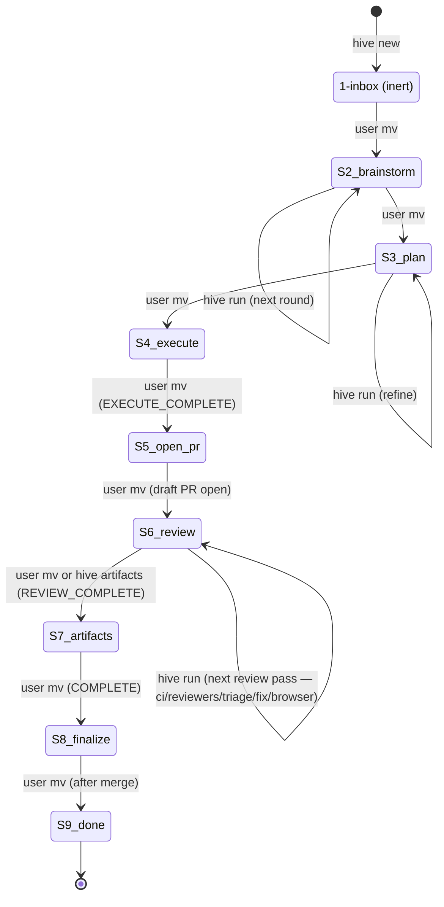

**TLDR**: Hive's workflow state has no application database. Task/project state lives in `.hive-state` and feature worktrees; durable task execution ownership lives in versioned attempt records under the global state home. Evidence-bound delivered/superseded closure is a separate task-local authority retained with an archived task, never fabricated attempt success.

## Stage directory layout

Per project, every task is a folder in exactly one stage subdirectory. Stage = location; `mv` between stages = approval.

```
<project>/.hive-state/
├── config.yml                # per-project config
├── .commit-lock              # short-lived flock around git commits
├── stages/
│   ├── 1-inbox/<slug>/
│   ├── 2-brainstorm/<slug>/
│   ├── 3-plan/<slug>/
│   ├── 4-execute/<slug>/
│   ├── 5-open-pr/<slug>/
│   ├── 6-review/<slug>/
│   ├── 7-artifacts/<slug>/
│   ├── 8-finalize/<slug>/
│   └── 9-done/<slug>/
└── logs/
    ├── <slug>/<stage>-<UTC-ts>.log
    └── display-name.log      # best-effort `hive generate-name` output
```

The constant `Hive::Stages::DIRS = %w[1-inbox 2-brainstorm 3-plan 4-execute 5-open-pr 6-review 7-artifacts 8-finalize 9-done]` is the canonical list (`lib/hive/stages.rb`). `GitOps`, `Status`, `Run#next_stage_dir`, and `Approve` all delegate to that single constant. See [[modules/stages]] and [[stages/review]].

`Hive::Task::PATH_RE` (`lib/hive/task.rb:16`) is the only validator for task paths and parses `<root>/.hive-state/stages/<N>-<stage>/<slug>/`.

`hive status --json` exposes two task timestamps from this layout: `mtime` is the current stage state-file mtime (or the folder mtime fallback when the state file is missing), while `folder_mtime` is always the task folder's own `File.mtime`. Daemon edit-resume decisions continue to use `mtime`; consumers that need directory-level aging can use `folder_mtime` without re-walking the filesystem. Status also exposes `pr_url` from `pr.md` frontmatter for coding tasks at `5-open-pr` and later and for generic workflows whose descriptor declares `handoff: draft_pr`, returning `null` before verified PR metadata exists or when the sidecar is absent/unparseable. See [[commands/status]].

## Per-stage state file

Each stage has exactly one "state file" the runner writes the marker into. This is the single source of truth for stage progress.

| Stage | State file | Created by |
|-------|------------|------------|
| `1-inbox` | `idea.md` | `hive new` (rendered from `templates/idea.md.erb`) |
| `2-brainstorm` | `brainstorm.md` | `Stages::Brainstorm` agent on first run |
| `3-plan` | `plan.md` | `Stages::Plan` agent on first run |
| `4-execute` | `task.md` | `Stages::Execute#write_initial_task_md` (with frontmatter `slug`, `started_at`) |
| `5-open-pr` | `pr.md` | `Stages::OpenPr` writes frontmatter `pr_url` / `pr_number` |
| `6-review` | `task.md` | reused from `4-execute`, created by Patrol Fix workflow routing, or created by `Hive::Commands::AdhocReview`; markers driven by `Stages::Review` orchestrator |
| `7-artifacts` | `artifact.md` | `Stages::Artifacts` asks the configured artifact agent to write the artifact summary and stamp `COMPLETE` |
| `8-finalize` | `pr.md` | reused from `5-open-pr`; `Stages::Finalize` appends the final `COMPLETE` marker and writes `summary.md` |
| `9-done` | `task.md` | reused from `4-execute` |

For coding tasks, mapping is encoded in `Hive::Task::STATE_FILES` (`lib/hive/task.rb:15`), derived from `Hive::Workflows::Registry.default`. `Hive::Task#state_file` uses the task's selected workflow descriptor (`workflow.state_file_for(stage_name)`) so non-coding workflows can carry their own stage-state filenames while field-less coding tasks keep the historical paths.

An opted-in terminal agent state file carries two distinct signals: the trailing
Hive marker controls the runner protocol, while the exact first-line `Outcome:`
value supplies workflow semantics. Hive validates that value before the
completion commit. A declared block or invalid value replaces `COMPLETE` with a
real attributed `ERROR`, so the task remains in its active stage, has no
`completed_at`, stays out of archive projections, and remains eligible for an
explicit observation-token retry.

## Task metadata sidecar

Every new task captured by `hive new` gets `<task>/meta.yml`, read and written by `Hive::TaskMeta` (`lib/hive/task_meta.rb`):

```yaml
id: 1
slug: add-foo-260603-abcd
display_name:
workflow:
depends_on: api:base-task-260716-abcd
completed_at: 2026-07-24T12:00:00Z
```

`Hive::Task#id`, `#display_name`, `#depends_on`,
`#completed_at`, and the optional workflow selector are derived from this
sidecar. `completed_at` is optional for active and legacy tasks. Once present it
is an exact UTC ISO 8601 timestamp and `TaskMeta.write_completed_at_once`
preserves the first valid value. Reopen, repin, id/display-name migration, and
other metadata rewrites retain it.

The tolerant reader remains total for display/task construction, but dependency
admission uses `TaskMeta.read_for_admission`, which distinguishes an absent
legacy file from unreadable YAML, a non-mapping document, and an invalid scalar
reference. Admission therefore never converts corrupt metadata into “no
dependency.” Mutation reads reject an explicitly malformed `completed_at`;
ordinary projection reads warn and fail open. `TaskMeta.update_id` and
`update_display_name` refuse corrupt input and preserve every
dependency/workflow/completion field on healthy rewrites. Writes remain atomic
tempfile-plus-rename.

`depends_on` is one scalar: same-project slug/numeric id, or explicit `project:slug`. The global registry stores canonical remote identity for cross-project verification. An optional `plan.md` frontmatter `depends_on` is only an exact drift assertion; `meta.yml` remains authoritative and prose is ignored. See [[modules/task_dependencies]].

`hive status` v5 projects strict evidence into a three-state read model: clear; benign below-gate wait (`blocked_by`/`dependency_stage`); or structured admission error (`reason_code`, `offending_ref`, `safe_correction`). Raw folder moves remain possible, but the next status or supported dispatch boundary observes and holds invalid state.

`workflow:` is pinned by `hive new` only for an explicit override or non-coding project default. `hive migrate` backfills legacy ids/names. Daemon display-name and id backfillers skip admission-error rows and strict-read failures, so background healing cannot erase dependency evidence. Patrol review handoff writes a normal id and display name because the task joins the standard review flow.

## Evidence-bound task closure

`Hive::TaskClosure` owns `<task>/closure.json`
(`hive-task-closure.v1`) for the exceptional case where immutable remote
evidence proves that work was delivered elsewhere. It is deliberately
separate from the append-only task journal and durable attempt records: a
merged PR can authorize operator closure, but cannot retroactively turn an
agent attempt into success.

The receipt records:

- `already_delivered` or `superseded`, with authority `remote_merge` or
  `operator_attestation`;
- exact task/project/workflow identity plus task and marker generation;
- canonical task repository identity and default branch;
- at most 16 canonical merged-PR/full-commit facts, including full PR head and
  merge OIDs where applicable, default-branch reachability, and one canonical
  evidence digest;
- the registered successor and bounded attestation for supersession;
- exact preview digest, operator/channel, timestamp, and canonical receipt
  digest.

Preview is read-only. Public confirmation requires an authenticated
CLI/web/bot operator, names the exact preview digest, and re-verifies
repository, remote, owner, attempt, marker, generation, and owned-worktree
facts under an adjacent private lock. The daemon has one narrower internal
channel: it may write `authority=remote_merge`, `channel=daemon` only for the
task's own verified same-repository merged PR after the durable reconciler's
guards pass. The reconciler's observed head and merge OIDs must still equal
the closure service's final GitHub read, so architecture-intake delay cannot
race a changed PR binding. The final locked PR-binding guard rechecks a
strictly owned canonical worktree when one exists and otherwise uses the
controller-observed head in current `pr.md` metadata. For tasks created before
that field existed, only the owned worktree can supply the binding; an
arbitrary path, missing worktree, or different HEAD remains unverifiable.
That channel is not accepted by the public confirmation API and
cannot take over an operator receipt. `closure.json` is mode 0600 and is
written/fsynced before the centralized move to `9-done`; a restart resumes the
same receipt idempotently. Projection overlays only a fully validated receipt
and never rewrites journal facts.

Invalid receipt bytes move to
`$HIVE_HOME/state/closure-quarantine/<project-key>/<slug>/` with a bounded
reason. The active task remains in place, status retains the quarantine
blocker, and no receipt digest is admitted by the closure transition guard.
The preserved bytes are audit material, not authority.

## Durable task-bound merge reconciliation

Each registered project owns
`.hive-state/daemon/pr-merge-reconciliation.json`
(`hive-pr-merge-reconciliation.v1`). This is distinct from architecture
patrol's repository-wide catch-up checkpoint and from the task-local closure
receipt. The ledger binds registration, canonical project/state paths,
GitHub host/repository, and default branch. It stores a backlog watermark,
per-project fair cursor, and candidates keyed by project, slug, and exact task
generation.

Each candidate retains its stage/marker generation, dependency/admission
hold, canonical PR and observed head, remote state and immutable merge facts,
architecture request/receipt, archive receipt, next eligible time, uncapped
failure count, and bounded diagnostic. GitHub verification and accepted
architecture intake are separately checkpointed before archive. `OPEN`,
closed-unmerged, held, unsafe, superseded-generation, and retrying candidates
therefore remain explainable across restart; none is discarded after a fixed
failure count.

An observed-head change within one task generation remains an immutable archive
hold, but it is eligible for bounded remote-state polling. An `OPEN` or
closed-unmerged result releases ordinary error recovery so a fresh generation
can review the changed head. A `MERGED` result remains blocked before
architecture intake or closure, so polling cannot silently accept drift as
delivery evidence. Other hold reasons remain ineligible until their owning
status evidence changes. A current dependency, admission, repository, or
PR-identity hold outranks the historical drift reason; after it clears, the
same-generation predecessor re-establishes the drift hold. The poll gate also
rechecks the ledger's host and repository identity before external I/O.

For a held drift candidate, `merged`, `delivered_elsewhere`, and `ambiguous`
remote facts become quiescent only after the blocked archive diagnostic is
durable. This preserves crash recovery between the remote-fact checkpoint and
the block write without turning a terminal mismatch into a permanent polling
loop.

An adjacent mode-0600 lock serializes readers and writers. State writes use
owner-private atomic replacement plus directory fsync. Malformed,
unsupported, or identity-drifted authoritative bytes are not rewritten:
conflict evidence is copied to
`.hive-state/daemon/quarantine/pr-merge-reconciliation/`, that project blocks,
and other registrations continue.
## Completion clock and archive visibility

Archive membership and ordinary visibility are separate. Membership comes from
the task's resolved workflow and canonical `TaskAction`: entering an inert
terminal stage archives immediately, while an agent/council terminal stage
archives only when its marker and deliverable satisfy the workflow. The
workflow's `archive_visibility_retention_days` then controls display only; it
never moves a folder, changes the task action, or changes dependency
completion.

The first successful transition to archived state writes `completed_at` in the
same move/finalization transaction. Rollback restores the exact prior metadata.
Reopening deliberately keeps the clock, and a later return to the terminal
stage reuses it.

At the shared ordinary-status producer boundary, `CompletedAtBackfiller`
converges archived legacy tasks that lack the field. Under the project commit
lock and task lock it prefers the earliest credible Git event that first made
the resolved terminal stage archived, then the terminal state-file mtime, then
the task-folder mtime. A value is eligible for hiding only after its metadata
write and `hive/state` commit both succeed. Missing/corrupt sources or failed
persistence warn and keep the task visible; a successful first write is
idempotent, including while policy is `never`. Each refresh reuses the status
producer's captured workflow/config generation, bounds Git history and commit
subprocesses by the shared deadline, commits only the metadata path without
consuming unrelated index entries, and advances a durable per-project cursor so
daemonless status calls remain fair across process restarts.

`ArchiveFilter` captures one UTC `now` for a refresh and applies the currently
resolved task pin, project default, or `coding` workflow policy. Positive
integer values mean full 24-hour periods and hide only when
`now - completed_at > days * 86_400`; equality and future timestamps remain
visible. `never` always remains visible in ordinary views. The dedicated
archive source bypasses this projection and retains every archived task.

Task ids are allocated from the global counter file `<state_home>/task-counter.yml` via `Hive::TaskCounter.next!` (`lib/hive/task_counter.rb`). The counter is protected by `<state_home>/.task-counter.lock` (`flock LOCK_EX`, default 30s timeout, 0.2s polling) and stores the next id as YAML:

```yaml
next_id: 2
```

`TaskCounter.peek` returns `1` on missing/corrupt input; `seed_at_least!` can advance the next id without moving it backwards. Capture paths (`hive new`, ad-hoc review, and patrol review handoff) use `next_or_nil`: counter lock contention writes `meta.yml` with `id: null` and preserves the already-created task for daemon backfill. `hive migrate` and the backfiller keep strict `next!` allocation; migration seeds the counter above existing sidecar ids before assigning new ones.

## Slug grammar

`Hive::Commands::New::SLUG_RE = /\A[a-z][a-z0-9-]{0,62}[a-z0-9]\z/` (`lib/hive/commands/new.rb:15`).

- 3–64 chars, must start with a letter and end with a letter or digit.
- Auto-derived shape: `<5-words-kebab>-<YYMMDD>-<4hex>`. Empty/non-ASCII text falls back to `task-<YYMMDD>-<4hex>`.
- Reserved tokens rejected: `head`, `fetch_head`, `orig_head`, `merge_head`, `master`, `main`, `origin`, `hive`. Also rejects `..`, `/`, `@`. See [[commands/new]].

## Marker grammar

Markers are HTML comments at end-of-file in the state file. Exactly one is "current" — the *last* marker scanned by `Hive::Markers.current` (`lib/hive/markers.rb:17`).

| Marker | Meaning | Set by |
|--------|---------|--------|
| `<!-- WAITING -->` | stage agent finished a round, awaits human edits | brainstorm/plan agents |
| `<!-- COMPLETE -->` | stage finished, ready for `mv` to next stage | brainstorm/plan/open-pr/finalize agents; `done` runner |
| `<!-- AGENT_WORKING pid=N started=ISO -->` | claude subprocess is running right now | `Hive::Agent#run!` pre-spawn |
| `<!-- ERROR reason=... marker_id=<hex16> -->` | runner or launcher detected timeout, non-zero exit, an agent return with zero or unavailable captured status that left Hive's transient `AGENT_WORKING` marker unchanged, concurrent edit, protected-file tamper, tmux session loss, or a stage-specific preflight failure; `Markers.set` generates `marker_id` for new `ERROR` markers. This is durable diagnostic evidence, not a permanent workflow terminal: with no live owner, Hive retries indefinitely. Every reason uses the same shared marker-age cooldown, after which the guarded rerun re-applies the stage's normal safety checks. | `Hive::Agent#handle_exit`, `Hive::ClaudeLauncher`, stage runners |
| `<!-- ERROR reason=budget_exhausted provider=claude subtype=error_max_budget_usd max_budget_usd=N observed_cost_usd=N remedy=raise_stage_budget marker_id=<hex16> -->` | Claude's structured terminal event says the configured per-invocation cap stopped this run before it produced a current valid artifact. This is deliberately separate from provider account/rate/quota `limits_reached`: it carries no provider reset estimate and tells the operator to raise the affected stage cap. A current non-empty marker-owned artifact can outrank a trailing budget diagnostic; stricter stages such as Brainstorm validate the artifact structure and whether it changed during this spawn before accepting it. | `Hive::Agent#handle_exit`, `Stages::Brainstorm` |
| `<!-- ERROR reason=limits_reached provider=<agent>? message="limits reached for <agent>: ..." retry_after=<iso8601> marker_id=<hex16> -->` | provider account/rate/quota limit surfaced by agent stdout/stderr or a Claude tmux pane menu; used to avoid masking account exhaustion as `timeout`, `exit_code`, `tmux_session_terminated`, `implementer_failed`, or "interactive prompt did not become ready". When the captured provider text includes a complete dated reset hint (month, day, year, and time), `Hive::AgentLimit.retry_after` preserves that boundary plus a one-minute grace for operator display; ambiguous time-only text and unparseable/expired/implausibly distant dates fall back to `now + RETRY_COOLDOWN_SEC` (default 1h, env `HIVE_LIMITS_RETRY_COOLDOWN_SEC`). Tmux parsing bounds this input to the live matched limit line and adjacent menu/reset lines, excluding unrelated transcript dates; all-reviewer failures display the latest captured provider boundary. Daemon scheduling does not trust the date as an embargo: it retries one cooldown interval after the latest marker mtime, indefinitely, so usage resets, top-ups, and account switches can recover early. `4-execute` stamps `provider=<execute-agent>` because its runner owns the final marker in `:exit_code_only` mode; older agent/launcher writers may only expose the provider in `message=`. | `Hive::Agent#handle_exit`, `Hive::ClaudeLauncher`, `Stages::Execute#run_pass` |
| `<!-- ERROR reason=ensure_clean_on_exit_failed residue_paths=<rel,paths> marker_id=<hex16> -->` | the clean-exit invariant (`Hive::Stages::CleanExit`, gated on `stages.ensure_clean_on_exit`) overwrote a stage's outcome marker because residue was outside `review.fix.auto_commit.scope_check`, contained a staged symlink, added content matching a shared secret detector, git add/commit failed (including bounded status/stage/index/diff/reset operations), or auto-commit raised `Hive::ConfigError`. The marker preserves bounded `residue_paths` / `detail` without secret bytes and rewrites the run result to `:error`. Inspect or repair it with `hive worktree status|commit-residue|discard-residue`; repair leaves the marker in place until a fresh generation-guarded retry. | `Hive::Stages::Base#enforce_clean_exit!` via `with_stage_events` exit hook + `Stages::Finalize` entry backstop |
| `<!-- EXECUTE_WAITING reason=no_worktree_changes\|dirty_worktree\|missing_research_output\|branch_mismatch\|head_not_descendant -->` | impl spawn exited cleanly but cannot be marked done yet; inspect `## Execute Output`, revise/mark research, clean/commit worktree changes, or recover the expected task branch | `Stages::Execute#run!` |
| `<!-- EXECUTE_COMPLETE mode=research? -->` | impl pass committed cleanly on the expected task branch, or explicit research-mode pass captured structured output; ready for `mv` to `5-open-pr/` | `Stages::Execute#run!` (impl-only since U9) |
| `<!-- REVIEW_WORKING phase=ci\|reviewers\|triage\|fix\|browser pass=NN -->` | 6-review phase in flight (transient — replaced at phase exit). The daemon can clear a wedged row and log `reason=review_agent_died` when the recorded Claude child is dead and the live review lock holder has no remaining children, allowing the next tick to retry review. Claude/tmux reviewer waits also fail fast when the managed tmux session disappears before writing the expected output file; a non-empty expected artifact is accepted after session death only when the Claude Stop hook already wrote `.done`, so partial files do not get promoted as successful reviews. Provider-limit pane menus are classified as `limits reached for claude:` before readiness/session-death errors. | `Stages::Review` phase entry |
| `<!-- REVIEW_WAITING escalations=N pass=NN -->` | review pass produced escalations awaiting human edit | `Stages::Review` orchestrator |
| `<!-- REVIEW_CI_STALE attempts=N -->` | CI hard-block — `cfg.review.ci.max_attempts` reached without green; reviewers don't run on red CI | `Stages::Review` CI phase |
| `<!-- REVIEW_STALE pass=NN -->` | hit `cfg.review.max_passes` (default 2) | `Stages::Review` orchestrator |
| `<!-- REVIEW_COMPLETE pass=NN browser=passed\|warned\|skipped -->` | review loop done — ready to run `hive artifacts` into 7-artifacts (`browser=warned` = soft-warn surfaced in PR body) | `Stages::Review` orchestrator |
| `<!-- REVIEW_ERROR phase=... reason=... message="..." -->` | agent-level error or protected-file tampering (mirrors ADR-013's `:error` shape for `EXECUTE_*`). Every review error remains indefinitely retryable when no live task lock exists. Every reason uses the same shared marker-age cooldown. Re-entry runs the same phase, tamper, Git-status, and protected-file checks; it does not turn those checks off. `limits_reached` keeps its provider/reset display metadata but follows the same unbounded retry invariant. | `Stages::Review` orchestrator |

New `REVIEW_WORKING` and `REVIEW_ERROR` writes carry a generated `marker_id`,
just like generic `ERROR` writes. Review healers match the id observed in the
status row and claim the per-task lock before clearing. Runtime recovery rejects
an id-less recoverable marker with `recovery_migration_required`; `hive migrate`
performs the one-off identity backfill. If an external run acquired the lock
after the status snapshot, healing leaves its lock and marker untouched.
For a live-but-wedged review holder, status also snapshots the lock PID,
process start time, and generated lock id. The healer rechecks that exact
identity before signaling, claims its own lock generation after termination,
and only then clears the matching marker. Together these fences prevent an old
healer tick from disrupting a newer review or runner generation.

`5-open-pr`, `7-artifacts`, and `8-finalize` reuse the generic `COMPLETE` / `ERROR` marker names with stage-specific attrs such as `pr_url=...`, `is_draft=true|false`, `idempotent=true`, and `reason=...`. No `ERROR` or `REVIEW_ERROR` is a permanent terminal. The daemon preserves the marker between attempts, waits for the shared cooldown, then clears only the observed generation when the project/global retry gates permit it, no live owner exists, and current work-area evidence is safe. A fresh failure restarts the schedule; retries never exhaust. `3-plan` clears enqueue a non-expiring `hive plan ... --from 3-plan` continuation because an empty markerless `plan.md` otherwise classifies back to `:error`; enqueue failure restores a fresh error generation. See [[daemon]].

Marker name allowlist: `Hive::Markers::KNOWN_NAMES`. Regex: `Hive::Markers::MARKER_RE`. Adding a marker requires updating BOTH (two sources of truth). Attributes are `key=value` (or `key="quoted value"`). New recoverable markers get a generated `marker_id` attr; human labels hide it, but every recovery request binds to it as the canonical generation identity. Reason, mtime, pass, and phase are diagnostics only and are never identity fallbacks. U9 dropped `EXECUTE_STALE` from the live grammar (review iteration moved out of 4-execute); the name remains in `KNOWN_NAMES` for parsing historical state files but is never written by current code. `EXECUTE_WAITING` remains live for implementation-output pauses, not review iteration.

Normal recovery from a stale or error marker is submitted by TUI, Rails,
Telegram, recorder, CLI/action, healer, or operator adapters through
`Hive::Recovery::API`; `RecoveryCoordinator` owns the guarded clear and retry
admission. The low-level `hive markers clear FOLDER --name <NAME>` command
remains only as an explicit operator repair primitive. Its clear allowlist is
`REVIEW_STALE`, `REVIEW_CI_STALE`, `REVIEW_ERROR`, `EXECUTE_STALE`, `ERROR`;
terminal-success markers (`REVIEW_COMPLETE`, `EXECUTE_COMPLETE`, `COMPLETE`)
are refused. A max-pass `REVIEW_STALE` with a current escalation artifact
requires the operator to edit that input and use the TUI's explicit `r`
gesture; ordinary action, web, and bot retry surfaces cannot bypass it.

`Markers.set` writes via tempfile + `File.rename` for atomicity, holding `LOCK_EX` on a `.markers-lock` sidecar (not the data file) so readers never see partial writes. UTF-8 is pinned. See [[modules/markers]].

## Concurrency files

Durable leases under `$HIVE_HOME/attempts/v4/records/` are the authoritative
execution owner. Records are `launching`, `running`, `terminal`, or `lost`;
wrapper/worker PID start fingerprints and session/group IDs make adoption and
cleanup PID-reuse safe. Each record also immutably stores the
exact admitted worker argv and only the digest of a random claim capability.
The secret crosses exec through inherited descriptors, claims once, and gates
worker context installation until the exact worker identity is durable.
The worker cannot select an alternate record-store path, and no production
thread-local/public constructor can synthesize the authenticated context.
Per-generation flocks plus guarded lease version/deadline comparisons serialize
claim, heartbeat, terminal, and loss transitions. See [[modules/attempts]].
The generation progress token includes the task's current dependency-admission
verdict as well as its stage artifact, so terminal replay is stable while an
admission wait is unchanged but cannot mask a later prerequisite advance.
For `2-brainstorm`, a successful receipt is additionally gated by the current
structural artifact: WAITING needs `## Round N`, COMPLETE needs non-empty
`## Requirements`. A legacy success receipt with no valid artifact admits one
repair attempt for that task generation across request IDs; after that repair
terminalizes, its newest receipt replays so missing output can be repaired
without creating an infinite loop.

- **Per-task lock**: `<task folder>/.lock` — compatibility/work-area exclusion projection, not the restart-safe owner. Its YAML payload is `{pid, started_at, process_start_time, lock_id, attempt_id?, task_generation?, claude_pid?, claude_pid_start_time?, slug?, stage?}`; old readers tolerate the optional attempt fields. `Hive::Lock.acquire_task_lock` writes and fsyncs a sibling tempfile, then atomically hard-links the complete payload into place under an already-ignored `.lock.tmp.guard` flock. Stale check uses `Process.kill(0, pid)` plus `/proc/<pid>/stat` field-22 cross-check to defeat runner PID reuse; release compares `lock_id` so an old owner cannot remove a replacement generation and does not recreate a source folder moved by a stage transition. After spawning, both headless `Hive::Agent` and tmux-backed `Hive::ClaudeLauncher` write the child `claude_pid` and its `claude_pid_start_time`; cleanup compares that identity metadata with the live process before signalling so PID reuse cannot target an unrelated child.
- **Per-project commit lock**: `<project>/.hive-state/.commit-lock` — short flock around the `git add && git commit` in the hive-state worktree to serialize concurrent writers. See [[modules/lock]].

## Task condition journal and projection

The task-local durability contracts are deliberately separate. Legacy,
fail-soft operational telemetry remains in `events.jsonl` under
`Hive::Events`. Versioned condition/generation/evidence/audit records live in
the strict `task-journal.jsonl` and are appended synchronously through
`Hive::TaskJournal::Writer` with a separate task-local journal flock, complete
JSON-line batch, short-write retry, flush, and fsync. A failed append truncates
and re-syncs to the pre-append byte boundary before reporting failure. Those
records reuse the durable attempt ID from [[modules/attempts]] and add a
numeric task input epoch plus exact-HEAD commit generation. Projection replay
applies the same structural, schema-version, and durable attempt task/stage/
generation checks as the writer; unknown record shapes fail closed.
Validation follows predecessor lineage and rejects missing, incompatible, or
cyclic links. Projection selection uses that causal chain before timestamps,
so clock regression cannot reverse retry order.

The underlying storage/replay mechanics now enter through
`require "hive/work_ledger"`. `Hive::WorkLedger` owns only policy-light ordered
descriptor validation, JSONL locking/complete-write/fsync/rollback,
idempotency-key conflict detection, byte-bound replay, and duplicate record
identity rejection. `Hive::TaskJournal` still creates and validates the
Hive-owned authoritative event schema, and `Hive::TaskProjection` supplies
attempt enrichment plus condition/projection compatibility policy through the
replay callback. Consequently `task-journal.jsonl` and
`task-projection.json` remain internal Hive compatibility formats, not public
WorkLedger formats. Task paths, store selection, migrations, transitions,
overlays, Git actions, and status policy remain above the mechanism.

Append and replay receipts contain detached, deeply frozen JSON record
snapshots. Replay hashes a private copy of its source bytes, and idempotent
append validates every historical record sharing the requested key before it
returns an existing receipt.

`<task>/task-projection.json` is an atomic, disposable materialized view bound
to the journal cursor, last event ID, and SHA-256. It contains projected
identity, current and superseded conditions, evidence, gate diagnostics,
compatibility state, provenance, and shadow audit. Missing/corrupt/stale views
replay from the journal without git/GitHub calls. A binding-matched cached view
hashes the journal bytes and revalidates each unique current/predecessor attempt
binding, including mutable state/outcome/lease; changed bindings take the full
parse/replay path. A missing or empty journal after a durable snapshot or
attempt-stamped `execute_*` marker fails both read and rebuild without
replacing the last snapshot; non-execute markers do not claim an execute
condition-journal handoff. Status replay is
read-only; the next mutating execute boundary republishes the view. The view
also carries at most the latest 20 `condition_overrides` projected from forced-
transition `operator_action` records; the journal keeps all of them. Terminal/
lost attempt state reconciles current `AgentHealthy` even before the daemon
lifecycle observation lands.
See [[modules/conditions]].

### Implementation identity events

The same task journal is the sole authority for implementation ownership.
`implementation_identity_captured` and `implementation_identity_backfilled`
retain one immutable execute identity per numeric task generation;
`implementation_identity_fallback` makes last-resort legacy config recovery
visible; and `implementation_stage_resolved` records the actual PR-opening or
repair selection before its process starts. Reconstruction accepts historical
execute attempts only when project, task id/slug, and numeric generation match
the current durable attempt. The journal and projection are protected across
implementation-owning agent spawns. The projection retains execute history and
the first resolution for each downstream stage in the current generation, so
attempt retries and configuration drift cannot replace a launched stage's
identity. Idempotency keys are generation-and-stage scoped: equivalent retries
are no-ops and conflicting captures preserve the first journal winner.

New routed identities also store a JSON-safe routing snapshot: the public stage,
concrete effective model/effort, and exact/coarse/current/legacy field
provenance. Durable stages map to public keys as `execute` →
`execute_implementation`, `open_pr` → `open_pr`, `review.fix` → `review_fix`,
and `review.ci` → `review_ci`. Provider-native `default`/`inherit` model
sentinels are materialized once before journaling. Reconstruction renders typed
profile-native arguments from that snapshot without consulting live `models:`
configuration; historical identities without routing metadata retain their
legacy flat native arguments.

The identity otherwise stores only provider, concrete model, profile/launcher
label, source, generation, originating/resolved attempt, model-pin policy, and
requested/effective effort support. Credentials, arbitrary provider
configuration, prompts, and raw environment values are excluded. Any
compatibility snapshot is cursor/hash-validated and replaceable from the
journal.

## Attempt storage lifecycle

`$HIVE_HOME/attempts/v4/records/` is the bounded hot authority for live,
lost-without-a-safe-successor, and finalization-pending attempts. Reconciliation
and admission scan this directory once per cycle. A terminal or safely resolved
lost attempt leaves it only after its immutable proof, decision-index entries,
and the accounting, journal, request-delivery, and (for loss) loss-consumer
acknowledgements are durable. `Store#fetch(attempt_id)` preserves point access
to that permanent proof after promotion; historical identity reconstruction
uses the successful semantic decision index and never enumerates proof.

Raw frames move from `logs/` to digest-sharded `cold-logs/` during promotion.
Maintenance advances a durable round-robin cursor through at most 512 entries
per hourly pass and deletes them when the owning task is archived or three days
after `ended_at`, whichever is earlier, unless recovery remains pinned. This
retention does not delete permanent proof or referenced output artifacts.

The physical v3-to-v4 migration is forward-only and can consume a remaining
supported v2 source. It quiesces the validated source tree, rejects live
attempts, renames it to v4, converts valid schema-v3 records and proofs,
publishes 0600 old-binary fences, verifies corpus and decision parity, promotes historical finals, and
advances a `fenced → verified → complete` checkpoint before publishing
`recovery-migration-v5.json`. Runtime has no v2/v3 reader or reverse hydration;
any competing material root or changed corpus fails closed.

One owner-private `maintenance/` status cell caches the latest migration and
maintenance outcome. Operational status combines that cell with counts from
the already-computed hot reconciliation snapshot. It does not traverse proof
or cold logs and exposes last-run deltas rather than lifetime totals.

## Runtime dispatch queue and web snapshots

The daemon's producer queue lives under `$HIVE_HOME/dispatch_requests/`
(`Hive::Paths.state_home`, not inside a project `.hive-state/`). Ordinary
producers include Telegram and hivebox web. Every recoverable-marker surface
(TUI, Rails, Telegram, recorder, CLI/action, and automatic healer scheduling)
submits through `Hive::Recovery::API`; `RecoveryCoordinator` is the only
producer of a recovery transition. The `requestor` field records the actual
adapter rather than disguising web or TUI requests as bot traffic.
Each pending request is one JSON file:

```yaml
schema: hive-dispatch-request
schema_version: 4
request_id: <hex16>
created_at: <UTC-ISO8601>
project: <registered project name>
slug: <task slug>
argv: ["hive", "<allowlisted verb>", ...]
requestor: bot|healer|web|tui|cli|action|daemon|recorder|operator
chat_id:
update_id:
trigger:
task_generation:
predecessor_attempt_id:
inherited_outputs: []
task_id:
expected_stage:
expected_marker_name:
expected_marker_id:
recovery: null
```

Current producers write `hive-dispatch-request.v5`. Ordinary requests leave
`recovery` null. Coordinator requests persist canonical task/marker/generation
identity, owner/remediation, retry count, terminal outcome/time, and the
`admitted → cleared → dispatched → terminal` phase. Consumers accept v4 only.
Daemon/bot startup and explicit `hive migrate` run the one-off global recovery
migration before opening the queue, rewriting pending v1-v3 requests to v4 and
v1 results to v2. Queue and claim sidecars
remain delivery records: after admission the claim stores the attempt
ID/generation, follows a loss successor, and completes from its terminal
receipt.

`Hive::Daemon::DispatchRequestQueue.valid_argv?` requires `argv[0] == "hive"`
and allowlists only workflow-mutating verbs (`run`, `develop`, `brainstorm`,
`plan`, `review`, `open-pr`, `artifacts`, `finalize`, `archive`, `markers`).
Ordinary pending requests expire after `EXPIRY_SEC = 600`. V4 recovery
requests instead persist `admitted → cleared → dispatched → terminal`, bound
to canonical task/stage/marker/generation identity plus owner/remediation and
terminal outcome/time. Nonterminal recovery never expires or generic-prunes,
and a bounded request-keyed lock shard serializes claim, phase CAS, and
pruning; request IDs are bounded filesystem-safe identifiers. On dispatch, the daemon
renames the file to `<id>.json.claimed` and writes
`<id>.json.claimed.claim` with `pid`, `process_start_time`, and `claimed_at`;
after task admission it also carries `attempt_id` and `task_generation`.
If the daemon dies after admission but before writing those fields, startup
recovers them from the attempt record's immutable `request_id` correlation.
Those claims are at-most-once delivery records, not execution owners.
`RecoveryCoordinator` is the destructive authority for recoverable markers:
adapters submit observations, while replay re-resolves identity and safety
under lock before resuming the persisted phase.

Hivebox's `web/app/models/status_broadcaster.rb` is a Rails model class, but it
is not an ActiveRecord workflow entity. It bridges `Hive::Web::StatusFeed` to
Turbo Streams. Status-page HTTP requests read `StatusFeed#current_state`
without scanning. A cold process returns an explicit loading snapshot; the
first accepted Cable subscription computes
`Hive::Commands::Status#json_payload(Hive::Config.registered_projects)` on the
broadcaster thread, then overlays canonical recovery receipts from that same
producer's operational payload by project/slug in memory. This performs no
second registry scan. This ordinary archive projection includes each
project's aggregate `hidden_archived_task_count`; task objects remain
unchanged. `StatusFeed#archive_snapshot` separately requests lossless archive
mode for the dedicated Archive route and never primes or replaces the ordinary
live-feed baseline. Cached page renders carry the canonical SHA-256 token for
the exact semantic payload they saw. A cold loading page carries a bounded
sentinel token that remains current only until its first background publication
succeeds, preventing a catch-up request from racing that publication. The
semantic token ignores `generated_at` / `age_seconds`, sorts hash
keys canonically, and is therefore comparable across Puma workers and process
restarts rather than being a process-local event counter.
After its stream is confirmed, `StatusChannel#catch_up` sends one targeted
refresh only when that token is stale; a normal fresh Turbo navigation sends
no second request, and unchanged timestamp-only ticks do not advance the
semantic identity. A competing render or an HTTP snapshot/poller interleaving
cannot borrow the current feed token and strand stale markup.
The targeted stream carries the page token. The permanent browser source
records the token and URL in a live-element property only for the same-URL
Turbo permanent handoff. The first successful catch-up consumes that property
by URL into connection-local state even if the reconciliation response carries
a different token; later confirmations on that connection include
`refresh_attempted: true`, so a Cable worker whose feed remains behind cannot
create a refresh loop. Turbo snapshot clones do not retain the property, so
navigation through a source-less page cannot restore an older attempt, and a
genuine socket disconnect clears the connection-local attempt so a later
missed update can recover.
`StatusChannel` owns the broadcaster lifecycle: the first accepted page
subscription starts one process-wide poller, the last disconnect stops it, and
an idle web server performs no status scans. Its per-channel synchronized
pending/active/closed state makes lease acquisition and release exactly once:
teardown can close a subscription while stream verification is pending without
allowing a later acquire, and duplicate cleanup cannot release another page's
lease or serialize unrelated connections. A failed first-poller start restores
the previous shared lease count, rejects that channel, and leaves the client to
retry a fresh subscription. The signed name is verified and the lease acquired
before stream registration is queued, so rejection cannot race a late pub/sub
handler into the adapter. While pages are connected,
`StatusFeed#each_snapshot` polls at a five-second interval and compares
snapshots with only volatile `generated_at` /
`age_seconds` fields removed. `hidden_archived_task_count`, `mtime`, and
`folder_mtime` deliberately remain
part of the comparison key because task pages use those changes as the liveness
signal for artifact/log refreshes while agents write and count-only retention
changes must refresh ordinary surfaces. The key is published
beside the payload and an unchanged key reuses the existing SHA-256 token,
avoiding a second normalization plus canonical serialization/hash each tick.
`StatusBroadcaster`
renders the refresh and composer-selector morph as one Turbo Stream message
before one Action Cable send. The refresh GET re-renders the project rail and
the project subset selected by the current URL; there is no separate broadcast
copy of filter state. A bad partial therefore
delivers no refresh-only prefix; the self-healing retry cannot turn that
failure into a periodic full-page request loop. Failed delivery remains
pending across last-subscriber shutdown, and a
replacement broadcaster retries the retained feed value before resuming normal
deduplication. Status and task pages use Hive's cancellation-safe custom Turbo
stream source: a subscription that finishes connecting after its DOM owner has
left is unsubscribed from its confirmed callback, preserving server command
order while still releasing the abandoned owner. Confirmation is scoped to the
current transport; disconnect clears it so teardown during reconnect again
waits for confirmation, rejection, or disconnect. If none arrives within five
seconds, Hive closes an otherwise-unowned Cable transport to make server cleanup
authoritative before local release. `StatusChannel` fences the deferred adapter
subscribe before it begins and in its completion callback, removing a handler
that finishes after teardown. An adapter exception after deferral releases the
lease and reconnects the transport instead of stranding an active unconfirmed
channel. A rejected server subscription is forgotten
and retried. A rejected asynchronous consumer setup
clears turbo-rails' rejected cached consumer promise before retrying at a
bounded five-second cadence. A synchronous subscription-creation failure drops
the partial registration and failed consumer before retrying; DOM disconnect
cancels that retry. The task-page
owner includes all mutation forms, keeping their native submit events inside
the same refresh-suppression boundary as the stream source; admission begins
only after Turbo accepts any confirmation.
Reconnect freshness is an Action Cable token handshake, not a browser
MutationObserver.

## Patrol Fix review generations and route state

The `patrol-fix` workflow keeps its semantic authority in the task manifest and
append-only `patrol-fix-receipts.jsonl`. One review decision is allowed for an
exact `(task slug, generation, evidence revision, review, decision)` tuple. The
controller resolves the current worktree ownership receipt, clean HEAD, bounded
diff, fix receipt, and validation receipt before launch and revalidates the
manifest and those exact bytes immediately before appending the decision.

`rework` and explicit operator `reopen` write a stable slug-scoped route intent
under `.hive-state/patrol-fix/transitions/<slug>/` before mutation. They advance
the manifest/evidence generation and append a new-generation `reopen` receipt
before any fresh decision. Rework moves the same folder from Review to Fix,
rotates the current worktree ownership file, retains the prior generation's
owned bytes, and carries no validation receipt. A review-stage operator reopen
stays in Review and may explicitly carry the unchanged fix and validation
receipt IDs; this provenance is a controller transition, not a newly executed
validation. A completed route intent remains replayable so a crash after the
folder move is reconciled from either the old caller path or the new location.

`reject`, `blocked`, and `escalate` are parked non-terminal outcomes. Escalation
uses a stable source fingerprint to capture one ordinary coding task and stores
reciprocal controller-owned relations on both tasks. A crash after capture but
before either link is repaired reuses the same successor. No issue record or
GitHub mutation is part of this state machine.

Publish is a deterministic stage after an exact current Review `publish`
receipt. It repeatedly reconstructs the current manifest, referenced Fix and
Validation receipts, worktree custody, clean HEAD/diff, repository identity,
base branch, and title/body bytes. The lower `Hive::GithubPublication`
controller persists one generation-scoped publication identity under
`.hive-state/patrol-fix/publications/<slug>/generation-<n>.json`. That file
contains only immutable identities and digests plus intent, attempt, remote
observation, and hosted-PR evidence; raw title, body, and diff bytes are never
durable controller state.

V1 publication only pushes with an expected-absence lease. A deterministic
branch already present on first contact is foreign unless a complete all-state
PR inventory contains exactly one controller-marker-owned match with the exact
title/body digests and repository/base/branch/head identity. Intent is durable
before an attempt. A crash before the attempt may resume it; once an attempt is
recorded, an absent/unresolved outcome parks until reconciliation and is never
blindly repeated. Lost successful push or create responses reconcile from the
remote branch and complete paginated inventory. Open, draft, closed, and merged
matches all produce a receipt while retaining their hosted state; later base
branch advancement does not rewrite the immutable creation-base commit.

The stage writes `pr.md` and one strict canonical publication receipt before
`StageTransition` may move the task from `5-publish` to `6-done`. Done projects
as current and archived only when that receipt matches the current task and
evidence generation. Worktree cleanup follows receipt durability; failure is a
bounded diagnostic and cannot revoke completion. Publication performs no LLM,
issue, edit, close, ready, or merge operation.

Admission may bypass remote reconciliation only by supplying this
same full canonical publication payload, including host/repository/base,
immutable creation base, exact head and digests, hosted state, and observation
time. `PublicationReceipt.adopt` wraps those exact validated bytes without a
GitHub call. The former five-field existing-PR summary is provenance only and
is rejected as Done authority.

## Patrol Fix operational projection

`hive-patrol-fix-operational-projection` v1 is the bounded common read model
for one project's ordinary and Architecture discovery, admission decisions,
workflow tasks, successors, publication, post-merge activity, and
current-day usage telemetry. The daemon builds it once from the source
authorities and stores it under `patrol_fix_projects` in the operational
snapshot. Consumers validate the complete project document before adopting it;
missing, cross-project, oversized, or malformed rows become explicitly
unavailable rather than triggering a source-store fallback.

Conversion cohorts use a mechanical `root_key`: the currently acknowledged or
bound task slug first, a selected `same_root` candidate identity second, and a
distinct occurrence identity third. Kind prefixes prevent collisions. Pending
semantic decisions remain unresolved and partial rather than manufacturing a
root. Aliases therefore remain visible without counting as additional roots.

Timing uses durable stage-transition and receipt boundaries. Inbox time before
the first durable decision is unknown, a live provider hold is exposed only as
its current interval, and a Done latency stops at the publication
`observed_at`. Sample and unavailable counts make missing history explicit.
Token counts are nullable current-UTC-day telemetry read from the existing
usage database; they are not an allowance, budget, or admission authority.

## Patrol Fix finding import

Patrol Fix has no runtime migration state, source epoch, cutover gate, or
rollback path. New accepted findings publish directly into source-owned
outboxes. Historical ordinary findings can be imported once with
`script/migrate_patrol_findings.rb`; the script creates normal `patrol-fix`
tasks through `TaskCapture`, preserves the source finding JSON, and is
deterministically idempotent.

## Patrol occurrence, selection, and recovery state

Ordinary Patrol and Architecture Patrol expose separate product stores over the
same occurrence protocol. Each occurrence record is the sole effect/outbox
recovery authority for that product operation. A provisional `PatrolCapture`
binds project, trigger, reservation, owner epoch, strict `selection_input`, and
the shared `PatrolDecisionProjection`; it cannot contain an outcome or receipt
ids. A final capture must retain every immutable field and adds the terminal
outcome plus exactly the terminal receipt ids. Consequently due/not-due/disabled
selection cannot be rewritten by a later execution result, and an outcome cannot
be misread as the scheduling decision.

Each occurrence directory also has one canonical
`journal-state.json` (`hive-patrol-occurrence-journal-state` v1), capped at
64 KiB, and one canonical `recovery-index.json`
(`hive-patrol-occurrence-recovery-index` v1), capped at 512 KiB and 4,096
active ids. These files are coordination metadata only:

The occurrence record admits at most 256 terminal effect cells. This is a
safety envelope, not a unit-of-work counter: ordinary mapping persists its
complete feature set as one digest-bound, locally retry-safe batch effect, and
Architecture Patrol retryable action failures wait one hour before minting a
new claim/release generation. Ordinary retryable discovery waits 60 seconds;
a structured discovery `token_limit` or `turn_limit` shares the one-hour
runaway cooldown. A valid action child that changed no job state receives that
same durable cooldown instead of immediate redispatch. Existing 192-effect
records remain valid and have bounded recovery headroom. At the reserved
boundary, Architecture Patrol verifies that every
predecessor transition is terminal, reserves the exact next attempt generation,
finalizes and projects the predecessor capture and receipts, then advances the
job's current occurrence pointer. The successor starts with an empty effect set
while finished claim history retains its predecessor identity. A crash after
successor reservation is recovered by deriving and terminalizing its exact
predecessor before pointer advance, so rollover cannot duplicate a transition
or restart a child on every daemon tick. The rollover mutation holds the shared
migration fence and revalidates owner, epoch, and admission. An expired active
claim is resolved before rollover, using the reserved headroom, and transition
history remains bounded per claim generation rather than across the lifetime
of a multi-segment action.

- scheduled ordinary attempts, module events, and Architecture Patrol jobs use
  canonical window/generation identities with bounded high-water entries and a
  compacted closed-through floor;
- non-sequenced manual/direct occurrences use at most 128 exact retirement
  digests; saturation retains the terminal occurrence and fails closed;
- a monotonic dirty generation marks possible reserved or projection-pending
  work before its occurrence write; a generation-matched empty repair clears
  it so idle scheduler ticks do not reread retained terminal history;
- `recovery-index.json` locates only exact reserved or projection-pending
  records. Reservation publishes its id before the authoritative occurrence
  write, retirement removes it only after the record becomes inactive, and a
  missing, malformed, stale-generation, or dirty index receives one bounded
  record-store repair;
- one normalized recovery-failure cell records generation, operation,
  occurrence/job identity, bounded UTF-8 error class/message/digest, failure
  count, and the next 60/300/900-second eligibility boundary.

The journal locks in the fixed order
identity → journal state → inventory → occurrence record. Inventory views
take one bounded sorted filename snapshot per full traversal; stateless cursors
retain their high-water fingerprint validation. The dirty generation is a
repair fence and the recovery index is a bounded locator, never a second
recovery authority: occurrence records retain authoritative effects and
projection outbox bytes, while neither coordination file can authorize work.
StateStore and JobStore remain the separate product-facing owners, and
observational EvidenceStore records are never consulted to authorize a retry.
JobStore establishes its admitted v4 namespace before any architecture
recovery backoff or active-index repair can write coordination state. Semantic
family dry-run resolution instead uses a read-only JobStore reader, so a
preview cannot create that namespace or any other project state.
Before terminal effect outcomes cross from `EffectDelivery` into either
product store, every nested string value passes through
`Hive::SecretPatterns`; journal, evidence, comparison, and replay therefore use
the same redacted receipt bytes without changing array/object shape or scalar
types.

Shadow-decision runtime state is v2-only. A native v2 record with
`migration: null` must satisfy the strict selection/projection/outcome schema.
The quiescence-fenced one-off converter archives each v1 source as
non-comparable, writes a v2 diagnostic replacement, and checkpoints exact
source/archive/replacement digests before completion. A restart adopts a
replacement only when those bindings match; the completion stamp requires a
fresh inventory with no remaining live v1 record.

## Architecture-patrol split-generation state

Only JobStore-owned authority uses v4. Manifests, merge reconciliation, child
results, runs, and logs retain their independent v2 owners:

```text
<hive_state_path>/refactor_patrol/
├── v2/
│   ├── reconciler.json                   # host-bound catch-up checkpoint
│   ├── reconciler-progress.json          # restart-safe page/intake cursor
│   ├── manifests/<job-id>.json           # checksummed immutable merge input
│   ├── results/<dispatch-id>.json
│   ├── runs/
│   └── logs/
└── v4/
    ├── jobs/<job-id>.json                # sole current aggregate authority
    ├── occurrences/records/              # effects and exact receipts
    ├── occurrences/recovery-index.json   # bounded active-record locator
    └── indexes/job-query/                # rebuildable ordered query index
```

A fresh project initializes the v4 namespace on its first authoritative
mutation. Construction and read-only job queries do not create it. JobStore
never probes, reads, hashes, moves, deletes, or interprets `v3/jobs`; arbitrary
v3 bytes are ignored, including when a non-empty v4 store already exists. The
other live v2 owners remain independent and unchanged.

Read-only job listing is bounded by the `indexes/job-query/` sequence
projection rather than a scan of every aggregate. Each authoritative new job
reserves an immutable monotonic entry/pointer pair before its job write;
`active.json` publishes only the contiguous prefix whose job files are durable.
`JobStoreFiles` owns descriptor-confined access to live jobs, index sidecars,
quarantine evidence, and locks. Its store-wide admission lock checks the
bounded authoritative inventory before creating a per-job lock, so concurrent
writers cannot persist an 8,193rd job or leave an over-capacity orphan lock.
The inventory recognizes only ManagedDirectory's exact job-temporary filename
grammar and verifies that a visible temporary is a regular file; a temporary
that completes its rename between enumeration and inspection is also benign.
Non-directory probes use nonblocking descriptor opens, so a temp-shaped FIFO
or device fails closed instead of hanging inventory. Before a job-lock holder
writes, it removes exact writer temporaries left by the previous holder; a
crash can therefore leave at most one temporary per admitted job. The bounded
directory inventory reserves that slot. All other unknown and non-regular
entries remain corruption, so an in-flight atomic write cannot masquerade as
a repository-identity failure without weakening the store boundary.
An exact retry can adopt the next fully written membership after a crash, while
a permanent hole keeps later entries invisible until an explicit authoritative
rebuild. Rebuild scans while holding the writer lock, prepares a complete new
generation, and atomically swaps `active.json` last while retaining the prior
generation for in-flight readers. An opaque cursor binds its after-sequence,
through-sequence snapshot, and active generation. Queries open only the requested
page and never mutate the projection; a rebuild makes stale cursors fail closed.
The next authoritative lifecycle write migrates a pre-index ledger, and every
new index directory ancestor is fsynced before the active-generation pointer is
published.

The manifest fixes registration, repository, PR number/URL (whose host is
authoritative), base and merge SHAs, merged time, file statuses/renames,
changed paths, and checksum before a job becomes runnable. `reconciler.json`
uses `hive-refactor-patrol-reconciler` schema v2 and stores registration, exact
host, canonical repository, default branch, high water, overlap occurrences,
and timestamps. Unsupported/corrupt checkpoints or a later registration, host,
repository, or branch change are quarantined and block intake rather than
silently replacing the baseline.

The authoritative checkpoint schema remains v2. Incremental catch-up uses a
separate `hive-refactor-patrol-reconciler-progress` v1 sidecar rather than
putting transient cursors into `reconciler.json`. The sidecar repeats the exact
registration/host/repository/default-branch identity and binds itself to the
SHA-256 fingerprint of the v2 checkpoint it started from. It persists two
restart-safe phases: paginated scan state (fixed overlap start, next/seen
cursors, accumulated merged-PR identities, fixed upper time bound, and frozen
result count), followed by manifest intake state (next item index and
already-enqueued PR numbers). Search traversal is creation-ordered inside that
fixed merge window. Count or terminal-size drift restarts page traversal while
retaining the upper bound. Origin identity discovery and each remote page or
intake item consume one shared project-step deadline within the reconciler's
monotonic total tick budget; project order rotates across rounds and ticks so a
slow project cannot monopolize the daemon.

Progress also owns persisted GitHub retry evidence: failure count,
jittered/capped exponential `not_before`, and a bounded last error. Restart
honors that deadline. Sidecar/checkpoint writes are atomic and directory-fsynced;
successful completion writes the new v2 checkpoint before unlinking and
directory-fsyncing the sidecar. A crash after checkpoint replacement but before
unlink is harmless: the leftover sidecar has the old base fingerprint and is
discarded on the next tick. A crash earlier resumes the recorded cursor/index;
replaying an already-written manifest/job remains idempotent. Malformed or
identity-drifted progress is retained as evidence under
`quarantine/reconciler-progress/` and blocks intake. Dry-run keeps equivalent
progress only in memory. The sidecar is continuation evidence, never high-water
or job-completion authority. Its timestamps, protocol scalars, merge OIDs, and
cursors are strictly typed; a persisted current cursor already present in the
consumed set is impossible state and is quarantined before any GitHub call.

The job aggregate remains the only completion authority. It stores the
enqueue-time discovery snapshot, one pinned `analysis_sha`, feature-level
completion/errors, immutable `fix`/`discuss`/`dismiss` thesis snapshots,
discovery claims and fencing generations, and completion state. New jobs have
an empty `actions` array; action fields are parsed only when inspecting old v4
records. Writes use a locked atomic tempfile/fsync/rename transition and
the shared `Hive::AtomicFile.fsync_directory` policy to persist directory-entry
changes where the platform supports directory fsync. Current JobStore authority
is v4; v3 is left byte-identical and opaque, and the first current mutation
starts a fresh v4 store.

Architecture discovery materializes `analysis_sha` at
`<worktree_root>/.refactor-patrol/analysis/<job-id>` as an ephemeral detached,
clean worktree. Source mapping and review use only that
tree; manifests, job aggregates, collision state, logs, and result receipts
remain under the registered project's `.hive-state`. The tree is validated at
feature checkpoints and removed before successful completion. An interrupted
clean tree may be reused only at the same exact SHA; a dirty, attached, or
different-SHA tree fails closed. The worktree is transport, never completion
authority, and a partial job keeps its durable SHA when the default branch
advances. A terminal manual replay receives a new current-default SHA after
its replay occurrence is created. Dry-run occurrences use invocation-unique
tree keys so they cannot collide with claimed discovery, and a missing tree
whose stale Git registration survived an interruption is pruned before the
deterministic retry materializes it again.

Discovery claims carry PID, process-start-time, process-group,
lease/heartbeat, owner, occurrence, and generation. A stale generation cannot
checkpoint. Repository ownership is resolved from the enabled registration
before intake or reservation and is never inferred from old publication
receipts. Once all feature slices complete, the aggregate is terminal and its
accepted dispositions are published to the Patrol Fix source outbox.

Historical v4 action attempts and receipts remain visible through bounded
`--show` output, but no scheduler or command claims, resumes, or mutates them.
They are compatibility data, not runtime authority.

The temporary `results/` file is a transport receipt rather than durable job
state: its path is bound to one supervisor dispatch token and is unlinked after
reap. See [[commands/refactor-patrol]] and [[modules/daemon]].

## Worktree pointer

When a task enters `4-execute/`, `Stages::Execute#run_init_pass` creates `~/Dev/<project>.worktrees/<slug>/` (or `cfg["worktree_root"]/<slug>`) and writes `<task folder>/worktree.yml`:

```yaml
path: /home/asterio/Dev/<project>.worktrees/<slug>
branch: <slug>
created_at: <UTC-ISO>
execute_base_head: <sha>
base_branch: <branch>
base_oid: <sha>
```

Runtime coding stages read the pointer through
`Hive::Worktree.read_owned_pointer`, which requires the exact
`<worktree_root>/<slug>` path and slug branch, current Git worktree
registration, and the same repository common directory. The permissive
`read_pointer` remains for compatibility cleanup/inspection only. See
[[modules/worktree]]. On initial `4-execute`, `execute_base_head` and
`base_oid` are the same controller-read commit before the implementation agent
starts. The former remains the execution-loop baseline; the latter is the
durable lower bound for the later outcome-evidence range.

### Managed draft-PR receipt

A terminal generic agent stage declaring `workspace: worktree` and
`handoff: draft_pr` adds owner-private `handoff.yml` beside `worktree.yml`.
`Hive::DraftPrReceipt` is a strict, versioned, atomically rewritten phase
machine:

```
worktree_created -> agent_validated -> push_intent -> branch_pushed
                 -> pr_create_intent -> pr_observed -> terminal
```

The receipt preserves canonical repository, base branch/OID, task branch,
confined worktree path, validated head/report/scan digests, mutation intent and
attempt timestamps, observed remote OID, and verified PR identity. Object,
commit, diff, path-list, and aggregate scan ceilings fail closed before remote
publication. The receipt and resume report use no-follow, bounded reads. It contains
no credentials, report prose, logs, or remote error payloads. Existing
non-nil fields are immutable; malformed, contradictory, skipped, or regressed
phases fail closed.

Resume compares the receipt with `worktree.yml` using only immutable identity
fields. The receipt's current phase is validated by its own phase-machine
schema and may be ahead of `worktree_created`; downstream reconciliation then
continues from that saved phase without resetting it. This uses the explicit
identity-only receipt comparison; ordinary expected-state reads still include
the phase.

When a recoverable controller marker follows the validated report, resume
removes that marker only after matching the stored report digest, restores the
original bytes as valid UTF-8, and reparses the report before remote
reconciliation.

An explicit `worktree.yml` pointer is visible to status and recovery at every
workflow stage, including generic stage indexes below coding's `4-execute`;
the stage-index guard now applies only to deriving an absent legacy coding
pointer. `hive run` also skips automatic rebase for any workflow with this
managed handoff, preserving the receipt's exact validated base/head identity.

`push_intent` and `pr_create_intent` distinguish a crash before a mutation from
an ambiguous crash after an attempt. Resume always reconciles first: a proven
remote result advances without repeating the mutation, while an attempted but
unobserved result parks as `ERROR reason=draft_pr_handoff_failed`. That error
surfaces an explicit operator `hive run <task>` action whose action kind is not
daemon-dispatchable. Quarantined secret/binary/LFS state and contradictory
repository/branch/PR identity terminate as non-retryable blocked outcomes.
Verified `pr-opened` writes the existing `pr.md` frontmatter shape and a
controller-owned `COMPLETE outcome=pr-opened pr_url=...` marker.
Terminal replay returns a durable `handoff_recovered` action, repairs missing
PR/marker artifacts without repeating remote mutation, retries a failed
clean-`no-fix` worktree removal until the registered path is absent, and
retries quarantine redaction before acknowledging the blocked terminal state.
Recoverable report markers preserve the exact pre-marker bytes for digest
verification, including reports without a final newline or with trailing
whitespace.

## Review artefacts

Inside `6-review/<slug>/reviews/` (since U9; pre-U9 review iteration lived under `4-execute/<slug>/reviews/`):

```
reviews/
├── <reviewer-name>-01.md      # per-reviewer finding file, pass 1
├── <reviewer-name>-02.md      # per-reviewer finding file, pass 2
├── escalations-01.md          # triage output: items needing user judgment
├── errors-01.md               # reviewer infrastructure failures for a pass
├── ci-blocked-NN.md           # written when CI hard-blocks (REVIEW_CI_STALE)
├── browser-result-NN-AA.json  # per-attempt browser-test result
├── browser-blocked-NN.md      # written when all browser attempts fail (browser=warned)
├── fix-guardrail-NN.md        # written when post-fix diff guardrail flags a match
├── suppressed.md              # base-bound triage RESOLVED/NO-FIX suppression list
└── ...
```

Per-reviewer file format (checkbox triage lines):

```
## High
- [ ] finding A: justification
## Medium
- [x] finding B: justification     # accepted by triage (or by user during REVIEW_WAITING)
## Nit
- [ ] finding C: justification
```

Pass derivation is filesystem-native: `Stages::Review` reads the max `-NN` suffix across per-reviewer files in `reviews/` to derive the current pass. Pass-N completion is classified by `pass_completion_status(folder, N)`:

- **`:complete`** — pass-`N+1` reviewer files exist OR `reviews/fix-success-NN.md` sentinel exists and is fresh relative to `escalations-NN.md`. The runner moved past pass N cleanly; advance to `NN+1`.
- **`:triage_incomplete`** — reviewer files for pass N exist but no `escalations-NN.md`, or `reviews/errors-NN.md` records reviewer infrastructure failures for that pass. The next markerless run retries pass N at Phase 2/3 so failed reviewers get a fresh attempt and stale `errors-NN.md` is cleared at the start of `run_reviewers`.
- **`:fix_incomplete`** — both reviewer files and `escalations-NN.md` exist, but neither the fix-success sentinel nor any pass-`N+1` reviewer file exists. The fix phase failed (`REVIEW_ERROR phase=fix`) or the runner was interrupted mid-fix. The next markerless run **skips Phase 2/3** and re-runs Phase 4 on the operator's existing `[x]` marks — preserving accepted findings instead of regenerating them.

The runner writes the `fix-success-NN.md` sentinel at every "pass N is done, advance" decision (post-guardrail-not-tripped, and the Phase 2 zero-findings short-circuit to Phase 5). The current pass's sentinel path is protected during the fix-agent spawn so only the runner can mark a pass complete. For repos created before the sentinel existed, the pass-`N+1` reviewer files act as a back-compat fallback at non-topmost passes (the topmost pass on a legacy repo may re-run its fix once on first encounter — accepted migration cost).

No `pass:` frontmatter or sidecar — recovery is "delete the highest-NN files to drop pass back" for completed stale passes. Accepted findings (`[x]` lines) are concatenated and passed to the Phase 4 fix agent via the per-spawn nonce wrap; orchestrator-owned files are excluded from the `Hive-Reviewer-Sources` trailer derivation by `reviewer_file?` (the single-source `ORCHESTRATOR_OWNED_PREFIXES` list). Note `suppressed.md` is already excluded by the `*-NN.md` glob `reviewer_sources_for` enumerates (it carries no `-NN` pass suffix), so its `suppressed` prefix is belt-and-suspenders for this particular derivation. The other two consumers — `discover_reviewer_files` (`triage.rb`) and `collect_accepted_findings` (`review.rb`) — also glob the narrow `*-NN.md`, so `suppressed.md` is excluded there by glob too; the prefix earns its place in the list purely as defense-in-depth against a future consumer that globs `*.md` more broadly, not because any current consumer does.

## Configs

### Global: `~/.config/hive/config.yml`

```yaml
registered_projects:
  - name: <project_name>
    path: /abs/path/to/project
    hive_state_path: /abs/path/to/project/.hive-state
    real_path: /resolved/path/to/project   # private; only present when resolvable
bot:
  enabled: false
  pairing_enabled: false
  chat_id_allowlist: []          # integers; token comes from HIVE_TELEGRAM_BOT_TOKEN
  poll_interval_sec: 30
  long_poll_timeout_sec: 25
  notification_dedupe_window_sec: 300
  alert_state_file: ~/.local/state/hive/.bot.alert_state.json
  recovery_reminder_window_sec: 28800
  conversation_ttl_sec: 3600
  shutdown_grace_sec: 60
  pid_file: ~/.local/state/hive/.bot.pid
  log_file: ~/.local/state/hive/logs/bot.log
  log_max_bytes: 10485760
  log_max_files: 5
  last_seen_state_file: ~/.local/state/hive/.bot.last_seen_update_id
update:                          # update-check knobs (plan 2026-05-27-002, U4)
  check: true                    # daemon probes GitHub latest release when idle
  auto: true                     # self-update when possible; false keeps checks/nudges only
```

`update:` is a global block merged over `DEFAULTS["update"]` by `Config.load_global_update` (used by `hive daemon start`). Both keys are booleans validated by `Config.validate_update!` (a non-Hash block or non-boolean key raises `ConfigError`, exit 78). `auto: false` keeps the daily check and brew/AUR nudge but never self-updates. The check's bookkeeping lives in the `update_check.json` runtime file (see below), not in this config.

Managed by `Hive::Config.register_project`; deregistered by `unregister_project` (one row, by name) and `prune_missing_projects!` (every row whose `path` is missing, whose stored valid `real_path` no longer matches the current target, OR whose shape is invalid). Registry writers serialize on the sticky sibling `config.yml.lock` and replace `config.yml` via tempfile + `fsync` + atomic rename. `HIVE_HOME` overrides the XDG default `~/.config/hive`; legacy `~/Dev/hive/config.yml` is migrated when no XDG config exists.

Loader tolerance (`Config.registered_projects` / `load_global_config`): a non-Hash row, a row missing `name`, or a row whose `path` isn't a String is *skipped silently* instead of raising — a single hand-edit accident can no longer brick `status`/`forget`/`prune`/TUI. `Psych::Exception` (any malformed YAML — syntax, disallowed-class, alias-not-enabled) plus `Errno::EACCES`/`EISDIR` are rewrapped as `ConfigError` (exit 78); `chmod 000 ~/.config/hive/config.yml` no longer leaks as exit-70 InternalError. `prune` is the cleanup verb for invalid rows surfaced this way (predicate `Config.droppable_registry_entry?` covers missing paths, stored valid-realpath mismatches, and invalid shape; `valid_registry_entry?` is the shared shape gate). Read-modify-write paths go through `update_global_config!` so concurrent `hive init` / `hive forget` / `hive prune` calls cannot lose updates; direct writes go through `write_global_config!` and take the same lock. See [[commands/forget]] · [[commands/prune]] · [[modules/config]]. Writer filesystem failures (`Errno::EACCES`/`EPERM`/`EISDIR`/`ENOTDIR`/`ELOOP`/`EROFS`/`ENOSPC`/rename-class errors) are rewrapped as `Hive::ConfigError` (exit 78). The reader (`load_global_config`) likewise rewraps `Psych::SyntaxError` AND `Errno::EACCES`/`EISDIR` to `ConfigError` so a `chmod 000` on `~/.config/hive/config.yml` surfaces as exit 78, not exit 70. Name matching in `unregister_project` is `to_s`-symmetric so a hand-edited Integer `name:` in YAML still resolves. `forget`/`prune` `--json` envelopes use `Hive::Schemas::EnvelopeEmitter` (`lib/hive.rb`) and `File.expand_path` raw `path` / `hive_state_path` to honor the schemas' "Absolute path" contract regardless of how the registry row was hand-edited.

`bot:` is a global operator-surface block, not a per-project enrollment knob. `Config.load_global_bot(require_runtime: true)` merges it over `Config.global_bot_defaults`, validates integer chat IDs, poll bounds, booleans including `pairing_enabled`, and path strings, then requires `HIVE_TELEGRAM_BOT_TOKEN` plus either a non-empty allowlist or `pairing_enabled: true` before `hive bot start` can run. Runtime files are global under `~/.local/state/hive/`: `.bot.pid` for the single-instance lock, `logs/bot.log` for structured JSON lines, `.bot.last_seen_update_id` for Telegram reconnect summaries, `.bot.alert_state.json` for persisted notification fingerprints, row snapshots, first-seen timestamps, and reminder timestamps, `.bot.pairings.json` for pending Telegram pairing codes, and `pairing_approvals/` for owner-authored approval notices drained by the running bot.

Active brainstorm answer conversations are not persisted. `Hive::Bot::ConversationStore` keeps only in-memory rows shaped as `chat_id`, `project`, `slug`, `question_n`, `mode`, and `updated_at`, with TTL pruning and a mutex because Telegram polling mutates rows while notification polling asks `active_for_slug?`. The retired Codex draft-assist confirm/draft state is intentionally absent: no `history`, `draft`, `awaiting_confirm`, or pending-confirm counter remains. Idea capture uses the separate `IdeaDraftStore` and `idea_draft_ttl_sec` path above.

### Per-project: `<project>/.hive-state/config.yml`

```yaml
project_name: <name>
default_branch: master              # detected by GitOps#detect_default_branch
worktree_root: /home/.../<name>.worktrees
hive_state_path: .hive-state
# Budgets and timeouts are GENEROUS sanity caps for runaway agents — not
# cost targets. Bumped ~5× from pre-2026-05-04 values (ADR-023). The
# `execute_review` key was DROPPED from DEFAULTS in plan 2026-05-04-001:
# 6-review owns reviewer budgets per ADR-014. Old project configs that
# still set `execute_review` survive deep-merge but the key is no longer
# rendered for fresh projects and nothing reads it.
budget_usd:
  brainstorm: 50
  plan: 100
  execute_implementation: 500
  pr: 50
  review_ci: 100
  review_triage: 75
  review_fix: 500
  review_browser: 100
timeout_sec:
  brainstorm: 1800
  plan: 3600
  execute_implementation: 14400
  pr: 1800
  review_ci: 3600
  review_triage: 1800
  review_fix: 14400
  review_browser: 3600
# Stage-level agent defaults remain for independently owned stages.
# open_pr and review ci/fix omit active identity defaults so the persisted
# generation-scoped execute owner applies; raw authored fields override it.
claude:     { mode: tmux, permission_mode: bypassPermissions }  # mode is tmux | headless; permission_mode applies to every Claude-backed launch in both tmux and headless mode via `AgentProfile#permission_flags` (`bypassPermissions` default → `--dangerously-skip-permissions`, otherwise `--permission-mode <mode>`; `auto` for Claude Code auto-mode rules). DEFAULTS-seeded — always non-nil after Config.load. `Config.explicit_claude_mode?` is a strict `EXPLICIT_CLAUDE_MODE_KEY == true` check (no dig fallback) so synthesised cfgs in tests/daemon helpers must set the flag themselves. Applies to every Claude-backed launch via `Hive::ClaudeLauncher` (shared tmux envelope across brainstorm/plan/execute/open_pr/artifacts/finalize/review). `hive doctor` surfaces the active mode.
brainstorm: { agent: claude, runtime: headless }  # runtime is legacy read-back-compat only
plan:       { agent: claude }
execute:    { agent: claude }   # rendered template recommends `codex`; DEFAULTS stays `claude`
open_pr:    {}
artifacts:  { agent: claude }
finalize:   { agent: claude }
agents:                 # per-CLI profile overrides (claude, codex, pi, grok)
  claude: { bin: claude, env_override: HIVE_CLAUDE_BIN, min_version: 2.1.118 }
  codex:  { bin: codex,  env_override: HIVE_CODEX_BIN,  min_version: 0.125.0 }
  pi:     { bin: pi,     env_override: HIVE_PI_BIN,     min_version: 0.70.2 }
  grok:   { bin: grok,   env_override: HIVE_GROK_BIN,   min_version: 0.2.90 }
review:                 # 6-review stage config (U2)
  ci:           { command: null, max_attempts: 3, prompt_template: ci_fix_prompt.md.erb }
  triage:       { enabled: true, agent: claude, bias: courageous, prompt_template: null, custom_prompt: null }
  fix:
    prompt_template: fix_prompt.md.erb
    auto_commit:
      sign_policy: inherit   # inherit | bypass | fail
      scope_check:
        enabled: true
        allowed_paths: [...] # default source/test/docs/wiki/manifests allowlist
        denied_paths: [...]  # default bin/config/CI/env/lockfile denylist
  browser_test: { enabled: false, agent: claude, prompt_template: browser_test_prompt.md.erb, max_attempts: 2 }
  max_passes: 2
  max_wall_clock_sec: 5400
  reviewers: [...]      # Array — REPLACED wholesale on override (no per-element merge)
rebase:                 # auto-rebase pre-step for `hive run` (plan 2026-05-14-001)
  enabled: true                         # opt out per-project
  conflict_resolution_timeout_sec: 2700 # min 60; per-spawn cap on conflict agent
stages:                  # stage-runner-level invariants enforced by `Hive::Stages::Base.with_stage_events`
  ensure_clean_on_exit: true            # default true; `Hive::Stages::CleanExit` runs as a post-yield hook on every WORKTREE_OWNING stage (`4-execute`, `6-review`, `8-finalize`). Clean worktree → no-op. `git add -A` means enabled projects must keep `.gitignore` strict. Residue must pass the configured filename scope, staged-symlink rejection, and added-line secret scan before auto-commit. Rejection or git failure writes `ERROR reason=ensure_clean_on_exit_failed`. PAUSE_MARKERS (`:execute_waiting`, `:review_waiting`) skip enforcement. Finalize also runs CleanExit as an entry backstop. The resolved boolean is published under `hive status --json` project `config_summary`.
```

The `rebase:` block (added 2026-05-14) drives a pre-dispatch step in `hive run`: before invoking the stage runner, the runner detects whether the task's worktree branch is behind `origin/<default_branch>`, fetches, attempts `git rebase`, and on conflict spawns the project's `cfg.execute.agent` against `templates/rebase_conflict_resolution.md.erb` to resolve them. Fail-soft — any failure aborts the rebase, cleans agent-created untracked files, and proceeds with the stale base. The agent-dispatch cap (`MAX_CONFLICT_RESOLUTIONS = 5`) is a Ruby constant in `lib/hive/rebase.rb`, not config. See [[modules/git_ops]] and [[modules/config]].

`Config::ROLE_AGENT_PATHS` (validated by `validate_role_agent_names!`) now also covers the three new stage-agent paths: `%w[brainstorm agent]`, `%w[plan agent]`, `%w[execute agent]` — alongside the existing `review.{ci,triage,fix,browser_test}.agent` paths.

Loaded by `Hive::Config.load`, recursively deep-merged onto `Hive::Config::DEFAULTS` (`lib/hive/config.rb:6`) and validated via `Config.validate!` before return. Templated from `templates/project_config.yml.erb`. The `review.reviewers` Array is replaced wholesale (not per-element merged) — see [[modules/config]].

## Logs

`<project>/.hive-state/logs/<slug>/<log_label>-<UTC-ts>.log` — one file per agent invocation. `log_label` is `brainstorm` / `plan` / `execute-impl-NN` / `execute-review-NN` / `open-pr` / `finalize`. (Pre-renumber log files used the unified `pr` label; new tasks emit `open-pr`/`finalize` separately.) Append-only; no rotation in MVP. Stream contains both spawn metadata and full stdout/stderr of the claude subprocess.

## Frontmatter conventions

- `idea.md` (Step 0 capture): `slug`, `created_at`, `original_text` (multiline).
- `task.md` (4-execute / 6-review / 9-done): `slug`, `started_at`. Pre-U9 carried `pass:`; the field was dropped when review iteration moved to 6-review and pass became filesystem-derived.
- `pr.md`: `pr_url`, `pr_number` (when populated by 8-finalize runner from existing PR lookup).

## Commit trailers (fix-agent metric)

Fix-agent commits (Phase 4 review-fix and Phase 1 ci-fix) MUST end with these git trailers — the templates `templates/fix_prompt.md.erb` and `templates/ci_fix_prompt.md.erb` instruct the LLM to emit them, and `Hive::Metrics.rollback_rate` is the consumer.

| Trailer | Phase | Source |
|---------|-------|--------|
| `Hive-Task-Slug: <slug>` | ci, fix | template var `task_slug` |
| `Hive-Fix-Pass: <NN>` | ci, fix | `attempt` (ci) / `pass` (fix) |
| `Hive-Fix-Phase: <ci\|fix>` | ci, fix | template literal |
| `Hive-Fix-Findings: <int>` | fix only | filled by LLM for self-authored fix commits; auto-commit fallback fills it from the accepted-findings collector. Counts accepted reviewer findings plus answered escalations applied in this commit, not raw markdown checkboxes inside answered-escalation context. |
| `Hive-Triage-Bias: <courageous\|safetyist\|custom>` | fix only | `cfg.review.triage.bias` via `Stages::Review#triage_bias_for` |
| `Hive-Reviewer-Sources: <names>` | fix only | sorted, comma-joined reviewer-file basenames for the pass via `Stages::Review#reviewer_sources_for`; orchestrator-owned files excluded via `reviewer_file?` (the single-source `ORCHESTRATOR_OWNED_PREFIXES`); `none` when empty |

Trailers are not validated server-side — commits without trailers are silently excluded from the rollback metric, so missing trailers degrade signal but never block work. `Hive::Metrics.parse_trailers` (`lib/hive/metrics.rb:104`) lower-cases keys and accepts any `[A-Za-z][A-Za-z0-9-]*: value` line in the body. See [[modules/metrics]] · [[commands/metrics]].

## Babysitter state (out-of-band)

Per-project opt-in PR-repair daemon (see [[modules/babysitter]]). Lives outside the 1→9 stages tree.

```
<project>/.hive-state/babysitter/
├── events.jsonl                 # append-only JSONL action log
├── status.md                    # human-readable loop summary
└── worktrees/<pr>/              # ephemeral worktree per PR head branch
$HIVE_HOME/.babysitter.pid        # single-instance PID lock
$HIVE_HOME/logs/babysitter.log    # rotated JSON-line process log
```

No marker grammar, no stage `mv`, no `worktree.yml` — `Hive::Babysitter::Worktree.materialize` recreates the per-PR worktree from the PR head each tick (it checks out `hive-babysitter/pr-<n>` built from `pull/<n>/head`, so context diffs/divergence run against local `HEAD`, never `headRefName`). `remove_existing!` runs `worktree remove --force` + `worktree prune` unconditionally each tick so orphan `.git/worktrees/<pr>/` metadata from a crashed run can't wedge the next `worktree add`. Events use the closed action/outcome enums documented in [[modules/babysitter]].

State invariants added in pass 02 (commit `7b07adc9`):

- **PID lock**: `start` reserves `$HIVE_HOME/.babysitter.pid` with an `O_CREAT|O_EXCL` open so two simultaneous starts can't both launch a dispatcher; the loser raises `ConcurrentRunError`. A start that can't read its own process start-time unlinks the file and refuses (PID-reuse defense must stay armed). `stop`/cleanup use `FileUtils.rm_f`.
- **Per-tick config reload**: `ProjectTick.run` re-reads `Hive::Config.load(project_path)` each tick (its signature dropped the dispatcher-cached `cfg`), so a `babysitter.*` edit takes effect next tick without a daemon restart. SIGHUP additionally rebuilds the `Logger` from `load_global_daemon` to pick up refreshed `log_max_bytes` / `log_max_files`.
- **Log rotation**: `log_max_files <= 1` deletes the current log and reopens fresh (no `.N` ring), fixing the prior infinite-re-rotate when the rename ring was a no-op. Rotation failures warn once (`@rotation_warned`).
- **Fork PRs**: a cross-repository PR (`isCrossRepository == true`) is never repaired — `PrFixer` labels it `needs-human`, emits `action=skipped outcome=fork_pr`, and `ProjectTick` counts it under `needs_human`. `fork_pr` is in the events outcome allowlist.
- **Base-divergence context**: `ContextBuilder` fills `base_sha`, `merge_base`, `ahead`, `behind` from `Hive::Gh.pr_base_divergence` (best-effort; blanks on git error) and threads them into `templates/babysitter_pr_fix_prompt.md.erb`.

## State machine diagram


```mermaid
stateDiagram-v2
    [*] --> S1_inbox: hive new
    S1_inbox: 1-inbox (inert)
    S1_inbox --> S2_brainstorm: user mv
    S2_brainstorm --> S2_brainstorm: hive run (next round)
    S2_brainstorm --> S3_plan: user mv
    S3_plan --> S3_plan: hive run (refine)
    S3_plan --> S4_execute: user mv
    S4_execute --> S5_open_pr: user mv (EXECUTE_COMPLETE)
    S5_open_pr --> S6_review: user mv (draft PR open)
    S6_review --> S6_review: hive run (next review pass — ci/reviewers/triage/fix/browser)
    S6_review --> S7_artifacts: user mv or hive artifacts (REVIEW_COMPLETE)
    S7_artifacts --> S8_finalize: user mv (COMPLETE)
    S8_finalize --> S9_done: user mv (after merge)
    S9_done --> [*]
```

Since 2026-05-22, `Hive::Stages::DIRS` has all nine slots filled in order; `Stages.next_dir(4)` returns `"5-open-pr"`, `Stages.next_dir(6)` returns `"7-artifacts"`, and `Stages.next_dir(8)` returns `"9-done"`. See [[stages/review]] for the autonomous-loop semantics.

## Capture applicability receipts

`7-artifacts/<slug>/capture-requirement.json` is `hive-capture-requirement` v1.
Its stable identity is the task/project, task generation, implementation
base/head, changed-path digest, and classifier version. Hive classifies
user-visible paths or an explicit visual-proof request as `required`; other
work is `not_applicable`. The result is deterministic and has no runtime
promotion or demotion API; the nullable `override` field remains empty for v1
receipt compatibility.

When required, new `media/capture-manifest.json` receipts use the
provider-neutral `hive-artifact-capture` v2 contract and must identify the same
task and implementation head with at least one retained artifact. Retained v1
receipts are still validated against their original schema and built-in
evidence rules. A `COMPLETE` marker without matching v1 or v2 capture evidence
is not terminal truth: the artifacts runner rewrites it to
`ERROR reason=required_capture_missing`.
JSON arrays, `null`, and receipts with non-object recorder envelopes are invalid
evidence rather than exceptions. Provider recapture replaces those malformed
receipts without treating any referenced media as task-owned cleanup input.

The v2 producer ceiling is 240 KiB, leaving headroom below the 256 KiB ceiling
shared by policy and Hive Web. Project-provider artifact names bind both source
and content digests; replacement media becomes authoritative only when the new
manifest is published, after which superseded task-owned provider files may be
removed.

## Outcome-evidence package

Capture applicability receipts are no longer `7-artifacts` completion
authority. The authoritative package is task-local and generation-scoped:

```text
<task>/outcome-evidence/
├── current.json
├── recovery.json                         # present after operator recovery
├── generations/
│   └── <generation>/
│       ├── requirement.json
│       └── attempts/
│           ├── attempt-01-<nonce>.json
│           └── attempt-02-<nonce>.json
└── work/
    └── <generation>/<attempt>/...        # retained proof representations
```

`requirement.json` and attempt documents are create-once, strict-schema JSON.
The generation SHA-256 binds project/task, durable numeric task generation,
controller recovery epoch, controller implementation base and head, and the
NUL-delimited changed-path digest. Requirements retain the independently
inferred claims/exclusions, complete changed-path traceability, actor identity,
and the reviewer's declared proof capabilities. Attempts retain the producer,
admitted proof descriptors, independent reviewer, every inspected SHA-256, and
exact per-target verdicts.

Each proof is one of `screenshot`, `video`, `terminal`, or `document`; it binds
one or more claim IDs and the frozen implementation head. Exactly one original
and one reviewer representation are required, with bounded supplemental
storyboards allowed for video. Retained bytes stay inside the task folder and
are rechecked for containment, regular-file status, media type/structure, size,
SHA-256, safe content, and source provenance whenever the package is published
or displayed. Built-in synthetic Hivebox capture is diagnostic-only.

`current.json` is the sole replaceable publication pointer. It includes the
requirement digest, complete ordered attempt ID/digest history, accepted or
blocked status, and—when blocked—failed claims, reviewer rationales, recovery
digest, and epoch. Publication is terminal only after all pointed-to documents,
proof bytes, and semantic-review structure revalidate. Hivebox uses that same
reader and fails closed to an integrity warning instead of rendering or serving
tampered evidence.

Capability, reviewer, and recapture-exhaustion blockers write semantic
`ERROR` reasons (`outcome_evidence_capability_blocked`,
`outcome_evidence_review_blocked`, or
`outcome_evidence_recaptures_exhausted`) and are excluded from automatic daemon
retry. `hive evidence recover` must match both the current generation and its
recovery digest. It atomically advances `recovery.json` without changing the
blocked history; the normal generation-guarded `workflow.retry` action then
starts the new epoch. Replaying the same observed blocker is idempotent, while a
stale generation or digest is rejected.

See [[stages/index]] for one page per stage.

## Backlinks

- [[architecture]]
- [[stages/inbox]] · [[stages/brainstorm]] · [[stages/plan]] · [[stages/execute]] · [[stages/open-pr]] · [[stages/review]] · [[stages/artifacts]] · [[stages/finalize]] · [[stages/done]]
- [[modules/task]] · [[modules/markers]] · [[modules/lock]] · [[modules/worktree]] · [[modules/config]] · [[modules/patrol]] · [[commands/refactor-patrol]]
